# 我是如何使用 Python 和 R 来分析和预测医疗预约的！

> 原文：<https://towardsdatascience.com/how-i-used-python-and-r-to-analyze-and-predict-medical-appointment-show-ups-cd290cd3fad0?source=collection_archive---------12----------------------->

## 一个 R 和 Python 共存的世界

Photo by [NEW DATA SERVICES](https://unsplash.com/@new_data_services?utm_source=medium&utm_medium=referral) on [Unsplash](https://unsplash.com?utm_source=medium&utm_medium=referral)

在过去的几年里，我已经熟悉了 Python，我真的很欣赏我可以用它来做的数据科学过程的广度。我发现 Python 使用起来非常简单，而且有了今天可用的许多库，我几乎可以做任何事情，从 web 抓取到开发深度学习模型。我从 Python 开始，因为我认识的每个人都在使用它，他们说这是正确的选择。

然而，我最近开始使用 R，因为我的一个项目需要使用`ggplot`和`leaflet`来开发交互式可视化。我的方法很简单——实用而非理论。所以，我开始学习一门关于 R 的课程，我真的很想理解 R 是什么，并且开始摆弄那个项目已经存在的代码。我喜欢它！我们也可以用 R 做很多事情，它对于统计来说非常有用，因为它非常简单，而且它有各种各样的内置函数。

所以，我开始思考，如果我能同时使用 Python 和 R 来创建可行的解决方案会怎么样。在本文中，我将首先讨论 R 和 Python，以及这些天的趋势如何，然后我如何使用这两种语言来预测人们是否会去赴约，准确率为 88%。在完成自己的代码后，我还参考了一些在线 Kaggle 内核，发现了一些非常有用的见解。

下面提供了该存储库:

 [## kb22/医疗预约失约预测

### 此时您不能执行该操作。您已使用另一个标签页或窗口登录。您已在另一个选项卡中注销，或者…

github.com](https://github.com/kb22/Medical-Appointment-No-Show-Prediction) 

如果你想在 R 上一门课，这是我正在上的一门课。您可以使用以下链接获得特别折扣:

 [## 用 R 编程教程学习 R 的基础知识

### 通过我们的 R 编程教程学习 R 语言基础。r 编程语言允许开发人员使用…

bit.ly](http://bit.ly/2mqwHMe) 

当我开始学习 Python 时，我开始学习 Python 的以下课程(Udemy 通常也会对该课程打折):

 [## 完整的 Python 训练营:学习 Python 编程和代码

### 这是 Udemy 上最全面、最直接的 Python 编程语言课程！你是否…

www.udemy.com](https://www.udemy.com/course/complete-python-bootcamp/) 

# R vs Python

古老的争论仍在继续，有些人可能更喜欢 R，而有些人可能更喜欢 Python，这完全是你自己的选择。然而，由于我现在同时使用两种语言，我可以更好地告诉大家这两种语言都很棒。

r 带来了内置的统计函数，在绘制图形方面，它比不上令人惊叹的`ggplot`库。Python 有很好的机器和深度学习库，更容易使用。

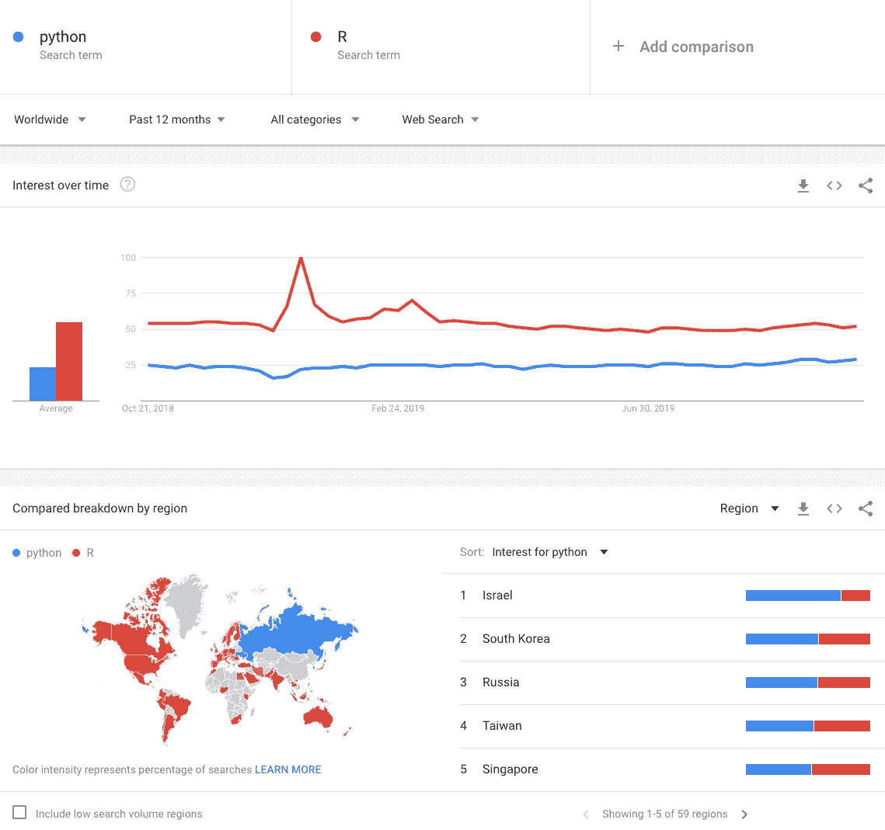

Source: [Google Trends](https://trends.google.com/trends/explore?q=python,R)

看看 Google Trends 在过去 12 个月里追踪的搜索次数，R 和 Python 在全球范围内都得到了广泛的搜索。根据 TIOBE Index，虽然趋势显示 R 语言的搜索越来越多，但 Python 远远领先于 R 语言，如下图所示:

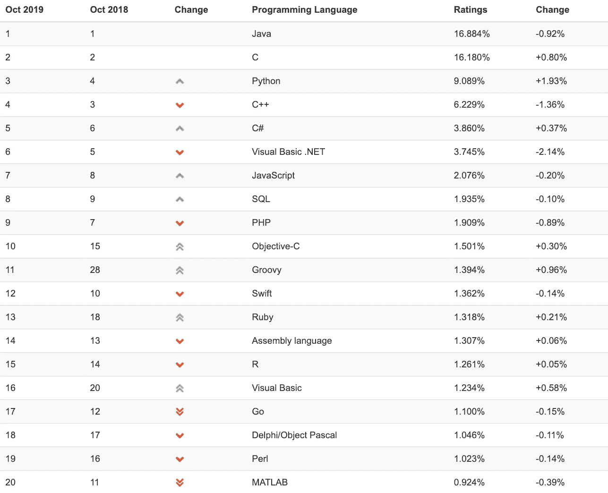

Source: [TIOBE Index](https://www.tiobe.com/tiobe-index/)

这些数字表明，虽然 Python 在今天更受欢迎，但来自 Google 的搜索结果表明，很多搜索结果往往更偏向于 R 而不是 Python。因此，两种语言技能的良好结合不仅能让你为今天的挑战做好准备，还能让你为未来做好准备。

现在，让我们看看如何使用这两种语言！

# 使用 R 的探索性数据分析

## 导入包

你可以使用`install.packages()`下载 R 中的包，然后使用`library()`将它们导入笔记本`.Rmd`文件。我使用`ggplot2`来处理图形，`gridExtra`来处理图形的网格，`lubridate`来处理日期。

## 导入数据集

我从 [Kaggle](https://www.kaggle.com/joniarroba/noshowappointments) 获取了关于各种医疗预约以及病人是否出现的数据集。它有 13 个特征和 1 个目标变量。功能`read.csv()`允许导入数据集。

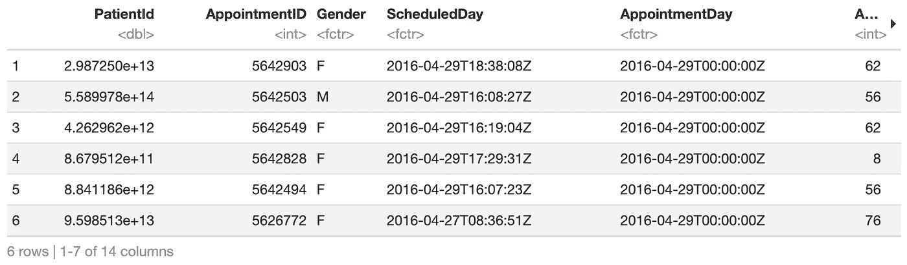

Dataset (First half)

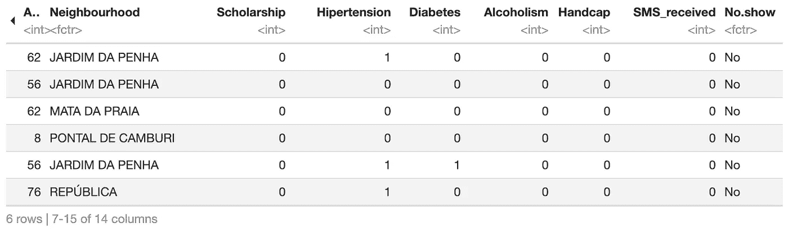

Dataset (Second half)

## 数据集探索

让我们首先来看看行数和列数以及这些列的名称。函数`nrow()`返回行数，`ncol()`返回列数，`names()`返回列名列表。`paste()`方法将不同的字符串组合成一个字符串。

数据集有 110527 行和 14 列。目标变量是`No.show`并且是否定形式，所以我想把它改成可读性更好的形式。当我将`No.show`更改为`Showed_up`时，我还必须将列值从`No`反转为`TRUE`并将`Yes`反转为`FALSE`。

我们有 13 个特性，让我们进一步探索它们:

1.  “PatientId”:它是每个患者的唯一标识符，但对任何预测都没有用。
2.  " AppointmentId:它是每个约会的唯一标识符。
3.  “性别”:这个人是用 F 表示的女性还是用 m 表示的男性。
4.  “预定日期”:安排约会的日期。
5.  “约会日”:约会的当天。
6.  “年龄”:人的年龄。
7.  “邻居”:该人所属的邻居。
8.  “奖学金”:这个人是否有奖学金(定义[维基百科](https://en.wikipedia.org/wiki/Bolsa_Fam%C3%ADlia))。
9.  “高血压”:人是否有高血压。
10.  “糖尿病”:人是否有糖尿病。
11.  “酒精中毒”:此人是否酗酒。
12.  “Handcap”:该人是否有身体残疾。
13.  “SMS_received”:此人是否收到了关于约会的短信。

目标变量是:

1.  “Showed_up”:描述此人是否赴约。

接下来，让我们看看数据集的摘要。

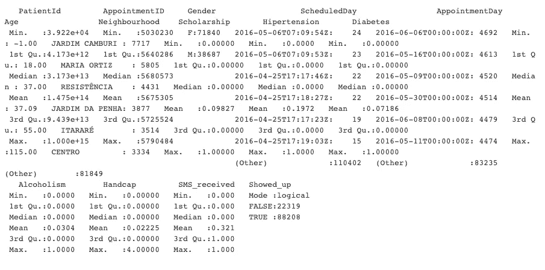

Dataset summary

仔细观察数据集可以发现，像`Alcoholism`、`Handcap`等特征。它们被认为是连续值，而不是分类变量。这些日期不被认为是日期，`Age`的最小值是`-1`，这是错误数据，所以我将删除这些行。

## 形象化

**目标阶层**
让我们看看有多少人来赴约，有多少人没来。我将使用`ggplot`，它将参数作为数据集，然后是`aes()`中的 x 值。`geom_bar()`定义我们想要一个条形图，每个条形图的填充颜色为白色，橙色定义为`color`橙色，每个条形图的`width`定义为`0.4`。标题是用`ggtitle()`定义的，我用`labs()`定义了 x 和 y 轴标签。

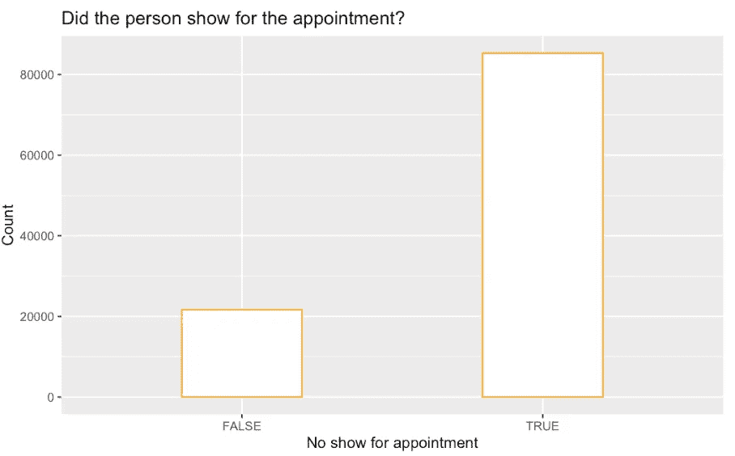

Target class distribution

与没来的人相比，来赴约的人更多。我们肯定需要努力确保模型不会出现偏差。

**性别分布** 让我们看看数据集中是否存在男性和女性之间的分布。我将创建一个条形图，并将列值重命名为`F`的`Female`和`M`的`Male`。就像上面的条形图一样，我使用了所有的函数，并用`scale_x_discrete`重命名了 x 标签。

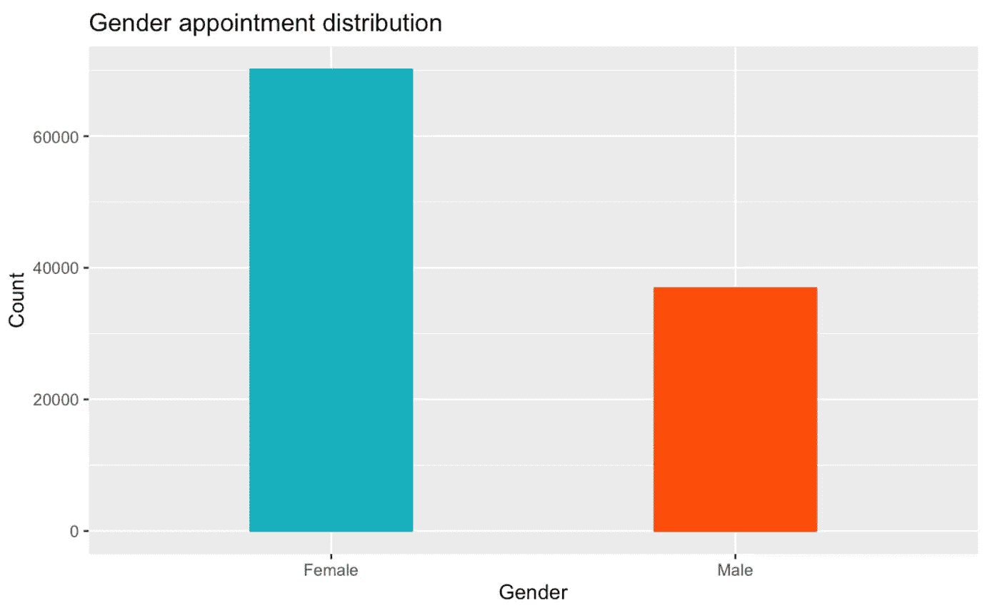

Gender distribution

与男性相比，有更多的女性安排了约会。

**二进制类分布**
由于有许多使用`TRUE`和`FALSE`定义的二进制类，我将根据目标类文件颜色来绘制它们。`aes()`函数接受参数`fill`，这基本上让我们基于另一个类绘制给定的数据，在我们的例子中，是目标变量。函数`grid.arrange()`帮助我们绘制一系列的行列图形。参数`ncol = 2`声明基于我想要的绘图数量，我想要 2 列和 2 行。

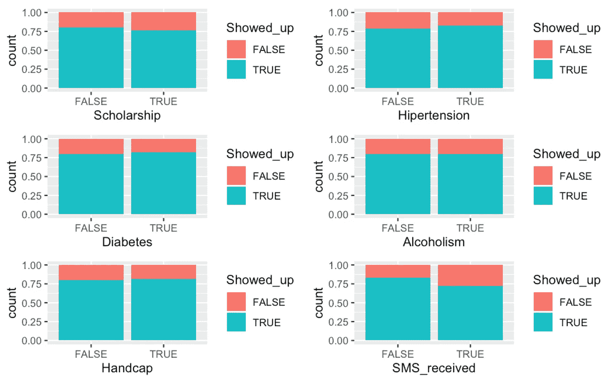

Binary class distribution

所有图显示，对于任一布尔值，目标类之间的分布几乎是恒定的。数据分布相当均匀。

**预约和预约日期的区别** 我注意到，某人预约的时间和实际预约的日期之间的区别可能也很有用。因此，我决定在数据集中创建一个新列`Date.diff`,它基本上是两天之间的差异。由于区别在于天数，所以我用`as.numeric(unlist(date.diff))`将其解列后转换成数值。

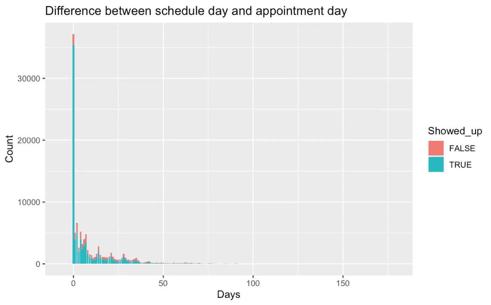

Date diff between schedule and appointment day

该图显示，有许多约会与预定日期同一天。让我们移开那个巨大的钉子，看看我们是否能找到除它之外的任何东西。所以，在上面的剧情中，我会加`xlim(1,200)`从 1 开始。

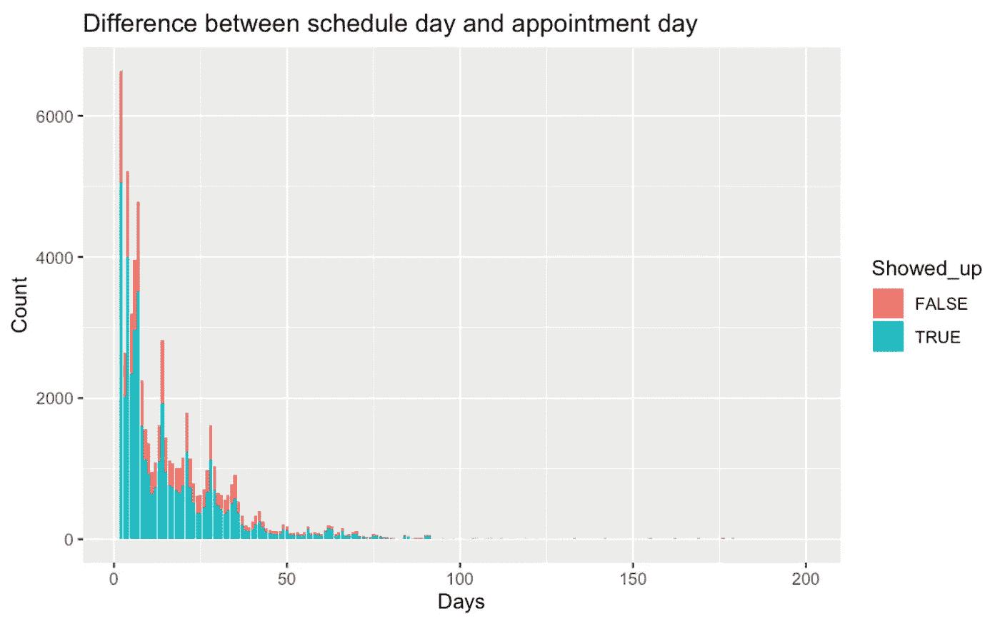

Date diff between schedule and appointment day (≥ 1 day)

请注意，随着天数差异的增加，约会的数量会减少。相差 50 天以上的预约真的少了。似乎没有相关性，因为 50 天之前的计数上升和下降没有任何模式。

**约会时间设置** 约会的时间或月份也可能影响某人是否出现在约会中。所以，让我们创建数据，看看是否有这样的影响。虽然小时数据很有用，但我注意到每个约会的小时信息都是相同的，所以我们不能使用它。让我们只处理月数据。

使用`month`函数，我能够从`AppointmentDay`中检索月份。然后，我用它画了一个柱状图。

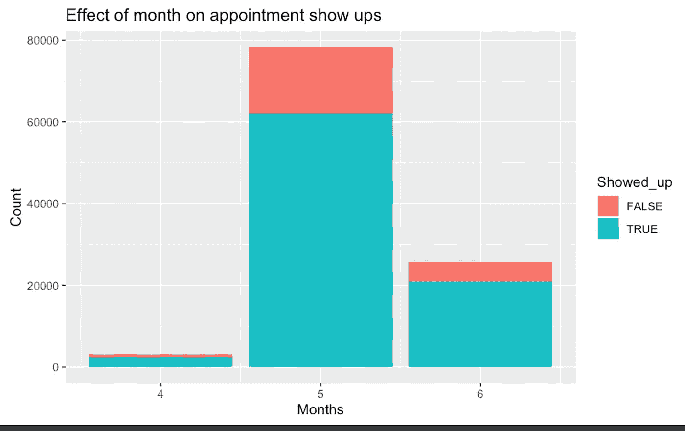

Monthly distribution of appointments

四月的约会很少，而五月的约会最多。

`prop.table()`导致基于边距的对称分布。正如我们从数据中看到的，月份对演出几乎没有影响，因为虚假和真实的比例几乎相同。因此，我们可以删除列本身。

我们可以使用`subset()`方法检索数据集的子集，然后通过将参数`select`定义为`-Month`，我们选择除了月份之外的所有内容。

**街区** 当我们放眼望去，也有许多不同的街区。让我们用条形图来研究一下它们。

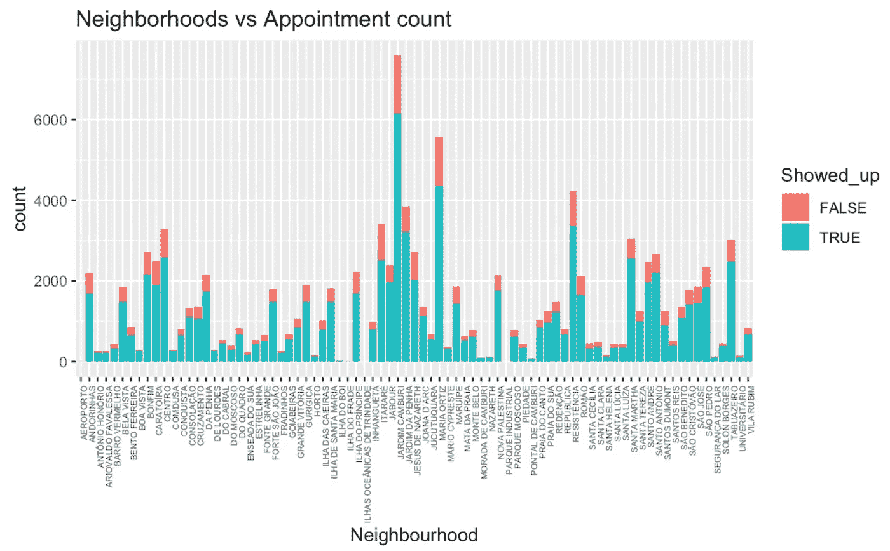

Neighborhoods in the dataset

邻里数据变化很大。`Jabour`有非常多的预约，但有些社区的预约少于 10 次。我们应该保留数据，但我们将在模型训练期间创建虚拟变量来容纳该列中的每个值。

**年龄**
最后，让我们看看年龄变化是如何在数据集中发生的。我们已经移除了数据集中的异常值。我现在将为目标变量中的两个类使用两个相互重叠的散点图。

我首先选择带有`Showed_up`的记录作为`TRUE`，然后使用`table`和`as.data.frame`创建一个名为`age.show`的频率表。我同样为`Showed_up`创建数据帧`age.no_show`为`FALSE`。使用两次`geom_point`，我创建了两个重叠的散点图。

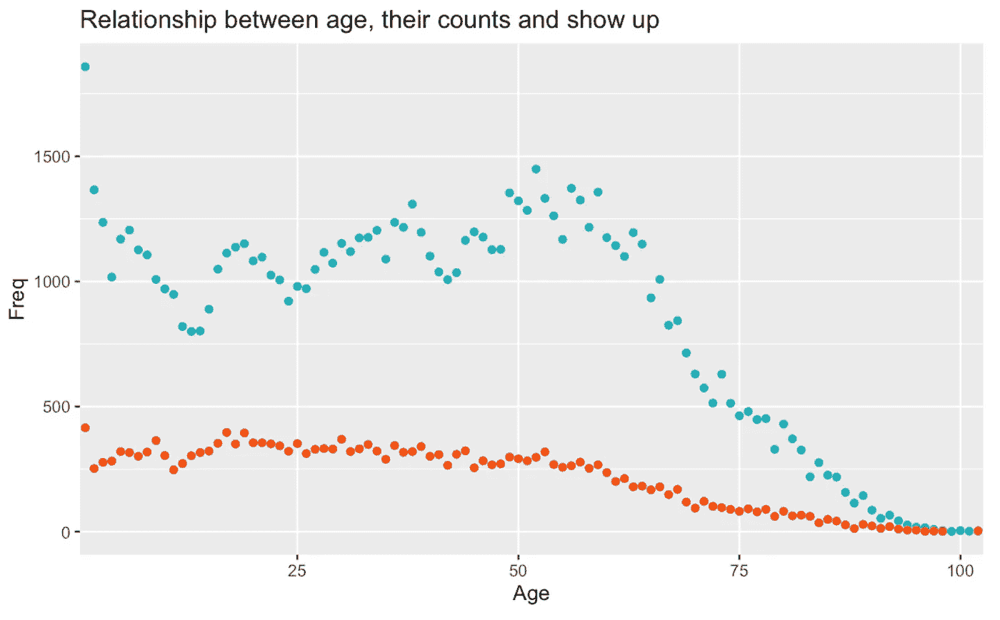

Age count and showed up status

该图显示，约会的次数随年龄变化很大。最大预约是给婴儿的。在 50 岁左右有一个下降然后一个峰值。最后，随着年龄的增长，预约的人越来越少。因此，年龄也可能对目标变量有影响。

现在我们对数据集有了一个相当好的想法，让我们以修改后的形式保存它，然后使用 Python 库进行预测。我将使用`write.csv()`将数据集保存到文件`dataset_modified.csv`。`row.names` as `FALSE`确保不保存行索引。

# 使用 Python 进行分类

在进行适当的数据工程以进行分类之后，我将开发一个人工神经网络来对给定的数据进行训练。

## 导入库

我将导入必要的库，包括用于 csv 的`pandas`、用于数据处理的`sklearn`和用于创建人工神经网络的`keras` & `tensorflow`。

## 导入数据集

我将使用函数`read_csv()`来导入数据集文件`dataset_modified.csv`。然后我将使用`head()`方法来查看前 5 行。

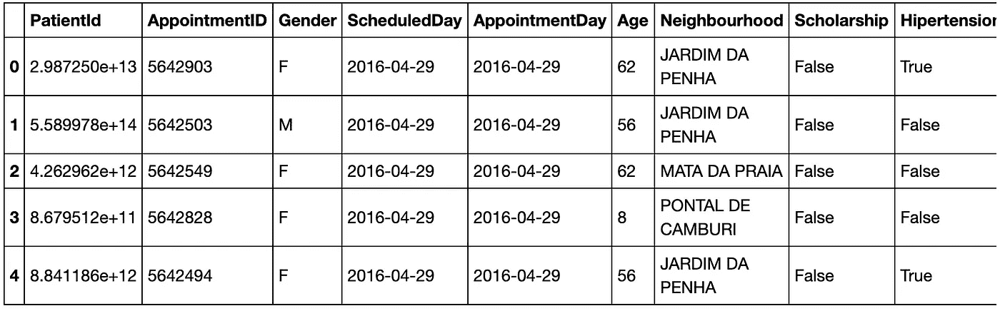

Dataset (Modified) — Part 2

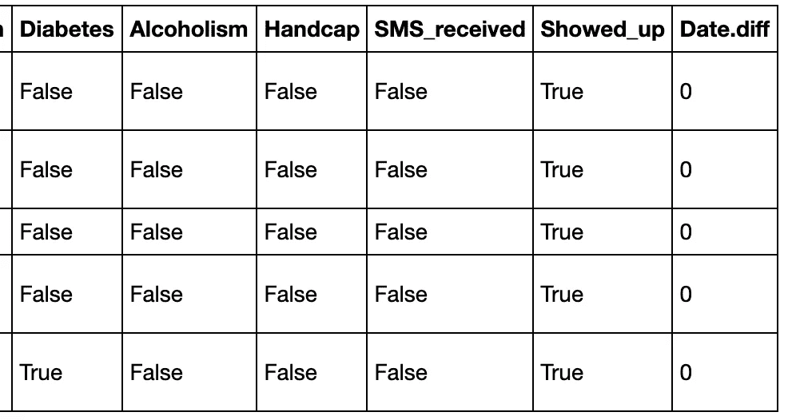

Dataset (Modified) — Part 2

# 数据工程

在数据集可以实际使用之前，我将执行许多数据工程步骤。

**失约** Kaggle 总是教会我很多东西。即使在我决定做了这么多步骤之后，我还是发现了另一个非常有用的步骤。受到这个 [Kaggle 内核](https://www.kaggle.com/belagoesr/predicting-no-show-downsampling-approach-with-rf)的极大启发，我决定看看如果有人之前在目标上错过了一次约会的效果。

正如我们所见，相关值非常高(~0.61)，因此它将是目标变量分类的一个重要因素。

**删除多余的列** ，因为列`PatientId`、`AppointmentID`、`ScheduleDay`和`AppointmentDay`不会直接影响目标变量，所以我用`drop()`删除它们。

**虚拟列** 我将把列`Neighbourhood`转换成一组虚拟列。我将使用`drop()`删除原始列，然后使用`get_dummies()`创建使用`concat()`添加到原始数据集中的列。

**映射列** 我们知道`Gender`列被分类为`F`或`M`，我将使用映射函数将它们转换为 ANN 可以理解的数值。

**分割测试训练数据** 下一步是分割特征和列，然后使用`train_test_split()`创建 33%的测试数据和 67%的训练数据。

最终训练数据总共有 91 列。

**缩放数据** 神经网络最适合缩放数据，因此，我将使用`StandardScaler()`来缩放数据，并将其用于训练神经网络。当使用`X_train`时，我们使用`fit_transform`,因为它确保它符合那些值并且也转换它。对于`X_test`，我们只使用`transform`，因为它确保了定标器函数使用来自 X_train 的知识来转换测试数据。

## 模型生成

数据集已经可以使用了，所以我现在将使用`Sequence()`方法创建人工神经网络。我添加四个密集层，分别有 512、1024、2048 和 1 个神经元。我还确保在每一层之后包含`Dropout()`,这样神经网络就不会过度适应数据。对于第一个密集层，我们还需要指定`input_dim`，它等于我们数据中的列数(91)。

我们的网络有 2，673，665 个不同的参数需要训练。

我现在将使用 0.1 的验证分割来训练模型，这意味着从训练数据中的所有数据来看，模型将对 90%的数据进行训练，并对 10%的数据进行学习测试。

## 模型预测法

我现在将在测试数据上测试模型，并输出混淆矩阵和准确性。

虽然该模型达到了大约 88%的准确率，但是混淆矩阵表明该模型能够正确地预测某人何时会出现在约会中，但是大约有 50%的人不会出现。

我们可以通过探索更多的数据特征和进行数据工程以确定其他因素来进一步改进该模型。但是现在，88%对于这个模型来说已经足够准确了。

# 结论

在本文中，我们使用人工神经网络和使用 R 和 Python 的数据探索来开发涉及两种语言的数据工作流。

如果你有任何想法或主意，请分享。还有，你可以在 [LinkedIn](https://www.linkedin.com/in/bhanotkaran22/) 上和我联系。如果您喜欢这篇文章，您可能也会喜欢:

 [## Google Colab——您在云上的 Python 工作空间

### 了解 Google Colab

towardsdatascience.com](/google-colab-your-python-workspace-on-cloud-c3aed424de0d)  [## seaborn——让绘图变得有趣

### Python 中的 Seaborn 库简介

towardsdatascience.com](/seaborn-lets-make-plotting-fun-4951b89a0c07)  [## 通过预测游客购买意向学习人工神经网络

### 使用 Keras 和 Tensorflow 构建人工神经网络

towardsdatascience.com](/learning-artificial-neural-networks-by-predicting-visitor-purchase-intention-724ba2be7c29)  [## 在 Kaggle 上使用 CNN 进行深度学习以识别疟疾细胞

### 医学领域的深度学习

towardsdatascience.com](/deep-learning-to-identify-malaria-cells-using-cnn-on-kaggle-b9a987f55ea5)