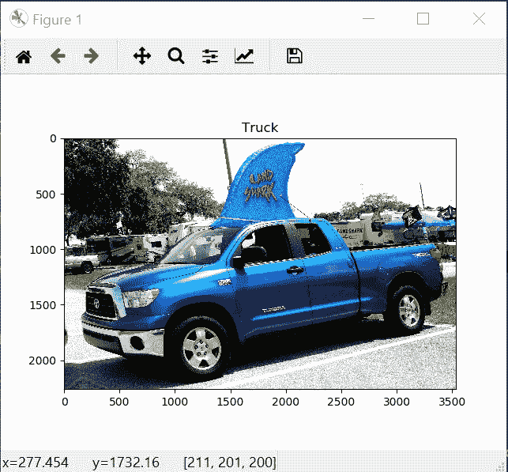
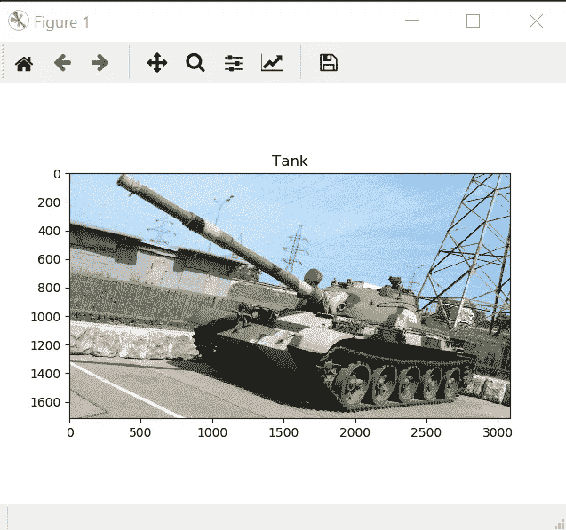

# 我如何使用迁移学习和集成学习在 Kaggle 竞赛中获得 90%的准确率

> 原文：<https://towardsdatascience.com/how-i-used-transfer-learning-and-ensemble-learning-to-get-90-accuracy-in-kaggle-competition-5a5e4c7e63e?source=collection_archive---------11----------------------->

## 图像分类是一项经典的机器学习任务，自深度神经网络诞生以来，它一直是机器学习研究的关键驱动因素。本文将指导您使用迁移学习和集成方法轻松解决这个问题。

Photo by [Blake Connally](https://unsplash.com/@blakeconnally?utm_source=unsplash&utm_medium=referral&utm_content=creditCopyText) on [Unsplash](https://unsplash.com/s/photos/code?utm_source=unsplash&utm_medium=referral&utm_content=creditCopyText)

# 1.介绍

在这个比赛中，我要对不同车辆类型的图像进行分类，包括汽车、自行车、货车、救护车等。(共 17 类)。竞赛的数据包括带有类别标签的训练数据和不带标签的测试数据。任务是预测测试数据的秘密标签。你可以在这里找到并下载数据集。

# 2.迁移学习

> 迁移学习是机器学习中的一个研究问题，它专注于存储在解决一个问题时获得的知识，并将其应用于不同但相关的问题。[1]

在**计算机视觉**中，迁移学习通常用预先训练好的模型来表示。预训练模型是由其他人创建的用于解决类似问题的模型。可以使用预先训练的模型作为起点，而不是从头开始构建模型。我在比赛中选择使用的型号有 [InceptionV3](https://keras.io/applications/#inceptionv3) 、 [MobilenetV2、](https://keras.io/applications/#mobilenetv2)和 [Densenet201](https://keras.io/applications/#densenet) 。

# 3.预训练模型

这是一个如何将预训练模型应用于您的问题的示例。

一些注意事项:

*   *Include-top* :是否包含网络顶部的全连通层。您应该在这里设置 *False* 来自己修改网络。
*   *globalaveragepool2d:在空间维度上应用*平均池。这里，我在基本模型的最后一个输出层应用了平均池操作。
*   *类别交叉熵损失:*用于单标签分类的损失函数。一个图像只能属于一个类。
*   *Adel ta optimizer:*Adagrad 的一个更健壮的扩展，它基于梯度更新的移动窗口来调整学习速率，而不是累积所有过去的梯度。
*   *Model.summary:* 获取模型的摘要

您也可以对其他模型使用相同的代码概念。在比赛中，我只对其他车型做了小调整。(InceptionV3 和 Densenet201)。

# 4.准备数据

我们必须将训练数据分成两个文件夹:训练和测试。每个文件夹包含以类别命名的子文件夹，每个子文件夹包含属于该类别的图像。

以下是如何做到这一点的示例:

之后，为了增加数据量并避免过度拟合，我使用 ImageDataGenerator 对训练数据进行了扩充。它将获取原始图像，对其进行随机转换，并返回新的随机转换图像。然后，我为 fit_generator 函数(稍后使用)创建了训练和测试生成器，以便在训练期间动态生成数据。

# 5.培养

在 Keras 中，使用 *fit()* 对于可以加载到内存中的较小数据集来说很好。但是在这里，我们的数据集太大了，所以使用 *fit()* 是不实际的。解决方法是使用 *fit_generator()* ，它可以在训练期间将图像加载到内存中。

一些注意事项:

*   根据您电脑的内存，您可能想要更改批处理大小。
*   您可能还希望在培训中添加检查点以进行备份，以防培训过程出现问题。

在训练每个模型大约 80 个时期后，下面是每个模型的准确度分数:

*   InceptionV3:训练准确率:93.76 %，验证准确率:92.30 %，Kaggle 评分:89.2%
*   MobilenetV2:训练准确率:88.25 %，验证准确率:92.30 %，Kaggle 评分:85.6%
*   Densenet201:训练准确率:92.3 %，验证准确率:90.3 %

# 6.集成学习

集成学习是训练多个模型而不是单个模型，并组合来自这些模型的预测。这减少了预测的方差并减少了泛化错误。结果是预测这比任何单一的模型都要好。[2]想要更多的动力，你可以看看 [ILSVRC2015](http://www.image-net.org/challenges/LSVRC/2015/results) 的结果，看到比赛的 12 强使用了多种模式的组合，而不是只有一种。

如何实现集成学习:

**集成学习结果:** 91.1% Kaggle 评分。

以下是一些**预测图像**:

Truck image

Tank image

# 7.摘要

要找到我在这个项目中使用的完整代码，你可以去这个[链接](https://github.com/hoanhle/Vehicle-Type-Detection)。

我希望你在这篇文章中找到一些有用的东西，可以用在你的深度学习和计算机视觉项目中。这是一个有趣和令人兴奋的领域，每个人每天都在尝试新的想法和技术。

我很乐意帮助你，所以如果你有任何问题或改进的想法，请告诉我。

# 8.参考

1.  韦斯特，杰里米；文图拉，丹；肖恩·沃尼克(2007 年)。[“春季研究报告:归纳转移的理论基础”](https://web.archive.org/web/20070801120743/http://cpms.byu.edu/springresearch/abstract-entry?id=861)。杨百翰大学物理和数学科学学院
2.  [https://machine learning mastery . com/ensemble-methods-for-deep-learning-neural-networks/](https://machinelearningmastery.com/ensemble-methods-for-deep-learning-neural-networks/)