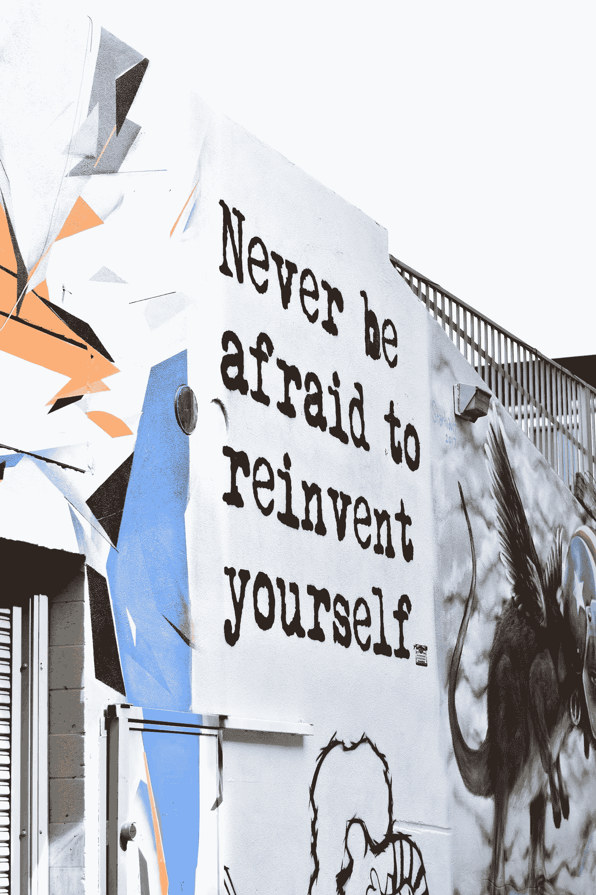

# 我如何从自动化工程师变成数据科学家

> 原文：<https://towardsdatascience.com/how-i-went-from-automation-engineer-to-data-scientist-9a1c84cbdcdc?source=collection_archive---------36----------------------->

## 从我进入数据科学和机器学习世界的旅程中得到的建议和教训。

Photo by [Allie Smith](https://unsplash.com/@creativegangsters?utm_source=medium&utm_medium=referral) on [Unsplash](https://unsplash.com?utm_source=medium&utm_medium=referral)

在这篇文章中，我想分享一些我在 2.5 年的职业转换旅程中所学到的有价值的见解，希望它能帮助任何正在考虑职业转换的读者。

对我来说，这种转变是从软件工程师到数据科学家，但我相信大多数这些见解适用于任何类型的职业转变。

所以现在开始…

# 首先，找到你的激情！

> “追寻你的激情，其他一切都会水到渠成。这不是浪漫。这是实用主义的最高境界。”~加贝·吉福兹

我并不总是知道我想成为一名数据科学家。其实在 PayPal 开始工作之前，我并没有考虑过职业规划。从这个意义上说，公司内部的一位导师给了我很大帮助，他鼓励我问自己正确的问题，并推动我掌控自己的职业道路。

所以，我想我的第一个建议是花点时间思考一些事情，比如:

*你的动力是什么？你最喜欢你工作的哪些方面？你最不喜欢哪方面？你认为自己在 1/3/5 年后会怎样？*

如果你能在这个自我发现的过程中找到一个导师陪伴你，那就更好了。

# 婴儿学步

> “朝着正确的方向迈出许多小步，总比大步向前却跌跌撞撞地后退好”~中国的一句古老谚语

好吧，让我们假设这个发现过程让你意识到你想改变职业。

接下来你需要明白的是**这种变化不会在一夜之间发生**。这是一个由许多小步骤组成的过程。对我来说，这个转变花了两年多的时间。

让我们从头开始(最好的起点:)。当我开始在 PayPal 的安全产品中心担任自动化工程师时，我第一次接触到了数据科学和机器学习的世界。我们有一个非常强大的机器学习团队，刚刚开始进行每周一次的阅读小组会议。在每次会议中，一名团队成员将提交一篇与其当前项目相关或他们个人感兴趣的论文，并开展讨论。起初，我以“只听”的方式参加这些会议。一次又一次，我慢慢地开始掌握越来越多的概念。几个月后，我被要求提交一篇论文。我发现了一篇我觉得很有趣的论文，并把它给 ML 团队的领导大卫看。由于论文作者发表了他们的代码，David 建议我应该尝试复制他们的结果。我很快意识到这不是一个简单的任务，因为代码并不完整，也没有很好的文档记录，但这对我来说是一次很好的学习经历。这是我第一次体验机器学习代码，我有机会了解许多基本概念(例如，反向传播)是如何实现的。这次经历教给我的另一个重要的教训是，学术研究中可重复性的重要性，仅仅因为论文中写的东西并不自动意味着它是真实的。

我迈出的下一小步是自愿做一个关于[强化学习](https://en.wikipedia.org/wiki/Reinforcement_learning)的内部介绍性演讲。不是因为我当时对强化学习有所了解，只是觉得它很有意思( [AlphaGo Zero](https://deepmind.com/blog/alphago-zero-learning-scratch/) 差不多同时发布)。我相信没有比教更好的学习方法了，所以这是我了解这个话题的绝佳机会。

# 要坚持！

> "成功是日复一日的微小努力的总和。"~路易·萨查尔

在这一点上，我已经意识到这是我想追求的道路，所以我开始进入自我学习的高速档。这包括参加吴恩达令人惊叹的[机器学习课程](https://www.coursera.org/learn/machine-learning)，然后是 deeplearning.ai 的[深度学习专业化](https://www.coursera.org/specializations/deep-learning)，阅读博客帖子和论文，在 Twitter 和 LinkedIn 上关注有影响力的研究人员和实践者，订阅机器学习和深度学习 DL，参加相关会议，甚至在打扫房间时听 ML 播客。

**我决心尽我所能让自己处于这样一个位置，当机会出现时，我会做好准备。每天晚上，一旦我的孩子睡着了，我就会打开我的笔记本电脑学习(特别感谢我那了不起的妻子，她在这段时间里一直陪着我:)。这成了我大约两年的例行公事。**

但这还不够。要改变职业生涯，最好得到经理的支持。这就引出了我的下一个观点。

# 明确你的职业抱负！

> “如果你提出要求，世界会在你的职业生涯中与你共谋”~ Sri Shivananda (PayPal 首席技术官)

我很幸运能在一家高度鼓励个人成长和个人发展的公司工作。这不是想当然的事情。即使这同样适用于你，也不要假设你周围的人会猜测你的野心是什么，事情会神奇地自己发生。你必须给别人帮助你的机会。一旦你周围的人意识到你的渴望，机会很可能会出现。

# 拥抱每一个机会！

尤其是当你觉得这是一个挑战，而你还没有准备好的时候。这些正是最能帮助你成长的经历。

> “如果有人给你提供了一个绝佳的机会，但你不确定自己能做到，那就答应吧——然后再学习如何去做！”~理查德·布兰森

我很幸运地得到了我的经理的支持以及当时机器学习团队领导的鼓励和指导，这使我在作为自动化工程师的日常工作之外，还与团队一起参与了几个项目。例如，作为 BGU 和贝宝安全产品中心合作的一部分，我有机会参与一个研究项目。这个项目属于[人工智能规划](https://en.wikipedia.org/wiki/Automated_planning_and_scheduling)的领域。我参与了实证实验，甚至与人合著了一篇[论文](https://arxiv.org/pdf/1709.03363.pdf)。

在那段时间里，我的另一个有意义的经历是在项目为期 5 周的实习项目阶段指导一组 4 名以色列技术挑战研究员。该项目旨在使用机器学习来静态分析网络流量，并确定流量的来源(物理机、虚拟机或 Docker 容器)。我们得到了相当好的结果，甚至基于这个想法提交了一个[专利](https://patents.google.com/patent/US20190207821A1/en)。

如果我没有让我的经理们知道我的雄心壮志，我就没有机会获得这些惊人的机会！

# 做体力工作

> “知道是不够的；我们必须申请。愿意是不够的；我们必须这样做。”~约翰·沃尔夫冈·冯·歌德

一旦你觉得自己掌握了基本知识，你应该**获得尽可能多的实践经验**。真正的[专业知识是通过实践获得的](https://en.wikipedia.org/wiki/Outliers_(book))。每当你学习一个新概念的时候，试着真正地“弄脏你的手”,摆弄一些代码。 [Kaggle](https://www.kaggle.com/) 是一个获得实践经验的绝佳平台，我强烈推荐。对于那些不知道的人来说，Kaggle 是一个由数据科学家和机器学习者组成的非常活跃的在线社区，归谷歌所有。社区非常支持这个领域的新成员。

在获得实践经验方面大有帮助的一个小技巧是**找一个犯罪伙伴**——一个对这个主题同样(或至少有点)有热情的人，可以陪你走过你的学习旅程。一旦你们一起决定了学习目标或里程碑，你们都不太可能偷工减料或决定跳过学习经历的实践方面。万一你遇到问题，有人给你出主意或向你咨询也总是有帮助的。

对我来说，那个人是我的同事和朋友，他已经是另一个团队的数据科学家和安全研究员。下班后我们开始参加 Kaggle 比赛。

起初，我们处理过去的比赛，几个月后过渡到现场比赛。我们在前 5 场现场比赛中获得了 3 枚奖牌(2 枚铜牌和 1 枚银牌)，这表明**你不应该害怕投入并开始练习你新学到的技能**。Kaggle 的好处是在各个领域有各种各样的比赛，这意味着你总能找到你感兴趣的比赛或与你当前工作相关的比赛，这样你就可以利用领域专业知识，帮助你走在队伍的前面。

# 不要等待完美的时刻！

> “如果我们等到准备好了，那我们就要等一辈子了。”~丹尼尔·汉德勒，假电梯

**总会有更多的东西要学**。不要等到你觉得已经准备好转变的那一刻，因为那个时刻可能永远不会到来。总会有新的算法需要学习，新的 MOOCs 需要学习，新的图书馆需要了解，更多的技能需要掌握。我们生活在一个技术不断变化和发展的时代，天生的好奇心和自学能力比任何具体技能都更重要。

帮助我实现这一点的是我的导师，他在我们的一次会面中简单地问我:*“你在等什么？是什么阻碍了你申请数据科学职位？”。他是对的。那时，我已经集中学习了大约 2 年，并且有足够的实践经验来应对任何技术面试。我决定接受他的建议，开始对数据科学职位进行内部面试(在我的经理的支持下)。*

不久之后，我加入了我现在的团队，成为一名数据科学家和安全研究员！

Photo by [Hello I’m Nik 🇬🇧](https://unsplash.com/@helloimnik?utm_source=medium&utm_medium=referral) on [Unsplash](https://unsplash.com?utm_source=medium&utm_medium=referral)

# 一些结束语

*   这个建议是基于我的个人经验。这些是对我有用的东西。谈到职业转换，没有对错之分，我相信每个人都应该尝试并找到自己的道路。
*   人们普遍认为，当你做出重大职业改变时，你基本上是从零开始。我不相信这是真的。你可能正在进入一个新的领域，但这并不意味着你过去的所有经历都变得无关紧要。我的软件工程背景使我精通编写模块化和可重用的代码、版本控制和持续集成。我的软件自动化经验也极大地帮助了我的日常工作，并为我提供了一个独特的视角，这是一个“传统培训”的数据科学家可能会缺少的。例如，我非常热衷于将“传统”软件开发中固有的相同质量标准应用到机器学习领域(单元测试、数据验证等)..).我甚至在 PyconIL 做了一个关于它的[演讲](https://www.youtube.com/watch?v=1fHGXOfiDO0)。所有这些都是说你应该**意识到你的优势以及你带来的独特视角和能力**。多元化的团队才是更强的团队！

这就是我想分享的，我希望你们中的一些人能够将这些知识应用到你的个人职业生涯中。祝你好运！

*原载于 2019 年 8 月 12 日*[*https://medium.com*](https://medium.com/paypal-engineering/how-i-went-from-automation-engineer-to-data-scientist-5f3760253cd)*。*