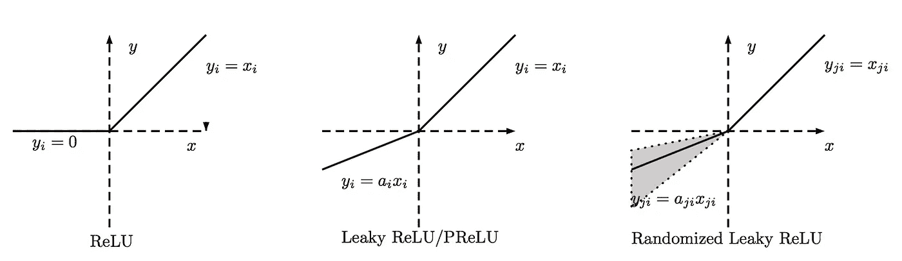
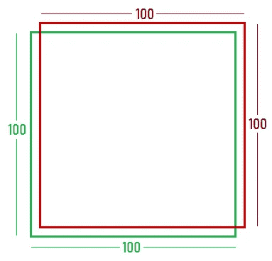
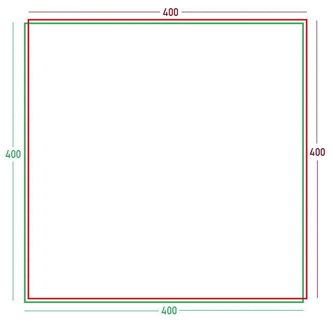

# 我如何赢得 Flipkart ML 挑战赛

> 原文：<https://towardsdatascience.com/how-i-won-the-flipkart-ml-challenge-fcf1fcc9e06a?source=collection_archive---------7----------------------->

## [深度分析](https://medium.com/towards-data-science/in-depth-analysis/home)

lipkart 最近为印度工程学院的学生举办了为期一个月的年度[机器学习挑战赛](https://dare2compete.com/o/Flipkart-GRiD-Teach-The-Machines-2019-74928)，总奖金为₹5,20,000(约 7500 美元)。我的团队在大约 6700 名参与者中胜出。在我告诉你我们是如何做到的之前，让我们记住，如果这个挑战不局限于这么小的目标人群，我可能很难保持在前 10%之内。作为一个题外话，这个博客将主要是理论性的。

# 问题陈述

给定一幅图像，定位图像中的主要对象。换句话说，它是没有分类部分的对象检测。我们只需要预测边界框。

Examples from the training set

然而，有一个问题，预先训练的模型是禁止的，但是使用标准架构是允许的。有 24000 幅训练图像和 24045 幅测试图像。

评分标准是平均交集除以并集(IOU)。

The IOU function

Custom metric to track mean IOU

当时不知道`tf.metrics.mean_iou`的存在，所以自己创建了一个函数，大概要慢很多。

# 初步分析

乍一看，数据集有很多普通背景的图像，所以我使用 OpenCV 尝试了 Otsu 阈值、分水岭、轮廓等等。这些显然没有产生很好的效果，所以我就不告诉你细节了。

在尝试 Yolo、RetinaNet SSD 和 RCNNs 等标准对象检测架构之前，让我们提醒自己，它们有复杂的方法来平衡定位和分类损失，对于手头的问题来说是多余的。最重要的是，我没有信心能很好地调整它们，所以我没有在这些上面花太多时间。但所有这些都使用标准架构，如 VGG 或 ResNet 作为特征提取器。

这个问题非常类似于一个分类问题。对于一个预测物体精确边界框的网络来说，它应该能够*识别*那些物体看起来像什么，因为我们没有 Imagenet 权重来帮助我们。理想情况下，如果我们有一个好的本地化网络，我们应该能够通过替换和训练*最后一层*来使它成为一个好的分类网络。

因此，我使用标准架构，用具有四个输出(x1、y1 和 x2，y2 是左上角和右下角的坐标)的密集层替换最后一层，移除激活并使用经典回归损失。

# 数据扩充

24，000 张照片不够，所以我应用了亮度对比度增强、沿两个轴翻转、横向移动等技术，最终得到了大约 480，000 张照片。我没有使用像生成器这样的原位方法，在每个时期生成不同版本的图像，因为我想确保网络可以看到每个时期的所有数据。回想起来，发电机也可以工作得很好。

Imagenet 声称拥有大约 5000 万张图片，你可能认为 50 万张不够，但是训练集中的图片可以大致分为大约 10 个类别，与 Imagenet 中的类别数量相差甚远，所以我们不会有问题。

# 训练技巧

在讨论我的最佳架构之前，这里是我们使用的训练技术。

*   **渐进大小增量**:由杰瑞米·霍华德推广，这是一种技术，我们首先传入缩小的图像，当学习开始停滞时，渐进地增加大小。这可以防止网络过度适应较大图像中存在的噪声，并有助于更快地收敛。我们依次使用了 64、96、128 和 224 的图像。从随机权重开始时，这尤其有用。当我们达到 224 的时候，我们已经有了一个网络，可以很好地处理较小的图像，就像迁移学习一样。
*   **回火**:这是一种我们使用原始数据集和大批量进行训练的技术。一旦网络开始过度拟合，我们就用扩充的数据集替换较小的数据集，并通过*梯度噪声*减少批量大小以引入正则化。在某种程度上，我们正在让网络在淹没它之前熟悉它应该期待的数据类型。
*   **带重启的随机梯度下降**:这是一个学习率调度器(不是优化器)，我们和 Adam 一起使用。在再次重置之前，它逐渐降低固定数量的历元的学习速率，以便网络在停滞时可以容易地跳出局部最小值。循环长度可以改变，逐渐下降到更宽、更可概括的最小值。[这篇](/https-medium-com-reina-wang-tw-stochastic-gradient-descent-with-restarts-5f511975163)博客解释得很好。

SGDR with a cycle multiplier of 1

*   **快照集成**:由于使用了 SGDR，网络将在整个训练过程中收敛到几个不同的最小值。保存每个最小值处的重量检查点并将它们组合在一起会产生很好的结果，如论文[快照组合:训练 1 获得 M 个自由](https://arxiv.org/abs/1704.00109)中所探讨的。

Save a checkpoint at the flagged points and ensemble them together for better results

*   **学习率查找器:**显然，找到一个好的学习率对于收敛至关重要。使用一个标准的学习率查找器，将 SGDR 的上限设置为亏损面下降最大的值。将下限设在亏损仍在减少的某个地方。
*   **消除间隙层**:实际上不是一种训练技术，但据观察，在最后一层之前有全局平均池层的网络比没有全局平均池层的网络表现差大约 3%。主要是因为最后一层现在要学习的输入更少了。

 [## ad71/Flipkart-Grid

### 用于对象定位的 Keras 辅助函数。

github.com](https://github.com/ad71/Flipkart-Grid) 

> 这里讨论的 Keras 回调可以在这个库中找到。PyTorch 用户可以使用更高级的库，如 [fastai](https://github.com/fastai/fastai) 已经实现了所有这些。

# 网络架构

A skip connection

*   对于任何视觉相关的任务，我首先尝试的是训练一个小的 ResNet 作为基准。ResNets 通过引入跳过连接解决了深度 CNN 的消失梯度问题，这使得网络更容易学习恒等函数。使用上面提到的所有技术，我们训练了一个 ResNet34 在公共排行榜上获得 93.41%的平均 IOU。
*   **ResNeXt** :这是下一代的 ResNet，有一些改进和新的超参数。ResNeXt 中的层的工作方式类似于神经元。来自前一层的激活通过 *C* 不同的路径接收，每个路径执行相同的操作，然后相加在一起。这里， **C** 称为网络的基数。这些路径是相互断开的，这在某种程度上增加了稀疏性，并有助于减少过度拟合。

Residual block in ResNet vs residual block in ResNeXt with C = 32

观察到较高的基数优于较低的基数，并且具有大 C 的 ResNeXt 比具有宽 ResNet 更好。由于我们只有一个新的超参数，这个网络比 Inception 系列中的任何网络都更容易为新的数据集进行训练和微调。基数为 32 的 ResNeXt 101 是我们性能最好的模型。[这篇](/review-resnext-1st-runner-up-of-ilsvrc-2016-image-classification-15d7f17b42ac)博客详细解释了 ResNeXts。

# 激活功能

在我们的第一次尝试中，ResNeXt101 比 ResNet34 表现更好，但差距不是很大。学习停滞不前，尽管我们的验证损失比培训损失要低一些。我们保存了一个检查点，并迅速将新的分类层连接到网络中的一个中间层，并尝试训练它。理想情况下，尽管损耗不会像最后一层损耗那样低，但仍会降低。但事实并非如此。我们的新分类器也停滞不前。这很能说明*将死的热路问题*。

当使用 ReLU 激活时，随着时间的推移，大的负梯度杀死神经元，因为对于负输入，ReLU 输出 0。由于这个原因，那个特定的神经元完全停止了对梯度变化的反应。死亡的 ReLUs 不一定是一个问题，因为死亡的神经元对于计算*偏差*是有用的，即使它们已经失去了学习能力。然而，如果你有很多死亡的神经元，学习就会停滞。在我们的例子中，这可能是因为数据中没有足够的变化来适应一个有这么多参数的模型。

为了解决这个问题，我们可以使用 ReLU 的修改，如*泄漏 ReLU* 或 *SELU。*这些函数也具有更接近于零的输出激活均值，在某种程度上自调整网络。

Versions of leaky ReLU

The SELU function, where (alpha) = 1.6732 and (lambda) = 1.0507 for *standard scaled inputs*.

由于时间不够，我们和 SELU 一起冒险，重新训练了整件事，看起来效果不错。这将我们的最终平均 IOU 提高了约 0.5%。

# 损失函数

到目前为止，我一直在尝试所有众所周知的方法，但理解为什么标准损失函数对于我们试图优化的东西来说是有缺陷的，是挤出精度的最后小数位数的关键。

考虑目标对象宽 100 像素、高 100 像素的情况。假设我们有一个能够正确预测尺寸的网络，但是将预测的边界框*向右偏移一个像素*并且向上偏移*一个像素*。

Case 1: 100 x 100 bounding boxes. Target box marked in green, prediction marked in red

在这种情况下，四个坐标的总平均绝对误差为 **4 * 1.414** ，总均方误差为 **4 * 2** ，而 IOU 为 **96.097%**

For this case, the IOU is 0.96097, the L1 loss is 1.414 and the L2 loss is 2, for each co-ordinate

考虑另一种情况，目标对象宽 400 像素，高 400 像素。让我们假设同一个网络精确地预测尺寸，但是在每个方向上偏移坐标一个像素。

Case 2: 400 x 400 bounding boxes. Target box marked in green, prediction marked in red

在这种情况下，总平均绝对误差和均方误差与之前的相同**，但是 IOU 更高，为 **99.006%****

For this case, the IOU is 0.99006, while L1 and L2 losses are the same as before

这些不一致性表明，对于相同的 MAE 或 MSE，IOU 可能不同。因此，我们想要一个损失函数，对于目标区域*较小的包围盒中的错误，它对网络的惩罚更大。*

为了进一步证明这种差异，让我们考虑一个更极端的情况。

For the same L1 loss and L2 loss, the IOU is very different this time

虽然 70.71 的像素距离是不可能的，但希望你明白这一点。对于完全相同的 MAE 和 MSE，我们可以找到非常不同的 IOU 分数。这是一个问题。

为了在这个指标上表现良好，我们需要重新定义我们的损失函数。让我们看看为什么基于 IOU 的函数也不能很好地工作。

*   `1 — IOU`:范围在 0 到 1 之间。数值和梯度之间的变化总是很小，导致收敛速度很慢。
*   `1 / IOU`:数值之间变化很大，梯度很大，但是函数是无约束的。对于没有交叉点的盒子，损耗爆炸到无穷大。在分母上加一个小值只是一个小技巧，并不能真正解决问题。

这是我最终得出的损失函数:

Where U is the Union, I is the intersection and At is the area of the target bounding box

`U — I`给出我们想要最小化的额外区域。`At`是我们想要对其进行缩放的因子，这样我们可以针对较小对象中的错误对网络进行更多的惩罚。由于没有更好的术语，我们姑且称这个函数为`Scaled Loss`。

The scaled loss function

这个新的损失函数对于 100 * 100 像素的情况给出的损失值为 **0.0398** ，对于 400 * 400 像素的情况给出的损失值为 **0.0099** ，大约少了 **4** 倍。这个函数的梯度很大，永远不会爆炸到无穷大(假设目标边界框的面积永远不会为零)。

有时候在训练的时候，损失函数会突然爆炸到`inf`，IOU 变成`nan`。这只有在目标面积为零时才会发生。分析训练集标签，我发现对于一些图像来说,`x1`大于`x2`。纠正这些贴错标签的例子就解决了问题。

这个功能有一个缺点。在没有相交的情况下，无论两个不相交的盒子相距多远，该损失函数都给出相同的损失，因为这是基于面积的函数。此外，由该函数形成的损失图不是很平滑。

为了克服这两个问题，我们在网络仅在 MAE 上达到大约 90%的平均 IOU 之后使用了这个复合损失函数。

The composite loss function

# 结论

大概就是这样。使用所有这些技术，我们能够创建一个网络，当一个接一个地喂入时，每秒预测 23 张图像，当小批量喂入时，每秒预测 73 张图像。我们在公开排行榜上取得了排名 **12** ，平均 IOU 为 **94.8813%** ，在私人排行榜上取得了排名 **1** ，平均 IOU 为 **94.7079%** ，我认为这是最少的超额。

 [## ad71/Flipkart-Grid

### 用于对象定位的 Keras 辅助函数。

github.com](https://github.com/ad71/Flipkart-Grid) 

> 所有自定义指标、损失和回调都上传到这个存储库中，供任何人使用。

谢谢你的时间。

Photo by [Rob Bates](https://unsplash.com/photos/0eLg8OTuCw0?utm_source=unsplash&utm_medium=referral&utm_content=creditCopyText) on [Unsplash](https://unsplash.com/search/photos/landscape?utm_source=unsplash&utm_medium=referral&utm_content=creditCopyText)