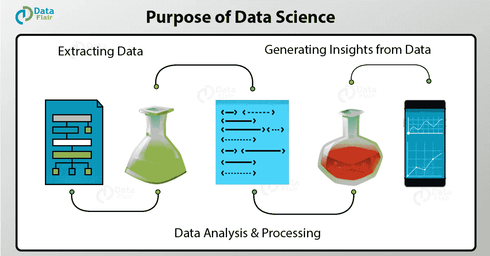

# 数据科学如何改变世界？

> 原文：<https://towardsdatascience.com/how-is-data-science-changing-the-world-db0c4b3cdb8?source=collection_archive---------14----------------------->

在本文中，您将了解数据科学家所扮演的角色。围绕数据科学有一层神秘的面纱。虽然数据科学的流行词已经流传了一段时间，但很少有人知道成为数据科学家的真正目的。

所以，我们来探讨一下数据科学的目的。

# 数据科学的目的

数据科学的主要目的是发现数据中的模式。它使用各种统计技术来分析数据并从中得出真知灼见。从数据提取、争论到预处理，数据科学家必须彻底审查数据。然后，他有责任从数据中做出预测。数据科学家的目标是从数据中得出结论。通过这些结论，他能够帮助公司做出更明智的商业决策。我们将把这个博客分成几个部分，以便更详细地理解数据科学家的角色。

# 为什么数据很重要

数据是新的电力。我们生活在第四次工业革命的时代。这是[人工智能](https://data-flair.training/blogs/artificial-intelligence-tutorial/)和大数据的时代。大规模的数据爆炸催生了新技术和更智能的产品。大约*每天产生 2.5 艾字节的数据*。在过去的十年里，对数据的需求急剧增加。许多公司已经将他们的业务集中在数据上。数据创造了 IT 行业的新领域。然而，

1.  我们为什么需要数据？
2.  为什么行业需要数据？
3.  是什么让数据成为珍贵的商品？

这些问题的答案在于企业寻求产品转型的方式。

[数据科学是一个非常新的术语](https://data-flair.training/blogs/data-science-tutorial/)。在数据科学出现之前，我们有统计学家。这些统计学家在数据的定性分析方面经验丰富，公司雇佣他们来分析他们的整体业绩和销售。随着计算过程、云存储和分析工具的出现，计算机科学领域与统计学相结合。这催生了数据科学。

早期[数据分析](https://data-flair.training/blogs/data-analytics-tutorial/)基于调查和寻找公共问题的解决方案。例如，对一个地区的一些孩子的调查将导致该地区学校发展的决定。在计算机的帮助下，决策过程被简化了。因此，计算机可以解决更复杂的统计问题。随着数据开始激增，公司开始意识到其价值。它的重要性体现在许多旨在提升客户体验的产品上。各行各业都在寻找能够挖掘数据潜在价值的专家。数据可以帮助他们做出正确的商业决策，实现利润最大化。此外，它给了公司一个机会，根据客户的购买模式来检查客户的行为并采取行动。数据有助于公司提升收入模式，并帮助他们为客户打造更高质量的产品。

数据对于产品就像电对于家用电器一样。我们需要数据来设计迎合用户的产品。这是驱动产品并使其可用的因素。数据科学家就像雕刻家。他篡改数据，从中创造出一些有意义的东西。虽然这可能是一项单调乏味的任务，但数据科学家需要具备正确的专业知识来提供结果。

# 数据科学为什么重要？

*数据创造神奇*。行业需要数据来帮助他们做出谨慎的决策。数据科学将原始数据搅拌成有意义的见解。所以，行业需要数据科学。数据科学家是知道如何利用数据创造奇迹的巫师。一个熟练的数据科学家将知道如何从他遇到的任何数据中挖掘出有意义的信息。他帮助公司朝着正确的方向发展。公司需要强有力的数据驱动决策，而他是这方面的专家。数据科学家是统计学和计算机科学各个基础领域的专家。他运用他的分析才能来解决商业问题。

数据科学家非常擅长解决问题，被指派在数据中寻找模式。他的目标是识别多余的样本，并从中获得洞见。[数据科学](https://en.wikipedia.org/wiki/Data_science)需要各种工具从数据中提取信息。数据科学家负责收集、存储和维护结构化和非结构化形式的数据。

虽然数据科学的角色侧重于数据的分析和管理，但它取决于公司的专业领域。这要求数据科学家具备特定行业的领域知识。

# 以数据为中心的行业的目的

如上所述，公司需要数据。他们需要数据驱动的决策模型和创造更好的客户体验。在本节中，我们将探讨这些公司关注的特定领域，以便做出更智能的数据驱动型决策。

# I .数据科学促进更好的营销

公司正在使用数据来分析他们的营销策略，并制作更好的广告。很多时候，企业在营销他们的产品上花费了天文数字。这有时可能不会产生预期的结果。因此，通过研究和分析客户反馈，公司能够创作出更好的广告。这些公司通过仔细分析客户的在线行为来做到这一点。此外，监控客户趋势有助于公司获得更好的市场洞察力。因此，企业需要数据科学家来帮助他们在营销活动和广告方面做出强有力的决策。

# 二。获取客户的数据科学

数据科学家通过分析客户的需求来帮助公司获得客户。这使得公司可以根据潜在客户的需求定制最适合的产品。数据是公司了解客户的关键。因此，数据科学家的目的是让公司能够识别客户，并帮助他们满足客户的需求。

# 三。数据科学促进创新

公司利用丰富的数据创造更好的创新。数据科学家通过分析和创造传统设计中的洞察力来帮助产品创新。他们分析顾客的评论，并帮助公司制作一个与评论和反馈完美契合的产品。利用客户反馈的数据，公司可以做出决策，并朝着正确的方向采取适当的行动。

# 四。丰富生活的数据科学

客户数据是改善他们生活的关键。医疗保健行业使用他们可用的数据来帮助他们的客户的日常生活。这些行业中的数据科学家的目的是分析个人数据、健康史，并创造产品来解决客户面临的问题。

从以上以数据为中心的公司的实例来看，很明显每个公司使用数据的方式都不同。数据的使用因公司要求而异。所以数据科学家的目的取决于公司的利益。

# 数据科学家的其他技能

现在，在这篇关于数据科学目的的博客中，我们将看到数据科学家还需要哪些其他的[技能](https://data-flair.training/blogs/skills-needed-to-become-a-data-scientist/)。在本节中，我们将探讨数据科学家的工作如何超越分析数据和从数据中获取洞察力。除了使用统计技术得出结论，数据科学家的目标是与公司交流他的结果。数据科学家不仅需要精通数字运算，还应该能够翻译数学术语，以便做出正确的商业决策。

例如，假设一名数据科学家正在分析公司的月销售额。他使用各种统计工具对数据进行分析并得出结论。最终，他获得了需要与公司分享的成果。数据科学家需要知道如何以非常简洁和简单的方式交流结果。管理销售和分销的人可能不理解技术结果和过程。因此，数据科学家必须会讲故事。数据的讲述将使他能够毫无困难地将其知识传递给管理团队。因此，它拓宽了数据科学家的目的。

数据科学是管理和 IT 的结合。数据科学家的目的不仅仅限于数据的统计处理，还包括管理和交流数据，以帮助公司做出更好的决策。

所以，这一切都是为了数据科学。希望你喜欢我们的文章。

# 摘要

在文章的最后——数据科学的目的，我们得出结论，数据科学家是数据密集型公司的中坚力量。数据科学家的目的是提取、预处理和分析数据。通过这一点，公司可以做出更好的决策。各个公司都有自己的要求，并相应地使用数据。最终，数据科学家的目标是让企业发展得更好。根据所提供的决策和见解，公司可以采取适当的策略并进行自我定制，以增强客户体验。

尽管如此，如果你有任何关于数据科学目的的问题，请通过评论自由提问。我们一定会回复你的。