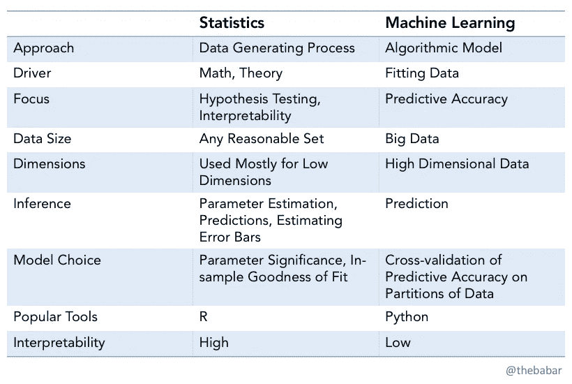
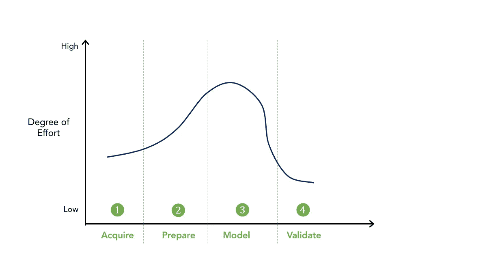
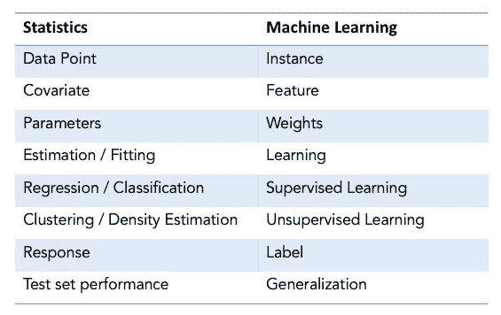

# 机器学习与统计学有什么不同，为什么它很重要

> 原文：<https://towardsdatascience.com/how-is-machine-learning-different-from-statistics-and-why-it-matters-5a8ed539976?source=collection_archive---------14----------------------->

Photo by [Daniel Prado](https://unsplash.com/@stratoprado?utm_source=unsplash&utm_medium=referral&utm_content=creditCopyText) on [Unsplash](https://unsplash.com/s/photos/math?utm_source=unsplash&utm_medium=referral&utm_content=creditCopyText)

统计学和机器学习的异同是一个引发大量讨论的话题。许多高质量的文章和帖子已经从不同的角度解决了这个问题(尤其参见下面的参考文献[1–5])。这篇文章的目的是 a)总结这个主题的大量工作 b)补充我的观点 c)包括有用的比较。

关键点是:

*   机器学习使用统计数据来理解和基准测试数据以及验证模型
*   在某些问题中，人们可以互换统计建模或机器学习(也称为经典 ML)——逻辑回归就是一个例子
*   深度学习是过去几年来炙手可热的机器学习的一个子集，它远远超出了统计方法，为全新类别的问题(如计算机视觉)提供了解决方案，正是在这里，ML 和统计之间的对比非常明显
*   业务目标、技术或其他资源限制决定了哪种方法最适合给定的问题——每种方法都有自己的优势和局限性——在现实世界的问题中，我们可以使用混合方法(例如，逻辑回归用作第一步，然后是深度学习)

先说统计学和机器学习的定义。然后，我们将进一步了解重叠、差异以及这两个领域如何在数据科学和分析的生命周期中共存。

*   统计学是数学的一个分支。 *统计建模是将数据中变量之间的关系以数学方程的形式形式化。有两个主要的思想流派:频率主义者和贝叶斯主义者(基于概率——数学的另一个分支，处理预测未来事件的可能性)。当你需要更多地了解数据和估计量的性质时，统计学通常应用于低维问题。估计量属性的常见示例包括 p 值、标准差、置信区间或无偏估计量。注:统计学使用概率论和分布。*
*   *机器学习(ML)是计算机科学和人工智能的一个子领域。ML 处理构建系统(算法，模型)，这些系统可以从数据和观察中学习，而不是显式编程的指令(例如规则)。*

《自然》[3]上的这篇论文很好地总结了这种差异。

> **统计学从样本中得出总体推断，机器学习找到可概括的预测模式。**【3】

下面简单总结一下统计学和机器学习的区别。

Comparison of Statistics and ML (multiple sources)

正如麦肯锡*【4】*的论文[*中所指出的，ML 算法通常远比它们的统计对应物复杂，并且通常需要在训练过程开始之前做出设计决策。ML 的优势包括卓越的性能和准确性，但其复杂性导致 ML 的解释、偏差和合规性面临额外的挑战。这不仅仅是一个技术问题。该文件正确地指出，所需的可解释性程度是一种政策选择。*](https://www.mckinsey.com/business-functions/risk/our-insights/derisking-machine-learning-and-artificial-intelligence)

**特征工程** — ML 更复杂是因为特征工程固有的困难——也就是用哪些特征？每个功能的声音如何？是否符合政策？本文指出了与特征工程相关的三个因素:

1.  大量输入

2.非结构化数据(如语音)需要特征工程作为训练开始前的预处理步骤

3.AutoML 可以生成大量复杂的特征来测试数据的许多转换，这会增加不必要的复杂性

**超参数**也是机器学习中的一个挑战。在训练过程开始之前，必须定义随机森林模型中的树的深度或深度神经网络中的层数。关于超参数的决策通常比统计建模中的类似决策更复杂。

不同的模型类型有自己的怪癖。当像支持向量机这样的二进制分类器通常与 NLP 结合来做出决定时，在这些情况下，性能将对所选择的核函数敏感。

# ML 工作流程中的统计数据

考虑具有四个阶段的 ML 工作流的简化版本: *(1)获取数据(2)准备数据(3)建模(4)验证。*统计是可靠数据准备和合理验证的关键，通常用作建模过程的一部分。

Four Phases of ML and Statistics

数据探索—通常是分析师、数据科学家执行的第一步—由统计数据提供信息。那么预处理是由问题的性质和业务需求驱动的。

当我们想要从总体中创建科学上可靠的样本数据时，也会用到统计学。术语' *S* 统计显著'[总体样本](https://medium.com/data-science-journal/how-to-correctly-select-a-sample-from-a-huge-dataset-in-machine-learning-24327650372c) —意思是我们想要创建合适大小的代表性数据集(样本)，然后可以用于 ML。这一步是减少 ML 中一类偏倚的关键。

**验证**

我们如何验证我们有代表性的样本？公认的方法是检查样本的 p 值，以确保其超过 5%的置信水平(即通过显著性测试)。数值型变量必须用 Kolmogorov-Smirnov 检验，而分类型变量需要用 Pearson 的卡方检验。例如，Bootstrap 是一种重采样方法。

统计学对于从数据中识别和减轻样本或测量偏差也很重要。验证者需要确定开发人员是否采取了必要的步骤来确保公平性。可以对模型进行公平性测试，如果有必要，可以在模型开发过程的每个阶段进行修正，从设计阶段一直到性能监控。

根据美联储银行的金融服务指南[ [美联储 SR11–7](https://www.federalreserve.gov/supervisionreg/srletters/sr1107a1.pdf)]，适当的统计测试取决于具体的分布假设和模型的目的。此外，在许多情况下，基于样本信息，统计检验不能明确地拒绝错误的假设或接受正确的假设。

《华尔街日报》最近的一篇文章谈到了金融机构在升级统计模型时如何应对洗钱的挑战。例子故事。例如，U. S. Bancorp 过去一直使用规则来检测欺诈。现在，它拥有 ML 人员和工具来运行更高级的搜索，根据更多的指标来标记那些看起来与其他人有统计差异的客户。

统计和 ML 经常一起使用来提供一个健壮的解决方案。

**迷失在翻译中？**

很多时候，统计建模和 ML 使用非常相似的方法，因此相互重叠。

逻辑回归-逻辑回归是机器学习从统计领域借用的一种技术。这是一种广泛用于二分类问题的方法，但也可以扩展到多类问题。

这里列出了一些意思相似但名称不同的术语。

Statistics and ML — Terms with Different Names, Similar Meaning

然后对**推论**有了不同的理解。以下是来自 Quora 帖子的一段经过编辑的摘录:

> 在统计推断中，我们观察到一些数据，我们想说一些关于产生这些数据的过程的知识。因此，预测、估计误差线、假设检验和参数估计都是统计推断的一部分。
> 
> 另一方面，来自计算机科学传统的传统机器学习研究人员通常喜欢区分学习和推理。*学习*与参数估计相关联，并且不被明确地认为是推理问题。因此，术语“推断”的概念比统计学家的概念要窄，被认为是一种预测。例如，在图像处理问题中，给定具有许多缺失像素值的图像，我们可能想要从我们学习的联合分布中填充缺失像素的最可能值。

总结一下，统计学和 ML 有关键的区别。特别是深度学习为解决以前难以解决的问题打开了大门，不需要手工设计功能、深入的领域知识或做出假设，这使它比任何其他分析方法都有优势。

# 为什么重要？

作为一名实践数据科学家或 ML 工程师，你需要了解统计学的基础知识。是的，你可以在不知道原因的情况下使用现有的库，但是在处理现实世界的问题时，你不会总是遵循一种千篇一律的方法。这就是统计理论的适当知识会有所帮助的地方。我认识许多数据科学家，他们一开始是统计学家，他们带来了一个重统计的观点。转向 ML 的软件工程师带来了另一种观点。

如果你正在招聘、资助或帮助创建数据科学实验室、卓越中心或实践中心，你需要留意这些趋势，并努力平衡团队的角色和思维类型。

让我们以一个轻松的音符结束——作者[乔·戴维森](https://medium.com/u/9532465e85b7?source=post_page-----5a8ed539976--------------------------------)【2】。

> *“当你筹款的时候，它是人工智能。当你在招人的时候，就是 ML。当你实施时，这是逻辑回归。”*

希望这篇文章对你有所帮助。查看我的其他文章，并随时在 LinkedIn 上与[我联系。](http://linkedin.com/in/bbhatti)

**参考资料和阅读材料**

1.  [马修·斯图尔特，博士研究员](https://medium.com/u/b89dbc0712c4?source=post_page-----5a8ed539976--------------------------------)—[https://towards data science . com/the-actual-difference-between-statistics-and-machine-learning-64b 49 f 07 ea 3](/the-actual-difference-between-statistics-and-machine-learning-64b49f07ea3)
2.  [乔·戴维森](https://medium.com/u/9532465e85b7?source=post_page-----5a8ed539976--------------------------------)[—https://towards data science . com/no-machine-learning-is-not-just-glorized-statistics-26d 3952234 E3](/no-machine-learning-is-not-just-glorified-statistics-26d3952234e3)
3.  [达尼洛·布兹多克](https://www.nature.com/articles/nmeth.4642#auth-1)、[娜奥米·奥特曼](https://www.nature.com/articles/nmeth.4642#auth-2)和[马丁·克日温斯基](https://www.nature.com/articles/nmeth.4642#auth-3)——统计学对机器学习[https://www.nature.com/articles/nmeth.4642](https://www.nature.com/articles/nmeth.4642)
4.  [https://www . McKinsey . com/business-functions/risk/our-insights/derisking-machine-learning-and-artificial-intelligence](https://www.mckinsey.com/business-functions/risk/our-insights/derisking-machine-learning-and-artificial-intelligence)
5.  [https://www . quora . com/What-is-the-difference-of-inference-and-learning](https://www.quora.com/What-is-the-difference-between-inference-and-learning)
6.  [https://stats . stack exchange . com/questions/6/the-two-cultures-statistics-vs-machine-learning](https://stats.stackexchange.com/questions/6/the-two-cultures-statistics-vs-machine-learning)
7.  罗布·提布拉尼——[http://statweb.stanford.edu/~tibs/stat315a/glossary.pdf](http://statweb.stanford.edu/~tibs/stat315a/glossary.pdf)
8.  [统计建模:两种文化](http://projecteuclid.org/euclid.ss/1009213726)作者 [Leo Breiman](https://en.wikipedia.org/wiki/Leo_Breiman) 。[http://projecteuclid.org/euclid.ss/1009213726](http://projecteuclid.org/euclid.ss/1009213726)
9.  [https://www . slide share . net/benjaminskrinka/essential-ecometrics-for-data-scientists](https://www.slideshare.net/BenjaminSkrainka/essential-econometrics-for-data-scientists)
10.  [https://machine learning mastery . com/relationship-between-applied-statistics-and-machine-learning/](https://machinelearningmastery.com/relationship-between-applied-statistics-and-machine-learning/)
11.  [https://www . kdnugges . com/2016/11/machine-learning-vs-statistics . html](https://www.kdnuggets.com/2016/11/machine-learning-vs-statistics.html)
12.  [Phani Srikanth](https://medium.com/u/b7f3e4fe28b3?source=post_page-----5a8ed539976--------------------------------)—https://medium . com/data-science-analytics/statistical-learning-vs-machine-learning-f 9682 FDC 339 f
13.  [https://normal deviate . WordPress . com/2012/06/12/statistics-vs-machine-learning-5-2/](https://normaldeviate.wordpress.com/2012/06/12/statistics-versus-machine-learning-5-2/)
14.  [https://www . quora . com/What-is-the-difference-of-inference-and-learning](https://www.quora.com/What-is-the-difference-between-inference-and-learning)
15.  [https://stats . stack exchange . com/questions/5026/what-is-the-difference-data-mining-statistics-machine-learning-and-ai](https://stats.stackexchange.com/questions/5026/what-is-the-difference-between-data-mining-statistics-machine-learning-and-ai)
16.  [https://medium . com/datadriveninvestor/differences-between-ai-and-machine-learning-and-why-it-matters-1255 b182 fc6](https://medium.com/datadriveninvestor/differences-between-ai-and-machine-learning-and-why-it-matters-1255b182fc6)
17.  [https://HBR . org/2019/07/building-the-ai-powered-organization](https://hbr.org/2019/07/building-the-ai-powered-organization)，[https://HBR . org/2019/03/why-data-science-teams-need-通才-非专家](https://hbr.org/2019/03/why-data-science-teams-need-generalists-not-specialists)