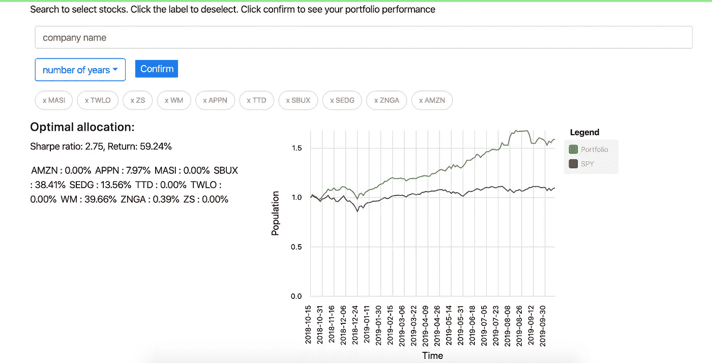

# 千禧一代对 Robinhood vs. Motley Fool 股票顾问的投资选择

> 原文：<https://towardsdatascience.com/how-is-millennials-investment-choice-compared-to-motley-fool-stock-advisor-6bfe6dbf9cc1?source=collection_archive---------14----------------------->

Photo by [Sabine Peters](https://unsplash.com/@kredit?utm_source=medium&utm_medium=referral) on [Unsplash](https://unsplash.com?utm_source=medium&utm_medium=referral)

(这篇文章也可以在我的[博客](https://kylelix7.github.io/How-is-Millennial's-Investment-choice-compared-to-Motley-Fool-Stock-Advisor/)上看到)

[Robinhood](https://robinhood.com/) 是一家受欢迎的交易经纪商，由于其革命性的 0 佣金服务，其用户群主要是千禧一代。The Motley Fool 是一家在互联网上提供金融信息的金融服务公司。杂色傻瓜向订阅用户提供每周股票推荐。该公司声称，他们的专家汤姆和大卫挑选的股票远远跑赢市场。

在这篇文章中，我将比较傻瓜投资组合(最近挑选的股票)和千禧一代投资组合(Robinhood 透露的热门股票)的表现。

# 一起

傻瓜精选:交易台(TTD)、Appian (APPN)、Zscale (ZS)、Twilio (TWLO)、Zoom Video Communications (ZM)、废物管理(WM)、星巴克(SBUX)、马西莫(MASI)、亚马逊(Amazon)、Zynga (ZNGA)和 SolarEdge Technologies (SEDG)。

千禧一代的选择(T4 榜单前十名):奥罗拉大麻(Aurora Cannabis)、通用电气(GE)、福特(Ford)、Fitbit、GoPro (GPRO)、克罗诺斯集团(CRON)、Hexo (HEXO)、Canopy Growth (CGC)、Snap (SNAP)、Plug Power (PLUG)和 Zynga (ZNGA)。

仔细观察，我们会发现愚人的投资组合似乎比另一个更多样化。它包含科技、消费者和高股息股票。而罗宾汉的用户主要关注科技股和大麻股。

most popular stock list by Robinhood as of the date of this post

我用来比较策略的工具是 [StockOptimizr](http://www.stockoptimizr.com/) 。StockOptimizr 可以根据历史数据(1 年、2 年或 4 年)计算给定股票列表的最佳分配。衡量投资组合好坏的指标是夏普比率。夏普比率衡量回报/风险的比率。夏普比率高意味着投资组合的收益相对较好，风险相对较低。在这个对比中，我只关注 1 年的历史数据。以下是愚人组合的表现。它强调，在 10 只股票中，只有几只包含在最优分配中。分别是 Appian (7.97%)、Startbucks (38.41%)、SolarEdge(13.56%)、废物管理(39.66%)和 Zynga (0.39%)。今年的总回报率为 59.24%，夏普比率为 2.75。这是相当不错的相比，市场(间谍)只获得约 9%。

Fools’ performance with SPY in one year

现在，让我们来看看千禧一代是如何做的。如下，我们发现，甚至更少的股票被用来做一个最佳的投资组合。只有 Plug Power (21.39%)和 Snap (78.61%)在最优组合中。这可能是因为去年马里胡阿那的股票波动太大。与傻瓜的投资组合 59.24%相比，该投资组合的回报率高达 77.46%。不过值得一提的是夏普比率要低很多，只有 1.35。它的高回报是以承担更多风险为代价的。这也反映出我们的年轻一代愿意为高潜在收益而冒险。

Portfolio built by Top 10 popular stocks in Robinhood

尽管数字是量化的，但很难判断哪个投资组合比另一个更好。这得由你自己的需要来衡量。一般来说，年轻一代有时间为高回报去冒险。老一辈可能倾向于购买更安全的高股息股票。但是应该适用于所有人的几个重要规则是分散投资和存足够的钱进行长期投资。

***注来自《走向数据科学》的编辑:*** *虽然我们允许独立作者根据我们的* [*规则和指导方针*](/questions-96667b06af5) *发表文章，但我们不认可每个作者的贡献。你不应该在没有寻求专业建议的情况下依赖一个作者的作品。详见我们的* [*读者术语*](/readers-terms-b5d780a700a4) *。*

**我的帖子:**

我关于金融和科技的帖子

[我的 YouTube 频道](https://bit.ly/3bBOjtJ)

[我关于 FAANG 访谈的帖子](https://medium.com/@fin.techology/my-posts-about-faang-interview-20e529c5f13f?source=your_stories_page---------------------------)

[从 CRUD web 应用开发到语音助手中的 SDE——我正在进行的机器学习之旅](https://medium.com/@fin.techology/from-crud-app-dev-to-sde-in-voice-assistant-my-ongoing-journey-to-ml-4ea11ec4966e?)

[全栈开发教程:将 AWS Lambda 无服务器服务集成到 Angular SPA 中](/full-stack-development-tutorial-integrate-aws-lambda-serverless-service-into-angular-spa-abb70bcf417f)

[全栈开发教程:用运行在 AWS Lambda 上的无服务器 REST API 提供交易数据](/full-stack-development-tutorial-serverless-rest-api-running-on-aws-lambda-a9a501f54405)

[全栈开发教程:在 Angular SPA 上可视化交易数据](/full-stack-development-tutorial-visualize-trading-data-on-angular-spa-7ec2a5749a38)

[强化学习:Q 学习简介](https://medium.com/@kyle.jinhai.li/reinforcement-learning-introduction-to-q-learning-444c951e292c)