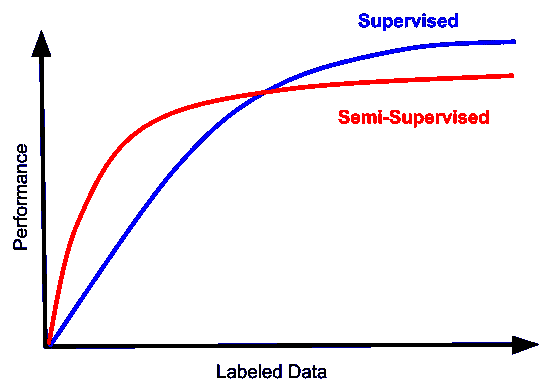
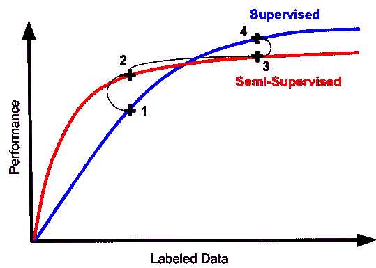
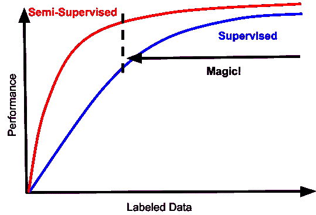
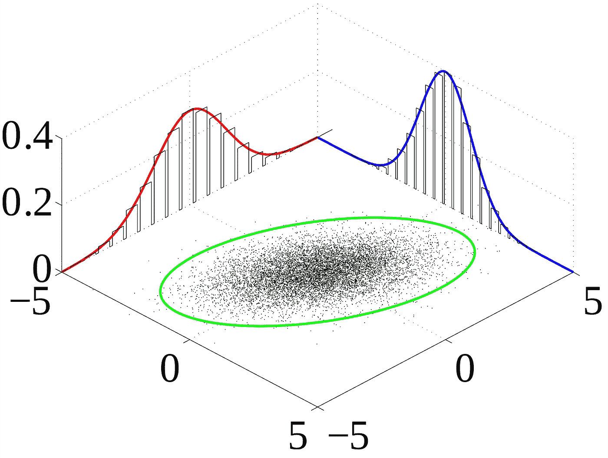

# 半监督学习中静悄悄的革命是如何改变行业的？

> 原文：<https://towardsdatascience.com/how-is-the-quiet-revolution-in-semi-supervised-learning-changing-the-industry-4a25f211ce1f?source=collection_archive---------18----------------------->

Photo by [@penguinuhh](https://unsplash.com/@penguinuhh)

## 混合匹配、无监督数据扩充和 PATE 方法

作为一名辅修计算机科学的人类学学生，我想尽我最大的努力去理解这一发展，以及当它实现时会有什么样的后果。然而，首先，我们必须运行的变化和技术，使一个可行的半监督学习方法的实际方面。然后，我将跳转到一些技术，这些技术结合起来，可能会改变我们在机器学习中处理这一领域的方式。

这是我三天看三个问题的最后一天。

[第一天:谷歌如何成为人工智能领域的领跑者？](/google-ai-and-developments-in-semi-supervised-learning-5b1a4ad29d67?source=friends_link&sk=ddc7b1d106980109b8699b187ee39191)(完成)

[第二天:无监督数据增强(UDA)的半监督学习(SSL)取得了哪些进展，为什么它对人工智能领域很重要？](/advancements-in-semi-supervised-learning-with-unsupervised-data-augmentation-fc1fc0be3182?source=friends_link&sk=cbac033d5f98b5ff54daf4547a3d0ace)(完成)

**第三天:SSL 的悄然革命如何改变行业？**

今天是最后一天，我将写下这场静悄悄的半监督革命。我将从这个术语是如何产生的开始；以前的惯例；以及 SSL 格局是如何变化的。之后我将很快结束发言。

## 谁创造了安静的半监督革命？

5 月 15 日，谷歌首席科学家 Vincent Vanhoucke 发表了一篇名为半监督革命的文章。据我所知，这是第一次提到以这种方式使用 SSL 的变化。

他首先谈到了半监督学习(SSL)之前的问题。由于要访问大量数据、有限的监督数据和大量未标记的数据，SSL 似乎是一个显而易见的解决方案。他在图表上展示了他的观点，这些图表通常来自监督和半监督实验。

Illustrative graph by [Vincent Vanhoucke](https://medium.com/u/2879ca55026a?source=post_page-----4a25f211ce1f--------------------------------)

根据 Vanhoucke 的说法，一名机器学习工程师经历了一段旅程，最终回到了图中所示的监督学习。

Illustrative graph by [Vincent Vanhoucke](https://medium.com/u/2879ca55026a?source=post_page-----4a25f211ce1f--------------------------------)

但是他接着说:

> 一个有趣的趋势是，半监督学习的前景可能会变得更像这样:

Illustrative graph by [Vincent Vanhoucke](https://medium.com/u/2879ca55026a?source=post_page-----4a25f211ce1f--------------------------------)

## 以前的惯例是什么？

对于工程师来说，SSL 被描述为一个兔子洞，几乎是一种成年仪式，最终只能回到数据标记上来。根据 Vanhoucke 的说法，以前的惯例是:

> …首先学习未标记数据的自动编码器，然后对标记数据进行微调。几乎没有人再这样做了，因为通过自动编码学习到的表示往往会在经验上限制微调的渐近性能。

那么什么是自动编码器呢？我们来分析一下。

**Autoencoder** 是一种人工神经网络，用于以无监督的方式学习高效的数据编码。自动编码器的目的是通过训练网络忽略信号“噪声”来学习一组数据的表示(编码)，通常用于*降维*。随着缩减侧，学习重构侧，其中自动编码器试图从缩减的编码中生成尽可能接近其原始输入的表示，因此得名。

*   **输入空间的维度**。高维空间(100 或 1000)。空间的体积增加太多，数据变得稀疏。例如，计算优化问题中的每个值的组合。如果你想要一个神秘的倾斜，这一点可以被称为[维度诅咒](https://en.m.wikipedia.org/wiki/Curse_of_dimensionality)。

**渐近线**在数学中用来指在无穷远处与曲线相切的直线。 ***计算复杂性中的渐近符号*** 是指定义域和值域为 Z+的函数的极限行为，对于定义域大于特定阈值的值有效。因此，这里我们用曲线来近似曲线。通常，优选地，我们寻找紧密跟踪原始曲线的曲线。

*   **渐近性能**是一种比较算法性能的方法。你可以抽象出底层的细节(例如精确的汇编代码)；调查缩放行为(对于非常大的输入，哪种方式更好？).渐近性能:随着输入大小的增长，执行时间如何增长？

Vanhoucke 声称:

> …即使是大幅改进的现代生成方法也没有改善这种情况，可能是因为好的生成模型不一定就是好的分类器。因此，今天当你看到工程师微调模型时，通常是从在监督数据上学习的表示开始的…

什么是生成方法？

**生成学习**是一种理论，涉及到新思想与学习者现有图式的积极整合。**生成性学习**的主要思想是，为了理解地学习，学习者必须主动构建意义。生成模型仅适用于概率方法。在统计分类中，包括机器学习，两种主要的方法被称为**生成**方法和鉴别方法。下面显示了生成分类器(联合分布):

## 是什么改变了 SSL 的前景？

昨天我写了一篇文章，名为谷歌人工智能和半监督学习的发展。文章首先经过了讲解*无监督学习、监督学习和强化学习*。然后，它继续解释半监督学习(SSL)以及如何利用无监督数据增强(UDA)对 SSL 进行研究。因此，如果你不熟悉这些术语，最好跳回那篇文章。

无论如何，有一些进步提到了向 SSL 的可用性增加的转变。你可能想看看这三个流行的:

*   [**提高精度的组合方法**。MixMatch:半监督学习的整体方法](https://arxiv.org/abs/1905.02249)
*   [**利用无监督数据扩充更好地处理未标记数据**](https://arxiv.org/abs/1904.12848)
*   **维护隐私**。PATE 方法([从私人训练数据进行深度学习的半监督知识转移](https://arxiv.org/abs/1610.05755)，[利用 PATE 进行可扩展的私人学习](https://arxiv.org/abs/1802.08908)

有一些新的聪明的方法来给数据贴上自我标签，并表达损失，这些方法与自我标签的噪音和潜在偏见更加兼容。与前两点相匹配的两个最近的工作例证了最近的进展并指向相关文献: [MixMatch:半监督学习的整体方法](https://arxiv.org/abs/1905.02249)和[非监督数据](https://arxiv.org/abs/1904.12848)增强。

在 MixMatch 论文中，他们介绍了 *MixMatch* ，这是一种 SSL 算法，它提出了一种单一损失，统一了半监督学习的主流方法。与以前的方法不同，MixMatch 同时针对所有属性，我们发现它有以下好处:

*   在一项实验中，他们表明 MixMatch 在所有标准
    图像基准上获得了最先进的结果(第 4.2 节)，例如在具有 250 个标签的 CIFAR-10
    上获得了 11.08%的错误率(相比之下，次优方法获得了 38%)。
*   他们在消融研究中表明，MixMatch 大于其各部分的总和。
*   他们证明了 MixMatch 对于不同的私人学习是有用的，使 PATE 框架中的学生能够获得新的最先进的结果，
    同时加强了提供的隐私保证和实现的准确性。

**一致性正则化**通过利用分类器即使在被增强后也应该为未标记的示例输出相同的类分布的思想，将数据增强应用于半监督学习。MixMatch 通过对图像使用标准数据扩充(随机水平翻转和裁剪)来利用一致性正则化的形式。

**MixMatch** 是一种“整体”方法，它结合了主流 SSL 范例的思想和组件。

MixMatch 是由 Google Brain 团队的成员作为半监督学习方法引入的，它结合了当前半监督学习的主流范式的思想和组件。

通过对半监督和隐私保护学习的大量实验，我们发现在他们研究的所有设置中，MixMatch 与其他方法相比表现出显著改善的性能，错误率通常降低两倍或更多。

在未来的工作中，他们有兴趣将来自半监督学习文献的额外想法融入混合方法，并继续探索哪些组件会产生有效的算法。

另外，大多数关于半监督学习算法的现代工作都是在图像基准上进行评估的；他们对探索 MixMatch 在其他领域的有效性很感兴趣。

**使用 UDA 的 SSL。**由于获得无标签数据比获得有标签数据容易得多，所以在实际操作中，我们经常会遇到
的情况，即无标签数据的数量与有标签数据的数量差距很大。

为了使 UDA 能够利用尽可能多的未标记数据，他们通常需要一个足够大的
模型，但是一个大模型很容易使有限大小的监督数据过拟合。

为了解决这个困难，他们引入了一种新的训练技术，叫做训练信号退火。TSA 背后的主要直觉是，随着模型在越来越多的未标记示例上进行训练，逐渐释放已标记示例的训练信号，而不会过度拟合它们。

**锐化预测**。我们观察到，在问题很难并且标记的

例子的数量非常少的情况下，在未标记的例子和增强的未标记的例子

上的预测分布在类别间趋于过度平坦。

**基于置信度的屏蔽**。屏蔽掉模型不确定的例子。

[***【可扩展私学】同 PATE***](https://arxiv.org/pdf/1802.08908.pdf) *。我将摘录 2018 年 2 月 24 日发布的论文摘要:*

> 机器学习的快速采用增加了对基于敏感数据(如医疗记录或其他个人信息)训练的机器学习模型的隐私影响的担忧。为了解决这些问题，一种有前途的方法是教师集合的私人聚合，或 PATE，它将“教师”模型集合的知识转移到“学生”模型，通过在不相交的数据上训练教师来提供直观的隐私，并通过教师答案的嘈杂聚合来保证强隐私。

## 结论

使用 UDA 的 SSL 非常类似于根据您刚刚看到的内容重新创建，以便在计算的意义上理解视觉印象。MixMatch 结合了许多方法来使 SSL 更好地工作。PATE 是维护隐私所必需的。当学习必须在需要知道的基础上进行时，SSL 还可以提议保护隐私，这些数据可能是您事先不知道(或不允许知道)的。因此，在这种情况下，提高准确性非常重要，并且可能会使行业变得更好。

这是#500daysofAI 的第 41 天。

希望你喜欢这篇文章，如果有机会记得给我反馈。正如我在引言中提到的，我尽我所能去理解，我写作是为了学习。

祝你一切顺利。

> *什么是#500daysofAI？
> 我在挑战自己，用#500daysofAI 来写下并思考未来 500 天的人工智能话题。一起学习是最大的快乐，所以如果你觉得一篇文章引起了共鸣，请给我反馈。*