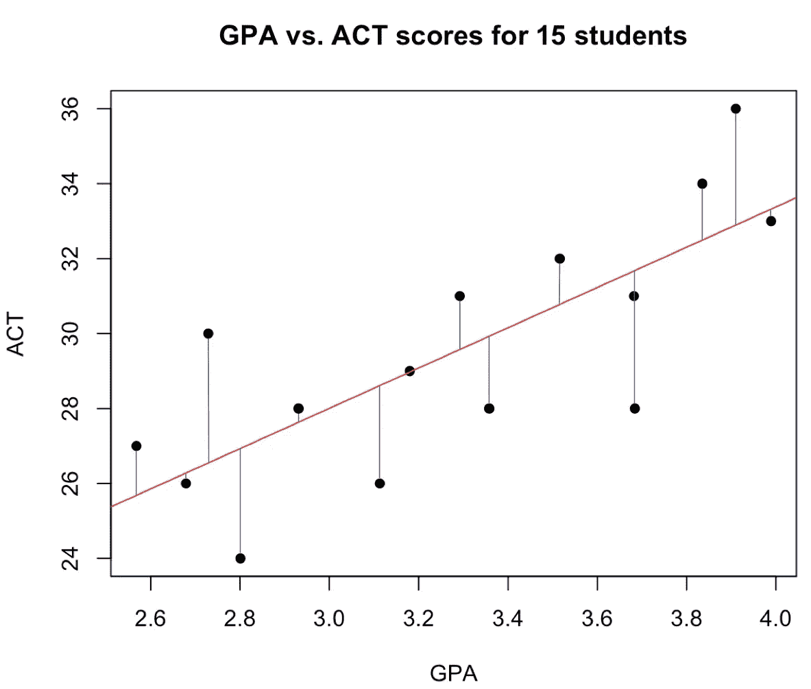
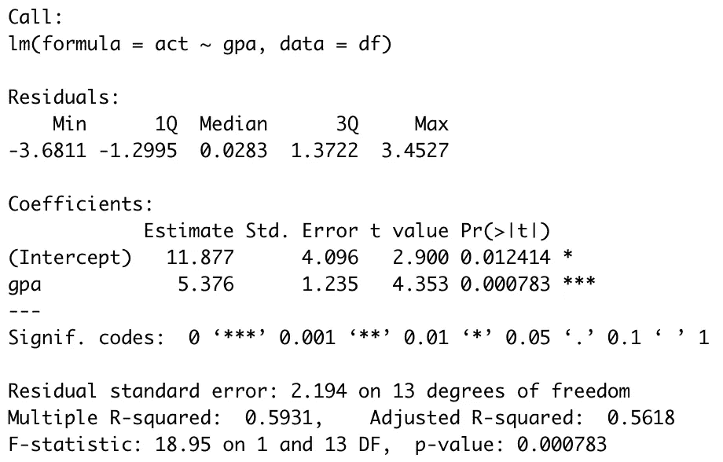
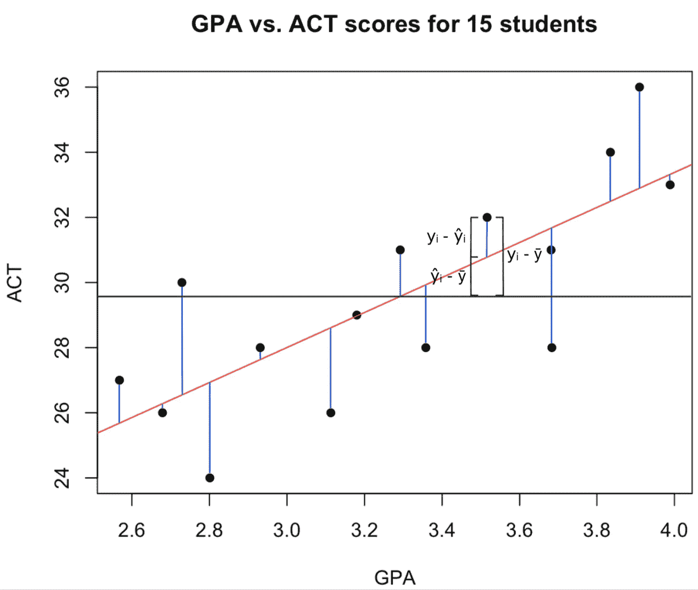

# 最小二乘回归估计实际上是如何计算的

> 原文：<https://towardsdatascience.com/how-least-squares-regression-estimates-are-actually-calculated-662d237a4d7e?source=collection_archive---------14----------------------->

## 理解模型输出是如何计算的，有助于理解它们的解释


FWStudio from Pexels

普通最小二乘法是线性回归用来获得参数估计的一种方法。这需要拟合一条线，使得从每个点到回归线的平方距离之和(残差)最小。让我们在下面的图表中想象一下，红线是回归线，蓝线是残差。



下面，我将首先介绍一个例子，然后说明如何使用残差来估计线性模型的参数。然后，我将展示如何计算汇总输出中的每个值。总之，这将揭示普通最小二乘法的内部工作原理，并演示它们是如何结合在一起的。

# **根据 GPA 预测 ACT 成绩**

目标是根据学生的 GPA 预测学生的 ACT 分数。我们首先制作一个包含 15 个 ACT 成绩和 GPA 的数据框架。然后，我们使用 lm 函数创建线性模型。

```
gpa = c(2.931,3.682,3.113,3.910,2.568,
 3.292,3.684,3.835,3.180,3.516,
 3.358,2.801,2.729,3.989,2.679)
act = c(28,31,26,36,27,31,28,34,29,32,28,24,30,33,26)
df = data.frame(cbind(gpa,act))mod = lm(act~gpa,data=df)
summary(mod)
```



*act*= 11.877+5.376 **GPA*

我们看到 *gpa* 由低 p 值支持，这表明它是 *act* 的强预测因子。估计是 5.376，这意味着 gpa 每增加 1.0，我们预计 ACT 会增加 5.376 个点。让我们看看汇总表中这些不同的值是从哪里来的。

# 平方和

下图中每个点是 *yᵢ，*每个预测值是 *ŷᵢ* ，平均值是 *ȳ* 。



**残差平方和(RSS/SSE)**

> eᵢ = yᵢ - ŷᵢ

第*个*残差是第*个*实际值和第*个*预测值之间的差值(蓝线)。**各残差平方之和为 RSS。这是为了得到我们的 beta 估计而最小化的。**

> 回想一下，ŷ = b₀ + b₁x
> 
> 因此，eᵢ = yᵢ - ŷᵢ = yᵢ - b₀ - b₁xᵢ
> 
> RSS =σ(yᵢ-b₀-b₁xᵢ)

我们首先对 RSS 取相对于 *b₀* 和 *b₁* 的偏导数，然后将它们设置为零。

> ∂rss/∂b₀=-2σ(yᵢ-b₀-b₁xᵢ)
> 
> b₀ = ȳ - b₁x̄
> 
> ∂rss/∂b₁=-2σ(yᵢ-b₀-b₁xᵢ)xᵢ
> 
> b₁=(σ(xᵢ-x̄)(yᵢ-ȳ))/σ(xᵢ-x̄)= sxy/sxx

让我们用上面的公式看看结果，从 *b₁.开始*

```
avg_act = mean(df$act)
avg_gpa = mean(df$gpa)
b1 = sum((df$gpa - avg_gpa)*(df$act - avg_act))/sum((df$gpa - avg_gpa)**2)
```

这得出 5.376。请注意，这与 lm 估计的 *gpa* 相匹配。太好了，让我们为 b₀.重复这个过程

```
b0 = avg_act - b1*(avg_gpa)
```

这得到 11.877，与截距估计值相匹配。很好，我们已经展示了如何计算参数估计，但现在我们需要测试它们的重要性。让我们先来看看与 RSS 密切相关的另外两个值。

**平方和回归(SSReg)**

> σ(ŷᵢ-ȳ)

这将对预测值和平均值之间的平方差求和。换句话说，这衡量了回归线解释了多少平方和。回头参考前面的图来想象一下。

**总平方和(SST)**

> σ(yᵢ-ȳ)
> 
> SST = RSS + SSReg

让我们检查一下这个等式对我们的例子是否成立。

```
rss = sum(((df$act - fitted.values(mod)))**2)
ssreg = sum(((fitted.values(mod) - avg_act))**2)
sst = sum(((df$act - avg_act))**2)
all.equal((rss+ssreg),sst)
```

# 将 RSS、SSReg 和 SST 与摘要输出相关联

**残差标准误差**

假设我们的误差是独立的，同方差的，正态分布，均值为 0，方差为σ。残差可用于创建误差方差的无偏估计。剩余标准误差是这个σ估计量的平方根。这让我们知道我们的点离回归线有多远。

```
n = nrow(df)
p = 1
rse = sqrt(rss/(n-p-1))
```

这里，p 是非截距预测值的数量。在我们的 SLR 例子中，我们只有一个预测器，所以分母变成 n-2。

**性病。(参数估计的)误差**

> var(*b₀*| x)=σ[(1/n)+(x̄/sxx)]

```
sxx = sum((df$gpa - avg_gpa)**2)
sigma_squared = rss/(n-p-1)var_b0 = sigma_squared*((1/n)+(avg_gpa**2/sxx))
se_b0 = sqrt(var_b0)
```

> Var( *b₁* |X) = σ /SXX

```
var_b1 = (rss/(n-p-1))/(sxx)
se_b1 = sqrt(var_b1)
```

**t 值**

t 统计量的计算方法是将β估计值除以它们的标准误差。分子是标准的正态变量，分母是具有 n-p-1 个自由度的卡方变量的平方根。因此，这些统计数据遵循具有 n-p-1 个自由度的 t 分布。

```
t_b0 = b0/se_b0
t_b1 = b1/se_b1
2*pt(t_b0,n-p-1,lower.tail=F)
2*pt(t_b1,n-p-1,lower.tail=F)
```

**多重 R 平方**

> R = SSReg/SST = 1 - RSS/SST

换句话说，R 是回归线(SSReg)对总方差(SST)解释的方差的度量。

**调整后的 R 平方**

> ᵃᵈʲ = 1 - (RSS/n-p-1)/(SST/n-1)

重新排列调整后的 R 方程，分子中会留下 n-1，分母中会留下 n-p-1。因此，即使在简单的线性回归环境中，调整后的 R 也总是小于 R 的倍数。

**F 统计量**

> f = MSReg/MSE

MS 指均方差。这些值的计算方法是将 SSReg 和 RSS 除以各自的自由度 1 和 n-p-1。因为这是两个卡方变量的比率，所以新的统计数据遵循具有 1 和 n-p-1 个自由度的 f 分布。

```
f = (ssreg/1)/(rss/(n-2))
pf(f,1,n-p-1,lower.tail=F)
```

# 结论

我们已经研究了普通的最小二乘法，以及如何用它来计算参数估计。此外，我们已经展示了如何使用与 RSS 相关的值来计算测试统计信息和诊断信息。