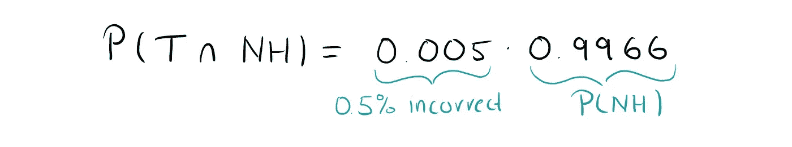
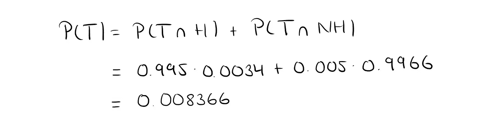
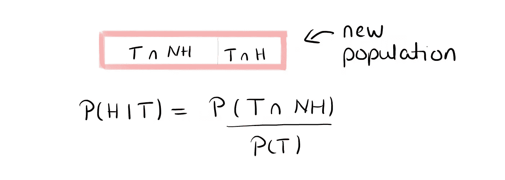

# 如果检测结果为阳性，是否会感染艾滋病病毒？

> 原文：<https://towardsdatascience.com/how-likely-is-it-that-you-are-infected-with-hiv-if-you-get-positive-test-results-59ae6e5a900a?source=collection_archive---------30----------------------->

## 解释了条件概率的一个惊人结果。

你曾经得到过让你害怕的医学测试结果吗？

可能是妊娠试验阳性(或阴性)？

也许是艾滋病毒检测呈阳性？

也许是别的什么？

吓到你了吗？嗯，应该是这样的。但也许没有以前那么多。如果得到这样的检测结果，就要谨慎了。但是，与其彻底崩溃，最好还是简单地再做一次测试。

让我们来解释一下为什么这些结果可能没有听起来那么可怕。让我们以艾滋病毒测试为例。

快速的谷歌搜索告诉我，截至 2018 年，美国大约有 3.28 亿人。其中，110 万人为艾滋病毒阳性。

艾滋病毒测试也相当不错。许多消息来源说他们是 99.5%正确的。

# “99.5%正确”是什么意思？

这意味着艾滋病毒感染者检测结果呈阳性的比例为 99.5%。这被称为*敏感性。*

这也意味着未感染艾滋病毒的人得到阴性检测结果的比例也是 99.5%。这被称为*特异性*。

永远记住，灵敏度和特异性不需要是同一个数字！

让我们开始计算。

# 事件定义和计算

我们首先需要定义一些事件。

*   ***H*** 描述某人感染了艾滋病毒的事件
*   ***NH*** 描述某人未感染 HIV 的事件
*   ***T*** 描述测试结果为阳性的事件
*   ***NT*** 描述测试结果为阴性的事件

We can divide our population into infected (H) and not infected (NH) individuals. We can also divide our population into positively tested (T) and negatively tested (NH) individuals.

这意味着一个给定的个体，让我们称他为汤姆，可能是 HIV 阳性( *H* )或者不是( *NH* )。此外，他的测试结果可能是阳性( *T* )，也可能是阴性( *NT* )。永远记住，医学测试是不完美的，只是因为有人被感染，这并不意味着测试结果这样说，反之亦然！

汤姆感染艾滋病毒的概率由 *P(H)* 给出，他没有感染艾滋病毒的概率由 *P(NH)* 给出。因为它们是仅有的两个选择，而且是互补的，所以这两个概率之和是 1。

他的测试结果呈阳性的概率由 *P(T)* 给出，呈阴性的概率由 *P(NT)* 给出。同样适用于 *P(T)* 和 *P(NT)* 。

H and NH are complimentary events and so are T and NT.

我们来计算一下汤姆感染艾滋病病毒的概率和汤姆不被感染的概率。这意味着我们在寻找事件发生的概率 *H* 和 *NH* 。

汤姆是个相当随便的美国人，我们对他一无所知。所以为了计算出他被感染的概率，我们用美国被感染的总人数除以人口数量。

The probability P(H) of Tom being infected and the probability P(NH) of Tom not being infected.

到目前为止，很容易。你还和我在一起吗？因为现在会变得有点棘手。

我们现在对联合活动感兴趣，也就是说，我们将开始混合活动。

Our whole population can be divided into those four groups where the top left for example denotes the event of both T and NH.

我们记得，根据“99%正确”的定义，被感染并得到阳性检测结果的人的比例是 99.5%(这是敏感性)。

同样，未被感染而得到阴性检测结果的人的比例也是 99.5%(这是特异性)。

这意味着我们通过将 0.995 乘以被感染或未被感染的概率来获得联合概率，如下所示:

如果一项测试有 99.5%的正确率，那么它也有 0.5%的错误率。这意味着，没有被感染但检测结果呈阳性的人的比例是 0.5%。然后，我们可以通过下式计算出某人既是 HIV 阴性又是阳性检测结果的概率

我们还需要 *P(T)* 。查看联合概率的图表有助于我们理解如何计算它。

This is how we can calculate P(T). Note that this is only possible because the two subsets are disjoint (i.e. they have no overlaps).

太好了！我们来计算一下 *P(T)* 。

厉害！我们快到了。现在，我们需要的是条件概率的定义。

# 条件概率

条件反射意味着我们“减少”我们的空间。因此，我们不看全部人口，而只看我们控制的那一部分。在我们的例子中，我们知道 Tom 的测试结果是阳性的，所以我们想要以 t 为条件的事件。因此，我们的“新群体”只是测试结果为阳性的群体。所以我们在寻找**给定*T*时 *H* 的概率。这就是所谓的条件概率。**

每当我们知道，我们想要以之为条件的事件，事实上是真的，我们就以某事为条件。在我们的案例中，Tom 已经拿到了他的结果，结果显示他是 HIV 阳性。这意味着 *T* 是真实事件！

好吧。我们快完成了。我们只需要输入数字，就可以得到汤姆实际上是艾滋病毒阳性的概率，即使他已经得到了阴性测试结果。

**40.4%。**

就是这个号码。

一个检测结果，汤姆真正感染艾滋病毒的概率“只有”40.4%。

是不是概率很低？没有。

比 99.5%好吗？地狱耶！

让你吃惊了吗？我敢打赌。

我们一会儿会谈到直观的解释。首先，我来回答你更迫切的想法和恐惧。

# 反过来怎么样？

我知道你现在可能在想什么。你可能在想，“等等，…如果我得到了一个阴性测试结果，这是否意味着我仍然有很高的几率是 HIV 阳性？”

让我们仔细检查一下这个。我们正在寻找给定 *NT* 的事件 *H* 的概率。

这真是太低了！所以你很幸运。如果你的测试结果是阴性，你可以非常确定你没有感染病毒。

# 直观的解释

我记得我第一次必须计算相似数字的概率(把美国和德国互换，调整数字)。

你无法想象我有多困惑，花了多少时间寻找错误。但是不用担心，我们的计算是正确的，直观的解释也相当简单。

想象一下我们测试了美国的每一个人。有 3.28 亿-110 万= 3.269 亿人没有被感染。其中，0.5%的人会得到错误的肯定结果。也就是 163 万人。这远远超过了感染艾滋病病毒的人数。

所以我们没事了。我们的计算是正确的。只是这个数字 99.5%可能没有听起来那么靠谱。

每当我们有两个高度相关但概率非常小的不同事件( *H，T* )时，条件概率通常会返回不直观的结果。为了说明这一点，我对德国(0.1%感染者)和两个幻想国家 risk land(50%感染者)和 Dreamland(0.001%感染者)做了上述计算。

Infection rates and probabilities that a person is infected if the test results say so.

感染率越低，拿回阳性检测结果就越不容易被感染！

# 抓狂还是不抓狂？这是个问题。

让我们回到汤姆身上。

*   汤姆应该抓狂吗？大概不会。
*   他会抓狂吗？大概是的。
*   如果他抓狂了会没事吗？当然是了。这完全取决于他。

但是如果我是汤姆，我会再做两到三次检查来确认我的感染状况。