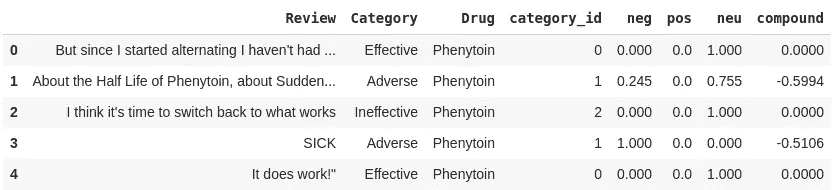
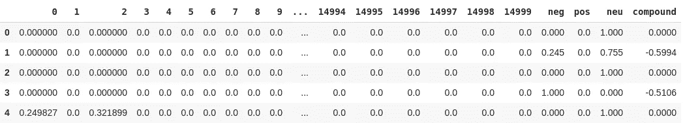
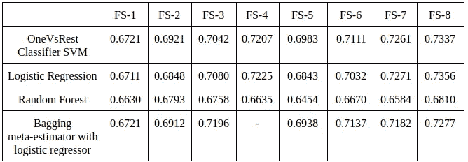
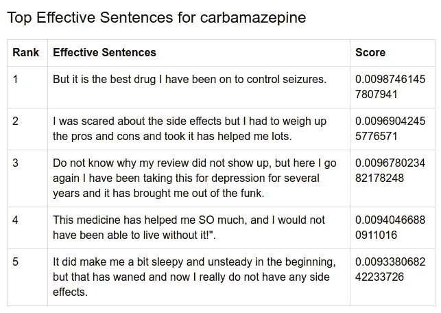
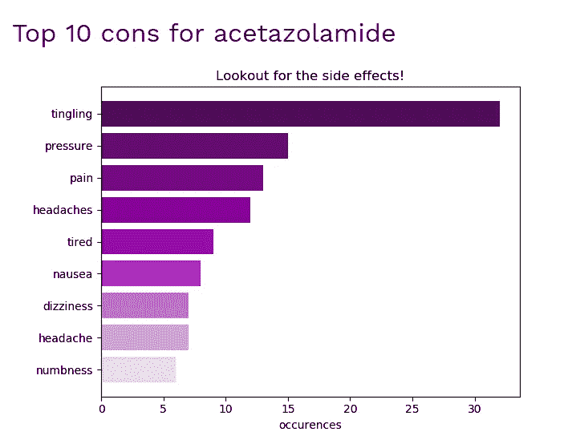
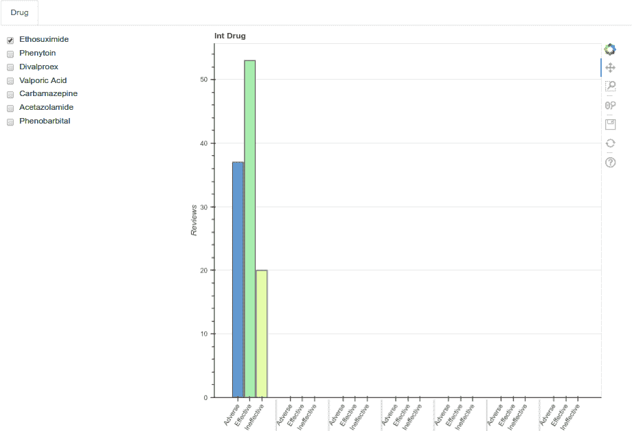

# 机器学习如何帮助识别药物的有效性和不良反应

> 原文：<https://towardsdatascience.com/how-machine-learning-can-help-identify-effectiveness-and-adverseness-of-a-drug-e23c7933c233?source=collection_archive---------8----------------------->

## 通过采用 ML 算法建立用于处理神经药物的文本综述的系统，以有洞察力的和视觉上信息丰富的表示形式提供有效性或不良反应的概述。


Photo by [Kendal James](https://unsplash.com/@hikendal?utm_source=medium&utm_medium=referral) on [Unsplash](https://unsplash.com?utm_source=medium&utm_medium=referral)

你有没有在网上查找你的普通感冒药，却被它下面列出的副作用数量吓坏了？或者浏览评论部分来验证它们，但被列出的评论数量淹没，如果你有一整天的时间，你可能无法阅读？或者希望有一种简单的方法来知道有多少使用它的人对结果感到满意？

我们大多数人都去过那里，做过那种事。作为人类，我们倾向于选择简单明了的信息，这样我们就可以有效地理解它，同时利用最少的时间和资源。

这同样适用于上述情况，在这种情况下，需要一个全面的、视觉上信息丰富的系统来在一个地方总结关于药物的所有信息，这有助于用户在选择特定药物之前做出明智的决定。

**ML 如何帮助这一过程？**

以博客或专门网站形式发布的用户药物评论信息具有巨大的分析潜力。然而，这些数据大多是文本数据，这意味着在用于分析之前，需要对其进行结构化和清理。

一个完整的端到端系统会将这些非结构化数据考虑在内，并将其转换为可用的特征，然后由合适的算法使用这些特征来确定该药物在给定的药物评论下是否有效。

因此，最终系统的目标是:

1.  提供药物的有效性和不良反应的概述，从单独的自动分类综述中汇总成三个不同的类别，即有效、无效和不良。
2.  直观地展示和比较药物的不良反应，进一步深入了解每种药物的评论，并按类别进行排名。

下面我们来分解一下文章中的开发过程。

# 阶段 1:收集和预处理数据

**刮评论:**

为了开发一个决定性的系统，一个子集的广泛审查数据可在互联网上被考虑。用于治疗癫痫、癫痫发作和双相情感障碍的神经药物的评论是使用 scrapy 搜集的，scrapy 是一个用于开发定制网络爬虫的 Python 库。

最终数据集由七种药物中每一种的平均 200 篇评论组成，然后以 80:20 的比例分成训练和测试数据集。


Examples of scraped reviews

**清理评论:**

*   使用自然语言工具包(nltk)中的`sent_tokenize`将评论标记成句子。
*   文本的标准化，包括小写转换、分离变形词和纠正拼写错误的词。
*   使用 nltk 获得单词的词根形式。

```
review = “But since I started alternating, I haven’t had a seizure”
pre_processed_review = preprocess(review)
print(pre_processed_review)['but','since','I','start','alternate','I','have','not','had','seizure']
```

在这一步中保留停用词、否定和标点符号，以尽可能保留评论中包含的信息。在这一步结束时，清理后的句子就可以被归入适当的类别了。

**标注训练数据集:**

这句话可以分为三类:

*   有效:指使用该药物后，患者健康状况得到改善的综述。
*   无效:这些综述暗示患者的病情没有变化或恶化，但没有提及使用药物后的任何不良反应。
*   不良反应:综述中明确提到患者使用药物后的不良反应。

建立了一个自动标注器，它根据三个参数来评估句子。

1.  由一系列“问题”单词组成的字典，这些单词通常出现在反类别句子中。

```
problems='hallucinations weakness hairloss tired hair loss nausea shakiness tremor tremors stones weight pounds flu flus lbs drowsiness dizziness appetite manic maniac cold vomiting seizures nauseous vision inflammation tingling numb numbness swollen swelling depression attacks blisters skin rash diarrhoea headache headaches head severe fever sleep pain stress numb'
```

2.句子中单个单词的 POS(词类)标记，使用 nltk 库生成。POS 标记流程和标记的详细描述可在[此处](https://medium.com/@gianpaul.r/tokenization-and-parts-of-speech-pos-tagging-in-pythons-nltk-library-2d30f70af13b)找到。

```
review = 'laying down is excruciating and im in the process of running test'[('laying', 'VBG'), ('down', 'RP'), ('is', 'VBZ'), ('excruciating', 'VBG'), ('and', 'CC'), ('im', 'NN'), ('in', 'IN'), ('the', 'DT'), ('process', 'NN'), ('of', 'IN'), ('running', 'VBG'), ('test', 'NN')]
```

3.每个句子的复合 VADER 情感得分。VADER 是一个 python 模块，用于根据极性(积极或消极)和强度(得分)对评论的情绪进行评分。复合得分是一个介于-1 和 1 之间的整数值，用于评估文本中传达的情感。值 0 是表示中性情绪的标度的中心点。

```
from vaderSentiment.vaderSentiment import SentimentIntensityAnalyzer
def analyze_sentiment(df):
 sentiments = []
 sid = SentimentIntensityAnalyzer()
 for i in range(df.shape[0]):
 line = df[‘Review’].iloc[i]
 sentiment = sid.polarity_scores(line)
 sentiments.append([sentiment[‘neg’], sentiment[‘pos’],
 sentiment[‘neu’], sentiment[‘compound’]])
 df[[‘neg’, ‘pos’, ‘neu’, ‘compound’]] = pd.DataFrame(sentiments)
 return df
```



Original reviews with VADER Sentiment Scores and category labels.

因此，我们开发了一个初步的评论标注方案，并通过人工标注句子对其进行了进一步的完善。

Pro-tip by Richard Socher highlighting the effectiveness of manual labeling.

被自动标注器错误分类的评论由两个独立的标注器手工标注，冲突由公正的第三个标注器解决。该数据集随后由医疗卫生专业人员进行验证。

训练集现在准备好输入到分类算法中。

# 阶段 2:选择正确的方法

**矢量化:**

矢量器用于将每个单词转换成向量，其大小等于整个文档集合(评论)中单词的唯一计数。这种方法被称为“单词袋”模型。该模型将文本转换成机器学习算法所需的数字特征形式。

例如，对某种药物的评论写着“这种药物使我变得更糟”，而另一篇评论说“这种药物使我变得更好”。评论中的独特词的数量被发现是 7 个(“这个”、“药物”、“已经”、“制造”、“我”、“更差”、“更好”)。

因此，审查的方向是

*   这种药让我变得更糟了
*   这种药让我变得更好。

我们可以使用计数矢量器方法(创建单词*评论大小的稀疏矩阵)或术语频率-逆文档频率(TF-IDF)方法(测量单词的频率以及该单词在集合中的稀有度)。

你可以在这里了解更多关于这两种方法及其实现的信息[。](https://machinelearningmastery.com/prepare-text-data-machine-learning-scikit-learn/)

**创造二字和三字:**

在自然语言处理中，文本文档中的每个单词被称为一个“元”。因此，共现单词的组合被称为 n 元语法，其中 n 是所考虑的组合的长度。

例如，“双相情感障碍”将是我们的语料库中经常出现的组合。因此，它可以用一个双词来表示，而不是单个单词“双相”和“障碍”，因为这两个单词可能不会频繁地作为单独的单词出现。

```
bigram = gensim.models.Phrases(words, min_count=5, threshold=100)
trigram = gensim.models.Phrases(bigram[words], threshold=100)  
bigram_mod = gensim.models.phrases.Phraser(bigram)
trigram_mod = gensim.models.phrases.Phraser(trigram)def make_bigrams(texts):
    return [bigram_mod[doc] for doc in texts]def make_trigrams(texts):
    return [trigram_mod[bigram_mod[doc]] for doc in texts]
```

可以使用 Gensim(如上所述)或通过使用 scikit-learn 的特征提取模块在矢量化过程中自动生成二元或三元模型，将二元或三元模型作为特征获取。

**选择算法:**

评论需要分为三类，即有效、无效和不利，因此我们需要使用多类分类器而不是二元分类器。

为了进行对比分析，使用了四种多类算法进行类别预测。

1.  OneVsRest SVM 分类器:
    它涉及为每个类拟合一个 SVM 分类器，同时将所有其他类视为一个类，有效地将问题转化为一个二元分类问题。
    此处[显示了吴恩达球场的 OneVsRest 分类图解](https://i.stack.imgur.com/zKpJy.jpg)(通过 stats.stackexchange [此处](https://stats.stackexchange.com/a/318526))。
2.  逻辑回归多类分类器
3.  随机森林分类器
4.  基于逻辑回归的 bagging meta-estimator:
    这种集成技术使用数据的随机子集来拟合基本类型的单个分类器，然后聚合它们的预测以获得单个预测。

下面给出了使用 scikit-learn 训练和测试上述分类器的代码。

**创建特征选择:**

算法的性能通过反复试验的方式针对各种特征选择进行了测试。因此，通过结合矢量化技术、被认为是特征的词的数量和评论的情感分数，产生了各种特征组合。下面显示了一个示例

```
from sklearn.feature_extraction.text import TfidfVectorizervectorizer = TfidfVectorizer(ngram_range=(1, 2), max_features=15000)
vector = vectorizer.fit_transform(corpus)df2 = pd.DataFrame(vector.toarray())
df_final = pd.concat([df2, reviews], axis =1)
```



Top 15000 word vectors + VADER Sentiment Scores.

这里，我们使用 TF-IDF 将前 15，000 个出现的单词及其二元模型(因为 ngram_range 设置在 1-2 之间)转换为特征向量。每个评论的向量与 VADER 情感分数相结合以获得特征，这些特征将被馈送到分类算法以决定该评论的类别。

类似地，如下创建 7 个其他这样的特征集:

*   FS-1:计数矢量器
*   FS-2:计数矢量器+ VADER 情感分数
*   FS-3:计数矢量器前 10000 个特征+ VADER 情感得分+ n 元语法范围 1–3
*   FS-4:计数矢量器所有特征+ VADER 情感分数+ n 元语法范围 1–3
*   FS-5:tfidf 矢量器
*   FS-6:tfidf 矢量器+ VADER 情绪得分
*   FS-7 : Tfidf 矢量器前 10000 个特征+ VADER 情感得分+ n 元语法范围 1–3
*   FS-8 : Tfidf 矢量器前 15000 个特征+单词标记化分析器+ VADER 情感分数+ n 元语法范围 1–3

# 阶段 3:可视化结果

我们以三种格式呈现系统结果:综述分类器、使用 TextRank 的每个类别的摘要以及用于药物比较的综述的交互式可视化绘图。

**f1 评分评估:**

```
reviews.groupby("Category").count().CategoryAdverse 1089
Effective 1276
Ineffective 335
```

我们使用 sklearn 的 f1_score 度量模块中的加权 f1 得分度量来评估性能，因为它具有在多类分类问题中考虑类不平衡的额外优势。它计算每个类的 f1 分数，并通过考虑每个类的支持(如上所示的实例数量)来平均它们。



Various approaches, feature selections, and their respective weighted f1-scores

使用特征选择 8 和逻辑回归方法获得大约 0.74 的 f1 分数。

**通过 TextRank 对评论进行排名**

TextRank 算法使用 TF-IDF 向量的相似性图来计算每个节点的重要性。与大多数其他评论最相似的节点或评论被认为是其所属类别的“中心”。



Top reviews for the effective category with similarity scores

在这里，有效类别的评论是针对特定药物进行排名的。短语“最佳药物”、“帮助了我很多”、“没有它就无法生活”最能反映有效类的主题，因此使用 TextRank 将包含它们的评论排在顶部。

类似地，将不良类别评论与不良反应字典进行比较，并为药物引起的不良反应生成发生排序图。



Occurrence-ordered graph for adverse category reviews.

**使用散景的交互式可视化**

webapp 使用 Bokeh(python 中的一个交互式可视化库)来呈现交互式条形图，以便为用户显示药物的并排比较。

bokeh 服务器用于启动服务，该服务响应 webapp 上的更改，以触发更新绘图数据的回调。这些更改由 webapp 的浏览器进行同步，并相应地更新绘图。

要运行散景服务器，通过运行命令在 app.py 中调用一个方法

```
bokeh serve myapp.py
```

可视化在本地主机端口 5006 呈现，该端口可以集成到 app.py 中



Bar graph dynamic update in Bokeh using checkboxes.

这里给出了使用散景进行交互式可视化的完整代码。

该代码包含三个主要函数`make_dataset`、`make_plot`和`update`，分别用于创建数据框及其值、静态绘图和基于复选框状态(选中或未选中)更新数据。最后，使用`curdoc()`将情节和控制元素放在一起，并将输出呈现给 web 浏览器。

# 摘要

我想创建一个以用户为中心的 web 应用程序，帮助患者了解更多关于过去使用过类似药物的其他人的经历，并省去他们在在线论坛上阅读数百篇评论的麻烦。

在未来，该系统可以通过提供对评论的认证的支持、考虑其他领域的评论以及通过使用神经网络来提高效率而在许多方面得到改进。

感谢我出色的队友们，是他们努力将这个想法变成现实。

有什么建议可以随意评论。我希望听到您的反馈！

这个网络应用现在在 Heroku 上，预测者[在这里](https://we-care-neuro.herokuapp.com/prediction)。

***来自《走向数据科学》编辑的提示:*** *虽然我们允许独立作者根据我们的* [*规则和指南*](/questions-96667b06af5) *发表文章，但我们并不认可每个作者的贡献。你不应该在没有寻求专业建议的情况下依赖一个作者的作品。详见我们的* [*读者术语*](/readers-terms-b5d780a700a4) *。*