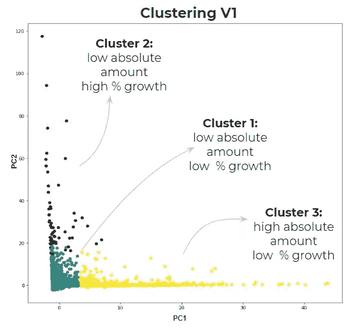
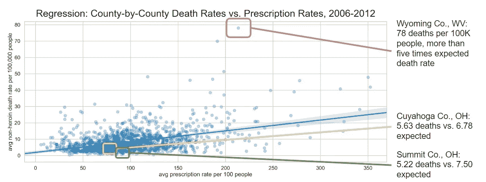
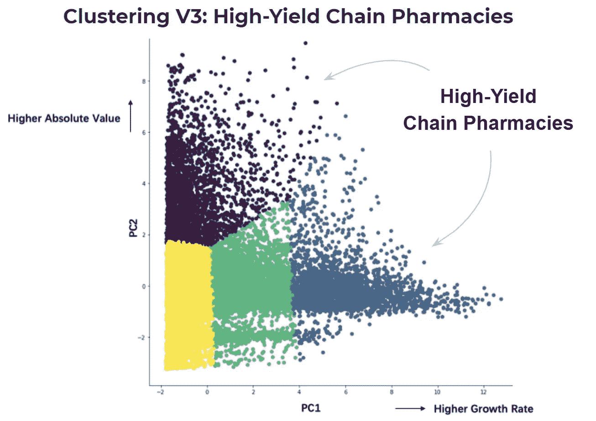
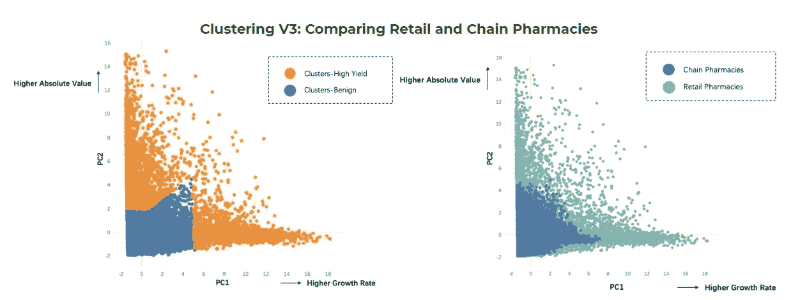

# 机器学习如何帮助揭示美国阿片类药物危机

> 原文：<https://towardsdatascience.com/how-machine-learning-can-help-shine-a-light-on-the-u-s-opioid-crisis-8d0937c092d1?source=collection_archive---------47----------------------->

## 使用 Python 中的 k-means 聚类和主成分分析在 ARCOS 数据集中查找“高产”阿片类药物购买者

*由* [*迈克尔·罗迪奥*](https://www.linkedin.com/in/michael-rodio-5b140629/) *、桑雅娜·罗萨里奥、* [*、*](https://www.linkedin.com/in/yc3526/) *、亚当·张、*

Photo credit: Joshua Coleman, [Hubble Studio, Los Angeles, United States](https://unsplash.com/s/photos/hubble-studio%2C-los-angeles%2C-united-states).

*免责声明:本演示中代表的任何观点或意见仅由作者所有，并不代表肾单位研究或肾单位研究分析师的观点或意见。*

无监督机器学习的诱人前景之一是，它可以从混沌中提取秩序。设计良好的聚类算法就像是在干草堆中专门寻找针的人。

说到干草堆，很少有人能比得上 ARCOS 的阿片类数据集。

ARCOS 是[自动化报告和综合订单系统](https://www.deadiversion.usdoj.gov/arcos/index.html)的缩写，是美国缉毒署对美国处方药交易的记录。这包括处方阿片类药物交易，以及关于谁制造了这些阿片类药物，谁运输了它们，以及谁将它们出售给美国患者的信息。

ARCOS 数据集，在[查理斯顿公报邮件*和*华盛顿邮报*领导的法律战*](https://www.washingtonpost.com/health/how-an-epic-legal-battle-brought-a-secret-drug-database-to-light/2019/08/02/3bc594ce-b3d4-11e9-951e-de024209545d_story.html)之后，由 DEA 在今年夏天首次公开，跨越 4 亿行和 40 多列。它包含了从 2006 年到 2012 年在制造商(如 Purdue Pharma)、分销商(如 AmerisourceBergen、Cardinal Health 和 McKesson)以及全国数千家药店、医院、医生办公室和诊所之间的几乎所有阿片类药物交易。

但从阿片类药物诉讼和美国阿片类药物危机的角度来看，ARCOS 数据集也因其忽略的内容而值得注意。尽管 DEA 记录了阿片类药物“购买者”——药房、医生办公室、诊所或其他向患者出售药物的企业——的违规行为，但 ARCOS 数据集不包含任何此类标志。

我们的 MBA 和数据科学家团队与医疗投资研究公司 [Nephron Research](http://nephronresearch.com/) 合作，想知道:我们能否找到一种方法，使用纯数据驱动的方法来标记潜在的有问题的阿片类药物购买者？我们能否使用 ARCOS 事务数据集来实现这一目标？

# 链条中的一环

ARCOS 数据集列出了涉及多种买家的交易，从大型医院到小型诊所。我们最初决定将搜索范围限制在**连锁药店**，原因有二。首先，阿片类诉讼主要集中在大型上市公司。第二，我们推断连锁药店可能比独立药店有更少的异常值，这适合聚类方法。

我们开始寻找“高产连锁药店”(我们称之为我们的目标)，寻找满足两个标准的个体药店:

1.  他们卖出了大量的阿片类药物，*和*
2.  在 ARCOS 数据集的七年中，他们迅速提高了阿片类药物的销售量(以百分比计)。

# 不择手段

正如机器学习项目的常见情况一样，我们的第一轮聚类实际上是从本质数据清理和组织开始的。经过几周时间对大约 4 亿行数据进行平滑和标准化后，我们开发了一组 Python 函数，将交易汇总成简化的药房规模的数字。我们还根据县级美国人口普查局的人口数据对交易进行了加权，以避免位于大城市的药店因交易量过大而受到惩罚。

在我们的第一次聚类迭代中，我们将所有 20 多个维度的事务数据加载到一个 [**k 均值聚类算法**](https://github.com/YC-Coder-Chen/Unsupervised-Notes/blob/master/K-Means.md) 中。当然，很难想象如此多的维度，所以我们利用 PCA——主成分分析的缩写**——将这些维度压缩成两个更容易理解的维度。最初的结果是…**

****

**PC1 reflects dimensions relating to absolute sales, while PC2 reflects growth dimensions. Each dot is a chain pharmacy. (Source: Modified DEA ARCOS dataset provided by Nephron Research)**

**…不太令人鼓舞。我们看到了大量快速增长但规模很小的药店(第二组，紫色部分)；许多大药房的销售量几乎没有变化(第三组，黄色)；中间是一片药房(第一组，蓝绿色)。**

**不过，没有高收益的连锁药店。**

## **集群:版本 2**

**然后，我们决定隔离药物的“强度”，而不是平等对待所有阿片类药物。我们特别关注了三种药物，CDC 的研究表明这三种药物最常与过量用药有关:T2 羟考酮、氢可酮和芬太尼。(芬太尼在 2012 年还没有像最近一样在美国爆发，但由于其纯粹的化学力量，它仍然引起了人们的兴趣)。结果是:**

****

**The algorithmically generated PC1 in this plot is the inverse of high sales volume. 0 implies a high sales volume, whereas 50 implies low sales volume. (Source: Modified DEA ARCOS dataset provided by Nephron Research)**

**现在我们有所进展了。将“药物强度因子”从阿片类药物交易中分离出来，似乎会产生一个符合我们两个标准的连锁药店集群。然而，很难想象五氯苯甲醚产生的奇怪条纹簇，特别是 PC1，它似乎代表了增长率的倒数，很难解释。**

## **集群:版本 3**

**然后，我们进行了三项改进。首先，我们根据县特定的 [CDC 阿片类药物处方率数据](https://www.cdc.gov/drugoverdose/maps/rxrate-maps.html)以及人口对药房交易进行加权。从我们的单独分析中，我们知道，在 2006-2012 年期间，县级阿片类药物处方与县级阿片类药物过量率显著相关:**

****

**There is a fairly strong correlation (0.70) between a county’s average prescription rate per 100 people and average death rate per 100,000 people. (*Source: Centers for Disease Control)***

**其次，我们剔除了所有交易数据，除了与羟考酮、氢可酮和芬太尼相关的交易。**

**第三，我们使用“肘规则”来解决四个不同的集群。结果是:**

****

**Clustering Version 3\. (Source: Modified DEA ARCOS dataset provided by Nephron Research)**

**最后，通过我们的第三次聚类迭代，我们发现了这一点:大量出售危险药物的药店(根据当地人口和处方率进行了调整)，并迅速加快了这些药物的销售。此外，在 1%的显著性水平上，高产聚类(在上图中统称为紫色和蓝色)不同于正常产量聚类。**

# **比较独立药店和连锁药店**

**有了我们的聚类结果，我们继续追踪另一个直觉。到目前为止，我们的聚类实验主要集中在连锁药店，这仅仅是因为[连锁药店在阿片类药物危机中吸引了更多的注意力](https://www.washingtonpost.com/investigations/2019/11/07/height-crisis-walgreens-handled-nearly-one-five-most-addictive-opioids/?arc404=true)。但是如果我们把我们的分析也应用到独立的零售药店呢？夫妻店会比连锁药店卖更危险的阿片类药物吗？**

**简而言之:是的。**

**当我们在同一个聚类分析中将独立药店和连锁药店结合起来时，高收益独立药店的数量远远超过了可比的连锁药店。在这 99 家两个主要成分都在第 60 百分位以上的药店中——称之为*超高产*药店——*所有 99 家*都是独立零售商。**

****

**Of the high-yield pharmacies in the independent + chain group (orange clusters at left), many are independent pharmacies (light blue, at right). Note: Independent pharmacies are labeled “retail” here, as they are denoted in the ARCOS dataset. (Source: Modified DEA ARCOS dataset provided by Nephron Research)**

# **把所有的放在一起**

**在项目开始时，我们的任务是在庞大的 ARCOS 数据集中识别潜在的问题药房。通过结合使用数据聚合、k-means 聚类和 PCA(以及额外的 CDC 人口和处方数据),我们发现了 2006 年至 2012 年期间购买危险阿片类药物的连锁药店和独立药店的子集，这些药店的购买量非常大，购买率也越来越高。**

**如果说我们的分析牵涉到这些药店，或者甚至意味着更大的责任，那也太牵强了。我们的方法只是 ARCOS 数据集的许多潜在数据驱动方法之一。**

**我们仍然预计连锁药店——而不是独立药店——将与制造商和经销商一起，继续成为阿片类药物诉讼的焦点。此外，虽然阿片类药物诉讼当事人可能不会针对个别独立药店，但我们预计美国药品管理局已经发现并关闭了这些独立药店，并将继续这样做。**

**最终，我们的目标是证明无监督机器学习*是*理解 ARCOS 数据集的可行方法。随着阿片类药物诉讼的继续，这种方法肯定会阐明关于谁做了多少以及何时何地做的争论。**

***本报告是哥伦比亚大学课程* [***行动分析***](https://medium.com/analytics-in-action-columbia-business-school) *的一部分。在整个课程中，哥伦比亚商学院的 MBA 学生和哥伦比亚工程研究生院的商业分析项目的硕士学生一起合作，应用数据科学，为一家公司解决一个实际的商业问题。***