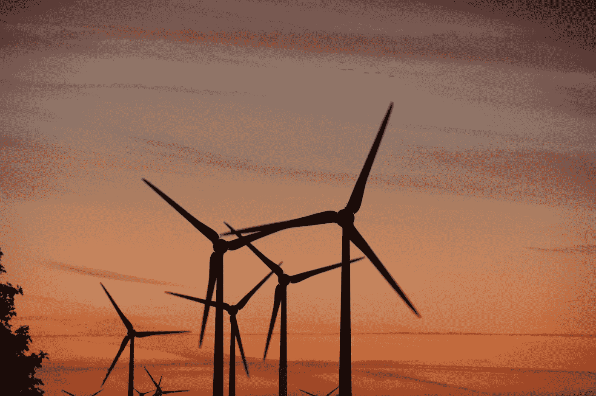
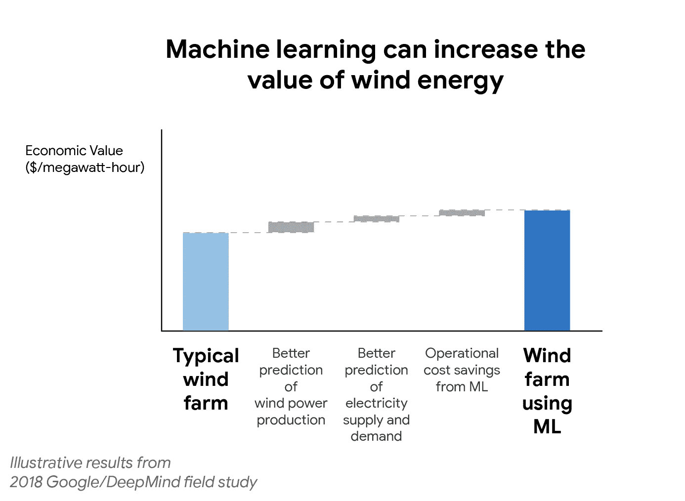

# 机器学习如何改变能源行业

> 原文：<https://towardsdatascience.com/how-machine-learning-can-transform-the-energy-industry-caaa965e282a?source=collection_archive---------5----------------------->

Photo by [Thorsten Hack](https://unsplash.com/@phocacius?utm_source=medium&utm_medium=referral) on [Unsplash](https://unsplash.com?utm_source=medium&utm_medium=referral)

2017 年，比尔·盖茨写了一封公开信给世界各地的大学毕业生。他提到，如果让他重新开始人生，寻找机会对当今世界产生重大影响，他会考虑三个领域:“*一个是人工智能。我们才刚刚开始探索它将使人们的生活更富有成效和创造性的所有方法。第二是能源，因为让能源变得清洁、可负担和可靠对于战胜贫困和气候变化至关重要。*“第三个领域是生物科学。[【1】](https://www.gatesnotes.com/About-Bill-Gates/Dear-Class-of-2017)

如今，当各国试图使其能源组合多样化，并对更清洁的能源产生更大的依赖时，它们只剩下一个主要问题。两种主要的可再生能源——太阳能和风能——本质上是可变的。太阳能电池板或风力涡轮机产生的电力从来都不是均匀的，取决于一系列无法控制的外部因素——太阳辐射强度、云量、风速。

即使是德国，这个世界上可再生能源的典范，也发现很难完全依赖可再生能源。在无风和多云的日子里，太阳能和风力发电场几乎不产生任何能量，电网运营商被迫求助于传统发电站来满足能量需求。另一方面，如果是一个风和日丽的日子，并且他们当天 90%的能源需求得到满足，运营商需要在电力过载窒息整个电网之前迅速减少燃煤和燃气发电站的输出。由于电网运营商必须补偿公用事业公司对其输入进行的调整，此类要求每年花费德国客户约 5.53 亿美元。此外，电网运营商最终会排放不必要的二氧化碳，因为额外的电力最终会被浪费掉。除此之外，准确预测消费者的能源需求也是一个挑战。总的来说，保持能源供需平衡可能会变成一场噩梦。

这让我想到了机器学习在整个能源领域可能扮演的角色。尽管它还处于实施的早期阶段，但机器学习可能会彻底改变我们处理能源的方式。其影响范围涵盖了**可再生能源预测**和**智能电网**领域。

## **可再生能源预测**

如果我们能够准确预测风力涡轮机在未来 36 小时内的发电量，我们将能够有效地过渡到可再生能源，而不会破坏电网的稳定。但这可能吗？答案是肯定的。我们快到了。

早在 2013 年，IBM 就与美国能源部合作，开始研究如何利用他们的人工智能引擎 Watson 来获得更清洁的电力。这个机器学习模型是从几个预测模型中建立的，后来又从美国约 1600 个地点获得了天气和大气数据。随着时间的推移，这个机器学习模型在预测功率输出方面变得越来越好。

今天，IBM research 有 200 多个合作伙伴使用其太阳能和风能预测技术，可以提前 15-30 天准确预测太阳能/风能条件。IBM 的项目经理亨德里克·哈曼说，IBM 的可再生能源预测技术(称为瓦特-太阳)比下一个最好的太阳预测模型精确 50%。

**经济潜力巨大。**最近被谷歌收购的英国人工智能公司 DeepMind 是这方面的最佳案例研究。

2018 年，DeepMind 开始将机器学习算法应用于谷歌在美国中部的 700 兆瓦风力发电能力(700 兆瓦足够为一个中等城市供电)。使用基于可用天气预报和历史涡轮机数据的神经网络，它可以提前 36 小时合理预测风力发电输出。DeepMind 的项目经理西姆斯·威瑟斯彭(Sims Witherspoon)表示，仅在一年内，这些机器学习算法就将风能的价值“提高了大约 20% 。[【4】](https://deepmind.com/blog/machine-learning-can-boost-value-wind-energy/)

更加依赖机器学习算法也可以节省客户的资金，同时拯救地球。Xcel Energy，一家拥有美国最高总风力发电能力的公用事业公司，正是这么做的。Xcel 能源公司的可再生能源分析师德雷克·巴特利特说:

“自 2009 年以来，预测错误的数量已经下降，为客户节省了约 6000 万美元，并减少了化石储备发电每年超过 25 万吨的二氧化碳排放量。”

## **智能电网**

随着预测能力的提高，各国正在逐步建立“智能电网”，即“监测和控制每个消费者和节点的全自动电力输送网络，确保电力和信息的双向流动”。[【第六期】](https://energy.gov/oe/activities/technology-development/grid-modernization-and-smart-grid)

自 2010 年以来，美国能源部已投资超过 45 亿美元建立智能电网基础设施。他们已经安装了超过 1500 万个智能电表，这些设备在消费者端监控能源需求和供应。此外，他们还投资了被称为**【同步相位器】**的设备。这些小盒子测量电网特定位置的瞬时电压、电流和频率。这些传感器将与电网通信，并在非高峰时间修改电流，为客户降低价格，同时也减轻了电网的工作负荷。甚至谷歌也应用了这种人工智能技术，以努力降低其数据中心的总功耗，在此过程中节省了数百万美元。[【7】](http://sitn.hms.harvard.edu/flash/2017/artificial-intelligence-will-revolutionize-energy-industry/)

但是即使有了智能电网，也有潜在的担忧。一个收集数百万用户能源使用习惯数据的中央系统可能成为恶意网络攻击的目标。这可能会破坏电网的稳定，同时也会损害宝贵的消费者数据。英国研究人员认为，区块链协议可能是解决方案。使用与比特币相同的技术，分散式账本系统可以避免用户数据单点存储的安全风险。

## **关键外卖**

随着智能电网中预测能力的提高，各国可以越来越多地依赖可再生能源，将太阳能和风能不规则性造成的干扰降至最低。机器学习和能源的融合可能会前所未有地改变世界，并从根本上改变我们对这两个行业的看法。

欢迎给我发电子邮件到*kausarp2@illinois.edu*或者通过 [LinkedIn](https://www.linkedin.com/in/kausar-patherya) 联系我！

*灵感:@TadasJucikas &* [*富兰克林·沃尔夫*](http://sitn.hms.harvard.edu/flash/2017/artificial-intelligence-will-revolutionize-energy-industry/)