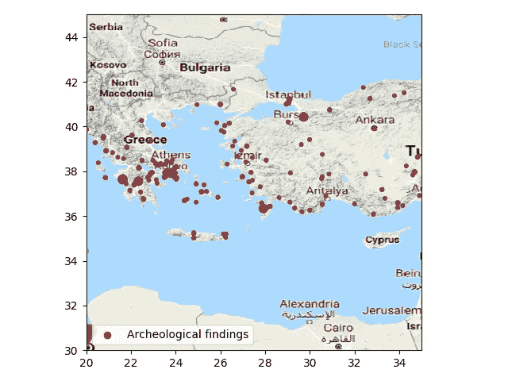
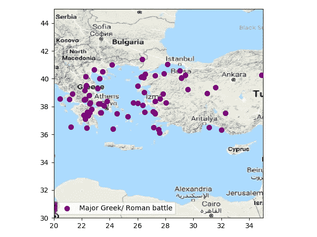
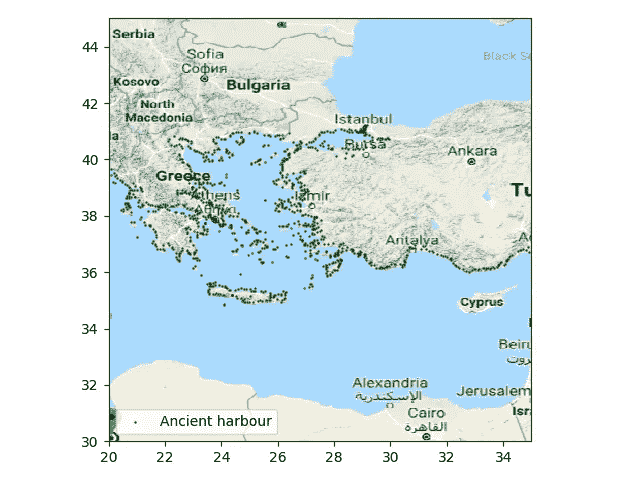
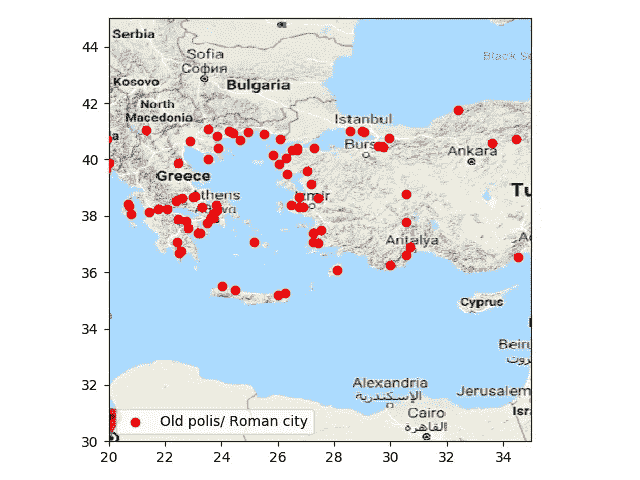
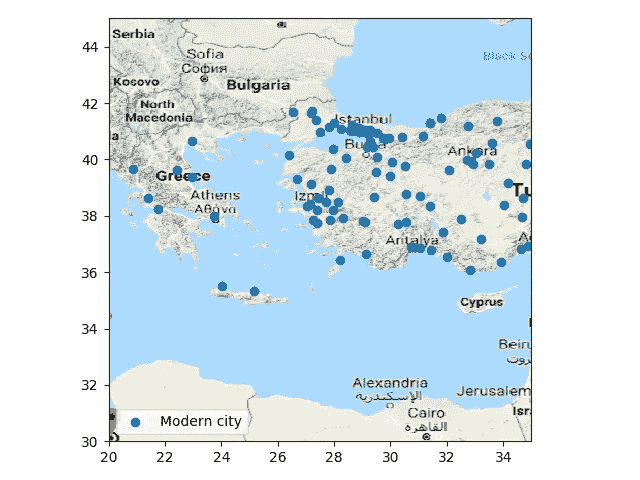
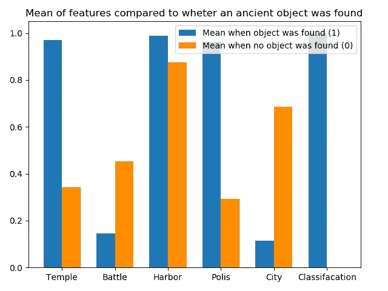
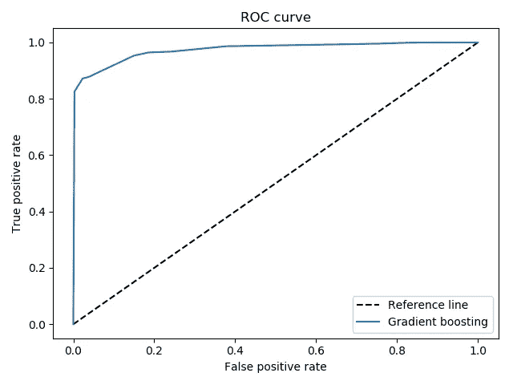
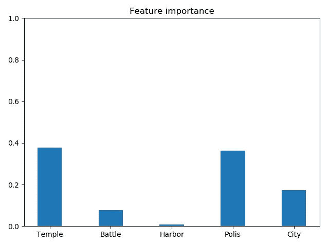
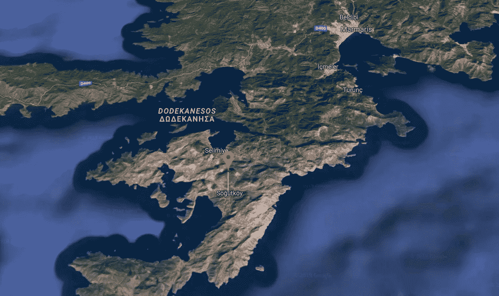
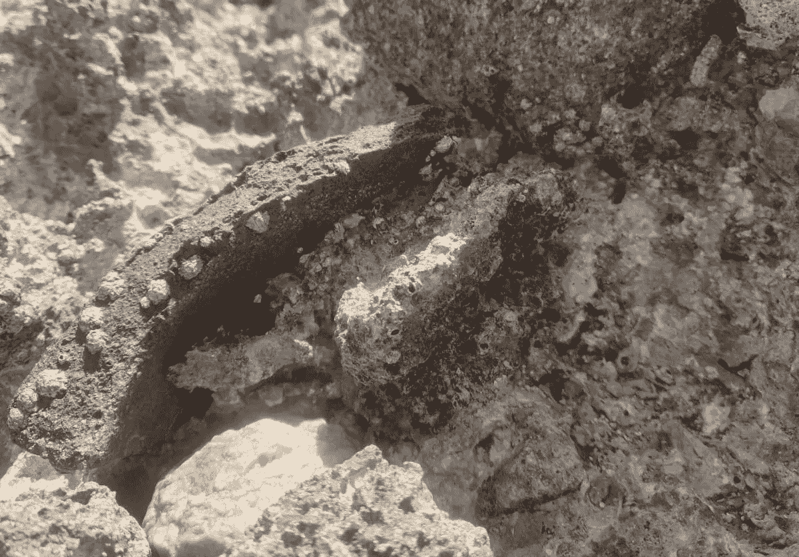

# 机器学习如何帮助寻找古代文物

> 原文：<https://towardsdatascience.com/how-machine-learning-could-help-find-ancient-artifacts-a-walk-through-cb718de92057?source=collection_archive---------25----------------------->

## 在这篇博文中，我们将使用大英博物馆和柏林博物馆的考古数据来训练一个梯度推进模型。第一部分是数据分析和数据结构化部分。在第二部分中，我们将进一步了解梯度推进算法，并将其用于数据。最后，该算法将用于发现潜在的新考古遗址。


Ancient ruins of Laodikeia, Turkey (Own work)

# 检查数据

在我们开始编程检索和结构化数据之前，理解数据是有用的。数据由 5763 行组成。每一行都有一个经度和纬度，代表古希腊的一个地方，在那里发现或没有发现古代艺术品。文物大多是硬币，双耳瓶，武器和小雕像。下面的地图显示了找到的文物的位置:



第一个特征(列)是地点是否在古希腊神庙附近。这些神庙从著名的特尔斐神谕到不太为人所知的泰奥斯的狄俄尼索斯神庙。在古代，寺庙曾经吸引朝圣者和商业，所以寺庙的邻近表明考古发现的可能性很大。下面的地图显示了各个古希腊神庙的位置:


第二个特征表明该位置是否在古希腊或古罗马战场附近。古代希腊人和波斯人打仗，雅典和斯巴达打仗，罗马人和马其顿人打仗。在这些战斗之后，武器和盔甲丢失并被遗忘，等待以后被发现。下图显示了现代希腊和土耳其最重要的古代战役的位置:



第三个特征表明该位置是否在古代港口附近。这可能是天然港口，古代码头的遗迹，或者是古代文献中提到的(更大的)港口。正如你在下面看到的，这里有很多古老的港口:



第四个特征检查位置是否在古代城邦或罗马城市附近。希腊文化以其城邦文化而闻名，那里没有中央希腊政府，而是一群独立的城邦。希腊最著名的城邦是雅典。罗马人也在该地区建立/升级了城市，最著名的是君士坦丁堡。古代城市周围有一个半径，他们在那里使用土地进行农业、商业、狩猎和采矿。由于城市周围的这些地区有人类活动，这些人类留下痕迹的可能性很大。下图显示了各个古代城市的位置:



最后一个特征表明该位置是否在现代城市附近:



# 检索数据

现在我们知道我们的数据看起来像什么了。下一步是检索数据，以便我们进行分析。打开您的 Python 解释器。我和 PyCharm 一起工作，社区版免费使用，可以在这里下载。打开 PyCharm 后，键入 ctrl+alt+s 并单击十字(+)。安装以下库，numpy，pandas，sklearn 和 matplotlib。如果您使用不同的应用程序来编写 Python 代码，那么使用 pip install numpy、pandas、sklearn、matplotlib 来安装库。

接下来我们必须下载数据集。数据集可以在[这里](https://raw.githubusercontent.com/matdekoning/Artifact_finder/master/ABT.csv)找到。右键单击网页，然后单击另存为，或按 ctrl+s。将文件另存为 csv。

打开新的 Python 文件。首先，我们必须导入上面添加的库。Pandas 是一个用于数据检索和结构化的库。Numpy 是科学 Python，一个用来做数学计算的库。Sklearn 是一个包含各种机器学习算法的库。Matplotlib 是一个通过绘制图形来可视化数据的库。键入以下内容以导入库:

```
# libraries needed to run algorithms
import pandas as pd
import numpy as np
from sklearn.ensemble import GradientBoostingClassifier
from sklearn.model_selection import train_test_split
from sklearn.metrics import roc_curve, auc
import matplotlib.pyplot as plt
```

很好，现在我们有了所有需要的库。接下来，创建一个名为 Trainer 的类。这个类将获取数据，进行分析，训练梯度推进算法，并使用训练好的算法来预测新的案例。在 Trainer 类中创建一个名为 createABT 的方法。在该方法的第一行，通过读取 csv 创建一个数据帧。在第二行中，混合数据行。这对于在后期阶段应对模型的过度拟合非常重要。最后，返回数据帧。

```
class Trainer:

    #method to get data and build Analytical Base Table
    def createABT(self):
        df = pd.read_csv("C:/Users/makin/Documents/ABT.csv")
        df = df.reindex(np.random.permutation(df.index))
        return(df)
```

创建一个名为 algo 的类的实例，在下一行中让它使用 createABT 方法。现在，数据被检索并放入分析基表中。

```
algo = Trainer()
df = algo.createABT()
```

# 分析数据

让我们使用 pandas describe 命令来检查数据。这个命令向我们显示了每一列的统计信息。

```
print(df.describe())
```

由于所有特征都是二进制(0 或 1)特征，因此每一列的平均值反映了数据的分布情况。特征“靠近古代港口”的平均值为 0.94。这意味着 94%的数据点靠近一个古老的港口。这是一个很高的数字，所以这个特性的影响可能会很有限。其他特征分布更加均匀。分类列的平均值为 0.54，这意味着正面和负面训练示例的分布相等。

第二个分析步骤是将特征平均值与分类列进行比较。以这种方式，我们可以检查每个特征的两个平均值，一个是当分类列为 1 时，即已经发现对象，另一个是当分类列为 0 时的平均值。在我们之前创建的 Trainer 类中，我们将创建一个名为 analyzeABT 的新方法，它将数据帧作为输入。首先，我们去掉数据帧中不必要的列。然后我们创建两个空数组，其中存储了每一列的正负平均值。然后，我们使用两个 for 循环来确定每列中的平均值，同时根据肯定或否定分类过滤数据。在这段代码之后，两个数组(pos_mean 和 neg_mean)填充了特性的所有平均值。使用 Matplotlib 库，以下代码将结果可视化:

通过将该方法添加到 python 文件底部的 Trainer 类的 algo 实例中，使该方法可执行。

```
algo.analyzeABT(df)
```

该代码将生成下图:



“附近的寺庙”特征和“附近的城邦”特征可能是算法中最重要的特征。该图显示，已证实的考古遗址平均更多地位于寺庙、古代港口和旧城邦附近，而没有文物的遗址平均更靠近古代战场和现代城市。

所以到目前为止的总代码是:

# 梯度增强是如何工作的？

在深入研究梯度推进代码之前，了解一下梯度推进算法是很有用的。梯度增强基本上是将许多弱预测模型以弱模型集合的形式增强成一个强预测模型。弱预测模型可以是比随机猜测稍微好一点的任何模型。

为了建立梯度增强模型，重要的是弱模型被最佳地组合。弱模型以自适应方式训练，如以下步骤所示:

1)通过使用来自您的群体的数据样本来训练弱模型。

2)增加被步骤 1 的模型错误分类的样本的权重，并减少被正确分类的样本的权重。

3)使用具有来自步骤 2 的更新的权重分布的新样本来训练下一个弱模型。

通过这种方式，梯度推进总是使用在前几轮中难以学习的数据样本进行训练，这导致擅长学习数据的不同部分的模型的集合。

为了衡量我们模型的质量，我们将使用 ROC 值。这是一个衡量真阳性(预测阳性和实际分类阳性)与假阳性(预测阳性但未分类阳性)的指标。ROC 值为 1 是可能的最佳结果。

# 训练我们的模型

此代码检索数据并将其转换为数据帧。现在，我们将构建一个梯度推进分类器来预测一个潜在的遗址是否适合考古调查。首先创建一个名为 trainingModel 的新方法，它将数据帧作为输入。在该方法中，为 X 值(要素)和 Y 值(分类)创建数据框。将 X 和 Y 数据分割为训练和测试数据，并在数据上训练来自 SKlearn 库的梯度提升分类器。接下来，通过确定真阳性率和假阳性率来计算 ROC 值。同样打印特征重要性，以查看哪些特征(X)对模型预测结果最重要。最后，返回梯度提升模型、真阳性率和假阳性率。以下代码是如何管理这一点的示例:

将以下代码添加到 python 文件的底部，以执行 trainingModel 方法(fpr =假阳性率，tpr =真阳性率，gb =已训练的梯度增强模型:

```
fpr_gb, tpr_gb, gb = algo.trainingModel(df)
```

# 训练模型的结果

下面的代码可视化了经过训练的梯度增强模型的结果。

将以下代码添加到 python 文件的底部，以执行 visualizeResults 方法:

```
algo.visualizeResults(fpr_gb, tpr_gb)
```

代码生成下图，显示了 ROC 曲线:



正如你所看到的，ROC 曲线下的面积几乎是 1(它是 0.97)，这意味着我们的模型表现得非常好！接下来，我们将检查各个功能。经过 1000 次迭代后，平均特征重要性如下所示:



正如我们在第 1 部分的分析步骤中所预期的,“接近古代港口”的特征并不重要，因为 94%的数据都在古代港口附近。事实证明,“近神庙”和“近城邦”特征对于模型确定位置分类最为重要。

# 使用我们的模型来识别潜在的考古遗址

我们有一个经过训练的梯度推进模型。经过一些分析后，该模型投入生产看起来一切正常。要将训练好的模型用于新的预测，请使用 SKlearn 函数“predict”。它需要 x 要素作为输入，并预测 ŷ输出。以下代码将要求用户输入要素，模型将给出预测作为响应。如果潜在的搜索位置是好的，它将返回‘这是一个调查的好地方’。否则，代码将返回‘最好去别的地方看看！’。为了方便起见，下面的代码是代码的完整最终版本。testAlgo 方法是新添加的部分:

我们用这个算法在土耳其寻找新的潜在考古遗址。我们去了希腊罗德岛附近的土耳其海岸。这个地方靠近一座古庙，一座古代城邦，而不是一座现代城市。经过训练的算法给出了积极的建议。



我们在这一带潜水寻找双耳瓶，并沿着海岸寻找新的踪迹。在希腊西米岛的对面，我们发现了第一批未知的古代遗迹。在水下 10 米处，我们发现了一块安瓶的碎片。


又过了几英里，我们再次测试了算法的正面结果。在海岸附近徘徊后，我们发现了一个双耳瓶的以下部分:



到目前为止，该算法似乎给出了一个很好的指示，表明一个地点是否适合寻找古代遗迹。根据土耳其法律，我们已经留下了安芙拉的碎片。由于双耳瓶不够稀有，土耳其博物馆对此不感兴趣。显然，该算法不够精确，无法检测新考古遗址的确切位置。但它确实给出了一个很好的初步迹象。在这项研究之后，我们希望将这种算法与卫星图像识别的使用相结合。待续..

## 非常感谢

古代海港资料来自:
http://www . ancientportsantiques . com/the-catalogue/Greece-islands/

staaliches Museum zu Berlin:
[https://www . SMB . Museum/en/research/online-categories-database . html](https://www.smb.museum/en/research/online-catalogues-database.html)

https://www.britishmuseum.org/research/collection_online/大英博物馆:
T5

维基百科:
[https://en.wikipedia.org/wiki/List_of_battles_before_301](https://en.wikipedia.org/wiki/List_of_battles_before_301)
[https://en.wikipedia.org/wiki/List_of_Ancient_Greek_temples](https://en.wikipedia.org/wiki/List_of_Ancient_Greek_temples)

谷歌地图 API:
[https://developers.google.com/maps/documentation/](https://developers.google.com/maps/documentation/?hl=nl)

野外工作:
[艾金·卡拉库尔](https://www.linkedin.com/in/ekin-karakurt-bab737143/)