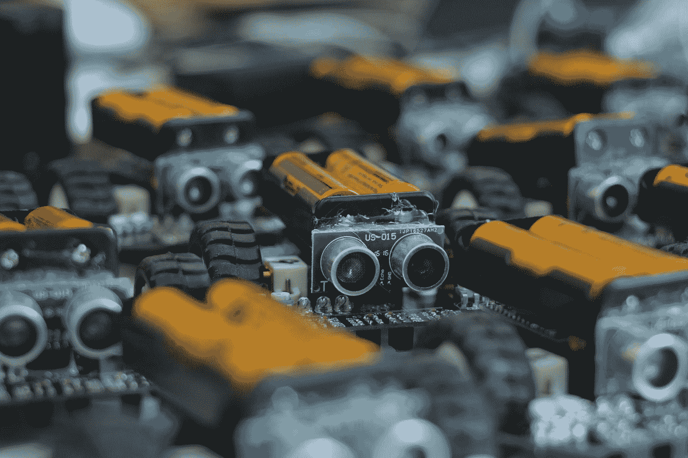

# 机器学习如何帮助制造更好的电池

> 原文：<https://towardsdatascience.com/how-machine-learning-is-helping-to-build-better-batteries-cfe3622388aa?source=collection_archive---------46----------------------->

Photo by [Frank Wang](https://unsplash.com/@nicetomeetyou?utm_source=medium&utm_medium=referral) on [Unsplash](https://unsplash.com?utm_source=medium&utm_medium=referral)

## 介绍

电池是当今世界最重要的设备之一。它们几乎被用于任何便携式电子设备:电话、汽车、玩具，甚至卫星。因此，它们提出了一些基本挑战，需要加以克服，社会才能可持续发展。

减缓减少对化石能源依赖的一个重要问题是，对大多数人来说，可再生能源不能提供恒定的电力流量:太阳能只在晴天可用(对不起，英国)，风力涡轮机需要风，等等。正因为如此，产生的电力需要储存起来，目前这种方式效率非常低。

例如，最常见的节能机制之一是“抽水蓄能”水电站大坝。通过使用来自可再生能源的电力将水“泵上大坝”，水被转化为势能，然后当网络需要时，通过让水通过水轮机流回，水又被转化为电力。不用说，在这个过程中会损失很多能量。

此外，目前的电池技术是由稀有矿物制成的，主要是钴和锂，它们是稀有的，并且显然储量有限。由于这些电池无处不在，因此迫切需要提高现有电池的效率，找到一种清洁回收它们的方法，或者找到其他化合物，以使矿物消耗多样化，并有望长期可持续。

此外，电池生产目前有很大的碳足迹。电动汽车的生产贡献了两倍，主要是由于电池。总之，这些问题为电池研究提供了强大的动力。

# 电池研究

电池研究的问题是解决方案空间的大小。有数千亿个潜在的分子化合物，甚至为了开始测试这些化合物，人们需要找到一种结构，使电池能够工作，能够很好地节约能源，而且非常重要的是，是安全的。

因此，这里的圣杯将是一个函数，给定一个结构，快速输出各种特征，但是当然我们离那个还很远。相反，这篇论文的目的是尝试看看是否有可能预测分子的原子化能量。这种特性可以用来立即过滤掉不好的化合物，从而让研究人员专注于更有潜力的化合物。目前有两种方法用于计算这些，一种缺乏速度(G4MP2)，另一种缺乏精度(B3LYP)。

这是 ML 方法的起点。他们采用了三种方法:基于核的岭回归(FCHL)和连续滤波卷积神经网络(SchNet)，并采用了不同的目标和模型。最有效的方法是使用δ学习。那是关于 B3LYP 和 G4MP2 能量之间的差异的训练。

总的来说，SchNet-delta 和 FCHL-delta 是最好的性能模型，训练后取得了相似的结果。然而，FCHL 需要更少的训练数据，却需要更强的计算能力，而 SchNet 则相反。此外，FCHL 执行时间与训练数据集的大小成线性比例，因为它需要将当前分子与已知分子进行比较，而神经网络的一个巨大优势是其执行速度。一旦网络被训练，它相当于一系列的矩阵乘法。即使在普通 CPU 上的深度卷积神经网络也能给出十分之几秒的预测结果。因此，如果神经网络能够获得良好的精度，它将免费获得速度。

即使在更重的分子上，这些分子更难预测，而且训练数据更少甚至没有，这些模型仍然达到了比 B3LYP 更好的精确度。

> 我们最好的模型，SchNet delta，在对 117，232 个分子进行训练后，预测 G4MP2 能量的 MAE 只有 4.5 meV (0.1 kcal/mol):远低于实验和 G4MP2 之间的 MAE(约 0.8 kcal/mol)

## 结论

总的来说，这是将机器学习应用于研究目的的一个很好的例子。它不是为我们解决问题或写方程，而是帮助研究人员专注于更有前途的道路。这是我个人设想机器学习将发展和实现最多的用例:不是作为中央决策计算机，而是作为人类决策的助手。

作者做了比本文更多的工作，在更多不同的条件下测试了更多的方法，这些都没有在本文中讨论。如果感兴趣，下面提供了链接和参考。

祝你今天开心！玩的开心！

## 参考

[沃德、布莱兹克、福斯特、阿萨里、纳拉亚南、布莱兹克、&柯蒂斯(2019)。从低保真度量子化学计算中机器学习预测有机分子的精确原子化能量。*夫人通信，*， *9* (3)，891–899。doi:10.1557/mrc.2019.107](https://www.cambridge.org/core/journals/mrs-communications/article/machine-learning-prediction-of-accurate-atomization-energies-of-organic-molecules-from-lowfidelity-quantum-chemical-calculations/49728123346DCEDC9171A42232B49003/core-reader)

[“里卡多研究发现，电动和混合动力汽车在生产过程中的碳足迹高于传统汽车，但在整个生命周期中的碳足迹却更低”](http://www.greencarcongress.com/2011/06/lowcvp-20110608.html)。绿色汽车大会。2011–06–08.检索于 2011 年 6 月 11 日。