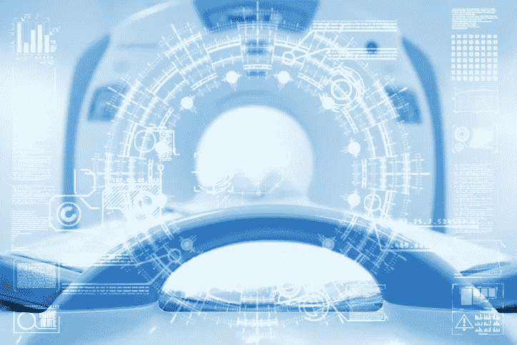
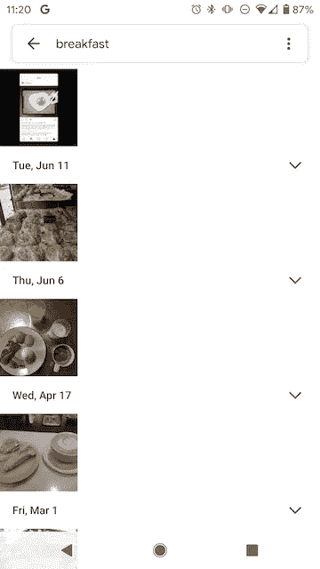
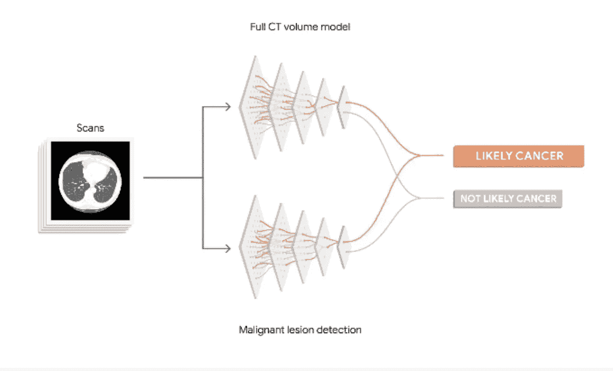
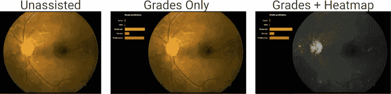
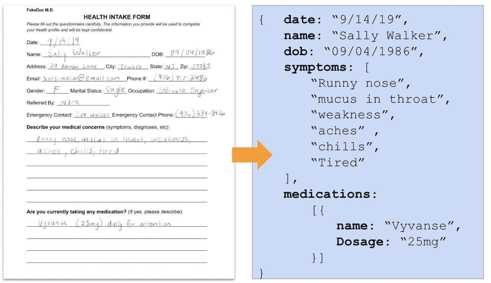
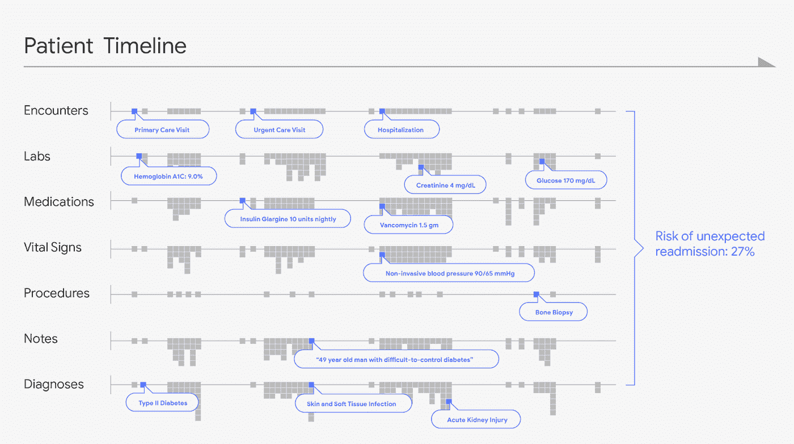

# 机器学习如何改变谷歌及其他公司的医疗保健

> 原文：<https://towardsdatascience.com/how-machine-learning-is-transforming-healthcare-at-google-and-beyond-d4f664b7e27c?source=collection_archive---------20----------------------->

## 谷歌和其他公司正在招募算法，在医学扫描中发现癌症，预测医院就诊的结果，等等。以下是方法。

机器学习——使用数据模式进行预测的艺术——将改变几乎所有行业，从金融、零售和营销到数字助理和无人驾驶汽车。但是当谈到机器学习(ML)如何造福人类时，几乎没有比医疗保健更有前景的领域了。

几乎每个月我们都会听到一种新的疾病，机器学习模型已经学会比训练有素的临床医生更快更准确地标记这种疾病。ML 正被用于帮助医生在医学扫描中发现肿瘤，加快数据输入，并自动响应医院患者的需求。

这些 ML 驱动的突破出现在关键时刻，因为美国和世界范围内的医生和专家短缺[继续增长](https://www.aamc.org/news-insights/press-releases/new-findings-confirm-predictions-physician-shortage)。随着我们对医生的需求超过供应，我们很可能会发现自己依赖技术来帮助填补空白。

在本帖中，我们将介绍谷歌和其他公司将机器学习应用于医疗保健的一些方法。让我们开始吧。

# 学习在医学图像中观察疾病

在过去的 5 年里，机器学习已经变得非常擅长分析图像，这主要归功于一种叫做“[神经网络](http://news.mit.edu/2017/explained-neural-networks-deep-learning-0414)的模型神经网络尤其擅长理解非结构化数据，如照片、大块文本、音频片段——这些不是电子表格中简单的数字行的东西(尽管它们也擅长分析这种数据！).

神经网络为识别照片中的人脸和宠物、将手写内容转换为文本、创建流畅的翻译、让您在谷歌照片应用程序中按关键字搜索照片等工具提供了动力。

Neural nets let you search your pictures by keyword in the Google Photos app. Here are all my breakfast pics.

要自己创建这样的视觉模型，你需要一个大型的*标记的*图像数据集——数百或数千张标记为“狗”和“猫”的狗和猫的图片——你可以用它来“训练”模型自己识别这些标签。

使用同样的技术，研究人员已经能够训练神经网络在医学扫描中发现疾病，有时比训练有素的专业人员更好。

就在上个月，谷歌[的研究人员训练了一个神经网络](https://arxiv.org/abs/1909.05382)来检测 26 种不同类型的皮肤状况，如黑色素瘤、牛皮癣、湿疹、囊肿等。该模型结合了照片和病史，与皮肤科医生一样准确，比没有经过皮肤专业培训的普通医生更准确。

这仅仅是最近的一大堆几乎有着相同故事情节的研究中的一个。我们已经能够[发现转移性乳腺癌](https://ai.googleblog.com/2017/03/assisting-pathologists-in-detecting.html)，[预测前列腺癌是否会变得具有侵略性](https://ai.googleblog.com/2018/11/improved-grading-of-prostate-cancer.html)，并从眼睛后部的扫描中检测出[糖尿病视网膜病变](https://ai.googleblog.com/2018/12/improving-effectiveness-of-diabetic.html)(失明增长最快的原因)。

Predicting lung cancer from CT scans. Credit: [https://www.blog.google/technology/health/lung-cancer-prediction/](https://www.blog.google/technology/health/lung-cancer-prediction/)

就在今年 5 月，研究人员[训练了一个模型](https://www.blog.google/technology/health/lung-cancer-prediction/)，该模型可以通过 ct 扫描预测肺癌的恶性程度，精确度相当于或优于委员会认证的放射科医生。这项工作尤其具有影响力，因为肺癌不仅是最致命的癌症，也是放射科医生最难发现的癌症之一。

这些模型可能不会很快取代医生，但可能过不了多久它们就会充当辅助工具，提醒医生最棘手或最微妙的诊断。

## 自我解释的医学模型

然而，要成为真正有用的辅助工具，医学成像模型不仅需要发现疾病的存在，还需要解释它们的决策过程。这样，如果医生不同意一个模型的预测，她至少会知道为什么这个模型说它做了什么。

出于这个原因，研究人员通常会建立模型，不仅预测疾病的存在，还会直观地突出有助于这些预测的扫描区域(热图)。

Ophthalmologists were better at detecting DR when aided by deep learning models and their associated decision heat maps, like the one above. Source: [https://www.aaojournal.org/article/S0161-6420(18)31575-6/fulltext](https://www.aaojournal.org/article/S0161-6420(18)31575-6/fulltext)

上面的模型，经过训练以识别糖尿病视网膜病变(DR，全球增长最快的致盲原因)的存在，突出了视网膜扫描的哪些部分最有助于其决策(DR 或无 DR)。当眼科医生看到这些热图时，他们能够更好地检测糖尿病视网膜病变。

# 争论医疗数据消防软管

当有一个漂亮、整洁的数据集时，ML 工作得最好(就像一堆带标签的 x 光片)。但是，许多临床数据是分散的，分散在以太网中，如手写表格、处方、用 chicken scratch 草草记下的笔记、存储在数据库中的重要数据，这些数据的格式与其他任何数据都完全不兼容。

也许“数据争论”听起来没有在 CT 扫描中发现肿瘤那么令人兴奋，但 ML 在医疗保健中的大部分作用是帮助捕获、组织和分类数据。

正如神经网络可以被训练来发现图像中的疾病一样，它们也可以被训练来解析文档和表格。例如，我们可以使用模型来分析医疗记录表单，将手写内容转换为文本，并对文本进行语义组织，以便将其存储在数据库中。

Using a ML Vision model, you could extract handwriting to text. Then you could use an ML technique called “Entity Extraction” to understand words in a document and their semantic relationship to each other.

我们越容易处理数据，就越容易建立强大的 ML 模型。为此，谷歌投入了大量资源来构建工具，使医疗数据更容易存储和分析，并帮助开发快速医疗互操作性资源协议( [FHIR](https://ai.googleblog.com/2018/03/making-healthcare-data-work-better-with.html) )，使医疗数据更具互操作性，更容易为其构建软件。

多亏了这些数据辩论工具，我们能够训练以前无法训练的模型。例如，去年，[的研究人员](https://ai.googleblog.com/2018/05/deep-learning-for-electronic-health.html)能够使用 FHIR 数据构建医院患者就诊的详细时间表:

Credit: [https://ai.googleblog.com/2018/05/deep-learning-for-electronic-health.html](https://ai.googleblog.com/2018/05/deep-learning-for-electronic-health.html)

利用患者的生命体征、医生笔记、实验室测试等数据，以及时间表中更有组织的数据，研究人员可以训练强大的神经网络模型来预测医院就诊的结果。利用这些时间线，他们可以预测病人住院的时间，他们是否会死亡，以及(如果不会的话)他们会以什么医疗代码出院。

我们对医疗数据的整理越有条理，我们建立的医疗模型就越强大和准确。

# 学习像医生一样倾听

就像组织数据需要工作一样，首先收集数据也需要时间。想象一次去全科医生办公室的典型拜访:

你的医生问你怎么了。你回答说你发冷，疲劳，喉咙后面有无尽的痰。也许你的医生正在记事本或 iPad 上潦草地记下你说的话，或者也许她有一个助手或“抄写员”代表她做笔记。无论哪种方式，这个过程都是耗时耗力的。

如果其他人(或其他什么东西)可以监听并帮助解决问题呢？如果那个人是 Alexa 呢？还是 Siri？还是谷歌助手？

事实上，语音助手已经部署在医疗中心和医院，帮助完成像 T2 把病人的请求转给工作人员或 T4 向护士提供行政信息这样的任务。

很明显，医疗语音机器人是大型科技公司关心的一个领域:[亚马逊最近宣布了一项计划](https://techcrunch.com/2019/04/04/amazon-alexa-launches-its-first-hipaa-compliant-medical-skills/)，让开发者更容易为 Alexa 开发符合 HIPPA 的健康语音应用。与此同时，谷歌花了大量时间研究更好的转录医疗对话的方法，探索一旦我们得到这些转录本，可能会做些什么，比如自动绘制病人在医生出诊期间描述的症状。

因此，也许用不了多久，谷歌助手就能为你做更多的事情，而不仅仅是设置你的闹钟和告诉你天气。

我们已经讨论了机器学习在医疗保健领域掀起波澜的许多方式，但到目前为止，我们只触及了可能的表面。因此，请务必关注这些新领域的交集。

感谢阅读！乐意回答下面的任何问题或评论。

*想看更多这样的故事？详见***。**

*[1]如果你想玩一个很酷的工具，可以让你自己建立一个这样的模型，看看谷歌的[文档理解人工智能](https://cloud.google.com/solutions/document-ai/)。*