# 机器学习是如何让我爱上 WNBA 的

> 原文：<https://towardsdatascience.com/how-machine-learning-made-me-fall-in-love-with-the-wnba-278f06eee503?source=collection_archive---------19----------------------->

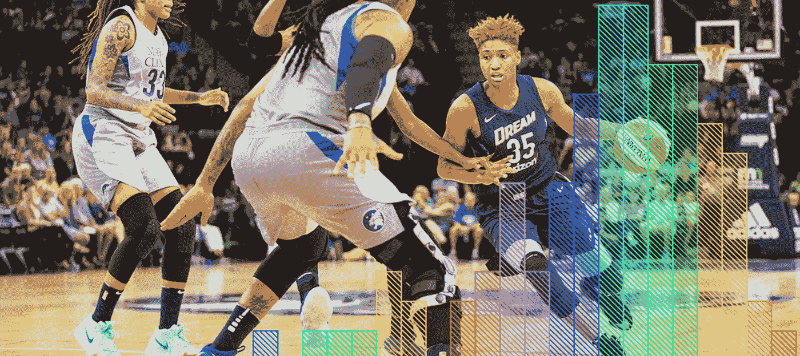

[Photo](https://www.flickr.com/photos/number7cloud/43170342644): Angel McCoughtry of the Atlanta Dream playing against the Minnesota Lynx.

## 实现我打造女子运动梦之队的幻想。

我做了一个不知道从哪里冒出来的白日梦。一个全明星女子运动队的形象出现在我眼前。所有团队和运动类型中最伟大的女性运动员在同一个团队中比赛。像马里奥赛车，除了你有小威廉姆斯，丽萨·莱斯利和 Katelyn Ohashi 都在同一个平台上玩，而不是马里奥，桃公主和蟾蜍。我意识到，我可以通过使用数据科学和机器学习工具来设计最好的团队，并预测如果他们互相比赛会是什么样子，从而使这一愿景成为现实。然而，就像所有大梦想(和大数据)一样，我决定从女子体育世界的一个子集开始，逐步从其他女子体育项目中获取数据。所以我开始了我的使命，通过分析来自 WNBA 的数据来实现我的白日梦。大家准备好，终极 WNBA 游戏即将开始。

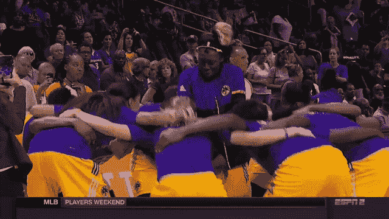

LA Sparks getting hyped before playing.

## **第一步:让每个 WNBA 球员都上场(或者，数据采集)**

我做的第一件事是从[篮球参考](https://www.basketball-reference.com/wnba/)收集每一个 WNBA 球员的每场职业统计数据。我总共获得了 923 名 WNBA 球员的数据。下面是我的数据帧头的预览。如果你想知道下面数据框中的每一列代表什么，请查看这个词汇表。我将继续翻译一行，以便您了解如何解释这些数据。洛杉矶火花队的 Farhiya Abdi 总共打了 52 场比赛，并首发了其中的 5 场。平均每场比赛，她在场上打了 9.6 分钟，投篮命中率为 38%，三分球命中率为 25%，两分球命中率为 43%，罚球命中率为 68%。阿卜迪也场均 1 篮板 0.4 助攻 0.2 盖帽 0.4 失误 1.2 个人犯规。最后，阿卜迪平均每场得分 2.9 次。一旦我完成了将所有球员分组到排名的球队，我将使用这些每场比赛的统计数据来模拟前两个球队之间的数据驱动的季后赛。

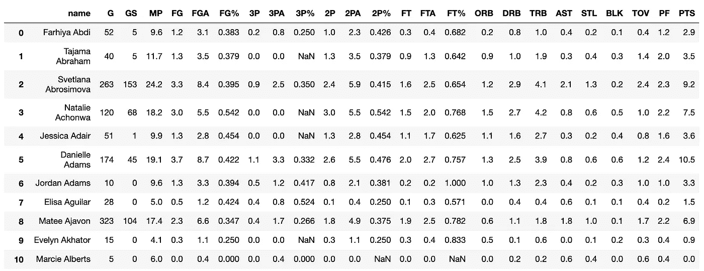

10 out of 923 per-game career stats for every WNBA player listed on basketball-reference. I can’t help but see this DataFrame as a court where the data are playing against each other.

## 第二步:按位置划分所有 WNBA 玩家

为了创建最好的团队，我决定根据位置拆分所有球员，并使用机器学习在每个位置内开发排名分组。正如《篮球参考》上记载的那样，WNBA 球员根据这五个位置进行分类:前锋、中锋、前锋、后卫和前锋。在 923 名 WNBA 球员中，有 908 人的位置已经列出。这是按位置分列的运动员名单。

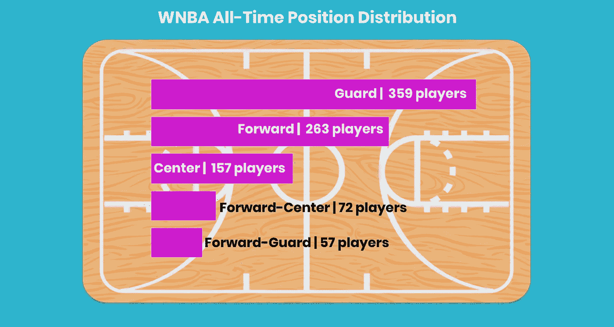

Distribution of positions of all-time WNBA players.

## 第三步:确定每个职位的最佳绩效比率

在我把所有球员按位置分成五类后，我根据以下类别计算了每个位置的平均表现:投篮命中率(`FG%`)、总篮板(`TRB`)、抢断(`STL`)、盖帽(`BLK`)、助攻(`AST`)和总得分(`PTS`)。一些职位在更多的类别上比其他职位表现更好。例如，前锋球员在更多的表现类别上比其他位置表现得更好，所以他们有四个最好的品质。另一方面，前锋球员更加专业化，在两个方面表现出色。以下是我认为每个职位的最佳表现品质。

*   前锋中锋:`TRB`、`BLK`、`FG%`、`PTS`
*   前锋:`AST`，`PTS`，`STL`
*   中心:`BLK`、`FG%`、`TRB`
*   守卫:`AST`、`PTS`、`STL`
*   前进:`FG%`，`TRB`

## 步骤 4:使用机器学习在每个位置内创建分级聚类

将 WNBA 球员按照他们的位置进行划分，我用他们表现最好的品质作为我的预测变量，在每个位置内创建了集群。我使用了一个名为 [K 均值聚类](https://www.naftaliharris.com/blog/visualizing-k-means-clustering/)的无监督机器学习模型来帮助我完成这项任务。K-Means 聚类所做的是围绕中心点对数据进行分组，从而创建相似数据的不同聚类。由字母`k`表示的中心点的数量是需要预先确定的参数。寻找最佳的`k`来为每个位置创建排名聚类需要多次尝试。我事先也知道我想用相同的数字`k`对每个职位进行分组，所以在某些情况下，一个职位的分组比其他职位的分组更清晰。最终我选择了`n_clusters = 8`,因为这个数字往往有相对较高的轮廓和较低的惯性分数。轮廓分数越高，组就越明显，惯性分数越低，每个数据点在一个聚类中就越相似。在下图中，您可以看到前中聚类的剪影得分非常高(见左)，但警卫聚类的剪影得分很低(见右)。这意味着前锋中的球员群将比后卫中的球员群更加独特。

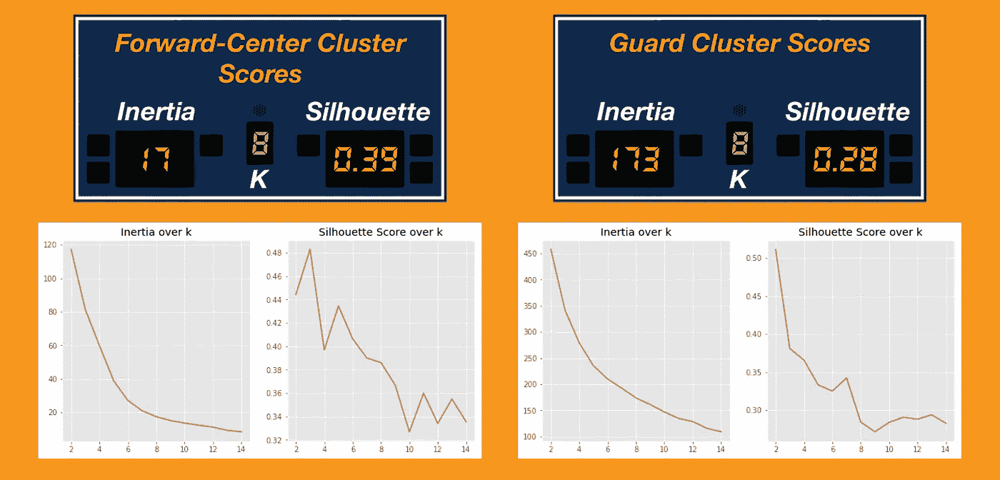

Here’s an example where my k worked better for Forward-Center compared to Guard, specifically looking at the silhouette scores.

在玩家被分类成组后，由我来决定排名并对任何任务进行调整。集群不会自动转化为排名，有时集群会形成不完美的群体。我将向您介绍我是如何为前锋解释集群的。在下面的集群可视化中(见左图)，有八个集群对应于`n_clusters = 8`。请记住，我决定了每个职位使用的绩效类别。对于前锋，我选择了助攻、总得分和抢断，因为他们在这些方面表现很好。现在创建排名，我提到了质心计算(右)。质心数据帧的索引指的是特定的簇号，范围在 0 到 7 之间。平均值最高的集群在所有性能类别中表现更好。聚类 5 中的玩家将被排名为最佳，聚类 4 中的玩家排名第二，依此类推。

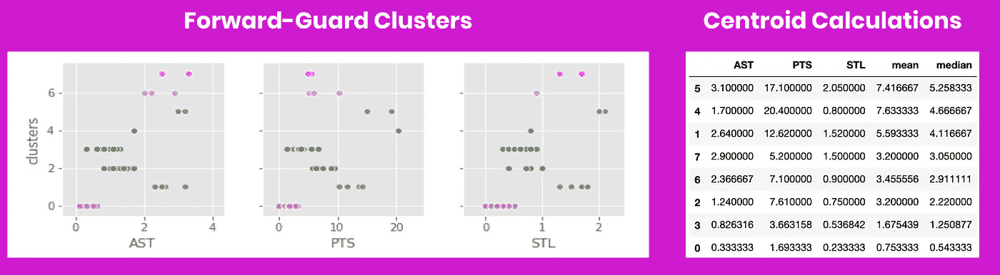

Cluster visualizations (right) and centroid calculations (left). There’s a lot going on here! I explain how to interpret all of this in the paragraph below.

然而，如果你看一下可视化，你会看到集群 4 中只有一个玩家。对我来说，很容易判断出属于第四类的玩家是华盛顿神秘主义者的[艾琳娜·戴尔·多恩](https://www.wnba.com/player/elena-delle-donne/)。在她所在的位置上，她获得了所有选手中最高的总分(在`PTS`可视化中，她的聚类点比其他任何人都远)，并且她是五次 WNBA 超级明星。根据这个排名，她进入了第二好的队？嗯，如果你仔细看看，多恩在助攻和抢断方面的表现低于她所在位置的其他球员。然而，如果你仔细看看她的集群(4)与有更多球员的集群 1 相比，他们在抢断和助攻方面明显优于她。因此，我在簇 4 和簇 1 之间交换了位置。新的排序变成分类 5 是最好的，分类 1 是第二好的，分类 4 是第三好的，等等。我仔细检查了所有五个职位的八个聚类，并在每个职位中从最好到最差排列它们。现在是组队的时候了。

## 第五步:创建八个有 WNBA 球员的排名球队

因为篮球队是由五个位置组成的，我从每个位置取出排序的集群，并将它们重新组合成队。每支球队的规模不同，每个位置的球员数量也不同。由于大多数类别的表现分布是右偏的，因此在每个类别中，表现明显好于其他人的玩家较少(见下图)。因此，八支队伍中最好的队伍会有更少的队员。

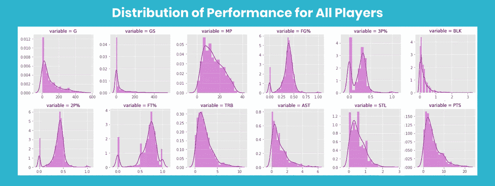

Distribution of performance across the categories I chose to measure. Most of the distributions are right-skewed except for free throw percentage. According to this, WNBA players are great at making free throws.

我将团队命名为“团队 1”到“团队 8”，团队 1 表现最好，团队 8 表现最差。为了简洁起见，我将介绍最好的两个团队，您可以访问我的 GitHub 资源库(本文末尾有链接)来查看其余的细节。队 1 有 35 名队员，队 2 有 56 名队员。两支球队都有全明星球员，但事实证明，1 队的球员往往在不止一项技能上比他们位置上的其他球员表现得更好。因此，团队 1 应该是拥有技能能力最全面的球员的团队。由于我没有使用比赛次数来确定排名，所以每个队都有很好的新秀和老将组合。例如，老将[辛西娅·库珀](https://www.wnba.com/player/cynthia-cooper/)场均最高分排名第一，新秀[阿贾威尔逊](https://www.wnba.com/player/aja-wilson/)场均最高分排名第二。

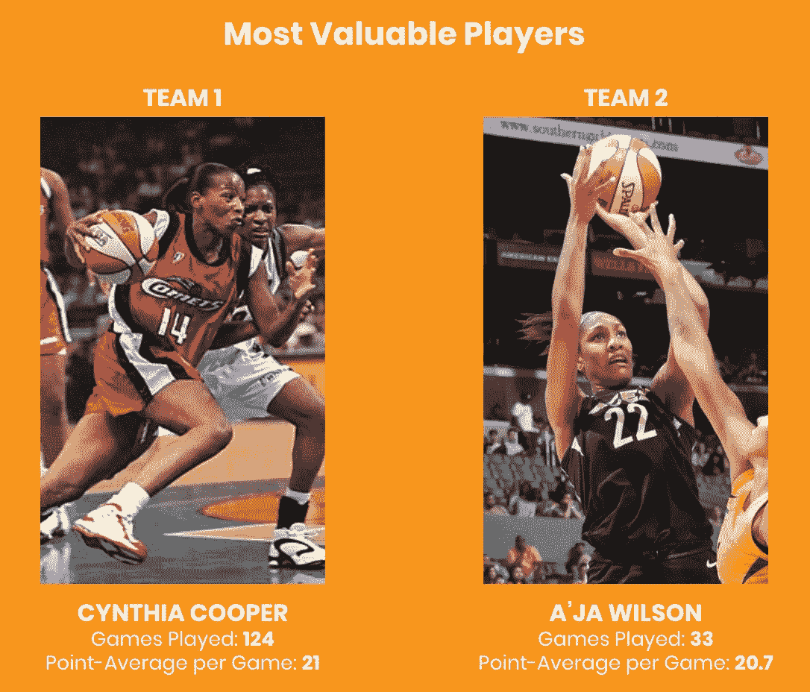

Players who had the highest point average per game in Team 1 and Team 2\. Image sources: [left](https://in.pinterest.com/pin/42432421462727330/?lp=true), [right](https://thetandd.com/sports/s_carolina/basketball/a-ja-wilson-named-wnba-all-star-in-rookie-season/article_cdf84b03-c997-5988-bd4a-73eb5409c196.html).

下面是梦之队 1 的最终名单，包括 16 名后卫，12 名前锋，3 名中锋，2 名前锋和 2 名前锋。仅举几个亮点:辛西娅·库珀场均得分最高，[凯蒂·史密斯](https://liberty.wnba.com/katie-smith-head-coach/)打了最多的比赛，[塔米卡·凯金斯](https://www.wnba.com/player/tamika-catchings/)开始了最多的比赛， [Chiney Ogwumike](https://www.wnba.com/player/chiney-ogwumike/) 场均三分命中率最高，[布兰妮·格里纳](https://www.wnba.com/player/brittney-griner/)场均盖帽最高。

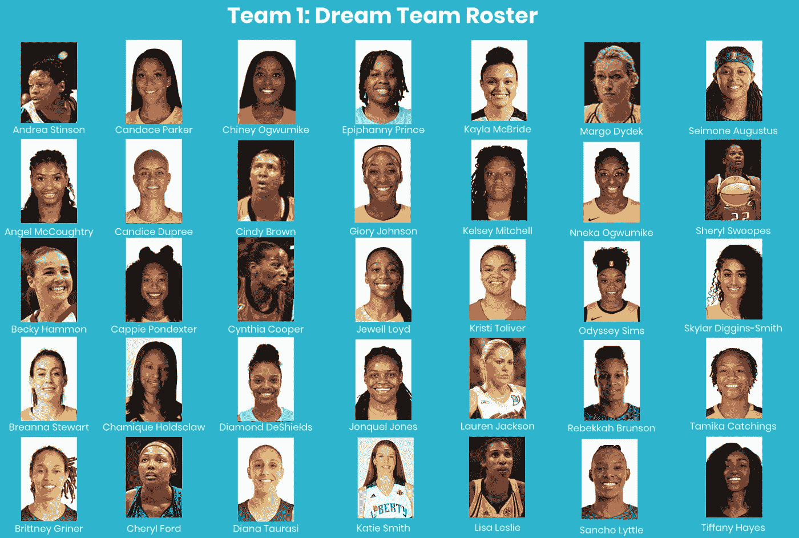

Team 1 roster comprised of 35 of the best WNBA players as identified through K-Means Clustering.

## 步骤 6:模拟两个顶尖团队之间的数据驱动游戏

各位，请坐。终极(数据驱动)WNBA 游戏即将开始！为了提示比赛，让我们来看看每个队中开始比赛最多的球员:从 1 队开始 448 场比赛的塔米卡·凯金斯和从 2 队开始 508 场比赛的苏·伯德。进攻篮板也是千钧一发。第一队进攻篮板的平均水平更高，但是他们的分布比第二队更偏，第二队进攻篮板的平均水平和中位数相似。如果第一队的界外球在场外，第二队有更大的机会获得更多的进攻篮板。但不可否认的是，在防守篮板方面，第一队的表现明显好于第二队。这场比赛的三分球成功率会很高，让你有更多的机会在看到球飞过球场并毫不费力地进入篮筐时欢呼。两队三分球命中率都很高。

这是你们期待已久的时刻，这场比赛的赢家。嗯，第一队击败了第二队，因为他们的场均得分比第二队高四分。但是你永远不知道——如果两个队中平均每场得分 20 分的局外者对阵，可以肯定地说这场比赛可能是势均力敌。

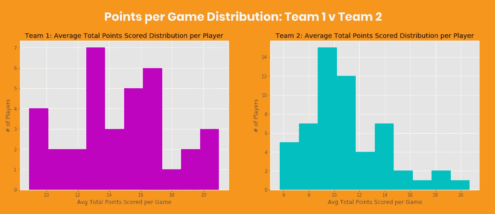

Points per game distribution for both teams. On average, players from Team 1 score 4 more points than players on Team 2.

## 结论

仅仅通过数据观看体育比赛比我想象的要有趣得多。我对我的结果很满意，展望未来，我可能会回到我的数据，以完善我的特征选择过程和模型参数。除了实现让所有女子运动员在同一个平台上比赛的梦想之外，我相信通过这个过程，我还实现了更大的成就:让 WNBA 获得了应有的关注。考虑到体育数据分析是一个蓬勃发展的领域，需要更多地关注妇女的体育数据和对这些数据的分析。最后，通过数据见证了历史上最伟大的 WNBA 球员的壮举，我感到很受鼓舞。我从来都不是一个真正的体育迷，但这个项目让我爱上了 WNBA。对于 WNBA 社区，由于数据科学，你现在有了一个新的粉丝。

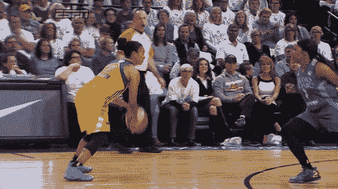

LA Sparks showing off their three-pointer skills.

要查看这里引用的代码和分析，请查看我的 GitHub [repo](https://github.com/jasminevasandani/WNBA_Teams_Clustering) 。

*感谢肖恩·瓦萨达尼和阿努瓦·卡拉瓦尔帮助我更好地理解篮球。感谢 Riley Dallas 帮助我思考我的建模过程。*

*Jasmine Vasandani 是一名数据科学家，也是 WNBA 的忠实粉丝。你可以在这里了解她的更多:*[*www.jasminev.co/*](http://www.jasminev.co/)