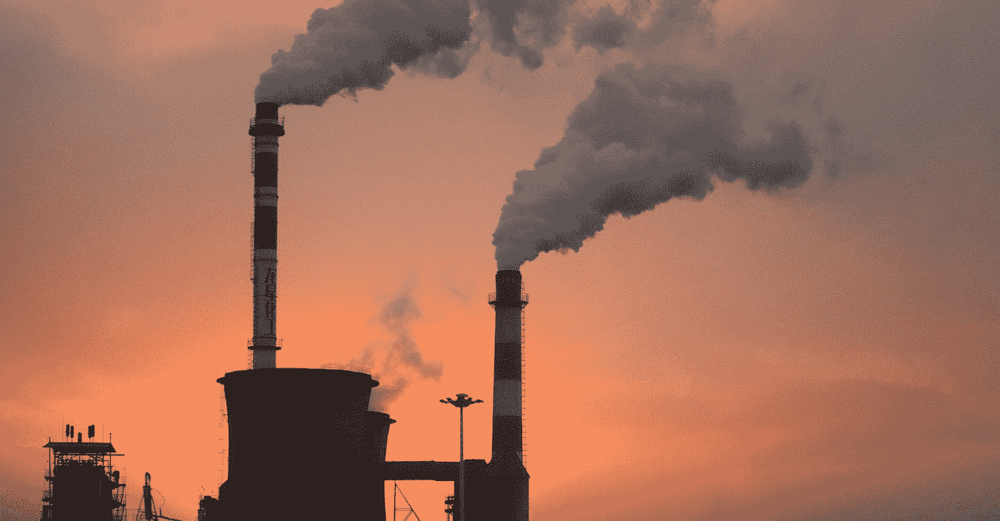

# 线性回归背后的机器学习概念

> 原文：<https://towardsdatascience.com/how-machine-learns-from-data-a-simple-method-for-co2-pollution-prediction-af18430ce12b?source=collection_archive---------19----------------------->

## 简单 ML 模型在 CO2 预测中的应用

Photo by [Alexander Tsang](https://unsplash.com/@alexander_tsang?utm_source=medium&utm_medium=referral) on [Unsplash](https://unsplash.com?utm_source=medium&utm_medium=referral)

# 介绍

在过去的几年里，有很多关于人工智能的炒作。从用声音开灯到完全自主的自动驾驶汽车，你几乎可以在任何地方找到它。

现代 AI 大多需要大量数据。你给的越多，它学的越好。例如，为了训练 AI 理解猫的图像，你需要给出大量猫和非猫的图像，以便它能够区分这两者。

> 但是 AI 到底是如何从数据中学习的呢？

在本帖中，我们将通过一个非常简单的模型来了解人工智能是如何学习的。我们将关注过去 55 年全球二氧化碳排放量，并试图预测 2030 年的排放量。

# 二氧化碳排放数据

我们将使用的数据来自[世界银行](https://data.worldbank.org/indicator/EN.ATM.CO2E.KT)。不幸的是，该数据不是截至 2019 年的当前日期(在撰写本文时)。这是从 1960 年到 2014 年，但这对于这个实验来说很好。

Fig 1: Amount of CO2 Emission annually from 1960 to 2014\. Source: [WorldBank Data](https://data.worldbank.org/indicator/EN.ATM.CO2E.KT)

x 轴对应年份(假设 0 年是 1960 年)，y 轴对应 CO2 排放量。根据图表，我们也许能够对 2030 年的价值做一个粗略的估计。

> 假设我们只是画一条最符合这个数据的直线，如果我们把这条线越拉越远，我们就可以预测未来。

Fig 2: Fit a line and use it to make a rough estimation at year 70 (2030)

请记住，我们无法准确预测未来。事情可能会变得更好，但为了简单起见，我们只是假设变化率是恒定的。

# 线性回归

让我们引入一点数学知识。上面的蓝线你可能很熟悉。这是一条简单的直线，用下面的等式表示。

嗯哼。现在你记起来了。同样， **x** 是年份， **y** 是排放量。为了得到图 2 所示的线，m=446，334，b=9，297，274。不用担心 m 和 b，后面我会详细解释。

如果我们想知道 2030 年的信息(如果从 1960 年算起，是 70 年)，我们现在可以使用上面的等式。

现在按照承诺，让我们仔细看看什么是 **m** 和 **b** 。

Fig 3: Behavior of m on the line

在图 3 中，当我们改变 m 的值时，直线旋转。因此，变量 m 控制**线**的方向。而在图 4 中，变量 b 通过上下移动线来控制线**的位置。**

Fig 4: Behavior of b on the line

# 学习过程

> 有了 m 和 b，我们就可以控制这条线，并将其调整到最适合我们的数据。

现在的问题是我们如何找到变量 m 和 b 的值？想法是这样的:

1.  随机化 m 和 b 的值。
2.  将变量赋予损失函数，以确定该线与数据相比有多差，也称为差错率。
3.  根据错误率调整 m 和 b 的值。
4.  回到步骤 2。重复直到变量停止变化。

# 损失函数

如果我们的线路很差，这个损失函数会给出非常大的误差。同时，如果直线与数据拟合得很好，误差也会很小。

Fig 5: The difference between predicted line and actual data

该线每年都有其预测值**y’**。然后，我们可以将预测值**y’**与实际值 **y** 进行比较，找出差异。我们每年计算这个值，取其平均值。这也被称为*均方误差* (MSE)。

Fig 6: Closed form of MSE

现在我们差不多准备好更新我们的变量了。有一个小问题。我们之前发现的错误率总是正的。我们几乎不知道哪个方向应该更新我们的线。它应该顺时针旋转还是逆时针旋转？这时**渐变下降**出现了。

Fig 7: Formula to update each variable (in this case, variable *m*)

简而言之，这说明了方向以及每个变量对误差的影响程度。**越是有效果，越应该改变价值。然后，我们可以使用这些信息来更新我们的变量。我们不会深入探究衍生品，但如果你感兴趣，你可以在 Coursera 上查看[这个视频](https://www.coursera.org/learn/machine-learning/lecture/kCvQc/gradient-descent-for-linear-regression)。我发现那里的解释相当清楚。**

注意阿尔法**阿尔法**，也称为**学习率**，是控制我们应该更新变量的多少。通常，我们将它设置为一个小值，比如 0.001，这样我们就可以慢慢地将变量更新到最佳值。

> 好消息是:在实践中，我们不会手动进行这种推导。

像 Tensorflow 或 PyTorch 这样的流行框架会自动计算这一点。但是我把它放在这里是为了简单说明它是如何知道向哪个方向改变值的。

# 履行

那么，您需要像上面描述的那样编写所有代码来让线性回归工作吗？幸运的是，许多现有的库为您简化了一切。在这个例子中，我们将探索为 Python 构建的机器学习库 [scikit-learn](https://scikit-learn.org) ，以预测二氧化碳排放。

只需几行代码，scikit-learn 就能让线性回归变得非常容易。仅第 9 行就完成了训练模型所需的所有必要步骤。唷，你是在杞人忧天，不是吗？这不仅适用于线性回归，也适用于用几行代码实现许多其他的 ML 算法。

# 结论

就是这样。没那么复杂吧(推导部分除外)？线性回归是一种简单而有效的方法，尽管它只是一条直线。在这篇文章中，我们只看了只有一个变量(年份)的情况。实际上，这可以扩展到处理多个变量，但这是后面文章的主题。

# 参考

1.  [https://en.wikipedia.org/wiki/Linear_regression](https://en.wikipedia.org/wiki/Linear_regression)
2.  [https://towards data science . com/introduction-to-machine-learning-algorithms-linear-regression-14c4e 325882 a](/introduction-to-machine-learning-algorithms-linear-regression-14c4e325882a)
3.  [https://developers . Google . com/machine-learning/速成/descending-into-ml/linear-regression](https://developers.google.com/machine-learning/crash-course/descending-into-ml/linear-regression)
4.  [https://www . coursera . org/learn/machine-learning/lecture/kCvQc/gradient-descent-for-linear-regression](https://www.coursera.org/learn/machine-learning/lecture/kCvQc/gradient-descent-for-linear-regression)