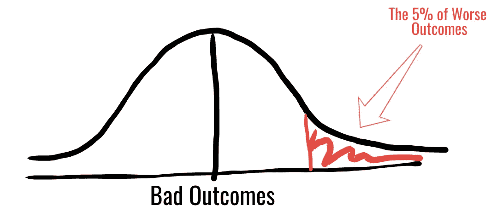
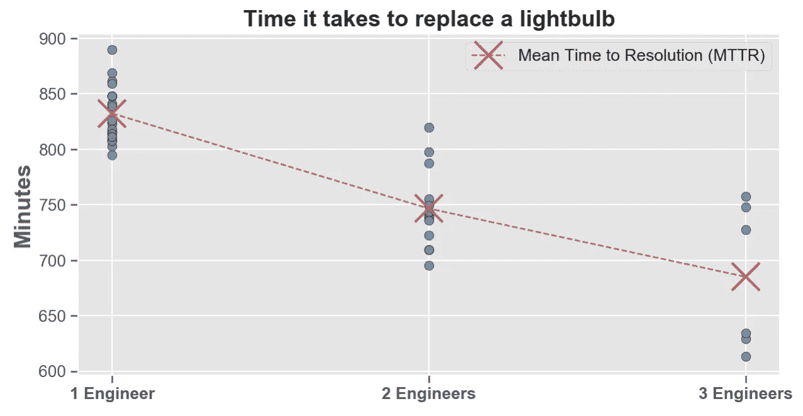
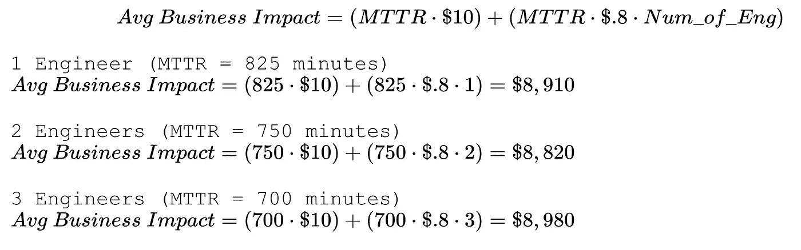
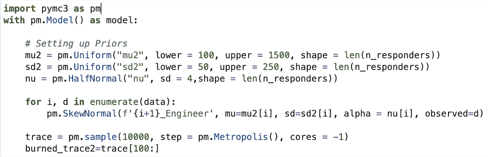
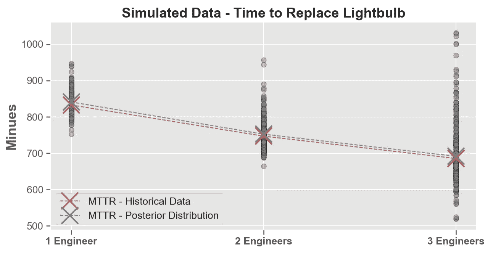
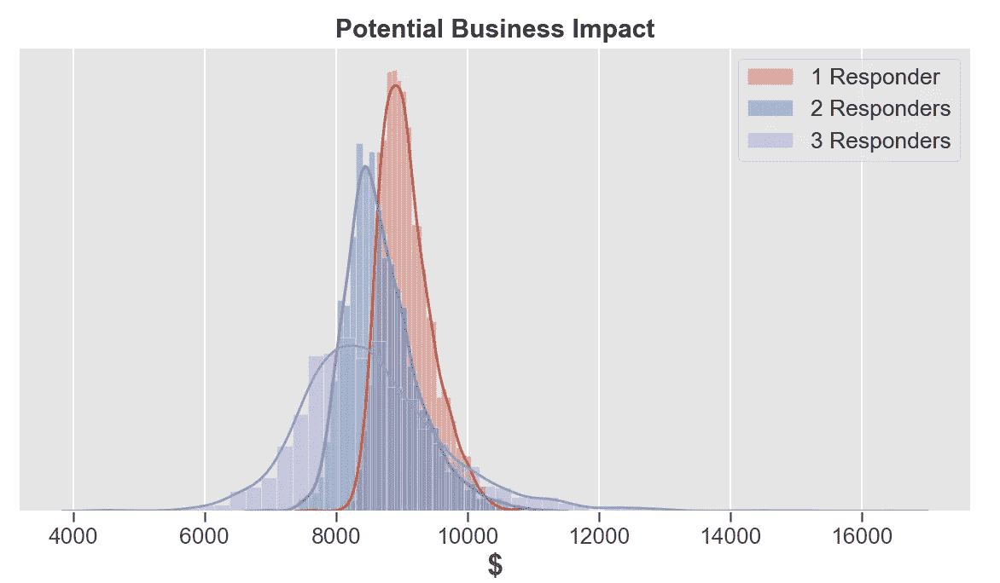
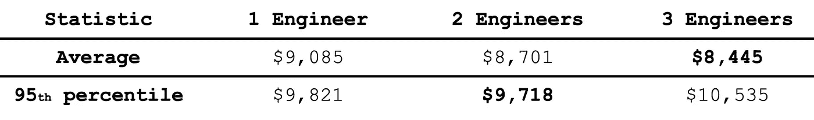
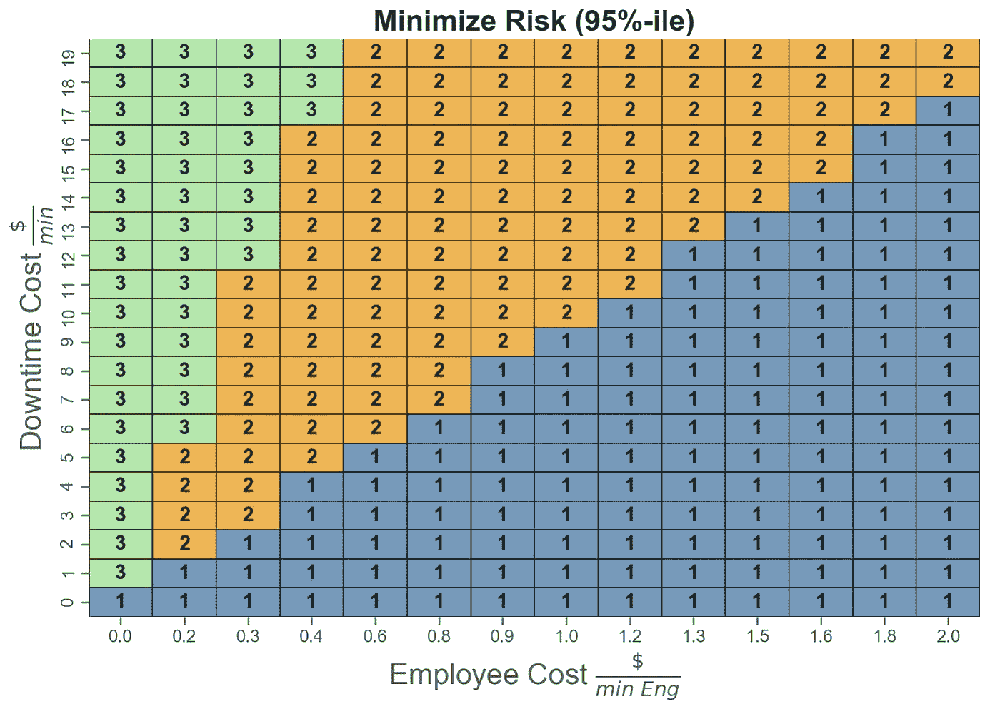

# 修复一个灯泡需要多少工程师——优化事故响应

> 原文：<https://towardsdatascience.com/how-many-engineers-does-it-take-to-fix-a-lightbulb-optimizing-incident-response-785f81d62470?source=collection_archive---------40----------------------->

## 避免“厨房里厨师太多”的问题—优化关键任务的事件响应

# 介绍

更换一个灯泡需要多少名工程师？这一讽刺性的假设将用于演示企业如何针对关键任务优化其事件响应。

我们经常在工作场所遇到需要我们与其他人合作来解决时间敏感、业务关键和客户面对的问题的情况。无论是试图解决电子商务网站宕机问题的软件开发人员，还是应对野火事件的第一反应人员，时间就是金钱(有时甚至是人命)，因此问题解决得越快，您的客户就越开心，有时也越安全。

# 加还是不加？

想象一下，你是一个管理灯泡的工程团队的经理。一个特定的灯泡熄灭了，工程团队得到了通知。你的老板疯狂地问你:

> 需要多少工程师来更换灯泡？

嗯，那要看情况:

1.  停机成本(例如，灯泡每坏一分钟，对我们的业务会有什么影响？)
2.  工程资源成本
3.  风险容忍度

## 风险

不用花太多时间在风险上，在这个上下文中它指的是一个*罕见的*机会，一些*真正糟糕的事情*发生了。*稀有*和*真坏*都是相对的/主观的术语。一种标准方法是测量所有可能结果分布的第 95 个百分位数。风险值将被定义为比风险值更糟糕的事情发生的概率为 5%。

95th-percentile of Bad Outcomes. Risk is the location of the red vertical line

黑色垂直线代表平均结果，而红色垂直线代表第 95 百分位。尾巴越粗，垂直线和红线之间的距离就越远，因此，风险就越高。

# 方法

幸运的是，该团队在过去已经修复了以前的灯泡。因为你是一个*数据驱动的*经理，你选择通过分析团队的历史数据来解决问题:

## **数据**

假设这一事件在过去已经发生了 38 次。每次，你都指派 1、2 或 3 名工程师，测量修好灯泡所需的时间。

红色“X”标记表示解决问题的平均时间(MTTR)，或解决事件所需的平均时间。请注意，平均来说，更换灯泡的工程师越多，更换的速度就越快… ***。*** 1 名工程师平均能在 825 分钟左右完成*，而 3 名工程师平均能在 700 分钟以内完成*。**

## *天真的方法*

*让我们做两个主要假设:*

1.  *你的工程师一年挣 10 万美元(大约 0 . 80 美元/分钟)*
2.  *灯泡每熄灭一分钟，你的企业就会损失 10 美元*

*确定要部署的工程师数量以最小化总体业务影响的简单方法是使用*平均估计值*:*

**

*增加 2 名工程师最有效，导致最低的*平均*影响。然而，这种方法忽略了:*

1.  *我们数据的不确定性。虽然 38 个样本似乎足够了，但请注意，我们只有 3 名工程师的 6 个样本，这使得我们对该组的平均(MTTR)估计不太有信心。*
2.  *风险(第 95 百分位)，而不是只考虑*的平均影响。**

## *概率方法*

*给定有限的历史数据，我们可以估计每个部署的工程师数量的解决时间的分布。意识到“厨房里有太多厨师”的现象，我们选择拟合一个[偏斜正态分布](https://en.wikipedia.org/wiki/Skew_normal_distribution)来解释偏斜的尾部。*

**

*采样并绘制后验分布结果:*

**

*Sampled Posterior Distribution*

*请注意，我们从后验数据(灰色)生成的 MTTR 与我们的历史数据(红色)的 MTTR 非常接近。此外，我们的后验分布反映了一些异常值，特别是对于 3 名工程师来说，更换灯泡的时间可能超过 1000 分钟。鉴于 *3 名工程师*花费 1000 分钟(总共 3000 多分钟)更换灯泡，这种情况是高风险的。*

## *模拟业务影响*

*我们可以采用上面的后验分布和我们之前的假设(每个工程师 0.80 美元/分钟，断电 10 美元/分钟)来模拟业务影响:*

**

*Distribution of Total Business Impact in USD*

*根据结果的分布，我们可以提取不同的统计数据，即平均值和第 95 百分位，我们可能希望最小化这些数据:*

**

*Business Impact Depending on Number of Engineers*

## *结果*

*如果你的目标是最小化平均影响，那么部署 3 名工程师(如**粗体**所示)将产生 8445 美元。该决策虽然具有最低的平均影响，但也具有最高的风险(10，535 美元)。有了 3 名工程师，你就有了*“厨房里厨师太多”*的风险，工程师们互相妨碍，拖延解决问题的时间。3 名工程师的业务影响有 5%的可能性会产生 10，535 美元*或更多*。*

*因此，如果风险很高，保守的解决方案是部署 2 名工程师(如**粗体**所示)，风险为 9718 美元。*

# *敏感性分析*

*我们的决策如何随着不同的员工成本或业务中断风险而改变？在一种情况下，最小化风险所需的最佳工程师数量是 1、2 或 3 名工程师。*

**

*Decision Boundary based on employee and downtime costs*

*上图反映了为了使 ***对员工和停工成本的业务影响*****最小化 95%而需要更换灯泡的*最佳*工程师数量。***

# **结论**

**随着越来越多的行业过渡到数字时代，变得更加*数据驱动*，优化事件响应不仅变得至关重要，也是影响决策的可行机会。在许多行业中，解决事件的时间差异可能至关重要(例如，对野火做出反应的第一反应者或开发人员将关闭的网站恢复为高流量电子商务网站)。因此，数据驱动的方法使您组织的事件响应变得敏捷、谨慎(考虑风险)，最重要的是*最优。***