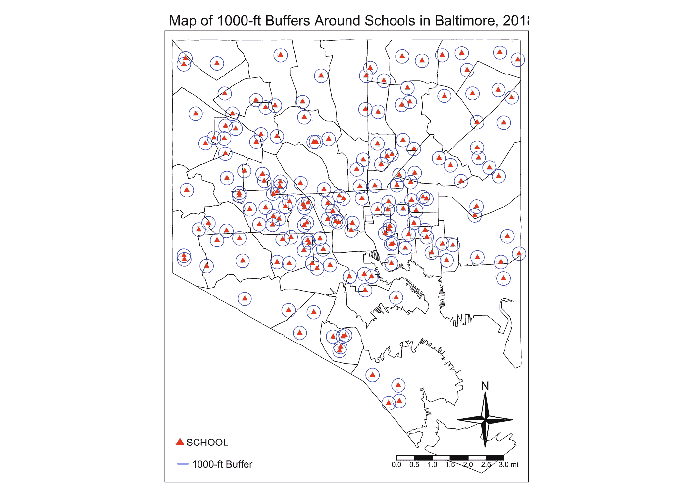

# 2018 年巴尔的摩学校 1000 英尺范围内有多少枪？

> 原文：<https://towardsdatascience.com/how-many-guns-were-within-1-000-feet-of-schools-in-baltimore-in-2018-16deb60ff9db?source=collection_archive---------49----------------------->

## 对巴尔的摩枪支暴力公开数据的分析显示，数量惊人的枪支犯罪非常接近这座迷人城市的一些最脆弱的居民

根据 1990 年的无枪校园法案，如果枪支穿越州界到达学校【1,000 英尺范围内的人不得拥有枪支(因为国会可以通过监管州际商业来监管枪支)，如果持枪者没有获得许可，也不得拥有枪支。想到这一点，我对巴尔的摩发生了多少起持枪杀人案感到好奇。这是我论文的一部分，但由于内容和时间的限制，它不得不从[论文和陈述](https://epidemiological.net/doctoral-dissertation/)中删除。

我的论文数据分析只到 2017 年，所以我很好奇 2018 年发生了什么。我们来看看，用 R 来看看发生了什么？(请注意，在学校 1000 英尺范围内发生的枪支杀人案或枪击案不一定是使用无证枪支进行的。)

# 数据

首先，我们从[巴尔的摩城市开放数据门户](https://data.baltimorecity.gov/)获得 2018 年巴尔的摩枪支杀人和枪击的数据:


这给了我一份 5343 起事件的清单，在这些事件中使用了枪支，并且注明了地点。他们归结为这一点。(注:这些都是举报的罪行。实际数字可能不同。):

犯罪类型|罪名
严重伤害罪| 1474
杀人罪| 273
抢劫—劫车| 337
抢劫—商业| 533
抢劫—住宅| 121
抢劫—街头| 1928
枪击| 677

有了这些信息，包括经度和纬度，我们把它们放到地图上，看看它们发生在哪里。为了创建这张地图，我使用了来自城市开放数据门户的社区统计区域(CsA)的形状文件。

当然，我可以在 QGIS 或 ArcGIS 中完成所有这些操作，它会生成这样的地图:


这里非常拥挤，因为有很多与枪支有关的犯罪。在 QGIS 和其他使用点击式界面的程序中这样做的问题是，你并没有准确地记录你刚刚做了什么。你必须花时间写一本操作手册来精确地复制上面的地图。或者你可以录下画面。

这就是像 R 这样的程序的用武之地。有了它，你在编写代码的同时也在编写操作手册。注释良好的代码允许下一个人抓取你的代码并精确地复制你的结果，而不需要花什么力气去弄清楚你做了什么以及你是怎么做的。所以让我们用 R 复制上面的地图，甚至得到一些关于哪个学校的枪支犯罪数量最多的统计数据。

# 代码

首先，我们要加载一些库。我已经评论了每个库的使用。

```
# Load the required libraries ----library(rgdal) # To manage spatial data
library(tigris) # To manage spatial data
library(tmap) # To create the maps
library(tmaptools) # To add more functionality to the maps created with tmap
library(raster) # To manipulate spatial data
library(sp) # To manipulate spatial data
library(rgeos) # To manipulate spatial data
library(sf) # To manipulate spatial data
library(spatialEco) # To join the layers
library(dplyr) # To manage data (make tables and summarize values)
```

现在，让我们输入数据。

```
# Import the data and make it readable ----crimes <-
  read.csv("data/gun_crimes_2018.csv", stringsAsFactors = F) # Import gun crime data
crimes <-
  as.data.frame(lapply(crimes, function(x)
    x[!is.na(crimes$Latitude)])) # Remove crimes without spatial data (i.e. addresses)
csas <-
  readOGR("data", "community_statistical_area") # Import Community Statistical Area shapefiles
schools <- readOGR("data", "bcpss_school") # Import Schools
```

现在，让我们把*犯罪*从一个数据帧变成一个合适的形状文件，并给它正确的投影。

```
# Create point shapefile from dataframe ----coordinates(crimes) <-
  ~ Longitude + Latitude # Assign the variables that are the coordinates
writeOGR(crimes, "data", "guncrimes", driver = "ESRI Shapefile") # Write it as a shapefile
guncrimes <- readOGR("data", "guncrimes") # Read it back in
proj4string(guncrimes) <-
  CRS("+proj=longlat +datum=WGS84 +unit=us-ft") # Give the right projection
```

一行简单的代码来查看不同类型的枪支犯罪数量。

```
table(crimes$Description)
```

接下来，因为我们要把层放在彼此之上，我们需要确保它们都有正确的投影([坐标参考系统](https://docs.qgis.org/2.8/en/docs/gentle_gis_introduction/coordinate_reference_systems.html))。

```
# Fix the projections of the other layers ---pro <- sp::CRS("+proj=longlat +datum=WGS84 +unit=us-ft")
csas <- sp::spTransform(csas, pro)
schools <- sp::spTransform(schools, pro)
```

所有的图层都在同一个投影上，让我们使用 *tmap* 来构建我们的第一张地图。

```
# Create map of Firearm Crimes ----tmap_mode("plot") # Set tmap to "plot" (instead of "view")baltimore1 <-
  tm_shape(csas) + # Adds the Community Statistical Areas layer
  tm_borders("black", lwd = .5) + # Makes those borders black and thin
  tm_shape(guncrimes) + # Adds the layer of gun-related crimes
  tm_dots("Dscrptn", # Creates a dot for each gun-related crime, color-coded by type of crime
          title = "Crime Type",
          size = 0.1) +
  tm_compass() + # Adds the north star compass
  tm_legend() + # Adds the legend
  tm_layout( # Controls the layout of the different elements of the map
    main.title = "Map of Firearm Crimes in Baltimore, 2018",
    main.title.size = 1,
    legend.position = c("left", "bottom"),
    compass.type = "4star",
    legend.text.size = 0.7,
    legend.title.size = 0.9
  ) +
  tm_scale_bar( # Adds the scale bar
    size = 0.5,
    color.dark = "black",
    color.light = "white",
    lwd = 1
  ) +
  tmap_options(unit = "mi") # Makes sure the scale bar is in milesbaltimore1 # Let's look at the maptmap_save(tm = baltimore1, # Saves the map
          filename = "Maps/baltimore1.bmp", # File name of the image
          dpi = 600) # Resolution of the image saved
```

这是我们创造的:


让我们建立第二个学校位置地图。(在这里，我没有太多的评论，因为它是上面第一张图的复制。):

```
# Create map of School locations ----baltimore2 <-
  tm_shape(csas) +
  tm_borders("black", lwd = .5) +
  tm_shape(schools) +
  tm_dots(
    "CATEGORY",
    shape = 17,
    size = 0.1,
    title = "School Type",
    col = "red",
    legend.show = T
  ) +
  tm_legend() +
  tm_compass() +
  tm_layout(
    main.title = "Map of School Locations in Baltimore, 2018",
    main.title.size = 1,
    legend.position = c("left", "bottom"),
    compass.type = "4star",
    legend.text.size = 0.7,
    legend.title.size = 0.9
  ) +
  tm_scale_bar(
    size = 0.5,
    color.dark = "black",
    color.light = "white",
    lwd = 1
  ) +
  tm_add_legend(
    "symbol",
    col = "red",
    shape = 17,
    size = 0.5,
    labels = "SCHOOL"
  ) +
  tmap_options(unit = "mi")baltimore2tmap_save(tm = baltimore2,
          filename = "Maps/baltimore2.jpg",
          dpi = 600)
```

这是我们得到的结果:


现在，让我们创建一个与枪支相关的犯罪和学校位置的地图:

```
# Create map of school locations and firearm crimes locations ----baltimore3 <-
  tm_shape(csas) +
  tm_borders("black", lwd = .5) +
  tm_shape(schools) +
  tm_dots(
    "CATEGORY",
    shape = 17,
    size = 0.1,
    title = "School Type",
    col = "red",
    legend.show = T
  ) +
  tm_shape(guncrimes) +
  tm_dots("Dscrptn",
          title = "Crime Type",
          size = 0.08) +
  tm_compass() +
  tm_layout(
    main.title = "Map of Firearm Crimes and Schools in Baltimore, 2018",
    main.title.size = 1,
    legend.position = c("left", "bottom"),
    compass.type = "4star",
    legend.text.size = 0.7,
    legend.title.size = 0.9
  ) +
  tm_scale_bar(
    size = 0.5,
    color.dark = "black",
    color.light = "white",
    lwd = 1
  ) +
  tm_add_legend(
    "symbol",
    col = "red",
    shape = 17,
    size = 0.5,
    labels = "SCHOOL"
  ) +
  tmap_options(unit = "mi")baltimore3tmap_save(tm = baltimore3,
          filename = "Maps/baltimore3.jpg",
          dpi = 600)
```

这是地图:


现在，我们要在学校周围建立一个 1000 英尺的缓冲区:

```
# Create a 1,000-foot buffer around the schools ----
# https://www.rdocumentation.org/packages/raster/versions/2.8-19/topics/bufferbuf <- buffer(schools, # Layer for buffers
              width = 304.8, # Buffer in meters
              dissolve = F)
plot(buf) # Take a look at the result
```

确保将英尺转换为米，并确保验证您创建的是您正在寻找的东西。

现在，让我们在地图上看看学校周围的缓冲区:

```
# Create map with buffers and schools only ----baltimore4 <-
  tm_shape(csas) +
  tm_borders("black", lwd = .5) +
  tm_shape(buf) +
  tm_borders("blue", lwd = .5) +
  tm_shape(schools) +
  tm_dots(
    "CATEGORY",
    shape = 17,
    size = 0.1,
    title = "School Type",
    col = "red"
  ) +
  tm_compass() +
  tm_layout(
    main.title = "Map of 1000-ft Buffers Around Schools in Baltimore, 2018",
    main.title.size = 1,
    legend.position = c("left", "bottom"),
    compass.type = "4star",
    legend.text.size = 0.7,
    legend.title.size = 0.9
  ) +
  tm_scale_bar(
    size = 0.5,
    color.dark = "black",
    color.light = "white",
    lwd = 1
  ) +
  tm_add_legend(
    "symbol",
    col = "red",
    shape = 17,
    size = 0.5,
    labels = "SCHOOL"
  ) +
  tm_add_legend("line",
                col = "blue",
                size = 0.1,
                labels = "1000-ft Buffer") +
  tmap_options(unit = "mi")baltimore4tmap_save(tm = baltimore4,
          filename = "Maps/baltimore4.jpg",
          dpi = 600)
```

它看起来是这样的:



现在，让我们创建最终的地图:

```
# Create map with buffer, schools and crimes. This is the final map. ----baltimore5 <-
  tm_shape(csas) +
  tm_borders("black", lwd = .5) +
  tm_shape(buf) +
  tm_borders("blue", lwd = .5) +
  tm_shape(schools) +
  tm_dots(
    "CATEGORY",
    title = "Schools",
    shape = 17,
    size = 0.1,
    col = "red"
  ) +
  tm_shape(guncrimes) +
  tm_dots("Dscrptn",
          title = "Crime Type",
          size = 0.08) +
  tm_compass() +
  tm_layout(
    main.title = "Map of Firearm Crimes, Schools and 1,000-ft Buffers in Baltimore, 2018",
    main.title.size = 0.8,
    legend.position = c("left", "bottom"),
    compass.type = "4star",
    legend.text.size = 0.7,
    legend.title.size = 0.9
  ) +
  tm_scale_bar(
    size = 0.5,
    color.dark = "black",
    color.light = "white",
    lwd = 1
  ) +
  tm_add_legend(
    "symbol",
    col = "red",
    shape = 17,
    size = 0.5,
    labels = "SCHOOL"
  ) +
  tm_add_legend("line",
                col = "blue",
                size = 0.1,
                labels = "1000-ft Buffer") +
  tmap_options(unit = "mi")baltimore5tmap_save(tm = baltimore5,
          filename = "Maps/baltimore5.jpg",
          dpi = 600)
```

这是它的样子:


那看起来像是在 QGIS 中创建的地图吗？绝对的。只是对标记的样子和大小做了一些调整，我们得到了两张相似的地图。

tmap 的好处是它允许你用一行代码创建一个交互式地图。(另一个 R 包，*传单*，做了一些类似的事情，在我看来，甚至可能更“健壮”。)

```
# View the final map in interactive mode ---tmap_mode("view") # Set the mode to view in order to create an interactive map
baltimore5
tmap_mode("plot") # Return to plotting if further maps are going to be made
```

现在，为了分析数据，让我们通过将所有点连接到缓冲区来创建一个数据帧。

```
# Now to create a dataframe of the gun crimes within the buffer zones ----crimespoints <- as.data.frame(point.in.poly(guncrimes, # Points
                                            buf)) # Polygons
crimesbuffer <-
  subset(crimespoints, NAME != "NA") # Creating a dataframe of only the points inside the polygons (NAME is not NA)
```

如果“ *NAME* ”是 NA(不可用)，那么这意味着该点不在缓冲区内。我将它细分到“ *crimesbuffer* ”中，在那里我将对 182 所学校进行分析，这些学校在 1000 英尺范围内至少发生了一起(1)与枪支有关的犯罪，我甚至可以对发生在学校 1000 英尺范围内的 2485 起犯罪进行分析。

```
# Finally, let's see which school had the most gun crimes within 1,000 feet from it ----table <-
  count(crimesbuffer,
        NAME,
        sort = T) # Create a table of names and numbers and sorts it descending
sort(table$n,
     decreasing = T) # Sorting the table
table # View the table
hist(table$n) # Histogram of crime counts (Notice a distribution?)
sum(table$n)
```

由此，我发现 1000 英尺范围内与枪支相关的犯罪最多的学校是位于莱克伍德大街 200 号的威廉帕卡小学。


那所学校方圆 1000 英尺内有 81 起与枪支有关的犯罪。

# 进一步分析？

从这里开始，你能做的分析类型只受你的数据和想象力的限制。您可以从 CSA shapefiles 中提取社会经济数据，并进行回归，看看是否有任何东西可以预测学校 1000 英尺范围内与枪支相关的犯罪数量。(请记住，您正在处理计数数据，因此您需要使用泊松分布，甚至可能是负二项式回归。还有，记得处理[空间自相关](https://cran.r-project.org/web/packages/lctools/vignettes/SpatialAutocorrelation.pdf)。)

至少，你现在可以去找决策者或家长教师协会，告诉他们哪些学校附近发生枪支相关犯罪的风险更高。如果你真的雄心勃勃，你可以使用犯罪数据上的时间代码，比较上学期间的犯罪和放学后的犯罪。最后，您可以将缓冲区扩大或缩小到对您的受众有意义的内容。

[*这篇博文的上一个版本*](https://epidemiological.net/2019/05/19/how-many-guns-were-within-1000-feet-of-schools-in-baltimore-in-2018/) *出现在我的博客上，* [*流行病学*](http://www.epidemiological.net/) *，2019 年 5 月 19 日。*

*René F. Najera，公共卫生硕士，是一名流行病学家，* [*业余摄影师*](http://najera.photography/) *，跑步/骑自行车/游泳爱好者，父亲，以及“无所不在的伟大家伙”(据了解他大脑内部运作的机密消息来源)。你可以发现他是一名流行病学家，在弗吉尼亚州当地的卫生部门工作，在你当地的塔克里餐厅买墨西哥玉米卷，或者在世界上最好的公共卫生学院的校园里，他是流行病学系的助理。*