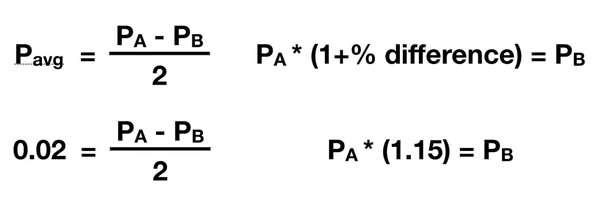
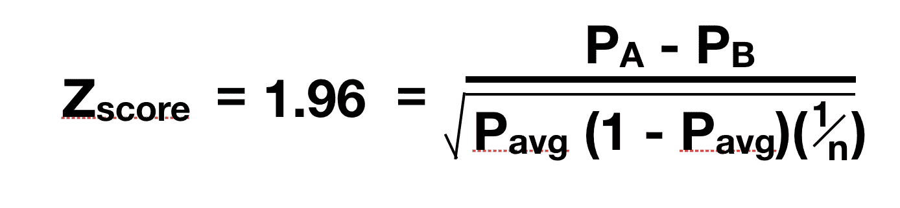
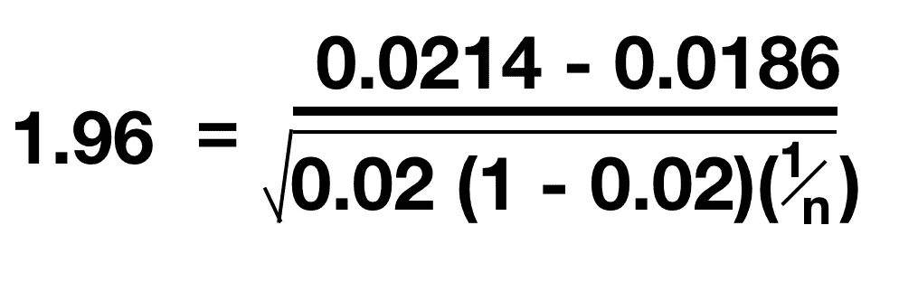

# 我的测试需要多少样本？

> 原文：<https://towardsdatascience.com/how-many-samples-do-i-need-in-my-test-db14e668289?source=collection_archive---------20----------------------->

## 计算二项式测试的最小测试规模需要知道什么，以及如何计算

在我熟悉假设检验的来龙去脉时，我没能找到一个简单问题的直接答案:当实现 A/B 检验时，你需要多大的检验规模？

这个看似简单的问题很难回答，原因有很多。

## 无效假设可能是真的

对于大多数测试来说，人们都希望证明另一个假设，而不是零假设。人们希望发现他们应用的治疗具有某种效果)。

如果替代假设是真的，但测试规模太小，你可能会错误地认为你不能反驳零假设。随着否定零假设的议程，不断增加样本量直到各组出现统计差异是有意义的。然而，如果处理 A 和 B 在统计学上没有差异，你可以永远增加样本量，这不会改变结果。任何样本量都会告诉你零假设是不能被证伪的。

An A/B test in which the results may be so similar that any difference between them is likely due to random chance.

想一想布尔迪安的驴的悖论:当一头驴又饿又渴时，它被放在食物和水之间。在这个有争议的悖论中，驴因为无法决定是吃还是喝而死于饥渴。

如果我们暂停这个悖论的任何问题，并将其视为对干草(A)或水(B)的需求之间的测试，我们的样本大小为 1(我们的驴),我们的零假设为真(同样饥渴的驴对干草或水的需求没有区别)。

在这种情况下，我们增加多少头驴子(我们的样本量有多大)并不重要——只要驴子同样饥渴，它们中任何一个被选中的比率都会告诉我们，水和干草是同样需要的。即使样本量变得如此之大，以至于我们偶然得到了几头做出选择的驴，这种情况也足够罕见和随机，我们仍然会发现零假设是正确的。

**在测试实施前需要知道结果**

假设替代假设为真，证明零假设为假的最小样本量取决于许多因素，其中许多因素只有在测试后才能知道。

首先是两组之间预期的成功率差异。例如，如果按钮 A 的性能比按钮 B 好 100%,那么通过较小的样本量就可以清楚地看出，按钮之间的差异是基于按钮的性能，而不是随机的。相比之下，如果按钮 A 的表现比按钮 B 好 5%,那么就需要更大的样本量来确定这两个按钮之间确实存在的差异。

The A/B test to the left is likely to have a bigger difference in performance across buttons than the A/B test to the right. As a result the test to the left needs fewer samples to provide statistical confidence in the difference between the buttons.

成功率也决定了需要测试多少样本。例如，如果您正在测量人们点击链接的比率，那么您的样本大小就是您向其显示链接的人数。点击那个链接的人越多，你从测试中得到的有用结果就越多。

如果你在测试中成功的标准是一小部分人可能会做的事情，例如，购物，你将需要更大的样本量来获得相同数量的结果。

接近 0 或 100%的成功率增加了获得统计显著结果所需的样本量，因为它们给你的测试集中的成功(或失败)比例更小。

The likelihood of success for either button A or button B on the test on the left will be higher than that for the test on the right. As a result, the sample size needed for the test on the left would be lower than the sample size for the test on the right.

# 那么你的测试需要多少样本呢？

根据上述问题，这个问题只有在假设替代假设为真的情况下才能得到真正的回答。在测试开始时做出这样的假设是与假设检验的思想相违背的。然而，为了设置一个数字，让我们首先假设替代假设为真(处理 A 的表现不同于处理 B)。

要设置最小测试规模，您需要对以下内容进行估计:

*   A 和 B 的平均**成功率**
*   **A 和 B 之间的百分比差异**

最后，您需要知道您的 **p 值**或您希望在结果中得到的**置信区间**。

# 示例测试

让我们创建一个假设的 A/B 测试来计算最小样本测试大小，这将为我们提供两个样本之间差异的期望置信区间。

在这个测试中，我们向个人发送邮件，希望他们去一个网站。待遇 A 是蓝色信封；治疗 B 是一个绿色信封。在这个测试中，我们还将发送相同数量的绿色信封和蓝色信封。

*   期望的**置信区间= 95%**
*   预期平均成功率= **2%** ( **Pavg** )
*   预期**百分比差异 A 和 B = 15%**

给定 2%的预期成功率和 15%的预期性能差异，那么性能更好的信封(假设蓝色)具有 **2.14%** 成功率( **Pa** )，绿色信封具有 **1.86%** 成功率( **Pb** )。Pa 和 Pb 通过以下等式求解:

为了达到 95%的置信区间，你需要一个至少为 **1.96** 的 **z 值**。在给定置信区间的情况下计算 z 值需要复杂的数学运算，才能找到一部分曲线在正态曲线下的面积。幸运的是，网上有[表格](https://www.ztable.net)告诉你需要的 z 分数。

对于此测试设置，z 分数可计算如下:

其中 n 是发出的信封总数。这是我们试图解决的测试规模。然后，我们可以填入从我们所做的假设中得知的值(Pa、Pb 和 Pavg):

我们现在可以求解 n，发现我们至少需要发送总共 9，604 封邮件(或者每种颜色 4，802 封邮件)。

如果信封颜色表现之间的百分比差异上升，或者如果平均成功率上升，所需的邮寄者数量就会下降。如果对结果的期望信心下降，所需的邮寄者数量也会下降。

# 结论

不幸的现实是，要提前知道所需的测试规模，你需要很多你根本无法知道的信息。幸运的是，如果您正在运行比较按钮点击或登录页面的测试，您可以在早期填写平均成功率和百分比差异，以估计您需要向多少人展示您的测试，以便对您的结果有信心。