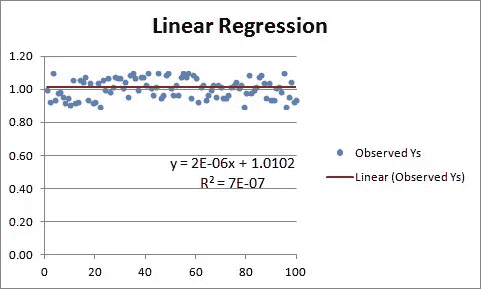
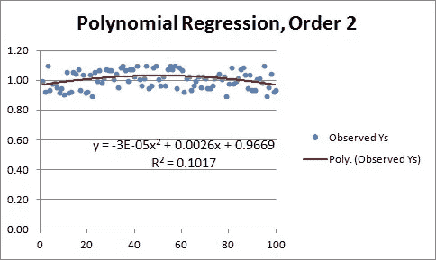
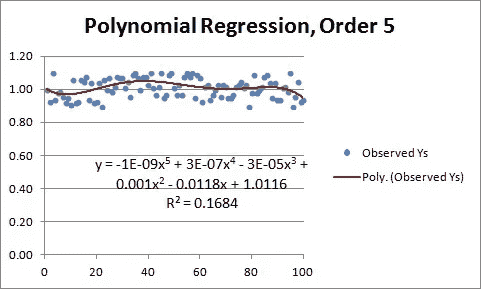
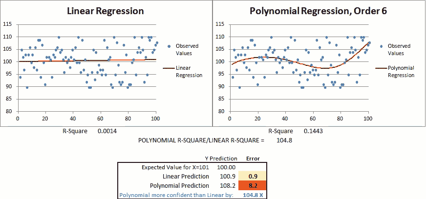
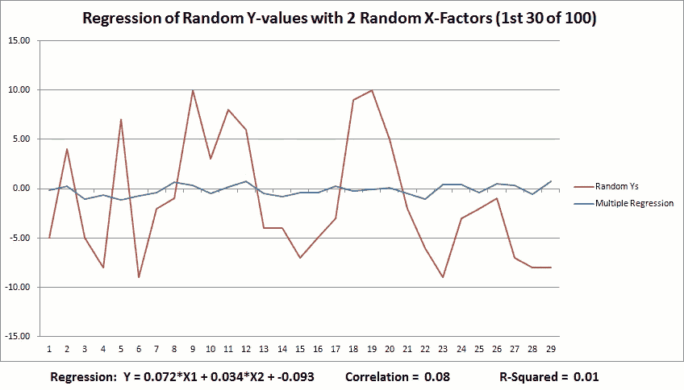
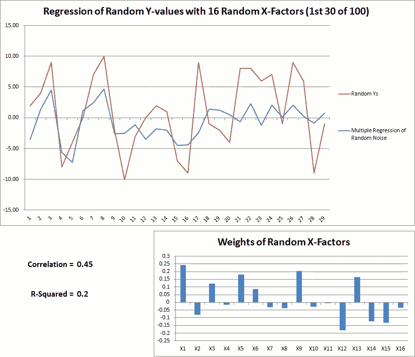
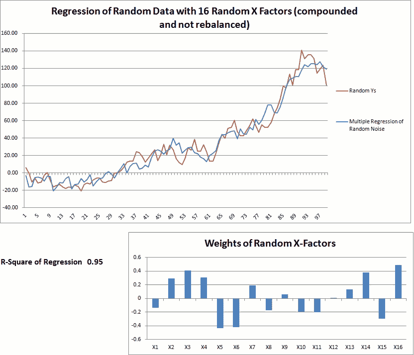
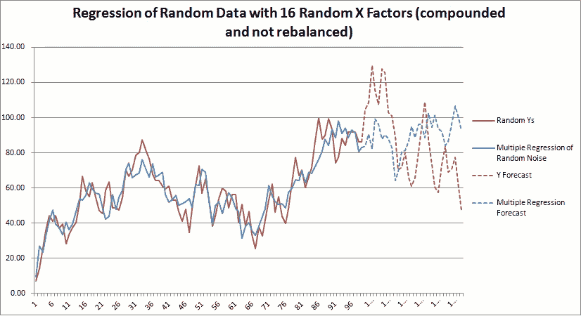

# 市场如何愚弄模型和我们

> 原文：<https://towardsdatascience.com/how-markets-fool-the-models-and-us-e9eb60279899?source=collection_archive---------18----------------------->

Curve Fit Market Data with Caution

数据科学曾经是统计学家、科学家和华尔街定量分析师的领域，但由于数据和开源库的无处不在，我们所有人现在都可以开发强大的预测模型。当然，这些模型也有滋生过度自信的能力，尤其是在数据、模型和随机性比比皆是的股市中。

统计学这门学科旨在帮助我们避免被数据和模型所愚弄，但并不是所有人都有时间和兴趣对统计学进行严格的研究。幸运的是，正如下面的简单模拟所示，通过对随机数据进行算法训练，很容易就能感受到预测模型有多么误导人。

**“被随机性愚弄”——纳西姆·塔勒布**
曲线拟合，或者说寻找最能追踪一系列数据点的函数的过程，并不总是一件坏事。在像国际象棋游戏或人脸和语音识别这样的领域，曲线拟合可能是一种有效的方法，这从根本上讲就是深度学习的神经网络所做的。

但是，当试图通过拟合过去市场数据的模型来预测未来市场行为时，曲线拟合可能会产生危险的误导，因为:

1.  大多数市场活动都是随机噪声。
2.  人们的行为发生了变化，从追逐 2008 年《QE 邮报》的央行行长，到在之前的熊市中遭受损失、决定长期持有现金的投资者。
3.  成功的算法通过反馈回路改变未来的市场行为，使得所有算法的未来永远不确定。像海森堡的不确定性原理一样，如果算法观察到一些有利可图的模式，以低买高卖，他们将通过交易利用这种“阿尔法”，直到价格调整，几乎没有机会剩下(交易中持续发生的阿尔法衰减)。

曲线拟合市场的问题出现在曲线的右边，模型试图预测未来。通过对随机数据应用曲线拟合算法可以很容易地看出这一点，更复杂的模型可以很容易地找到实际上并不存在的因变量和自变量之间的模式和关系，并以高统计置信度做出实际上更容易出错的预测。

**第 1 部分:有一个因变量(Y)和一个自变量(X)的数据集**

让我们从 100 个 Y 值的简单线性回归开始，这些值在 0.9 和 1.1 之间随机选择，预期均值为 1。线性回归的曲线拟合算法找到最接近数据点的直线的斜率和截距。换句话说，它会找到使线预测的 Y 点与观察到的 Y 值之间的误差最小的斜率和截距。

从上图的等式可以看出，红色回归线的斜率几乎为零，截距为 1。但更值得注意的是 R 平方的微小值，它基本上告诉我们，由于 X 的变化而引起的观察到的 y 的变化的比例只有 0.000007。换句话说，微小的 R 平方告诉我们，当 X=101 时，对这个模型预测 Y 的下一个值的能力的信心非常低。​

所以，这不是一个有用的模型，但至少它没有误导我们用它来做预测。

然而，如果我们通过添加指数项或添加更多因子来增加模型的复杂性和解决方案空间，那么算法将能够找到更紧密地跟踪数据的曲线，并且 R 平方将上升。例如，请注意在下一个多项式回归中添加一个 X 平方项如何将 R 平方从 0.000007 显著增加到 0.1017，这表明 Y 中有 10%的可变性是由 X 引起的。

将多项式阶数增加到 5 会进一步将 R 平方增加到 0.1684。如果 Y 和 X 之间存在持续的指数关系，这样的曲线拟合可能不会产生误导，但是这个数据是随机的。

在下面的动画中，您可以看到切换到更复杂的多项式模型如何增加 X=101 时的 Y 预测误差，同时增加预测的可信度，如较高的 R 平方所示:

**第二部分:有多个自变量的数据集** 
现实世界中的大多数现象都是由多个自变量，或者说因素引起的，所以建立多个 *-* 因素模型通常是有意义的。但是增加因素也会增加曲线拟合的风险，因为每个额外的因素都会以指数方式增加模型的解空间，从而增加其找到更好地跟踪观察点的曲线的能力，但不一定是*样本外的*点。在市场存在随机噪音的情况下，这一点尤其正确。

以下动画展示了在对具有高度随机性的数据集进行建模时，为什么要对曲线拟合和模型复杂性保持警惕。在这些模拟中，自变量和因变量被赋予 100 个介于-10 和+10 之间的随机值，预期平均值为 0。然后，执行多重回归，为每个 X 因子生成优化的斜率值，这些斜率(或权重)用于绘制蓝色的多重回归线，旁边是用红色绘制的观察到的 Y 点。

首先，这里有一个最简单的模型，它只对两个独立变量回归 Y。请注意，R 平方往往很低，这表明模型在解释 Y 值的可变性方面做得很差，不应该依赖它们来预测未来的结果。

接下来，独立变量的数量增加到 16，为算法提供了在随机噪声中更大的解空间，以搜索具有更好拟合的曲线，结果 R 平方增加 **:**

**第三部分:曲线拟合价格和复合回报数据** 
曲线拟合价格和复合回报数据集更容易欺骗我们自己。下面的随机 Y 值和 16 个 X 因子被视为回报率和独立复合。然后，复合 Y 值相对于 16 个复合 X 因子进行回归。

这些模型似乎很好地解释了 Y 的可变性，对吗？

当然，由于数据是随机的**,曲线拟合算法只是在噪声中寻找将来不会重复的模式。**下面的数据在样本内训练数据之外延伸了 30 个点，这表明这些曲线拟合模型对于解释样本外数据是多么的没有价值:

希望这有助于强调随机性欺骗算法和我们是多么容易。对我来说，上述预测最令人清醒的一面是，许多市场活动也是随机噪声，这意味着当用实际市场数据进行回溯测试时，我们也可以轻易地欺骗自己。

**结论？**

1.  你的市场模型越简单越好。
2.  当使用市场数据进行回溯测试时，避免对整个数据集进行曲线拟合。
3.  通过在样本内数据上建立模型，然后在样本外数据上测试它们，用一种训练有素的方法进行回溯测试，一旦测试完成，抵制改进你的模型。一旦使用了样本外数据，它就变成了样本内数据，**从那时起对模型或因素的任何额外改进基本上都是曲线拟合**，这可能会降低模型预测未来结果的能力，同时助长对预测的过度自信。
4.  避免天真地使用交叉验证工具，如 Scikit-Learn 的[分层洗牌分割](https://scikit-learn.org/0.15/modules/generated/sklearn.cross_validation.StratifiedShuffleSplit.html)，否则你将最终在所有数据上训练你的模型，产生一个理想的模型——也就是说，如果你能回到过去。
5.  做自己的怀疑者！未来的样本外数据可能会以许多微妙的方式渗入并污染过去的样本内数据，这可能会愚弄模型开发人员，他们没有足够批判性地思考为什么他们的新模型的[夏普比率](https://www.schoolsthatlast.com/efficient-portfolios-pt-1.html)在回溯测试中如此之高。例如，如果您在样本外数据上构建并测试一个多因素模型，您可能会深入了解每个因素在样本外的独立表现。*在开发包含这些因素的其他模型时，你如何避免使用这些样本外的见解？*
6.  人类的智能进化到通过寻找模式来理解现实的复杂性，如果没有我们认知高效的启发式方法，我们甚至很难走过一个房间。但是，像算法一样，我们也在随机噪声中发现模式，并且我们非常擅长合理化为什么我们感知的模式是正确的——所以，再次，扮演你自己的魔鬼代言人，特别是当回溯测试看起来有希望的时候。

Write an algorithm to search for faces in clouds, and if given enough noisy data, it will find them

如果你有任何问题或意见，我很乐意通过 Wade@SchoolsThatLast.com 联系，或者点击[这里](https://www.schoolsthatlast.com/endowments-101.html)了解更多

Wade Vagle，CAIA CFA