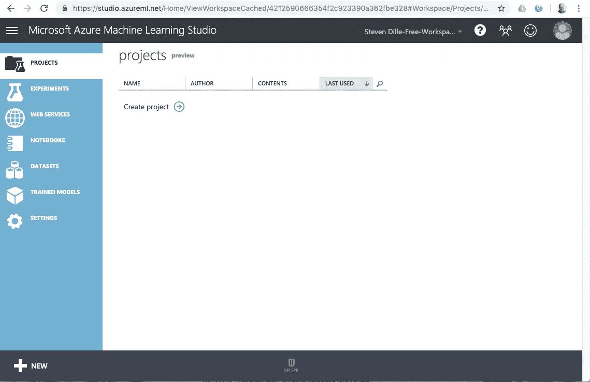
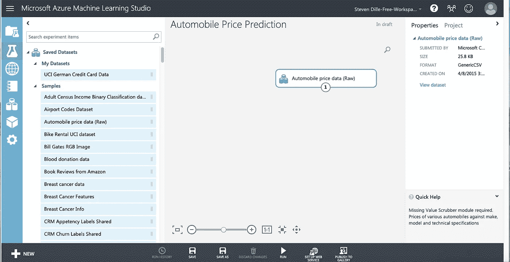
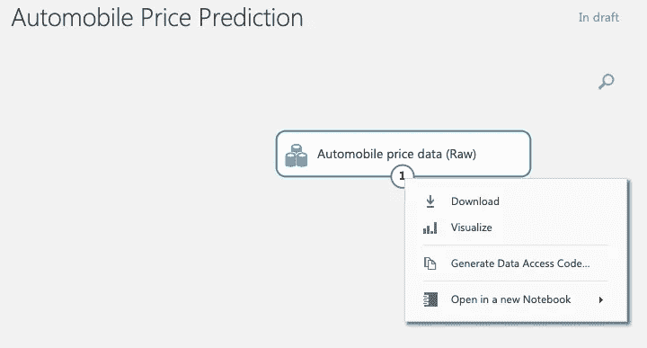
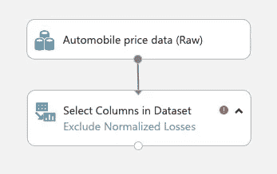
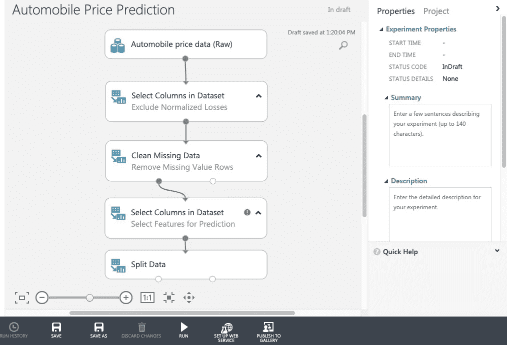
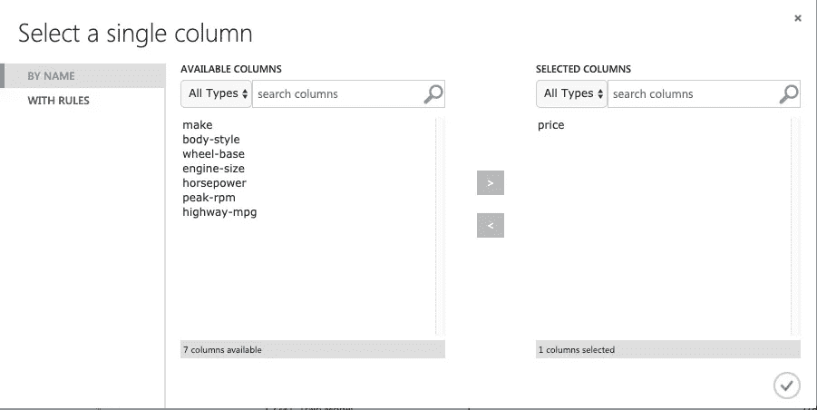
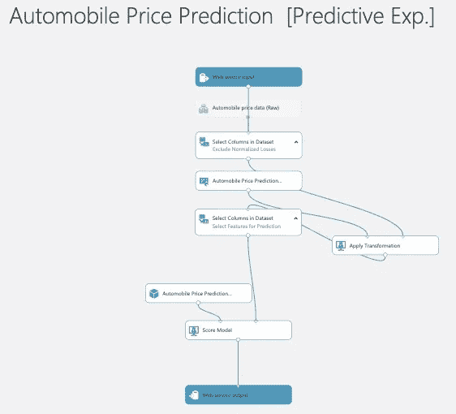

# 微软 Azure 机器学习工作室如何阐明数据科学

> 原文：<https://towardsdatascience.com/how-microsoft-azure-machine-learning-studio-clarifies-data-science-8e8d3e6ed64e?source=collection_archive---------8----------------------->

## 简单易用，但仍需要扎实的数据科学知识

**Two great tastes that taste great together —** Azure model construction + data science knowledge

我一直渴望试驾市场上最近许多针对“公民数据科学家”的工具之一，如 DataRobot、H20 无人驾驶 AI、亚马逊 SageMaker 和微软在云端的新产品 Microsoft Azure Machine Learning Studio(Studio)。这些工具承诺通过简化机器学习模型的构建来加快数据科学项目的价值实现时间。最终，这将允许数据工程师、程序员、业务分析师和其他没有博士学位的人开始在大量建模机会中打拼，这些公司渴望进入这些机会，但由于数据科学技能短缺，他们解决这些问题的能力有限。

所以我开了一个 Azure 账户，花了几个小时用它们的样本数据从头开始构建了几个机器学习模型。我将在这里描述我的经历，向您展示这个工具是多么容易使用，希望其他人能够快速掌握它的优点和缺点。我认为我是进行这项审查的代表性候选人，因为我现在不是一名工作数据科学家。然而，我是加州大学伯克利分校数据科学专业的研究生，拥有计算机科学学位，上过几门研究生级别的统计学和机器学习课程，并且可以用 Python 编程。

让我先说，我真的，真的…比如微软 Azure 机器学习工作室。它使数据科学工作的流程(即构建、测试和部署数据的预测模型)变得更加简单和直观，无论是对于初学者还是更有经验的数据科学用户。Studio 通过可视化地引导您思考数据源、将数据连接到潜在的模型算法候选、进行数据清理和转换、选择功能、训练模型、测试模型、选择最佳模型，甚至将您新的闪亮的工作机器学习模型部署为 Azure 中的 web 服务以供他人使用，来阐明整个过程。最后，您得到了一个可通过 API 访问的工作模型和一个可视化的、文档化的模型表示，供其他人查看和您继续调优。哇！

正如您将看到的，Studio 是如此易于使用，它使得数据科学看起来几乎看似简单。Studio 确实让这个过程变得更简单，但就像 Reese 的花生酱杯子需要两种口味才能做出美国最畅销的糖果(根据尼尔森的数据)，你既需要更简单的模型构建过程(巧克力)，也需要里面的花生酱。花生酱是用于特征确定、模型选择和解释，甚至一些编程技巧(用于更复杂的数据适应)的统计知识的有益补充。

# 我的第一个实验

为了对产品进行测试，我直接跳了进去，并遵循了微软创建模型的一些经过深思熟虑的方法，直到需要时才开始阅读文档。你可以从头开始创建一个机器学习建模实验，或者使用现有的样本实验作为 Azure AI Gallery 的模板。更多信息请参见:[复制示例实验，创建新的机器学习实验。](https://docs.microsoft.com/en-us/azure/machine-learning/studio/sample-experiments)我们将从头开始介绍创建实验的过程。

我的第一个模型实验非常简单，使用了加州大学欧文分校、亚马逊、IMDB 等提供的 39 个数据集之一的数据。这是一个线性回归模型，根据不同的变量(如品牌和技术规格)预测汽车价格。

您在交互式工作区中输入 Studio。要开发预测分析模型，您将使用来自一个或多个来源的数据，通过各种数据操作和统计函数转换和分析该数据，并生成一组结果。用 Studio 开发模型是一个迭代的过程。当您修改各种函数和参数时，您的结果会逐渐收敛，直到您对通过评估其得分结果而得到的经过训练的有效模型感到满意为止。

Azure Machine Learning Studio 具有漂亮的交互性和可视化。您将数据集和分析模块拖放到一个交互式画布上，将它们连接在一起形成一个实验，您可以在 Machine Learning Studio 中运行该实验。要迭代您的模型设计，您可以编辑实验，如果需要，保存一个副本，然后再次运行它。当你准备好了，你可以把你的训练实验转换成预测实验，然后把它作为 Azure web 服务 API 发布，这样你的模型就可以被其他人访问了。

首先，我去了位于 https://studio.azureml.net/[T3 的 Azure 机器学习工作室，在那里我被要求使用微软账户、工作或学校账户登录。登录后，你会看到一个类似这样的主页。](https://studio.azureml.net/)

基本布局显示在左侧的以下选项卡中:

项目——代表单个项目的实验、数据集、笔记本和其他资源的集合

实验-您创建或保存的实验

Web 服务——您从实验中部署的 WEB 服务模型

笔记本—您创建的 Jupyter 笔记本

数据集-您已上传到 Studio 的数据集

训练模型-您在实验中训练并保存的模型

设置—可用于配置您的帐户和资源的设置集合。

在顶层，进行实验并最终将其作为 web 服务发布的推荐工作流如下:

1.  创建模型

*   获取数据
*   准备数据
*   定义特征

2.训练模型

*   选择并应用算法

3.对模型进行评分和测试

*   预测新的汽车汽油价格

4.将模型发布为云服务

# **获取数据**

点击机器学习工作室窗口底部的**+新建**，创建一个新的实验。选择**实验** > **空白实验**，并将该实验命名为汽车价格预测。有许多其他预先构建的实验可以选择，但我选择了这个作为第一眼。

实验画布的左边是一个样本数据集和模块的调色板，您可以对其进行搜索。我选择了标记为**汽车价格数据(原始)**的数据集，然后将该数据集拖到实验画布上。当然，Studio 也支持上传多种格式的数据集。

数据科学家欣赏的一个非常好的功能是能够快速查看数据列和分布，以了解我们正在处理的数据。要查看这些数据的样子，只需点击数据集底部的输出端口，然后选择 **Visualize** 。

数据集和模块的输入和输出端口用小圆圈表示，输入端口在顶部，输出端口在底部。要在实验中创建数据流，需要将一个模块的输出端口连接到另一个模块的输入端口。您可以随时单击数据集或模块的输出端口，查看数据流中该点的数据。

在该数据集中，每行代表一辆汽车，与每辆汽车相关联的变量显示为列。我们将使用特定汽车的变量来预测最右边的列(第 26 列，标题为“价格”)中的价格。请注意给出的每一列的直方图，以及右窗格中数据分布的详细信息。在我用过的其他工具中，这种快速查看似乎更耗时。

# 准备数据

任何有经验的数据科学家都知道，数据集通常需要一些预处理才能进行分析。在这种情况下，各行的列中存在缺失值。需要清除这些缺失值，以便模型能够正确分析数据。我们将删除任何缺少值的行。此外，**normalized-loss**列有很大比例的缺失值，因此我们将从模型中完全排除该列。

Studio 让这个过程变得非常简单。他们提供了一个模块来完全删除**normalized-loss**列(选择数据集中的列),然后我们将添加另一个模块来删除任何丢失数据的行。

首先，我们在左边的搜索栏中键入“选择列”，并将数据集模块中的**选择列拖到画布上。然后，我们将**汽车价格数据(原始)**数据集的输出端口连接到数据集**模块中**选择列的输入端口，只需单击并在两个点之间画一条线。**

通过单击数据集模块中的**选择列，我们**在该模块的**属性**窗格中启动列选择器**。通过使用带有规则**的**并从**所有列**设置开始，通过几个步骤，我们可以排除一个列名，在这种情况下，**归一化损失**列和模块仍将通过所有其他列。Studio 允许您通过输入文本来双击模块添加注释，这样您就可以一目了然地看到该模块在您的实验中做了什么。在这种情况下，我添加了注释“排除正常损失”**

类似地，要删除丢失数据的行，将**清除丢失数据**模块拖到实验画布上，并将其连接到数据集模块中的**选择列。在**属性**窗格中，选择**清洗模式**下的**移除整行**。这些选项指示**清除缺失数据**通过删除有任何缺失值的行来清除数据。然后**双击**模块并输入注释“删除丢失的值行”**

# **定义特征**

定义特性仅仅意味着我们将选择我们将在模型中用来预测价格的列(特性)。定义特征需要实验，因为一些特征比其他特征具有更强的预测能力。一些特征将与其他特征高度相关，因此不会增加模型的预测能力，并且这些特征不应被包括在内以使模型尽可能简洁。一个**简约模型**是一个**模型**，它用尽可能少的预测变量实现了期望的解释或预测水平。

在我们的演练中，我们将继续以微软为例，并假设我们可以预测价格的功能的子集:

{品牌、车身风格、轴距、发动机尺寸、马力、峰值转速、公路里程、价格}

为了添加这些特性，我们将 Dataset 模块中的 **Select 列拖到画布上，并将 **Clean Missing Data** 列的输出连接到其输入。我们**双击**模块并键入**选择预测特征作为我们的描述符**。接下来，在**属性**窗格中点击**启动列**选择器，选择**带规则。**我们可以从**无列**开始，一个接一个地将列名(特性)添加到模型列表中。完成后，单击复选标记(确定)按钮。该模块仅生成我们希望传递给学习算法的那些特征(和相关数据)的过滤数据集，我们将在接下来添加学习算法。**

当你开始钻研文档和背后的数据科学时，这听起来肯定比最佳特性选择的现实和复杂性简单得多。在第一次演练中，我们希望它简单，这样我们就可以体验构建模型的整个流程。但是让我给你一些见解，这样读者就不会认为这很容易，他们应该立即向公司的每个分析师推出 Studio。

随着您更多地使用该产品，您会发现应该使用一些模块来选择功能，并且这应该是清理数据后流程中的一个步骤。Studio 为功能选择提供了以下模块:

*   [基于过滤器的特征选择](https://docs.microsoft.com/en-us/azure/machine-learning/studio-module-reference/filter-based-feature-selection):识别数据集中具有最大预测能力的特征。
*   [Fisher 线性判别分析](https://docs.microsoft.com/en-us/azure/machine-learning/studio-module-reference/fisher-linear-discriminant-analysis):识别特征变量的线性组合，该组合能够最好地将数据分组到单独的类别中。
*   [排列特征重要性](https://docs.microsoft.com/en-us/azure/machine-learning/studio-module-reference/permutation-feature-importance):计算训练模型和测试数据集的特征变量的排列特征重要性分数。

微软提供了这篇关于特性选择模块以及如何使用它们的文章，如果你想了解更多。

[https://docs . Microsoft . com/en-us/azure/machine-learning/studio-module-reference/feature-selection-modules # bkmk _ how to](https://docs.microsoft.com/en-us/azure/machine-learning/studio-module-reference/feature-selection-modules#bkmk_howto)

作为特征选择复杂性如何在建模中发挥作用的真实故事，这里有一个由微软 Data Insight 卓越中心的两位企业架构师完成的特征选择示例。它描述了他们将用于财务预测的 Excel 线性回归模型迁移到 Studio 的过程。他们最终成功地从 Studio 获得了更好的预测，并能够将模型作为 web 服务发布，使其更易于访问——为 Studio 欢呼三声！

[https://docs . Microsoft . com/en-us/azure/machine-learning/studio/linear-regression-in-azure](https://docs.microsoft.com/en-us/azure/machine-learning/studio/linear-regression-in-azure)

但是，请记住，他们需要进行一些学习和调整，了解是使用“在线梯度下降”还是“普通最小二乘法”回归方法，还发现他们需要根据数据集大小调整 L2 正则化权重。他们还描述了他们如何开始使用基于[过滤器的特征选择](https://msdn.microsoft.com/library/azure/918b356b-045c-412b-aa12-94a1d2dad90f/) 来改进他们对初始数据元素的选择，并且他们还打算测试其他算法，如[贝叶斯](https://msdn.microsoft.com/library/azure/ee12de50-2b34-4145-aec0-23e0485da308/)或[增强决策树](https://msdn.microsoft.com/library/azure/0207d252-6c41-4c77-84c3-73bdf1ac5960/)，以便与我们将在下一节讨论的线性回归进行性能比较。即使使用像 Studio 这样简单的工具，也需要时间、测试和数据科学培训才能真正产生最佳结果。

我希望看到的一个改进是 Studio 在自动选择最佳特性方面提供更多的帮助。上面的术语听起来不像公民数据科学家所理解的。我确实发现 Studio 中的一些机器学习算法(在下一节中讨论)确实使用特征选择或维度缩减作为训练过程的一部分。当您使用这些算法时，您可以跳过特征选择过程，让算法决定最佳输入，这是朝着正确方向迈出的一步。但是，对于可能不知道如何最好地选择特征的公民数据科学家来说，知道哪些算法可以做到这一点，哪些算法不能做到这一点，以及实际执行特征选择将是一个困难、耗时的过程。

# **训练模型—选择并应用算法**

现在我们准备训练模型。在这个例子中，我们正在进行所谓的监督机器学习，有许多算法可以提供我们所寻求的预测能力。例如，有一些分类模型可以预测主题行可能属于哪个类别(是汽车还是卡车？)，有回归算法预测一个数值答案(比如未来股价)。MLS 内置了 25 种模型，用于异常检测、分类、回归和聚类，还有许多看似开放的库模块。

因为我们想要预测价格，价格是一个数字，所以我们将使用一个回归算法——在本例中是*线性回归*。

我们通过给一个模型一组数据来训练它，这组数据包括我们想要预测的答案(价格。)该模型扫描数据，寻找汽车功能和价格之间的相关性，并在模型(一个数学方程)中捕捉它们。

Studio 将允许我们通过将数据分成单独的训练和测试数据集，将数据用于训练模型和测试模型。这是通过将 S **plit 数据模块**拖到实验画布并将其连接到数据集模块中的**选择列的输出来完成的。**

点击**分割数据**模块将其选中，将数据分成两部分，如图所示，将 75%的数据用于训练，其余 25%用于评分。

此时，我们应该运行实验，以便数据集中的 S **elect 列和 **Split Data** 模块拥有数据和最新的列定义，以便在我们对模型进行评分时向前传递。这可以通过按下屏幕底部的运行按钮来完成。**

现在是时候添加我们希望使用的学习算法了，方法是展开画布左侧的**机器学习类别**并展开**初始化模型**。选择线性回归模块，并将其拖到画布上。同时找到**火车模型**模块并将其拖到实验画布上。将**线性回归**模块的输出连接到**列车模型**的输入，并将**分割数据**模块的训练数据(左端口)连接到**列车模型**，如图所示。

点击**火车模型**模块，然后点击**属性**窗格中的**启动列选择器**，然后选择**价格**列。**价格**是我们的模型将要预测的值..将**价格**从可用列移至选定列列表。

我们终于可以进行实验了。我们现在有了一个经过训练的回归模型，可以进行价格预测。

# **预测新车价格**

既然我们已经训练了模型，我们可以用它来对其他 25%的数据进行评分，以查看我们的模型运行得有多好。我们通过将**乐谱模型**模块拖到实验画布上，并将**火车模型**的输出连接到它来实现这一点。然后，我们将 S **plit Data** 模块的测试数据输出(右端口)连接到 **Score Model** 模块，如图所示。

现在运行实验，通过点击底部端口并选择**可视化**来查看**分数模型**的输出。预测价格显示在列**评分标签**中，以及模型使用的所有已知特征数据。列**价格**是数据集中的实际已知价格。

**决定我们的模型是否是一个好模型？**

在我们发布任何模型供使用之前，最后一步是测试结果的质量。为此，我们将 E **评估模型**模块拖到画布上，并简单地将其连接到**评分模型**的输出。现在，当您再次运行这个实验时，您将能够可视化统计结果。

我认为这个地区的服务还可以做得更好。为了选择最好的模型，用户将不得不反复运行许多不同的实验，保存结果并比较它们，直到你得到一个最适合的模型。这需要统计学知识，并了解何时使用线性回归、分类、逻辑回归或许多开源算法中的一些，这些算法可能非常适合数据建模。更进一步，如果用户真的是公民数据科学家，他们真的理解如何解释这些结果并在上下文中使用它们来决定最佳模型吗？

在这种情况下，对于每个报告的结果，越小越好，因为这表明预测与数据更加匹配(误差更小)。例外情况是决定系数(也称为 R 的平方),我们试图使其接近 1.0 作为模型精度的指标。这个模型对拟合数据的预测精度是 0 . 91。我很想告诉你这很好，但实际上，答案取决于你的数据，你试图预测的东西，以及错误的后果。为了了解这有多复杂，你可以阅读杜克大学 https://people.duke.edu/~rnau/rsquared.htm.分校的文章。公民数据科学家在这方面需要微软的更多帮助。

# **将模型发布为云服务**

一个非常好的特性是 Studio 让你的模型投入生产变得非常容易。对于我们这些既不是数据工程师也不是 IT 人员，但却擅长在云中发布模型作为 API 供他人使用的人来说，这使得您的工作变得更加容易。

发布模型最简单的方法是使用**设置 Web 服务**按钮，简单地将模型发布为 **web 服务经典**。此选项通过在确定模型的功能和算法后消除模型中的数据拆分、训练和其他不必要的步骤，将模型从实验转换为预测实验。您最后一次运行模型来检查结果，并且您已经准备好使用 API 密钥供其他人在 Azure 上使用。

您可以在此了解有关如何部署模型的更多信息:

 [## 部署一个机器学习工作室 web 服务——Azure Machine Learning Studio

### 如何将训练实验转换为预测实验，为部署做准备，然后将其部署为 Azure…

docs.microsoft.com](https://docs.microsoft.com/en-us/azure/machine-learning/studio/publish-a-machine-learning-web-service) 

# 可扩展性和性能

部署确实提出了我要部署什么的问题—我可以使用哪些硬件资源，我的服务级别保证是什么，是专用云还是多租户云，安全性等..？

Azure 机器学习服务是多租户的，后端使用的计算资源会有所不同，并针对性能和可预测性进行了优化。Studio 可以部署在数据集不超过 10 GB 的免费层，也可以部署在允许使用更多付费资源和 BYO 存储的标准付费层。

 [## 定价-机器学习|微软 Azure

### 查看 Azure Machine Learning 的定价详情，这是一项用于大数据预测分析的云服务。没有前期成本…

azure.microsoft.com](https://azure.microsoft.com/en-us/pricing/details/machine-learning-studio/) 

数据科学中的一个热点问题是使用 GPU 实现非常快的计算性能。我确实看到 Azure 为计算密集型应用程序提供了 GPU，但我没有看到直接为 Studio 指定 GPU 的方法，因为它是一种多租户服务。也许保证所需计算性能的方法是通过标准付费层中的付费 SLA，或者微软可能有其他方法来保证 GPU 访问，这些方法在我的阅读中并不明显。

# **总结**

微软在构建云服务方面做得非常出色，它澄清、简化并确保了构建机器学习模型过程的完整性。他们的过程直观地展示了一种简单明了的获取数据的方法，提供了清理数据和选择模型的工具。Studio 继续要求培训和模型评分，除非正确执行之前的步骤，否则不会让您继续。最终，Studio 甚至使模型作为 web 服务的部署变得更加容易。

但正如我在题目中所说，Studio 并不是让任何人都可以建立机器学习模型的灵丹妙药。机器学习很复杂，仍然需要数据科学知识。用户需要统计知识来理解选择哪种算法，如何选择特性，以及解释哪种模型最适合您的环境的评分结果。此外，为了获得更大的灵活性，可以在清理和转换数据的流程中插入模块，这些模块可以用 R 或 Python 等语言定制..这需要编程技巧。

为了将该产品推向公民数据科学家的下一步，微软必须提供更多内置的数据科学智能。想象一下，如果 Studio 可以查看您的数据和您想要预测的内容，并通过一系列算法运行，尝试不同的功能，对模型进行评分，然后提供具有最佳推荐拟合的模型！这将为用户节省大量时间、精力和成本，并且不需要用户掌握太多的数据科学知识。

我认为 Studio 将很适合许多寻求建立模型的用户，包括公民数据科学家，他们寻求一种带有预建算法的拖放式解决方案，以更高级的企业用户，他们可以将 Studio 工作纳入微软 Azure 机器学习服务的更广泛的生态系统。该服务允许数据科学家在 Python 环境中工作，提供对机器学习算法、部署的更多控制，并支持 PyTorch、TensorFlow 和 scikit-learn 等开源机器学习框架。我期待更多地使用该产品。

# **关于作者**

史蒂夫·迪尔(Steve Dille)是硅谷的产品管理和营销领导者，曾在数据管理、分析、商业智能和大数据领域的公司高管团队中成功完成了 5 次公司收购和 1 次 IPO。最近，他是 SparkPost 的 CMO，在他的帮助下，SparkPost 从一家内部高容量电子邮件发送者转变为领先的预测分析驱动的云电子邮件 API 服务，并从 1300 万美元增长到超过 5000 万美元。他目前正在通过在加州大学伯克利分校攻读信息和数据科学硕士学位，建立数据科学、人工智能和机器学习方面的深厚知识。他过去的学历包括芝加哥大学布斯商学院的 MBA 学位和匹兹堡大学的计算机科学/数学学士学位。他曾在 NCR 担任软件开发人员，在惠普担任产品经理，在赛贝斯(Sybase)担任数据仓库总监，在许多其他初创公司和中型公司担任产品或 CMO 副总裁。