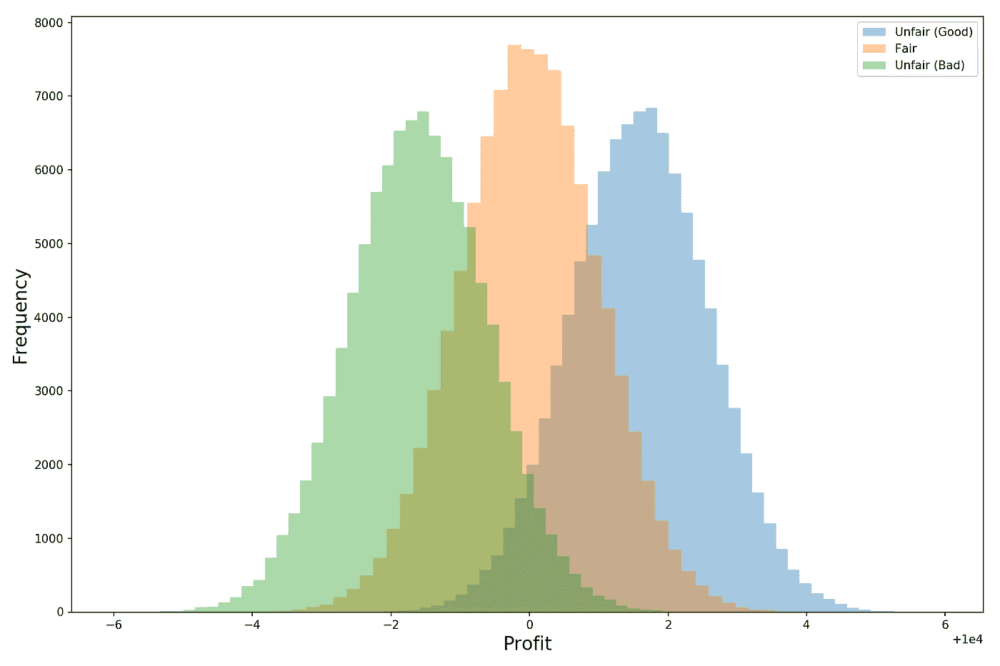
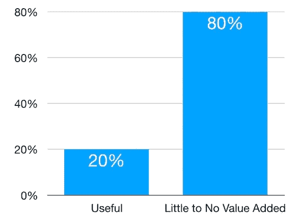
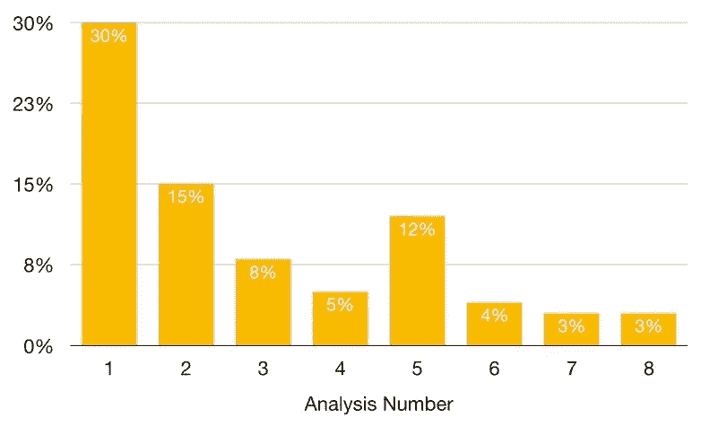

# 多少分析才算多？

> 原文：<https://towardsdatascience.com/how-much-analysis-is-too-much-e1dfc5b37cbb?source=collection_archive---------25----------------------->

Photo by [Jonatan Pie](https://unsplash.com/@r3dmax?utm_source=medium&utm_medium=referral) on [Unsplash](https://unsplash.com?utm_source=medium&utm_medium=referral)

## 不要让你的生产力和决策成为分析瘫痪的牺牲品

我们通常认为更多的分析是一件好事(尤其是随着越来越多的公司加强他们的分析和数据科学能力)。你对一个问题投入的时间和思考越多，你的解决方案就应该越好，越有见地。这在一定程度上是真实的。

但是有两大警告。第一，更多分析的增量价值会迅速下降。虽然我不认为这是白费力气，但你第 30 个小时研究的回报可能会比你第 3 个小时的研究低得多。

第二，当人们甚至整个团队收集越来越多的信息时，他们可能会犹豫不决。这就是通常所说的分析瘫痪，发生这种情况有几个原因:

*   太多的信息(和噪音)和太多试图解读这些信息的人会导致意见不一致，并大大减慢决策过程。
*   “我们不能放过任何一块石头”的想法会让我们陷入无止境的分析和检查。这通常是由偏执的决策者推动的，他们过分强调犯错的可能性和代价。这一点很难打破，因为随着我们做更多的分析，我们仍然觉得我们在努力工作并取得进展(这感觉很好，掩盖了优柔寡断)——但现实是，随着每一项新的分析，我们增加的价值越来越少。

# 怎样才能避免分析麻痹？

那么如何才能避免被数据麻痹呢？虽然这绝不是一份详尽的清单，但每当我试图获取数据、分析数据并最终基于数据做出决定时，以下要点都帮了我很大的忙。

## 1.接受总会有一些不确定性

无论我们做多少分析，总会有一些我们没有检查到的东西。即使我们可以检查一切，生活也不是象棋——结果是随机的，而不是确定的。所以我们唯一能做的就是适应随机性和不确定性。尽管我们尽了最大努力，但有时一切仍取决于硬币的翻转。

但作为分析师和数据科学家，我们的工作是确保我们主要是在投掷不公平的硬币。也就是说，虽然可能存在不确定性，但我们希望机会(或决策)的结果分布向有利于我们的方向转移(就像硬币有超过 50%的机会正面朝上)。因此，我们的分析应该集中在识别一系列机会上，在这些机会上，我们的优势是倾斜的(并且避免那些不利的机会)。

We want the blue distribution (unfair in our favor)

我想重申这一关键点—

> 作为分析师、数据科学家和战略家，我们的工作不是消除风险和不确定性(这是不可能的)；相反，它是识别不对称的风险/回报机会(不公平硬币)并采取行动。

## 2.认识到我们的心理偏见

前景理论是由丹尼尔·卡内曼和阿莫斯·特沃斯基发展起来的行为经济学理论，它告诉我们，一般人感受到的损失的痛苦多于获得的快乐。根据他们的理论，卡尼曼和特沃斯基能够对我们的心理偏见做出一些有趣的观察:

*   对于某些人来说，可能需要 2000 美元的收益来弥补 1000 美元损失的痛苦。这是一个例子，说明一般来说，人们感受到的损失比得到的多。
*   人们**高估了小概率**，比如市场崩盘或飞机失事的风险。
*   人们**会为确定性**(消除所有差异)支付额外费用——例如，人们一般会**更喜欢有** : 100%的机会获得 94 **美元，而不是有 95%的机会获得 100 美元。这在传统经济学意义上是不合理的，因为 A 的期望值为 94 美元，而 B 的期望值更高，为 95 美元(0.95 * 100 美元= 95 美元)。**

因此，前景理论的关键要点之一是，人们会非常努力地避免错误，因为他们:

*   **高估错误的可能性。**
*   比起做出正确决定所带来的回报，他们更害怕犯错误(和遭受损失)的痛苦。
*   **又过分看重不确定性的消除。**

消除这些偏见可能是不可能的，但是知道它们的存在和对我们的影响是很好的第一步。接下来清单上的几项帮助我们减少这些心理偏见的负面影响。

## 3.彻底就可以了；害怕做决定是不对的

有时候，我们发现自己在原地打转，想着，“哦，也许在我决定做什么之前，我应该看看这个。我还想看看另外一件事。我应该看看我的同事是怎么想的。但他们两周后才会回来，所以我想我会在那之前暂不做决定。”

那不是彻底，那是拖延。我们都知道什么时候我们在拖延，即使我们尽最大努力合理化这是可以的。

是什么让我们拖延和磨磨蹭蹭？假设我们不懒(我没有，我发誓！)，那么我们可能会推迟做决定，因为我们害怕犯错(因为上面第 2 项中详述的所有原因)。所以我们需要对自己诚实——如果我们发现对未知(和犯错)的恐惧驱使我们缺乏行动，那么这可能是一个很好的信号，是时候做出选择并继续前进了。

## 4.理解我们决策背后的关键假设(然后重点检查这些假设的有效性)

当我们选择一件东西的时候，我们应该知道我们为什么选择它。更具体地说，我们应该能够识别关键的假设，这些假设对我们来说是正确的。例如，我们可能会认为股票便宜，因为该公司拥有一个快速增长的软件业务，而这个业务被市场上的其他公司忽略了。

因此，在这种情况下，我们的主要假设是，软件业务被其他投资者低估了，它要么将以比所有人预期的更快的速度增长，要么获得比预期高得多的利润率(或者两者兼而有之)。在这种情况下，我们股票投资的成功主要取决于我们对软件业务未来的预测。因此，我们应该将大部分检查集中在软件业务上(以及我们可能如何错误地分析了它)，而在我们认为被市场公平估价的业务的其他方面花费相对较少的时间。

## 5.量化最坏的情况

当任由自己想象时，人们通常会高估事情可能变得有多糟糕。这就是为什么保险公司通常都能盈利。

因此，克服这种偏见的一个方法是尽我们所能量化最坏情况的概率和幅度。如果我们能够对事情会变得多糟糕做出合理的估计，那么我们就可以理性地决定我们应该对最坏的情况担心多少。我们可能会发现，最糟糕的情况并没有那么糟糕，我们是在杞人忧天。

如果我们发现损失的幅度或概率可能超过我们的承受能力，那么要么我们根本不应该前进，要么我们应该找到一种方法来对冲一些风险。

我要提醒你，估计最坏的情况并不容易。例如，用纯粹的历史数据创造的最坏情况应该以怀疑的态度看待——在 2007 年和 2008 年，历史数据告诉我们房地产市场永远不会崩溃，然后它迅速崩溃了。

## 6.估计额外分析的增量价值

我个人认为，越来越多的分析的附加值遵循帕累托原则，即 80%的收益由 20%的工作产生:

Most of the value is produced by 20% of the work/effort

当然，这并不意味着我们可以只做 20%的工作，然后就到此为止——收益很少是线性增长的。但是这确实意味着**我们应该尝试测量每次分析增加的增量价值的数量**。

这里的**关键词是增量**。无论我们第一次分析选择什么，它都可能增加很多价值，因为我们在开始时知道的很少。然后，随着我们研究和建立更多的模型，它们平均产生的增值越来越少(有一些幸运的突破)。至于我们何时应该停止分析并开始做出决策，没有正确的答案——但重要的是要认识到**就员工每小时产生的价值而言，每一次额外的分析都越来越昂贵**。

Illustrative example of incremental value produced by additional analyses

## 7.认识到大多数决策只是一个正在进行的迭代过程中的一步(失败可以也应该从中吸取教训)

最后，它有助于保持全局观念。很少有决定是最终的(除非你真的在赌这家公司)。我们做一些分析来告知我们的决定，根据我们对数据的阅读做出选择，从结果中学习，然后重新开始这个过程。

伟大的组织不是一个成败决定的起源。

> 相反，它们是一个又一个好的决定混合在一起的结果，同时经受住不可避免的错误选择和失败，并从中吸取教训。

# 感谢阅读！

我希望你觉得这是令人愉快的和有见地的。干杯！

***更多数据科学与商业相关岗位由我:***

[*数据科学家的商业战略*](/business-strategy-for-data-scientists-25e3ca0af5ee)

[*数据科学家的商业策略:品牌估值*](/business-strategy-for-data-scientists-brand-valuation-daf4ec862399)

[*用 Python 进行业务模拟*](/business-simulations-with-python-a70d6cba92c8)

[*了解 PCA*](/understanding-pca-fae3e243731d?source=post_page---------------------------)

[*理解贝叶斯定理*](/understanding-bayes-theorem-7e31b8434d4b)

[*理解朴素贝叶斯分类器*](/understanding-the-naive-bayes-classifier-16b6ee03ff7b)