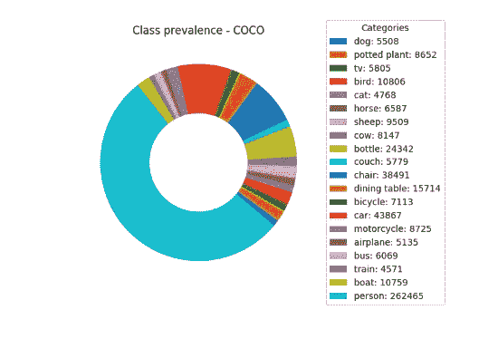
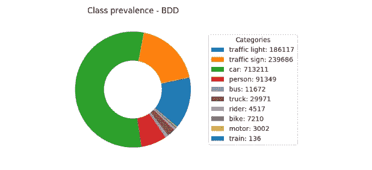
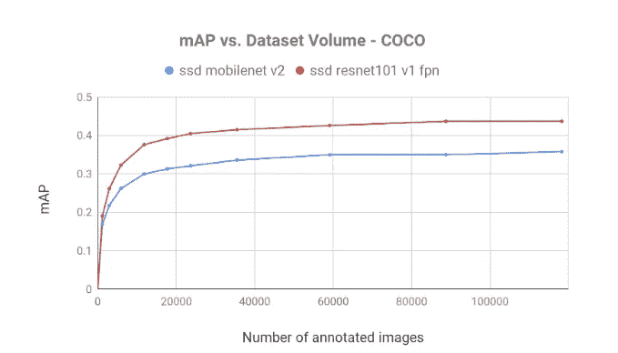
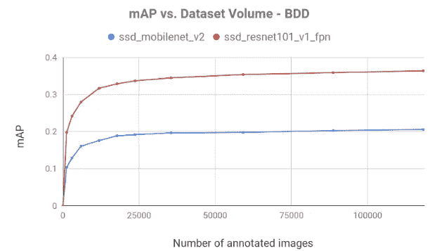
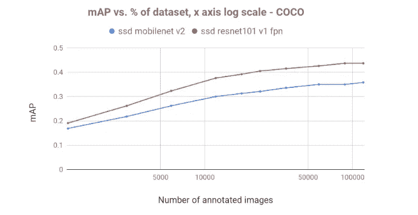
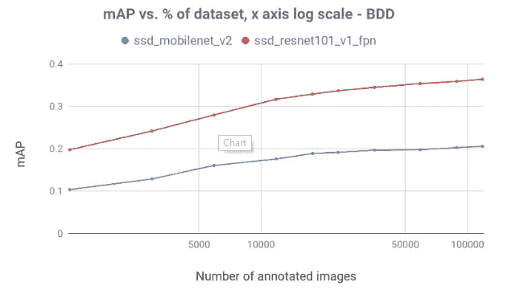
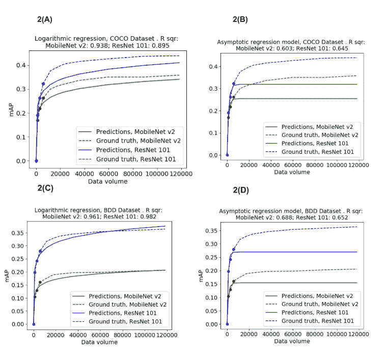
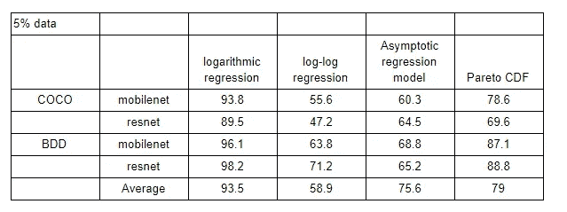

# 你真正需要多少数据？

> 原文：<https://towardsdatascience.com/how-much-data-do-you-really-need-8c02a59394b?source=collection_archive---------22----------------------->

## 现实世界中的数据科学

# 量化注释数据的收益递减

*作者:*[*Gal Hyams*](https://il.linkedin.com/in/gal-hyams-2146a662)*[*Dan Malowany*](https://il.linkedin.com/in/dan-malowany-78b2b21)*[*Ariel Biller*](https://il.linkedin.com/in/arielai)*[*Gregory Axler*](https://www.linkedin.com/in/gregory-axler-10b4697)[*allegrock . ai 团队*](https://medium.com/u/7743e9a45144?source=post_page-----8c02a59394b--------------------------------)***

****

**Too Many Cooks in the Kitchen, John Cherry**

**深度学习模型因其对训练数据的无尽胃口而臭名昭著。获取高质量带注释数据的过程会消耗多种资源，主要是现金。随着机器学习项目的进展，数据量不断增长，导致了其他不良后果，例如减慢了所有的研发。因此，经验丰富的项目负责人总是关注其数据集的额外增量所带来的整体性能增益。通常情况下，特别是如果新数据与现有数据相对相似，人们会遇到**收益递减**的现象。**

**收益递减规律表明，当你在生产过程中不断增加越来越多的投入时，实际上产出的增长会逐渐变小。这一现象被 18 世纪的经济学家如[图尔古特](https://socialsciences.mcmaster.ca/econ/ugcm/3ll3/cannan/cannan003.html)和[亚当斯密](http://www.ultimorecurso.org.ar/drupi/files/Adam%20Smith%20%27The%20Wealth%20of%20Nations%27.pdf)所提及，并在 1815 年被英国经济学家[大卫·李嘉图](http://la.utexas.edu/users/hcleaver/368/368RicardoCornLawstable.pdf)所阐述。在处理训练数据量对模型性能的影响时，收益递减规律表明，训练集大小的每次增量对预定的成功度量的贡献将会更小。**

**当项目负责人能够监控甚至量化他们机器学习项目中的收益递减效应时，他们就能够在其整个生命周期中实现更好的控制。比如:估算达到项目目标需要多少数据；避免多余的培训课程；或者甚至预测当前的模型架构是否能够达到目标度量。这种知识有效地为时间、人力和计算资源的优化管理提供了工具。**

# **监控对象检测中的收益递减**

**收益递减的现实是否也适用于物体探测任务？我们决定通过在两个代表性数据集的增量部分上训练检测器来探索这个问题的答案:(1)上下文中的公共对象(COCO)和(2)伯克利深度驱动(BDD)。通过查看相应的验证集，对每个模型进行评估。数据准备是使用[这个脚本](https://github.com/GalAllegroAi/QuantifyDiminishingReturns/blob/master/create_subsets.py)完成的，元数据子集在[这里](https://drive.google.com/drive/folders/1PRlb1iA2rvmiD7gxBpuplEyQuf0gp9C_?usp=sharing)可用。COCO 数据集包含 80 个对象类别，其中一些是稀缺的。当对该数据集的子集进行采样时，稀有类别严重不足，有些甚至根本不存在。**

**因此，我们仅在视觉对象类(VOC)数据集中出现的二十个标签上训练和评估该模型。这些类别是 COCO 中最常见的，相对来说没有贴错标签。从 COCO 训练集中得到的分类流行度和标签图像的样本拼贴如下图所示。**

****

***Figure 1(A): Collage of labeled images from the COCO training set***

****

***Figure 1(B): Class prevalence of the COCO dataset with VOC labels. Counting and visualization were done using* [*this*](https://github.com/GalAllegroAi/QuantifyDiminishingReturns/blob/master/category_prevalence.py)*.***

**在 BDD 数据集上， [*的内容*](https://arxiv.org/abs/1612.03716) 类别，“可驾驶区域”和“车道”被忽略，它们具有不定的空间范围或形状。类别“骑手”被映射到“人员”类别。BDD 训练集的类流行度和标记图像拼贴样本可以在*图 2* 中看到。**

****

***Figure 2(A): Collage of labeled images from the BDD training set***

****

***Figure 2(B): Class prevalence of the BDD dataset. Counting and visualization were done using* [*this*](https://github.com/GalAllegroAi/QuantifyDiminishingReturns/blob/master/category_prevalence.py) *code.***

**单触发检测器(SSD)元架构用于两个流行的主干:MobileNet-v2 和 ResNet101。对训练集的样本进行了训练。结果由每个数据集各自的验证集进行评估。为了模拟迁移学习的常见情况，这两个模型在 [TensorFlow 的检测模型 zoo](https://github.com/tensorflow/models/blob/master/research/object_detection/g3doc/detection_model_zoo.md) 中找到的*开放图像数据集(v4)* 上进行预训练。使用 RMSProp 对基于 MobileNet 的模型进行批量大小为 12 的 200，000 个训练步骤的训练。通过动量优化器对具有 ResNet-101 主干的模型进行批量大小为 4 的 300，000 个训练步骤的训练。**

**在图 3 中，我们可以看到模型实现的映射:**

****

***Figure 3(A): Diminishing returns — mAP as a function of training data volume for COCO dataset. Each point on the graph is the mAP of the validation-set evaluation, with a model trained on the respective training-subset.***

****

***Figure 3(B): Diminishing returns — mAP as a function of training data volume for BDD datasets. Each point on the graph is the mAP of the validation-set evaluation, with a model trained on the respective training-subset.***

**图 3 显示了 mAP 的缓慢增长，展示了附加注释帧的收益递减。在两个模型的两个数据集上，我们观察到 mAP 快速增加，随着数据量的增加而减少。常识表明，收益递减效应出现在大多数数据集和模型中。**

# **预测收益递减**

**预测收益递减效应的能力对于任何深度学习经理的工具箱来说都是一个有价值的补充。它能够在项目的整个生命周期中做出更明智的决策，节省宝贵的资源。一般每个项目的收益递减取决于数据复杂度和模型架构；然而，如上所述，收益递减效应在不同的任务中表现相似。**

**事实上，收益递减模型非常普遍。问题是，普遍的收益递减模型是后验的——它们符合观察到的数据，但很难预测收益递减动态的升级。**

**考虑描述收益递减动态的经典模型—[渐近回归模型](https://www.ibm.com/support/knowledgecenter/en/SSLVMB_24.0.0/spss/tutorials/nlr_asymptotic_regression_advert.html) (ARM):**

**f(x) =a1-a2*et*a3**

**当 *t* 为数据集体积，ai 为学习参数。当提供所有的经验数据时，这个渐近模型非常适合收益递减曲线。尽管如此，在预测图谱演变时，ARM 努力预测基于较小规模实验绘制的后期实验。当没有给定渐近线时，学习模型不能正确地放置它的渐近线。显然这是因为在这个模型中，渐近线直接由参数 *a1* 描述。通常，当函数的渐近线未知时，很难预测其趋势。**

**为了克服这个问题，我们选择了一个非渐近*对数回归*模型:**

**f(x)= x log(a1)+a2**

**该函数很好地预测了正在进行的 mAP 曲线，如图 5 和表 1 所示，并被证明是一个相当有用的经验工具。这个模型实际上接近一个渐近模型，并根据一些早期实验预测收益递减动态。尽管如此，执行对数变换(图 4)显示，地图升级开始时是对数函数，随着数据量的扩大，这种增长变成次对数函数。因此，*对数回归*可能是收益递减预测的有效工具，但其准确性有限。有趣的是，之前提到的深度学习项目中数据量的收益递减被描述为[对数](https://arxiv.org/pdf/1707.02968.pdf)或[亚对数](https://arxiv.org/pdf/1511.02251.pdf)。**

****

***Figure 4(A): mAP as a function of training data volume for BDD datasets. X-axis on log scale.***

****

***Figure 4(B): mAP as a function of training data volume for COCO. X-axis on log scale.***

**对数-对数回归，即 f = x log(log(t))+a，尽管更接近渐近模型，但在预测任务中并不成功(表 1)。尽管对数回归与我们的收益递减经验数据相对吻合，但在缺乏观察的情况下,*帕累托 CDF* 实际上可能会产生更好的预测。在预测收益递减时，由于获取数据的成本，可用的经验数据(设定体积、结果图)通常很少。这通常会导致预测器参数过拟合。仅包含单个可学习参数的 *Pareto CDF* 对这种现象的弹性是模型所能达到的:**

**f(x)=1 — (1/t)x**

**不幸的是，单参数函数除了具有过度拟合弹性的特征之外，还过于死板。事实上，如*表 1* 所述，帕累托 CDF 并不像对数回归那样提供准确的预测。**

****

***Figure 5: mAP elevation prediction, using logarithmic-regression model and asymptotic regression model (ARM), on COCO (figure 2 A-B) and BDD (figure 2 C-D) datasets. The dots on the ground-truth lines represents the mAP/dataset-volume observation available to the fitted model*.**

****

**Table 1: Prediction of diminishing returns dynamics: a survey of the various models, given only 5% of the dataset.**

# **结论**

**从上面的实验中可以清楚地看出，收益递减规律适用于任何深度学习项目，并可能对其产生不利影响。然而，它不可避免的存在也可能被用作[预测工具](https://github.com/GalAllegroAi/QuantifyDiminishingReturns/blob/master/predict_diminishing_returns.ipynb)。至少，监控其效果提供了一种方法来评估项目生命周期的不同阶段需要多少数据，从超参数搜索到模型微调。最后，很明显，预先了解预期的最终模型性能有助于任何架构搜索工作。预测项目的收益递减将有助于节省大量的时间和金钱。**

**欢迎你使用这个 [Jupyter 笔记本](https://github.com/GalAllegroAi/QuantifyDiminishingReturns/blob/master/predict_diminishing_returns.ipynb)来预测你的项目的收益递减，甚至设计和评估新的收益递减模型。**

***以上研究是在深度学习开源实验管理器* [*trains*](https://demoapp.trainsai.io) *中完成的。*你可以在这里找到我们为这个博客[做的培训和评估实验。](https://demoapp.trainsai.io/projects/1257f1e212e44e908fd358aa8c690ea4/experiments)**

# **接下来**

**在我们的下一篇博客中，我们将探索有偏见的数据集，其中类不平衡是突出的。我们将检查处理这种常见疾病的方法:数据集去偏置，专门损失(有人能说是焦点吗？)甚至互补的合成数据。所以[请继续关注](https://medium.com/@allegroai)并在下面的评论中向我们提问。**

***原载于 2019 年 9 月 23 日*[*https://allegro . ai*](https://allegro.ai/blog/quantifying-diminishing-returns/)*。***