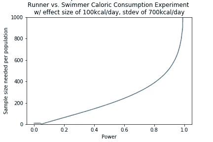

# 多少数据才够？

> 原文：<https://towardsdatascience.com/how-much-data-is-enough-366d5b11ca3c?source=collection_archive---------14----------------------->

## 使用 Python 工具进行实验设计


Photo Credit: [pxhere.com CC0](https://pxhere.com/en/photo/40260)

当你在一个现有的数据集或多个数据集的组合中寻找洞察力时，你必须接受给你的，或者决定出去收集你自己的数据。在第二种情况下，当您还没有数据或者您的数据质量或数量不够高时，下一个问题是:我需要多少数据？

这个问题根据上下文有不同程度的重要性:数据收集有多贵？数据收集需要多长时间？显然，昂贵和/或缓慢的数据收集将使你需要多少数据的问题变得更有争议。如果数据便宜且易于收集，就没有理由不收集或增加额外的缓冲区。在其他场景中，您可能不得不竭尽全力来捍卫您的数据收集计划，并抵抗分析部分数据集的压力。

今天，我们正在考虑一个假设性的问题:“跑步者和游泳者，哪一组吃得更多？”


Photo Credit: [Martin Vorel on librashot.com](https://libreshot.com/runner/) w/ [Public Domain License](https://creativecommons.org/licenses/publicdomain/)

不管你的背景如何，在你开始收集数据之前，你会想知道你需要多少数据来找到一个有统计学意义的结果。这将有助于你计划数据收集、估算成本和获得资金。

既然你已经记住了为什么要做这项工作，那就让我们来看看你需要什么:

*   可接受的**\u\u**——I 类错误的概率(当零假设实际上是正确的时，拒绝零假设)
*   期望的**统计功效** —假设实验治疗产生了效果，检测到效果的可能性。功效= 1- β，其中β是第二类错误的概率(当零假设不正确时，未能拒绝零假设)
*   预期**效果大小**——有两种方法可以考虑预期效果大小:1)如果你已经做了一些初步调查，你可能对效果大小有一个很好的想法，或者 2)你可以考虑在你的环境中有意义或可操作的最小效果大小。例如，两个人群的平均身高相差 0.00001 英寸可能在统计学上是显著的，但实际上并不重要。可能不值得收集足够的数据来检测这么小的影响大小。也许对于你的目的来说，只有 1 英寸的效果尺寸才是有意义和可行的。这将需要非常不同的数据量来实现相同的功率。
*   **总体标准差**——同样，一些初步数据可以帮助你解决这个问题，这些数据来自一项较小的研究、一篇文献综述或你的最佳猜测。这个特性中的任何错误都将影响您最终实验的实际统计能力。对于相同的绝对效应大小，较小的标准差需要更多的数据。

对于我的实验问题，我的研究小组决定如下:

*   可接受= 0.05 —相当标准
*   幂= 0.95 —我真的很想找到一个有统计学意义的结果，如果有的话！
*   达到那个能量的效果大小= 100 千卡/天——我认为 100 千卡/天是一个值得注意的水平，较小的差异对我们的使用并不重要。
*   标准偏差= 700 千卡/天(来自本[研究](https://watermark.silverchair.com/milmed-d-13-00178.pdf?token=AQECAHi208BE49Ooan9kkhW_Ercy7Dm3ZL_9Cf3qfKAc485ysgAAAnMwggJvBgkqhkiG9w0BBwagggJgMIICXAIBADCCAlUGCSqGSIb3DQEHATAeBglghkgBZQMEAS4wEQQMcW3gMERyjU6Rsbu6AgEQgIICJlBVYhwIB2mub_-6qECnLIbjtMmmQ2Y6MuqjEPBojvG4pNXBedk4dBWpSL5uvDL0FcgekfUovcrmZLihvS92tWYfl90a1GvIZBZA1m727AVADcZQfeovgkHagyHC23C5V4G3--SLxsYiS2eyjLwyHIDJr-WOy7aebE-fdrDfPXf_1no737ZkU0d3jL1j9PGxbnZShqsXusD2eG3499GFs4rlINBDMoB3hELoMbJMWdGPpwkzz4YMcwviaZNZJOHr0ns_3XpBGdr9UiiXVoa9lNS6FjIx_j8Ae7xySUxPx0OF9NJHJ5NXr5rsjFC86AU82PoV8COx9ROKfxHa9LOlSlbE9Tcxhu2od5SL8vOKxgqqxfTBuZc3GFDIUIKs5MAN9t2pnX8_GhC3Cl63Zryei_lAgnkDMwVKmYfSB4njn0OZmMeg8K3LLLZ-gpC47brE3loCsCtyeUKs3otzV33AWolOSvf55z8Vc6jKBCLiSFzqFEBuseTltIeFILiM4GxmICivGk_v-aGyKdX7erA29whncXOXDka0nanzaJ5c-A2lkz6vVD5T8l0Wi6rzlESkXSIT05o3lGYS8mQlzDWs05SYE6iL4pvdLWNSkcB_f5joQ7cF-ykYSqJmdi-0hul_j1tvhv0XnwUD_Ij10IURxZThMv51oP4PJfQmXEqYbHYDqYdIboVey8zSIEbEr7wjyUZrQsconnSjIH3jPufxgeo9gfYWes4)),假设两个群体的总和

一旦你决定了这些输入，你就可以开始计算了。

对于比较两个总体平均值的实验，首先使用您的效应大小来计算标准化效应大小:平均值之差的绝对值除以两组的标准差。

```
effect_size = 100
stdev = 700
standardized_effect_size = effect_size / stdev
```

注意[科恩的 d](https://en.wikipedia.org/wiki/Effect_size#Cohen's_d) 提供了另一种常用的标准化效果大小方法。

您可以使用 python 的`statsmodels.stats.power.tt_solve_power`来求解所需的样本大小，其中 nobs 是来自每个群体的观察值的数量。

```
from statsmodels.stats.power import tt_solve_powertt_solve_power(effect_size=standardized_effect_size, alpha=0.05, power=0.95)Result: 639
```

注意:TT _ 求解 _ 功率( *effect_size=None* ， *nobs=None* ， *alpha=None* ， *power=None* ，*alternative =‘双边’*)将求解四个输入中未提供的任何一个。更多信息参见[文档](https://www.statsmodels.org/dev/generated/statsmodels.stats.power.tt_solve_power.html)。

现在我看到了结果，并考虑到大型研究所需的费用和时间，我将绘制不同功率水平所需的观察次数。

```
from matplotlib import pyplot as plt
import numpy as nppowers = np.linspace(0, 1, 101)
nobs = [tt_solve_power(effect_size=standardized_effect_size, 
                       alpha=0.05, power=power) 
        for power in powers]plt.plot(powers, nobs)
plt.title("Sample Size Needed vs. Power for \nRunner vs. Swimmer Caloric Consumption Experiment \nw/ effect size of 100kcal/day, stdev of 700kcal/day")
plt.ylabel('Sample size needed per population')
plt.xlabel('Power')
plt.ylim((0,1000))
plt.savefig('power_plot.png')
```



理想情况下，我们总是有一个超高的能量和一个超低的阿尔法值，这样我们就可以确信我们的实验结果反映了现实。然而，我们看到，除非数据收集是快速和免费的，或者我们两个群体之间的差异非常大(与合并标准差相比)，否则我们通常需要做出权衡。将经济分析添加到功率分析中，将有助于您和您的团队做出适合您的情况的决策。

快乐实验！


Picture Credit: Mohamed Hassan on [needpics.com](https://www.needpix.com/photo/1300433/finish-line-runner-winner-run-race-man-athlete-sport)

请随意查看 GitHub [回购](https://github.com/allisonhonold/blog_how_much_data)。完全公开:这次没有任何额外的代码。