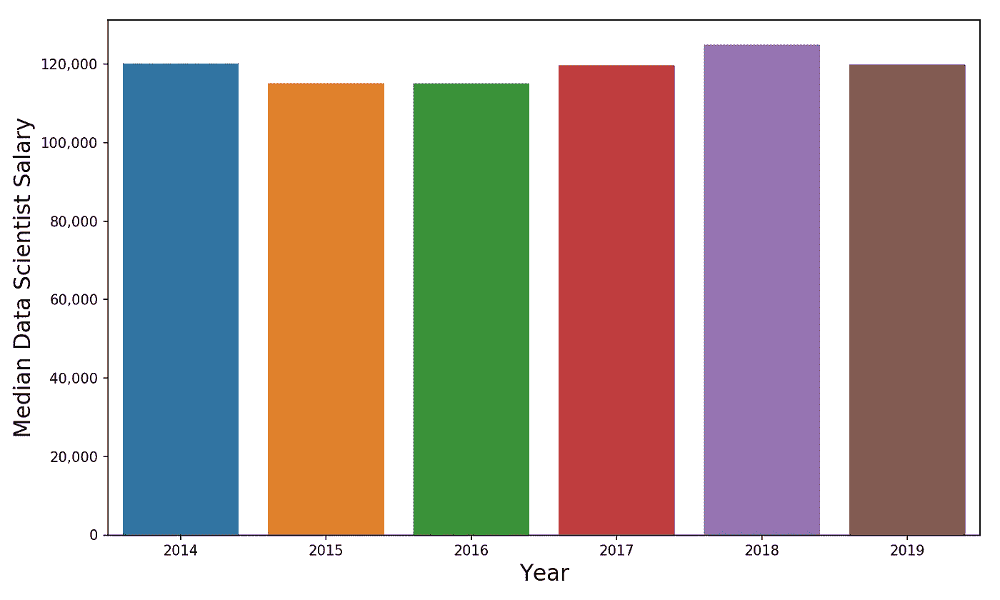
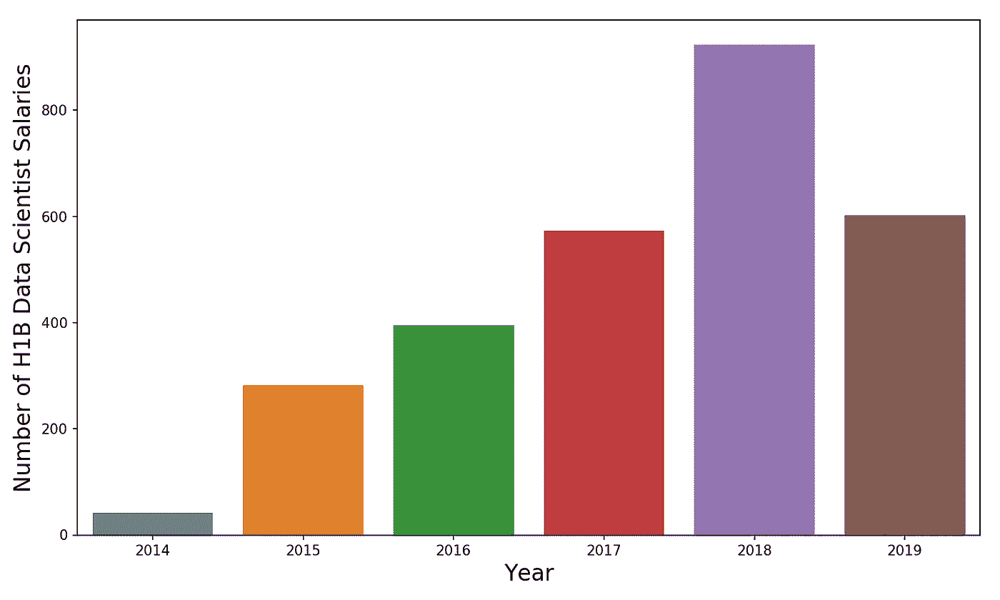
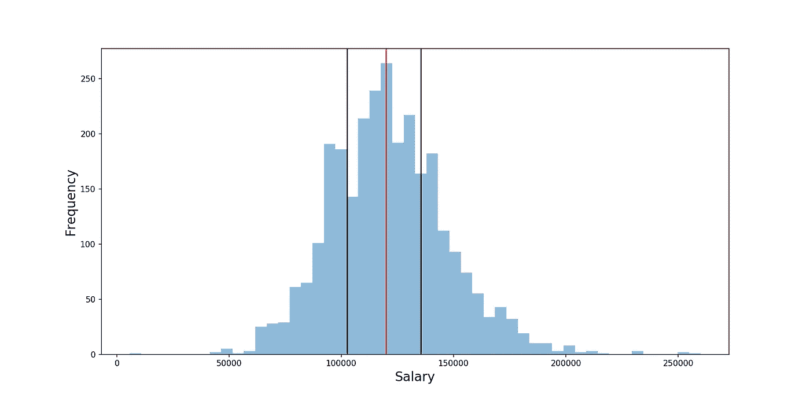
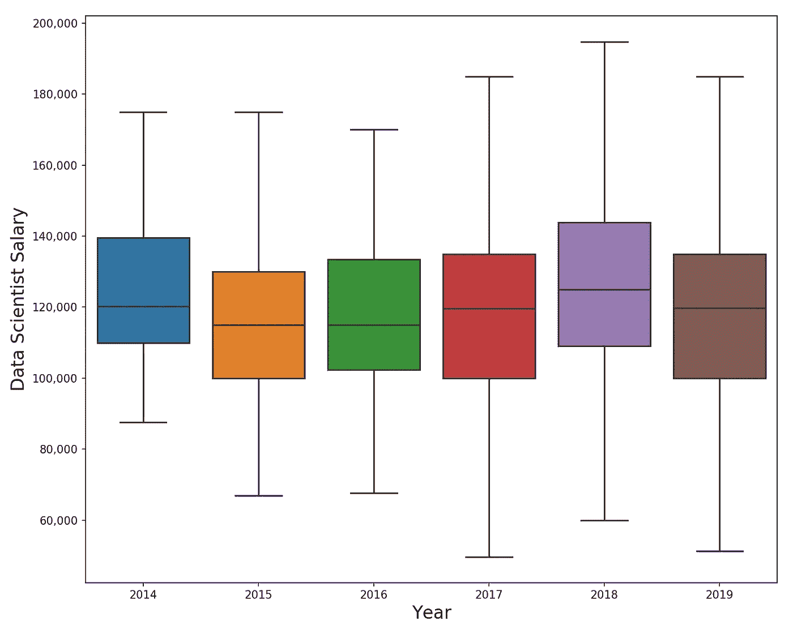
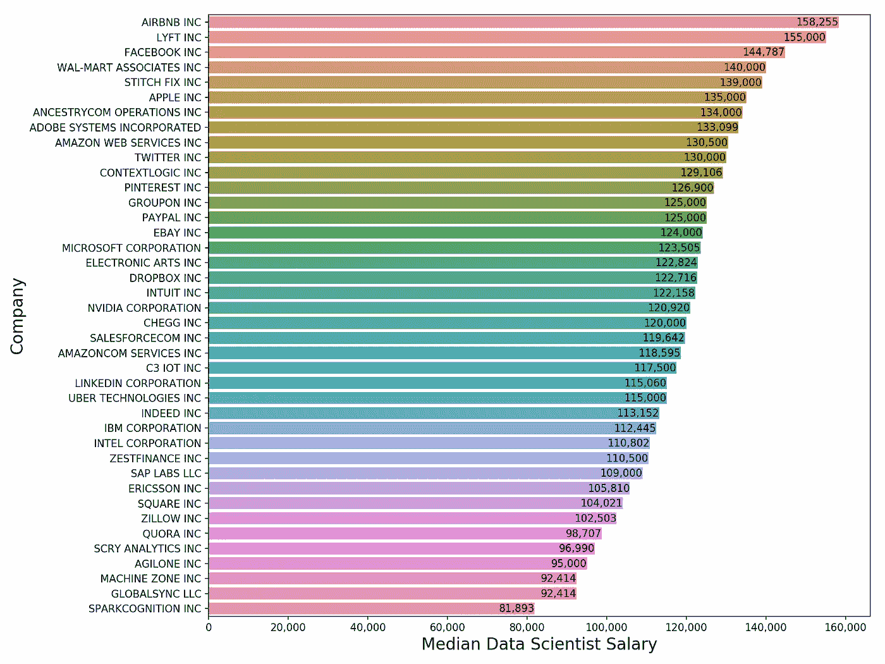
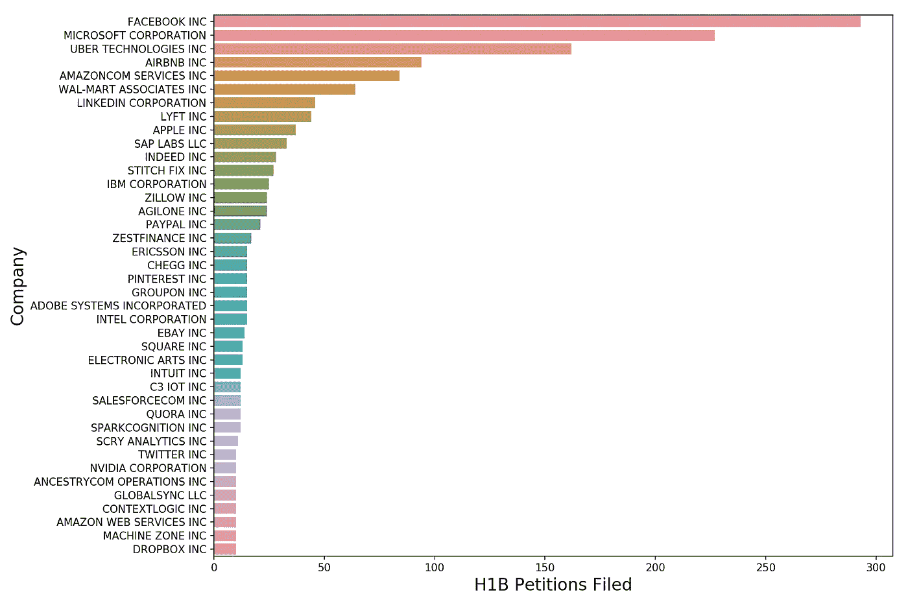

# 数据科学家挣多少钱？

> 原文：<https://towardsdatascience.com/how-much-do-data-scientists-make-cbd7ec2b458?source=collection_archive---------6----------------------->

Photo by [Kevin Ku](https://www.pexels.com/@kevin-ku-92347?utm_content=attributionCopyText&utm_medium=referral&utm_source=pexels) from [Pexels](https://www.pexels.com/photo/coding-computer-data-depth-of-field-577585/?utm_content=attributionCopyText&utm_medium=referral&utm_source=pexels)

## 我们用 H1B 工资数据来探究数据科学家的工资

我最近写了很多关于数据科学行业的文章——既有关于[如何打入](/got-data-science-jobs-552e39d48da2)的，也有关于[分析行业本身是否容易受到它所引领的自动化趋势](/is-the-data-science-profession-at-risk-of-automation-ae162b5f052f)的影响。

今天我们将讨论最有趣的话题，**薪酬**。如果数据科学家的市场如此火爆，那么他们的薪酬到底有多少呢？

# 对于不耐烦的人，让我们开门见山吧

在我谈论数据来源和所有这些好东西之前，让我先告诉你一些数字。就我个人而言，我讨厌和老板开会讨论我的加薪和奖金，但是接下来的 30 分钟我们会讨论其他事情——说重点！这就是:

Median Data Scientist Salary by Year

**所有年份的工资中位数是 12 万美元。**正如你从上面的图表中看到的，当我们按年细分时，趋势非常平缓，稳定在 120，000 美元左右。请记住，这个中位数只是基本工资，不包括现金奖金，股权和福利。因此，数据科学家的总薪酬中值很可能要高得多。

在我们探索数据的更多趋势之前，让我们先弄清楚我们到底在看什么。

# 数据是从哪里来的？

**我从这个牛逼的网站** **上得到了我的工资数据** [**这个网站索引了劳工部(DOL)的劳动条件申请(LCA)数据。**基本上，当公司打算雇用需要 H1B 签证担保的员工时，他们需要在提交 H1B 签证申请之前向劳工部提交 LCA。**此 LCA 包含所有人都可以公开获得的公司、工资和职位数据。**](https://h1bdata.info/index.php)

我在网上搜集了上述网站(如果你想自己动手， [**你可以在我的 GitHub**](https://github.com/yiuhyuk/ds_salary_h1b) 上找到我的代码)以下地区数据科学家的工资数据(抱歉，我把重点放在美国西海岸，因为那是我生活和工作的地方):

*   旧金山湾区(旧金山、圣何塞、库比蒂诺、山景城、帕洛阿尔托等。)
*   西雅图(包括微软的雷德蒙)
*   奥斯汀
*   洛杉矶(包括圣莫尼卡)

此外，我将分析的重点放在了被聘为数据科学家的员工身上。因此，该分析不包括更有经验的数据科学职位，如高级数据科学家或员工数据科学家，也不包括数据分析师。

在所有这些自我强加的过滤之后，我最终得到了 2818 个观察结果。

最后，**请注意，这是 H1B 相关的薪资数据，因此，我在分析中使用的薪资数据不包括美国公民的收入。**由于我没有看到任何相反的证据，我将假设美国公民数据科学家和持有绿卡的数据科学家的数据遵循 H1B 数据中相同的一般趋势。

# 越来越多的数据科学家被雇佣

好消息是，在过去的 5 年里，数据科学家的雇佣人数大幅上升。请注意，当我在 8 月份写这篇文章时，2019 年还有一段路要走，因此在最后有一个较短的专栏(棕色)。

Number of Data Scientists Hired (H1B) by Year (2019 Still Ongoing)

虽然数据科学现在绝对是一个时髦的职业，但我个人认为，过去几年数据科学家的增加也反映了另一个因素——许多公司都试图赶上大数据和人工智能的潮流。因此，这些公司以前被称为决策分析或研究的团队正在被重新命名为数据科学。因此，几年前被称为研究分析师的角色现在被称为数据科学家。

不过，我不认为这有什么不对。**数据科学家的头衔并不神圣——如果你以一种有见地的方式应用定量数据来帮助你的组织做出更好的决策，那么在我看来，你就是数据科学从业者！**

但是请记住，并不是所有的数据科学工作都是平等的。数据科学家头衔的过度使用意味着，A 公司的数据科学家可能会将 80%的时间花在 SQL 上，而 B 公司的数据科学家会花一整天的时间用 Python 实现机器学习算法。不管合理与否，这可能是数据科学家的工资表现出如此高的差异的原因之一(其他明显的原因是经验年限、雇佣地点、公司的平均工资水平以及员工是否有高等学位)。

让我们通过柱状图来看看工资的分布情况。由于这些数据在不同年份之间差别不大，我在下面的柱状图中绘制了所有 5 年的数据。两条黑线显示的是**第 25 位(102，600 美元)**和**第 75 位(135，475 美元)**，红线显示的是**中位数(120，000 美元)**。

Data Science Salary Histogram, Black Lines are 25th and 75th Percentiles, Red Line is Median

如果我告诉你这些年来工资分布变化不大，你可能不相信，我们可以用一个箱线图来比较不同年份的工资分布:

Box Plot of Data Scientist Salary by Year

作为参考，2015 年，薪酬四分位界限为:

*   **第 25 百分位:10 万美元**
*   **第 50 百分位:11.5 万美元**
*   **第 75 百分位:13 万美元**

目前在 2019 年，同样的四分位界限是:

*   **第 25 百分位:10 万美元**
*   **第 50 百分位:119850 美元**
*   **第 75 百分位:13.5 万美元**

因此，工资确实有所上升，但幅度不大。此外，在撰写本文时，**2019 年数据科学家的工资与 2018 年相比有所下降。**

# 谁付的钱最多？

那么，你去哪里得到大笔的钱呢？这是一张按公司从高到低排列的数据科学家工资中位数的图表。在这张图表中，我只包括了在我的样本期内雇佣了 10 名或更多数据科学家的公司——如果我向你展示一家雇佣了一名孤独的数据科学家的公司，即使他或她挣 20 万美元，也没有多大帮助。

你会发现最常见的嫌疑人——AirBnB、Lyft、脸书、苹果都支付了 13.5 万美元或更多。你也有一些惊喜。谁知道 Ancestry.com 是数据科学家的主要高薪雇主呢(我也没想到沃尔玛会名列前茅——我一直认为低低的价格意味着低低的薪水)？

Where You Should Go to Get the Big Bucks

如果你感兴趣，我在下面的图表中画出了数据科学家**的最大雇主**(提交 H1B 申请最多的雇主)。不出所料，你的顶端是大型科技股。我的列表中有一个明显的遗漏是谷歌。不管出于什么原因，它们在数据科学家的数据库中并不常见。这可能是谷歌使用的标题不同——我将在未来对此进行更多的调查。

Who Hires the Most?

# 直到下次

我希望这是有益的。虽然这不是一个完整的画面，因为这只是基于 H1B 数据，但我得到的数字与我听说的以及在薪资聚合网站如 [Paysa](https://www.paysa.com/salaries/data-scientist--san-francisco,-ca--tl) 上看到的非常吻合。

在某个时候，我将进行第 2 部分，在那里我将更深入地研究数据，并为其他与数据相关的角色(如数据工程师和数据分析师)引入数字。我还会调查公司内部的趋势——例如，随着时间的推移，脸书是否会给数据科学家越来越多的报酬？

在那之前，干杯！

**来源:**[https://h1bdata.info/index.php](https://h1bdata.info/index.php)

***在这里阅读本系列的第二部分:***

[*数据科学家赚多少钱第二部*](/how-much-do-data-scientists-make-part-2-cb959a0d05f)

***更多数据科学与分析相关帖子由我:***

[*面临自动化风险的数据科学家*](/is-the-data-science-profession-at-risk-of-automation-ae162b5f052f)

[*拿到了数据科学的工作？*](/got-data-science-jobs-552e39d48da2)

[*了解 PCA*](/understanding-pca-fae3e243731d?source=post_page---------------------------)

[*了解随机森林*](/understanding-random-forest-58381e0602d2?source=post_page---------------------------)

[*理解神经网络*](/understanding-neural-networks-19020b758230?source=post_page---------------------------)

[*趣味与二项分布*](/fun-with-the-binomial-distribution-96a5ecabf65b)