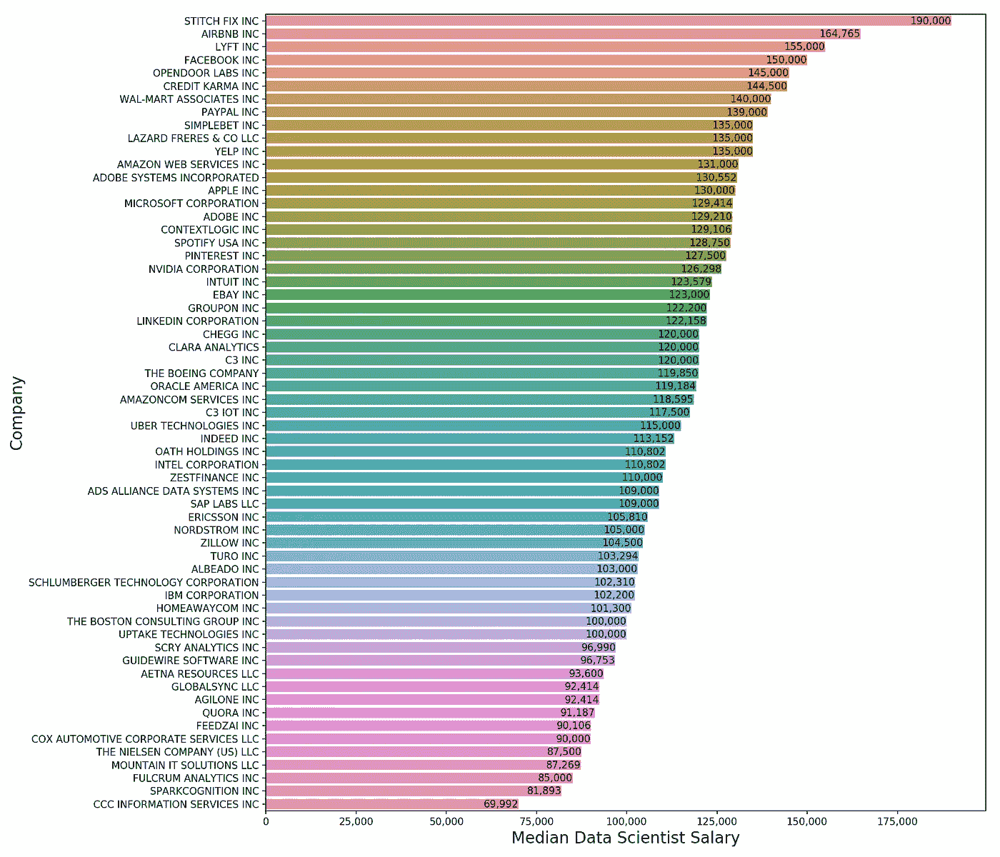

# 数据科学家挣多少钱第二部分

> 原文：<https://towardsdatascience.com/how-much-do-data-scientists-make-part-2-cb959a0d05f?source=collection_archive---------8----------------------->

Photo by [Lukas](https://www.pexels.com/@goumbik?utm_content=attributionCopyText&utm_medium=referral&utm_source=pexels) from [Pexels](https://www.pexels.com/photo/computer-data-display-documents-577210/?utm_content=attributionCopyText&utm_medium=referral&utm_source=pexels)

## 当我们深入挖掘时，我们发现了一些令人惊讶的趋势

L [上次我们用 H1B 的薪资数据探讨了一般数据科学家的薪资趋势(数据详情请参考我之前的博文)。](/how-much-do-data-scientists-make-cbd7ec2b458)以下是我们发现的快速回顾:

*   我们发现数据科学家基本工资的中位数是 12 万美元(不包括奖金和股权)。
*   工资中位数几乎没有逐年增长。
*   最大的科技公司通常支付最多。

Median Data Scientist Salary by Year

# 深入挖掘揭示了两个潜在趋势

上次我没有足够的时间深入研究这些数字。但是在对事情进行了更详细的研究后，我发现了一些令人惊讶的趋势。

首先，过去几年数据科学平均工资的普遍停滞实际上是两个趋势的故事:

1.  **在“更时尚”的科技公司**(谷歌、脸书、苹果和 Airbnb 等家喻户晓的名字，以及 Stitch Fix 和 Opendoor 等较小的公司)**中，数据科学家的薪水正在大幅增长。**
2.  对于我样本中的其他公司(如 IBM、思科、甲骨文、波音、诺德斯特龙、斯伦贝谢等公司。)，工资中位数实际上略有下降。

我意识到我列出的“新潮”科技公司完全是主观的——我的标准是，“顶尖工程学院的普通毕业生会对在那里工作感到兴奋吗？”不管怎样，看看趋势的不同:

Trendy tech raising data science pay, everyone else not so much

我的猜测是，有两组公司——一组有能力从专有数据中产生、收集和提取竞争优势，另一组没有这种能力。因为“富人”可以从他们的数据科学家那里获得更多价值，所以他们也愿意支付更多。与此同时,“穷人”更有可能对他们的数据科学团队没有创造价值感到沮丧，从而导致更低的感知价值(和更高的流动率)。

谷歌和脸书等公司已经证明，收集和利用独特的数据可以创造巨大的竞争优势(这种竞争优势会随着时间的推移而扩大，因为收集了更多的数据和见解)。他们在利用数据科学创造巨额利润方面的成功创造了一个良性的反馈循环，数据和研究创造利润，然后再投资到更多的数据和研究中(从而产生更大的未来利润)。

> 因此，对于有抱负的数据科学家来说，教训是为拥有独特数据类型的公司工作，这种数据类型赋予了他们竞争优势。一家知道如何正确使用这些数据来创造研究和利润的良性循环的公司。

这是最近(2018 年至 2019 年)按公司分列的数据科学家工资中位数。请记住，我们只查看数据科学家职位，我过滤掉了在此期间雇用 5 名或更少数据科学家的公司。

Data scientist salary by company, those Stitch Fixers make a lot!

哇，看看缝针！这是一大笔钱，尤其是当我们记住 19 万美元的中位数只是基本工资，不包括奖金或股票。更普遍的是，处于顶端的公司都是数据驱动的，要么拥有大量的专有数据(AirBnB、Lyft、脸书)，要么正在通过与用户的独特互动来建立这些数据(Stitch Fix、Opendoor)。

最后，在考察不同公司之间的这些差异时，记住这些差异不仅是由每个公司银行账户的相对规模驱动的，也是由角色和所需专业知识的差异驱动的，这是很有帮助的。

# 硅谷数据科学的工资更高(但我们还是买不起这里的房子)

不出所料，旧金山湾区(硅谷)的数据科学家薪酬高于美国其他地区(我所在的“新潮”科技集团的许多公司都位于硅谷)。下图显示的基本工资中位数的差异可能被低估了，因为我主要关注的是西海岸和其他科技中心——中西部和南部的许多低成本城市没有包括在我的分析中。

Silicon Valley firms (orange) pay more

在硅谷工作的数据科学家与在其他地区工作的数据科学家之间的薪酬差距看起来相当显著。但不幸的是，生活成本的差异(由高昂的房价和租金推动)甚至更大。

# 那么作为一名数据科学家，我应该去哪里生活最舒服呢？

赚大钱固然好，但我们需要记住开销也同样重要。如果我们赚了大钱，但最终却向山姆大叔(税收)和我们的房东(房租)支付了更多的钱，那么我们最终可能还是一个净输家。

首先，让我们来看一下数据科学家的工资按地区排列的情况(仅限 2018-19 年的工资):

Data scientists earn more in major coastal cities

正如预期的那样，旧金山湾区在基本工资中位数方面名列前茅。纽约的薪水低于我的预期——可能的原因是，我的数据集没有捕捉到大银行聘用的一些数据科学家(在那里，他们可能被称为量化策略师、风险经理或投资组合顾问)。此外，仅使用基本工资可能会低估大银行聘用的数据科学家的收入能力，因为他们的薪酬在年度现金奖金中占很大比重(100%的奖金并不罕见)。

> 最让我印象深刻的是西雅图。作为一名数据科学家，你的收入几乎和在硅谷一样多，但你不用缴纳州所得税，住房成本也低得多。

让我们用上一个柱状图中的基本工资中值除以每个城市的租金中值(乘以 12 得到年租金),得到一个你的美元能走多远的粗略替代值(我省略了“其他”类别，因为它包括多个城市，但不足以安全地应用全国平均水平)。如果你感到好奇，以下是我使用的月租金中位数([来源于本文](https://www.businessinsider.com/cost-of-one-bedroom-apartment-rent-major-us-cities-2019-6#washington-dc-the-median-asking-price-for-a-one-bedroom-rental-in-washington-dc-is-2347-12)):

*   湾区(硅谷):**:3300 美元**，比文章中的价格略低，以反映旧金山以外的租金略低。
*   西雅图:**2100 美元**
*   纽约市:**$ 2700**
*   洛杉矶:**2400 美元**

下面是基本工资转换成租金等值单位后的样子。回想一下，我将月租金乘以 12，以便按年计算:

Your dollar goes furthest in Seattle

**经房租调整后，你在西雅图的数据科学薪水比其他科技中心高得多。**这是在我们考虑你支付较低税收(没有州所得税记得吗？)也是。所以如果你不介意下雨，可以考虑在亚马逊、微软和星巴克投一两份简历。

最后，让我们来看看这些地区的科技与非科技薪资差距(仅 2018-19 年薪资)。西雅图“时尚”科技公司的平均薪酬也更高，就像湾区(硅谷)一样。纽约的差距尤其大——我的最佳猜测是，纽约的非科技公司支付高额年度奖金，这不会在 H1B 工资数据中显示出来。

In all regions, trendier tech companies pay more

# 结论

在今天结束之前，让我们回顾一下我们数据中的一些关键发现:

*   数据科学家的薪酬数据有两个潜在趋势——“时尚”科技公司的数据科学家薪酬稳步增长，其他公司的薪酬停滞不前(尽管这些公司的薪酬中值仍接近 11 万美元)。
*   看看目前的数据(2018-19)，在“时尚”科技公司工作与在其他公司工作的收入之间有很大的差距(超过 3 万美元)。这种差距也只是基本工资——在考虑奖金、股权和股权表现后，实际差距可能会更大(更时尚的公司拥有更时尚的股票)。
*   西雅图提供非常有竞争力的数据科学薪资，没有州所得税，生活成本相对合理(以租金中位数计算)。你有机会通过经受风雨和寒冷来塑造性格。

希望这是有见地的，对你有用。干杯！

***在这里阅读这个故事的第一部分:***

[*数据科学家挣多少钱？*](/how-much-do-data-scientists-make-cbd7ec2b458)

***更多数据科学与分析相关帖子由我:***

[*数据科学家是做什么的？*](/what-do-data-scientists-do-13526f678129)

[*数据科学家面临自动化的风险吗*](/is-the-data-science-profession-at-risk-of-automation-ae162b5f052f)

[*拿到了数据科学的工作？*](/got-data-science-jobs-552e39d48da2)

[*了解 PCA*](/understanding-pca-fae3e243731d?source=post_page---------------------------)

[*了解随机森林*](/understanding-random-forest-58381e0602d2?source=post_page---------------------------)

[*理解神经网络*](/understanding-neural-networks-19020b758230?source=post_page---------------------------)