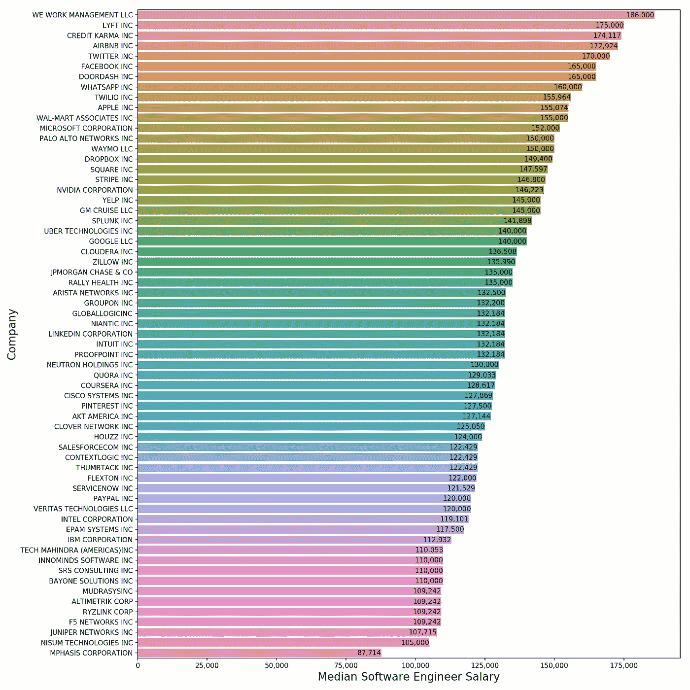
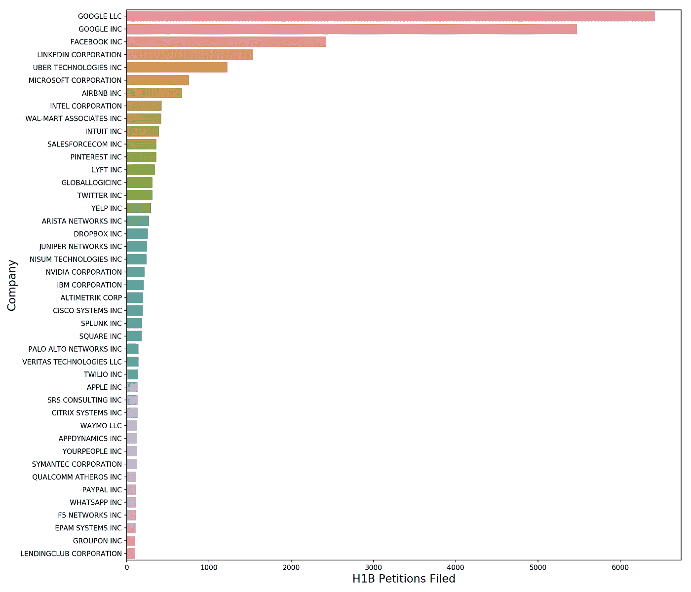
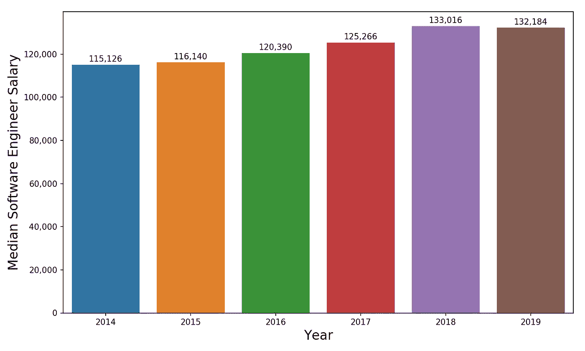
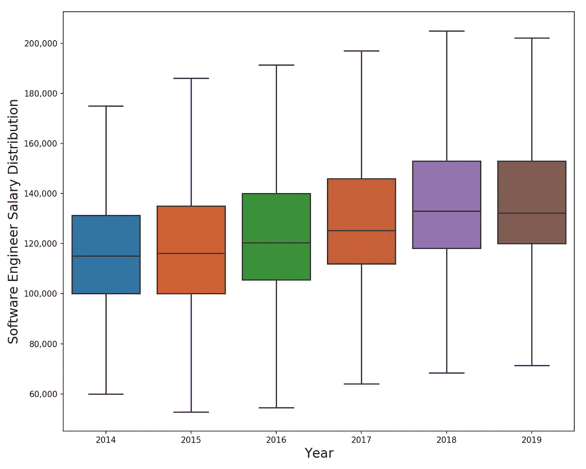
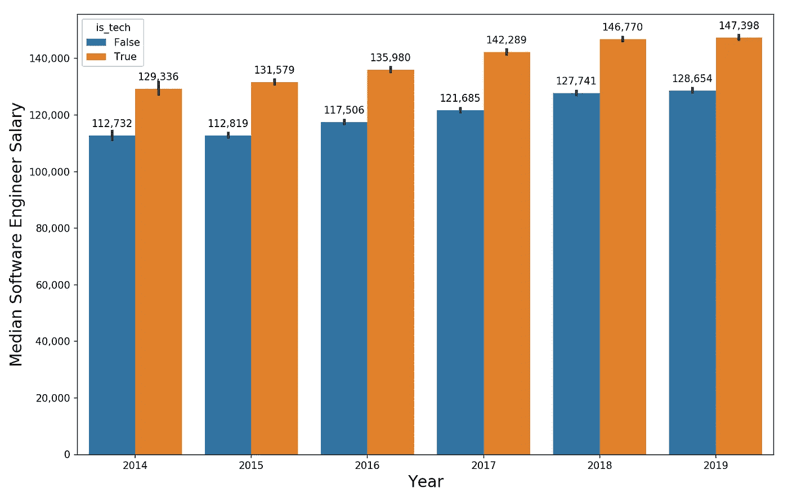
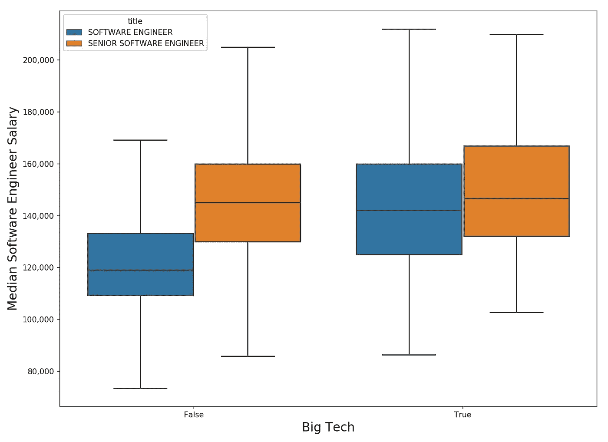

# 软件工程师挣多少钱？

> 原文：<https://towardsdatascience.com/how-much-do-software-engineers-make-60565f50f579?source=collection_archive---------7----------------------->

Photo by [Markus Spiske temporausch.com](https://www.pexels.com/@markusspiske?utm_content=attributionCopyText&utm_medium=referral&utm_source=pexels) from [Pexels](https://www.pexels.com/photo/javascript-screenshot-2004161/?utm_content=attributionCopyText&utm_medium=referral&utm_source=pexels)

## 写代码是目前城里最热门的游戏——让我们看看薪水是否与宣传相符

2012 年，当我搬回硅谷时，我记得曾听说优秀的软件工程师越来越难招到了。大型科技公司正在竭尽全力争夺给最优秀的工程师开巨额支票的特权。

当时，我距离获得莱斯大学的 MBA 学位仅差两年。我最近没有查看统计数据，但在当时，作为一名排名相当不错的 MBA 毕业生(当然，如果你去了哈佛或斯坦福，你会期望更多)，你对 10 万至 11 万美元的基本工资加上适度的奖金相当满意。因此，当我搬回湾区时，我震惊地听说，顶尖计算机科学本科项目的应届毕业生除了获得公司股票或期权的丰厚奖励外，还获得了越来越多的收入。

自那以后的几年里，软件工程师的薪酬只是在大型科技公司(脸书、谷歌、苹果等)赚取巨额利润的推动下上涨的。)，资本从软银这样的非传统风险公司大量涌入创业公司，以及华尔街(在大多数情况下)愿意专注于使命和机会而不是损益表。

今天，我们将使用 H1B 工资数据来探索硅谷软件工程师的基本工资有多高，以及过去几年的趋势如何。我将借用我之前两篇与薪酬相关的文章中的许多方法和代码，您可以在这里找到:

[*数据科学家挣多少钱？*](/how-much-do-data-scientists-make-cbd7ec2b458)

[*数据科学家挣多少钱第二部*](/how-much-do-data-scientists-make-part-2-cb959a0d05f)

希望你喜欢！如果你想用我的代码进行你自己的分析，[你可以在我的 GitHub](https://github.com/yiuhyuk/ds_salary_h1b_swe) 上找到它。

# 他们挣多少钱？

在我们深入研究这些数字之前，让我们先了解一些细节:

*   所有数据都是从 [H1B 工资数据库](https://h1bdata.info/index.php)中抓取的。
*   我只收集了硅谷(旧金山湾区)城镇的数据。
*   我的数据只包括以下两个职位——软件工程师和高级软件工程师。
*   最后，我给出的数字**只是基本工资**，不包括年度奖金、限制性股票单位(rsu)或股票期权。

让我们先把基本数字弄清楚。**2019 年，我发现软件工程师的底薪中位数是 13 万美元。拥有高级软件工程师头衔的人年薪为 14.8 万美元。**

以下是 H1B 数据中软件工程师头衔的 2019 年基本工资四分位数:

*   **第 25 位**百分位数—**【12 万美元**
*   **第 50 个百分位数**—**13 万美元**
*   **第 75 个百分位数**—**15 万美元**

以下是高级软件工程师头衔的相同值:

*   **第 25 个百分位数**—**132，000 美元**
*   **第 50 个百分位数**—**148，000 美元**
*   **第 75 个百分位数**—**164，000 美元**

这些数字很大，我想再次提醒你，这些数字是在年度奖金(如果适用)和股权(绝对适用)之前的。

# 哪些公司工资最高？

上一次，人们对哪些公司向数据科学家支付最高工资颇感兴趣，所以让我们来看看软件工程师的类似图表。为了提醒大家我们在看什么，下表中的值捕捉了 2018 年和 2019 年硅谷软件和高级软件工程师(我把他们都放在一起)在公司中的 H1B 工资中位数。我只标出了在此期间雇佣了至少 30 名 H1B 软件工程师的公司。

Median Software Engineer Salary by Company (2018–19)

有几件事引起了我的注意:

*   在我调查的所有公司中，只有一家公司的薪资中值低于 10 万美元。
*   这份名单上有 14 家公司(都是你应该认识的公司)给他们的软件工程师支付的平均基本工资是 15 万美元或者更多。
*   我们稍后会看到，谷歌是 H1B 软件工程师的最大雇主之一。他们的基本工资中值为 14 万美元，相当可观，但这仅使他们在我们的榜单上排名第 23 位。话说回来，他们可能会以其他方式弥补，比如更高的奖金、大量的股权、高于平均水平的加薪，以及波霸鸡尾酒(主宰他们所有人的一项特殊待遇)。
*   第一是……我们工作！我没想到会这样。话又说回来，他们从风险投资家那里获得了大量资金，并极其努力地将自己塑造成一家科技公司，而不是房地产公司。此外，它们目前的价值为 470 亿美元。无论你有多乐观，都很难指望股票在这些泡沫水平上有很大的上涨(特别是在它继续消耗大量现金的情况下)——所以最近的新员工可能会要求更高的现金薪酬来弥补风险。

但是更重要的是，不管你选择在哪里编码，看起来你都会得到一份相当不错的薪水，

# 过去几年谁雇佣的人最多？

现在我们来看看过去 6 年(2014-19 年)谁雇佣了最多的 H1B 软件工程师:

Who Hired the Most H1B Software Engineers (2014–19)

哇，看看谷歌——他们雇佣的员工数量比其他任何人都多。脸书和 LinkedIn 远远落后于第二名和第三名——在我研究的这段时间里，他们仍然雇佣了几千名软件工程师。

所以看起来谷歌在我的数据集和软件工程师招聘中占据了主导地位。不过，这并不一定会扭曲我的数据。请记住，所有这些公司都在竞相招聘高质量的工程师——没有人会在真空中招聘。因此，谷歌对程序员的兴趣成为了水涨船高(工资)的潮流，其薪酬方案成为了许多薪资谈判中使用的标准基准。有趣的是，这一点得到了证实，正如我经常听到工程师告诉他们的同事，“如果你认为自己的薪酬不够，那就去谷歌(Google)找一份有竞争力的工作。”当然，说起来容易做起来难。

# 过去几年软件工程师的工资趋势

现在我们来看看软件工程师(包括软件工程师和高级软件工程师)的工资中位数在过去几年的趋势如何。从 2014 年到 2019 年(五年一期)，工资增长了 14.8%，相当于年增长率为 2.8%。这并不比通货膨胀高多少(也比硅谷的通货膨胀低很多)。作为比较基准，2014 年斯坦福大学 MBA 毕业生的平均工资为 12.5 万美元，2018 年为 14.2 万美元(4 年增长率为 13.6%，年增长率为 3.2%)。

因此，虽然水平很高，但过去几年的增长率低于我的预期。话说回来，这只是基本工资的增长——薪酬的大部分增长可能发生在股权方面，既可以获得更多股权，也可以提高已获股份的估值。

Software Engineer Median Salary by Year

如果你对 H1B 软件工程师工资的分布趋势感到好奇，下面是箱线图。这没什么太令人震惊的——随着时间的推移，工资的差异保持相对稳定。

Distribution of Software Engineer Median Salary by Year

# 数据中的其他趋势

既然大型科技公司，尤其是谷歌和脸书，在数据中占据主导地位，让我们也来看看不为这些公司工作的软件工程师的薪水。下面的图表用橙色(is_tech=True)显示了大科技软件工程师的工资中位数，用蓝色(is_tech=False)显示了其他人的工资中位数。**我对大型科技公司的定义是为以下公司工作的工程师——谷歌、脸书、微软、优步、AirBnB、Lyft、苹果、网飞和 LinkedIn。**

大型科技公司支付的价格肯定要高得多(这可能不仅仅是因为它们的盈利能力更高，也是因为它们股票的上涨空间更小)。然而，两组的增长率大致相等(5 年期间都在 14%左右)。

Median Software Engineer Salaries for Big Tech (in Orange) and Everyone Else (in Blue)

最后，虽然我不是这方面的专家，但软件工程师的头衔似乎在大型科技公司使用得更广泛——在较小、不太知名的公司被视为高级软件工程师的人，可能是谷歌或脸书的软件工程师。这也许可以解释为什么大型科技软件工程师的薪水和其他人之间存在差距(这体现了更广泛的经验水平)。

在大技术类别中有一些高级软件工程师的工资，所以我们可以通过比较“其他所有人”(X 轴上为假)和大技术(X 轴上为真)类别中的软件工程师和高级软件工程师的工资来检验我的假设:

这似乎证实了我的假设——“其他所有人”类别(左边的蓝色和橙色方框图)的分布重叠比大型科技公司(右边的蓝色和橙色方框图)的分布重叠少得多。因此，看起来“软件工程师”或多或少是一个包罗万象的头衔，涵盖了大型科技公司的各种经验水平和工资级别。

# 结论

随着软件继续“吞噬世界”，颠覆和改变传统行业，软件工程师的技能对于任何想要在这个竞技场上竞争的公司来说都是至关重要的。

数字支持了这一点——虽然增长率比我想象的要低，但程序员的基本工资水平非常令人印象深刻(甚至不要说软件工程师年复一年赚了多少钱)。

这是否可持续是另一个时代的故事(对世界上的谷歌来说是这样，对世界上的 WeWorks 和 Ubers 来说可能不是这样)。我希望这对你有所帮助和启发。干杯！

***更多数据科学、职业、教育相关岗位由我:***

[*数据科学家是做什么的？*](/what-do-data-scientists-do-13526f678129)

[*数据科学家面临自动化的风险吗*](/is-the-data-science-profession-at-risk-of-automation-ae162b5f052f)

[*拿到了数据科学的工作？*](/got-data-science-jobs-552e39d48da2)

[*数据科学家挣多少钱？*](/how-much-do-data-scientists-make-cbd7ec2b458)

[*数据科学家赚多少钱第二部*](/how-much-do-data-scientists-make-part-2-cb959a0d05f)

[*技能提升的更好方法*](/a-better-way-to-skill-up-b2e5ee87dd0a)