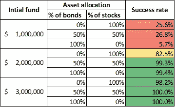
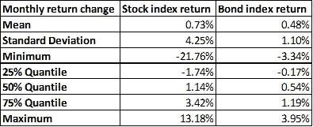

# 根据模拟，30 岁退休需要多少钱

> 原文：<https://towardsdatascience.com/how-much-do-you-need-to-retire-at-age-30-based-on-simulation-424fa9e0922b?source=collection_archive---------26----------------------->

Photo by [Fabian Blank](https://unsplash.com/@blankerwahnsinn?utm_source=medium&utm_medium=referral) on [Unsplash](https://unsplash.com?utm_source=medium&utm_medium=referral)

任何人都有在年轻时辞掉工作，环游世界，同时保持经济独立的梦想。达到这个目标需要多少钱？

在本文中，我们运行了一个统计(蒙特卡罗)模拟来估计基于历史数据的退休投资组合(首先是资产配置)的成功率。

## 假设和策略

让我们考虑一下利亚姆。他存了一些钱，打算在 30 岁时退休。我们将假设他的:

*   预期寿命又是 65 岁。
*   月收入/提现 4000 美元。

他用以下策略投资他的钱:

*   在标准普尔 500 指数和美国债券指数(以先锋总债券指数基金为代表)中分配退休投资组合。
*   最初%的股票和债券将每月进行再平衡。例如，给定 50%股票和 50%债券的初始设置，如果股票市场表现良好，并且他的股票投资组合的价值比债券增加了很多，那么投资组合将通过出售股票和购买债券来重新平衡，以回到最初的 50/50 分割。

利亚姆在未来 65 年面临的经济形势是:

*   股票/债券市场的年度回报率与 1986 年至 2019 年的市场有些相似。为了模拟这种情况，我们随机抽取了四个 15 年的市场周期和一个 5 年的市场周期，总共是 65 年。我们用这些收益来投资他的投资组合。
*   通货膨胀率为每年 3%。所以 Liam 的月收入/提现每年都会以这个速率上去。

## 结果

这个模拟的目标是看看在给定初始资金和资产分配策略的不同组合的情况下，Liam 在余生中保持每月提款的可能性有多大。

我们查看了 9 种不同的场景，并对每种场景进行了 1000 次模拟。成功率是以他的投资组合在整个 65 年中保持在 0 美元以上的次数的百分比来计算的。

*   **30 岁时舒适的提前退休需要 200 万美元左右**

如你所见，在初始资金只有 100 万美元的情况下，利亚姆的成功率很低。所有 200 万美元投资组合的例子都有很高的成功率，值得一试。当利亚姆有 300 万美元时，他可能希望每月提取更多的钱。

*   **资产配置很重要**

事实上，资产配置是投资者根据自己的风险偏好应该做的第一件事。

在模拟中，当利亚姆的钱更少时，即 100 万美元，如果他冒更大的风险——购买更多的股票，他就有更大的成功机会。从长期来看，债券的回报不足以跟上他的提款和通货膨胀。

如下表所示，股票的波动性更大。1986 年至 2019 年的月度股票收益率范围为-21.76%至 13.18%。债券指数的波动范围更窄，为-3.34%至 3.95%。

然而，即使利亚姆将一切都配置到股票中，成功率仍然很低，只有 25.6%。这些成功很可能是牛市中的一些连续的幸运抽奖。

当利亚姆有一笔合理的资金(超过 200 万美元)时，如果他只想维持稳定的提取金额(经通胀调整)，最好投资于债券等更稳定的投资。

## **更多考虑？**

这里讨论的模拟是简化的。在现实生活中，还有很多其他的事情需要考虑。

*   **投资策略或偏好可能会有所不同**

除了股票和债券指数，你还可以投资许多其他资产。你可以进行彻底的分析，自己挑选特定的股票/债券产品。许多人还购买了出租房地产。

还有许多不同的策略，人们试图增加收益或降低风险——购买并持有并不是唯一的策略。

*   **撤军计划可能改变**

在现实生活中，你可能会根据你的投资表现来调整你的提款额度。如果你的投资在一年内下跌 50%，继续同样的撤资计划并不是一个好主意。如果你突然需要一大笔钱，你最好也有一些应急基金。

*   **经济状况可能转变**

与过去相比，债券和股票市场的回报在未来可能会发生变化。一些人认为，由于世界经济增长放缓，股市在未来十年的表现不会那么好。然而，我们 1986 年至 2019 年的时间段确实包括 1987 年 10 月 20%的下跌以及 2000 年和 2008 年的严重熊市。

*   **税务考虑**

这绝对是要考虑的重要因素。由于定期派息较低，股票指数可能优于债券。这将有效地推迟税收。

*   **养老金计划包容性**

许多政府确实有帮助人们退休的社会项目。在加拿大，CPP(加拿大养老金计划)和 OAS(老年保障)是两个通常在 65 岁开始实施的计划。这些也应该包括在退休计划中。