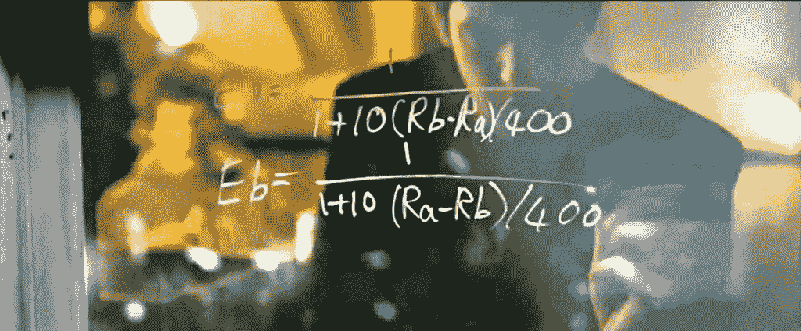
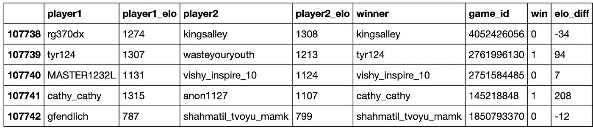
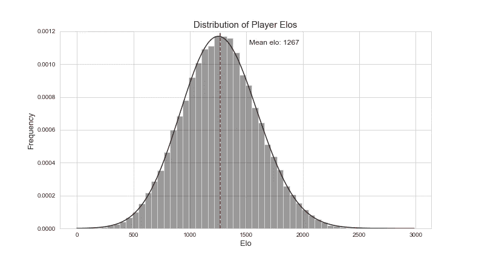
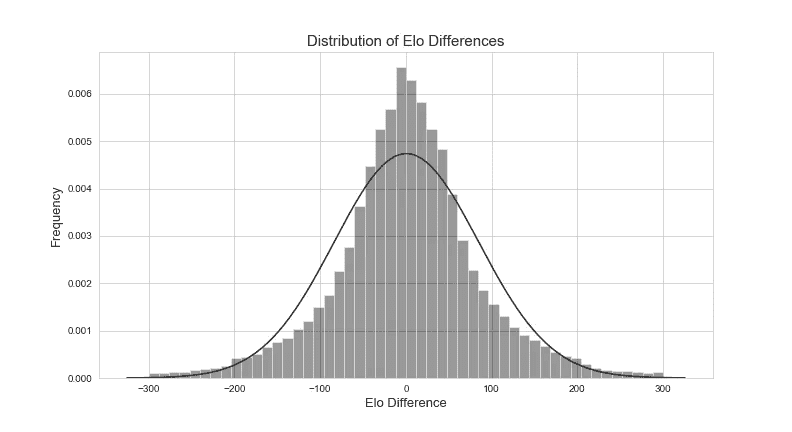
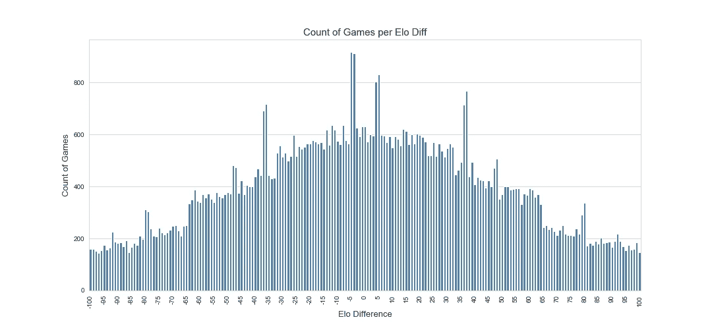
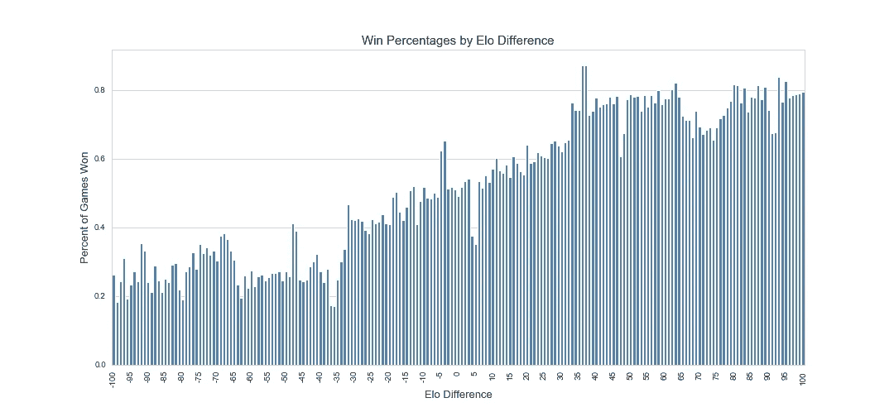
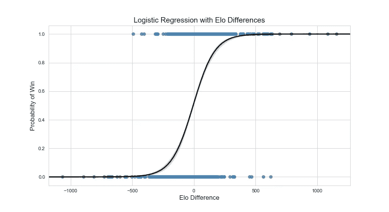
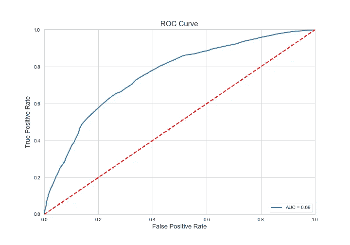
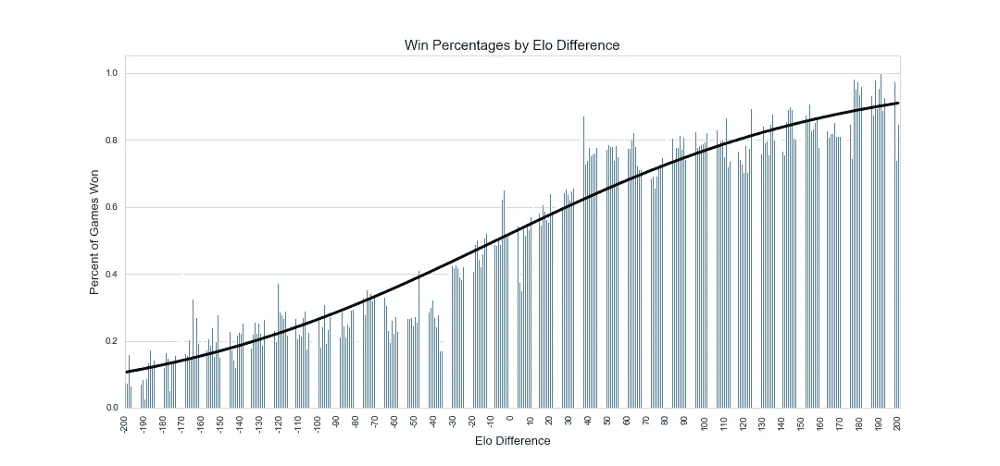
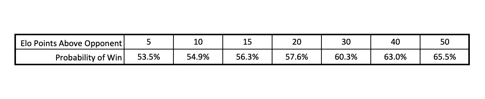

# Elo 有多重要？

> 原文：<https://towardsdatascience.com/how-much-does-elo-matter-7e8c3e910cb1?source=collection_archive---------25----------------------->

# elo 是什么？

Elo 是一个计算出来的分数，用于在国际象棋或篮球比赛中对选手进行排名。许多人已经看到了这个算法背后的实际公式，因为安德鲁·加菲尔德把它写在了社交网络中哈佛宿舍的窗户上。



Image from [https://www.akitaonrails.com](https://www.akitaonrails.com/)

# 有多重要？

当芒努斯·卡尔森与法比亚诺·卡鲁阿纳争夺国际象棋世界锦标赛时，马格努斯的 Elo 评分为 2835，而法比亚诺为 2832。这种差异有什么关系吗？Elo ~ 1250，我打败 Magnus 的几率有多大？在这篇文章中，我详细介绍了我如何使用 Python 来收集、转换和分析数据，以理解 Elo 对于预测游戏赢家有多么重要。

# 收集数据

为了理解 Elo 与游戏预测结果之间的关系，我首先使用下面的脚本从 chess.com 的 100，000 多场游戏中收集数据。在这里，我通过在 URL“***【https://www.chess.com/live/game/】***”的末尾添加一个随机数来遍历国际象棋游戏，并使用辅助函数 get_chess_info()获取游戏结果。这个函数返回一个字符串，如下例所示，所以我使用第二个辅助函数 parse_text()将它转换成有用的数据。

```
eono619 (1243) vs Rogeriothales (1201). eono619 won on time in 59 moves. The average chess game takes 25 moves — could you have cracked the defenses earlier? Click to review the game, move by move.
```

我用两个助手函数提取数据，然后用 csv 库的 DictWriter 方法将其全部写入一个. csv 文件。

在一些额外的特征工程之后，我得到了如下形式的数据:



# 探索性分析

现在有了收集和转换的数据，我继续进行分析。为了确定 Elo 在预测游戏结果中的重要性，我查看了 1)两个玩家之间的 Elo 评分差异，以及 2)谁赢得了游戏。但是首先，我很快检查了数据，从玩家评分的分布开始，不出所料，它是正态分布的。



然后，我继续讨论玩家评级之间的差异。Chess.com 将技能水平相似的玩家配对，因此两个玩家之间的 Elo 差异分布也呈正态分布并以 0 为中心是有道理的。



要了解玩家之间的 Elo 排名差异有多大，一种方法是查看在 Elo 差异的每个级别上赢得游戏的百分比。然而，小样本会引入很多噪声，所以我首先检查在两个玩家评级之间的每个增量点上，我是否有足够数量的游戏。对于-100 到+100 的 Elo 差异，看起来我在每个级别至少有 100 场比赛，所以我很高兴继续前进，看看胜率。



通过对玩家之间的 Elo 差异进行分组，并取“赢”列的平均值(赢=1，输=0)，我就可以得到每个 Elo 差异的胜率。除了数据中的一点噪音之外，玩家之间 Elo 差距的前 50 分与游戏结果之间有着非常明显的关系。在这个范围之外，趋势似乎趋于平稳，一个人高于或低于对手的每一个增量点似乎对她赢得比赛的机会都不太重要。



# 逻辑回归

另一种观察 Elo 重要性的方法是通过使用玩家之间的 Elo 差异训练逻辑回归模型来预测获胜者。



顺便提一下，我展示了 ROC 曲线，该曲线针对不同的分类阈值绘制了真阳性对假阳性。曲线下的面积，通常称为 AUC，是. 69；对于一个单一预测模型来说还不错。

Credit to Susan Li’s article ([https://towardsdatascience.com/building-a-logistic-regression-in-python-step-by-step-becd4d56c9c8](/building-a-logistic-regression-in-python-step-by-step-becd4d56c9c8)) on TDS for the code to make the ROC curve



我现在可以使用我训练的逻辑回归模型来预测在两个玩家的 Elo 评级之间的每个差异点上赢得游戏的概率。将预测叠加到原始数据的观察结果上，我们看到一个非常相似的关系，如果不是稍微平滑的话。



用这个模型来预测我和国际象棋世界冠军芒努斯·卡尔森的比赛，我被给出了 2.227e-08 的获胜概率，老实说，这听起来是对的。对于更现实的游戏，我在 Elo 差异的 5、10、15、20、30、40 和 50 点水平上观察逻辑回归模型的预测。



本文背后的完整代码和数据可以在我的 [GitHub](https://github.com/eonofrey/elo_analysis) 上找到，感谢阅读。要获得所有媒体文章的完整访问权限，请点击[此处](https://eonofrey.medium.com/membership)！