# 一平方米要加多少钱？

> 原文：<https://towardsdatascience.com/how-much-extra-for-one-square-metre-a1bafc061d70?source=collection_archive---------25----------------------->

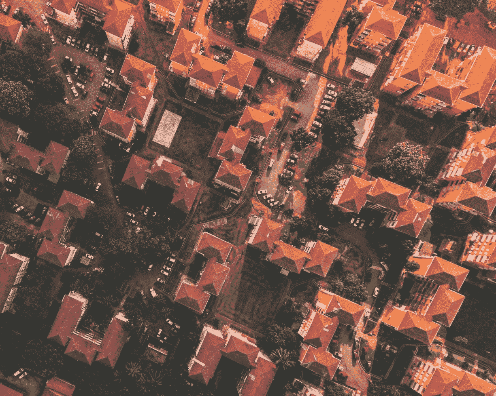

Photo by [Deva Darshan](https://unsplash.com/@darshan394)

里士满建筑面积与房价的简单线性回归分析

我们研究了澳大利亚墨尔本郊区里士满的**建筑/楼层面积**和**房屋的**价格**之间的关系。**

这里的目的是展示探索数据以揭示关系、为分析做准备以及理解线性关系的端到端过程。

这篇文章分为两部分:

1.  **探索数据**
2.  **应用线性回归**

> 请随意跳到您感兴趣的步骤，因为它们可以按任何顺序阅读。

我们的分析使用了从[域](https://www.domain.com.au/)刮来的来自 Kaggle 的[墨尔本住房市场](https://www.kaggle.com/anthonypino/melbourne-housing-market)数据(完整版)。它包含价格，房间数量，郊区，建筑面积等房屋信息。

我们开始吧！完整的代码请访问我的 GitHub 库。

# 1.探索数据

在这一节中，我们深入研究了住房市场数据，看看房子的建筑面积和价格之间是否存在可能的关系，并希望应用线性回归模型。

首先，让我们快速浏览一下我们的数据。

Viewing and cleaning our data

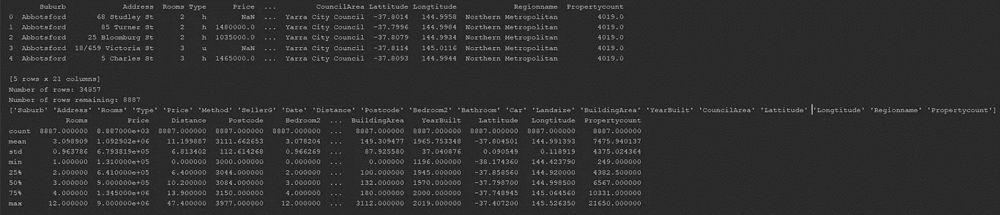

Table 1 — Summary Output

现在，如果我们看第一个表(从`melbourneHousePrices.head()`开始)，有几个 NaN 值。理想情况下，我们应该调查这些值存在的原因，并适当地处理每一个值，但是对于本例，我们将删除所有包含 NaN 值的行。因此，在清理数据集之后，我们还剩下 8887 行。

总共有 21 个栏目，每个栏目都有描述房屋的有趣而有用的信息。虽然我很想深入分析每一个问题，并将其纳入我们的分析中，但我们今天的主要关注点将是`BuildingArea`和`Price`。

*   *建筑面积*，指房屋占用的**建筑面积**。这通常以平方米或平方英尺来衡量。
*   *价格*，这是指房屋的价格，用澳元($)表示

就我个人而言，我发现可视化两个变量之间关系的最快和最好的方法是散点图。所以，让我们就这么做吧！

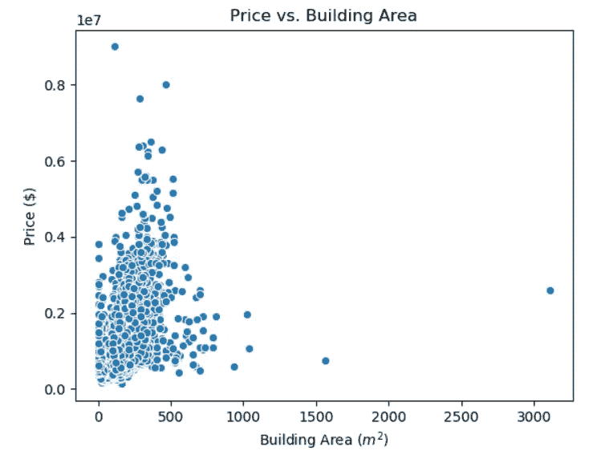

Figure 1: Scatter plot of House Price and Building Area

好了，没有明显的线性关系，所以这将是文章的结尾…

> 坚持住！我们有一些异常值！

正是这些异常值扭曲了我们的散点图。我们无法辨别 0 到 500 米之间拥挤的房屋的大致位置，因为房屋的高度超过 3000 米(有趣的事实是，这是一个足球场的一半大小)。

**我们应该放弃这个离群值吗？**也许吧，但让我们先调查一下，因为它可能会给我们更多关于数据集的信息。

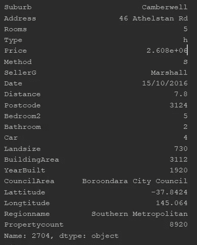

Table 2: 46 Athelstan Rd, Camberwell

如果我们查看显示的数据点，您会注意到一些非常有趣的事情。*的土地面积*是 730 m，比*的建筑面积*还小，这怎么可能？这可能意味着它有多个故事。

不幸的是，我看了一下[的平面图和这个房子](https://www.domain.com.au/property-profile/46-athelstan-road-camberwell-vic-3124)的描述，我一点也不明白它怎么会有 3112 平方米的*建筑面积。*

> 如果你能解释为什么，请留言，我很想知道答案！

让我们试着去除这个异常值，看看我们的散点图是如何变化的。

Removing outlier with Building Area of 3112 m²

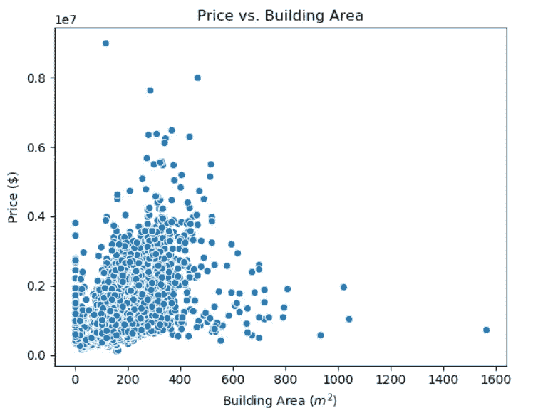

Figure 2: Scatter plot of House Price and Building Area (with outlier removed)

好的，我们的数据集开始看起来好一点了，但是仍然有异常值扭曲了我们的图，没有明确的线性关系。

记下我们上次的异常值调查，让我们根据*建筑面积*调查前 10 所房屋，看看我们是否能观察到任何模式。我们也将只提取总列的子集(即*郊区*、*距离*、*建筑面积*和*价格*)。

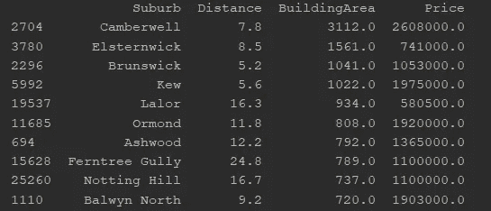

Table 3: Top 10 Building Areas

查看表 3，你可以看到每栋房子都属于不同的郊区。一些与墨尔本中央商务区*距离*相似的郊区房屋也有相似的*建筑面积*(例如`Brunswick`和`Kew`)

是否值得对某个特定的郊区进行过滤，以查看其房屋在建筑面积和价格之间是否呈现线性关系？

首先，让我们看看哪些郊区的房子在数据集中最多，因为我们希望有一个良好的样本量。

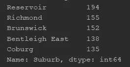

Table 4: Suburbs with most houses in data set

我们可以选任何一个郊区，但是我们选里士满吧！

酷，让我们过滤里士满的房屋数据，并再次在散点图上可视化。

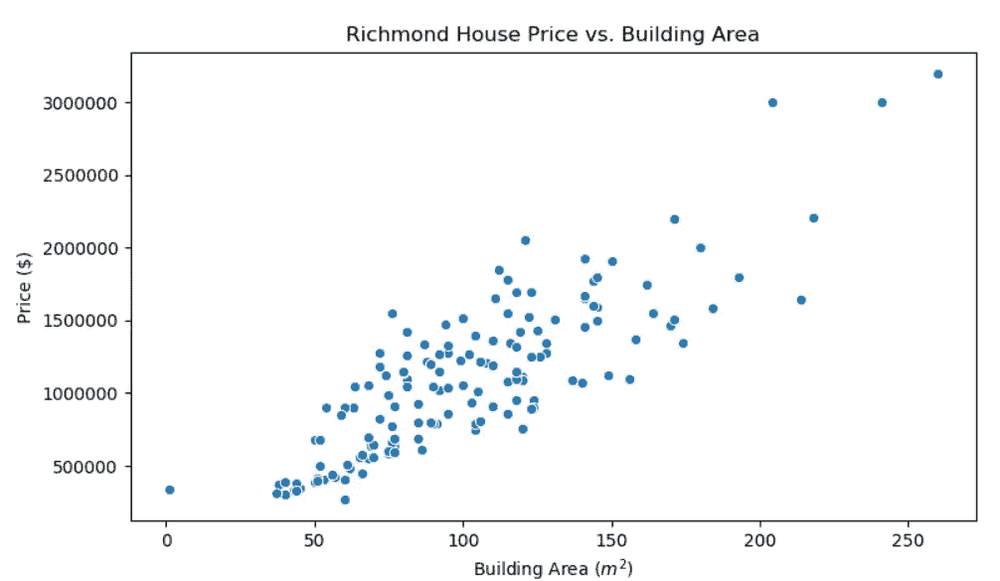

Figure 3: Scatter plot of Richmond House Price and Building Area

好吧，好吧，好吧…我们这里有什么？线性关系。

里士满房价和建筑面积之间似乎存在正相关关系。这让我们可以开始构建我们的线性回归模型。

继续下一个！

# 2.应用线性回归模型

在这一节中，我们试图用一个线性回归模型来拟合里士满房价和建筑面积之间的关系。

我们将清除数据中的任何异常值或错误点，然后理解回归输出。

首先，让我们用一个箱线图来可视化我们的数据。

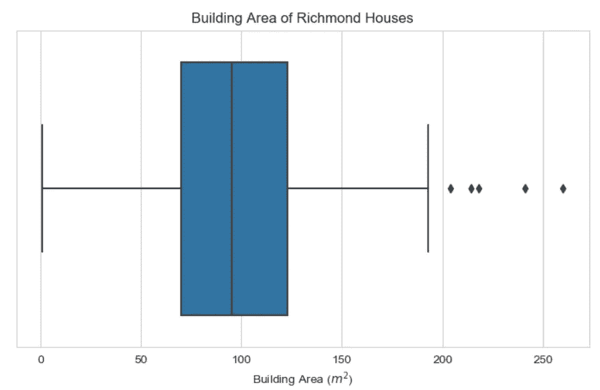

Figure 4: Box plot of building area for Richmond houses

我们可以从图 4 中确定以下几点:

1.  看起来最小值为 0 米
2.  从 200 米向前有 5 个异常值

先说第一点，里士满有一套*建筑面积*为 0 平方米的房子，很奇怪，让我们来看看。

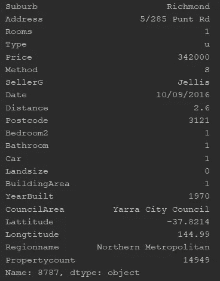

Table 5: House with Building Area of 1 m²

*建筑面积*实际上是 1 平方米，但*的土地面积*为 0 平方米。在调查了这个[在线房产](https://www.realestate.com.au/property/unit-5-285-punt-rd-richmond-vic-3121)后，很明显这不是一个茶水间，但比那个大得多。因此，这个数据点是不正确的，所以让我们把它过滤掉。

接下来，我们有 5 个 200 米以上的异常值。为了识别这些异常值，我们使用 [1.5 倍 IQR 法则](https://www.purplemath.com/modules/boxwhisk3.htm)。

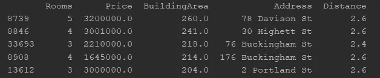

Table 6: Richmond house outliers based on Building Area

虽然根据 IQR 计算，这些房子被认为是高异常值，但我将把它们保留在数据集中。原因是，如果我们回到图 3 中的散点图，这些值对于捕捉房价和建筑面积之间的线性关系非常重要。

现在我们已经清理了数据并评估了所有的异常值，我们可以使用最小二乘回归来构建我们的回归模型了！

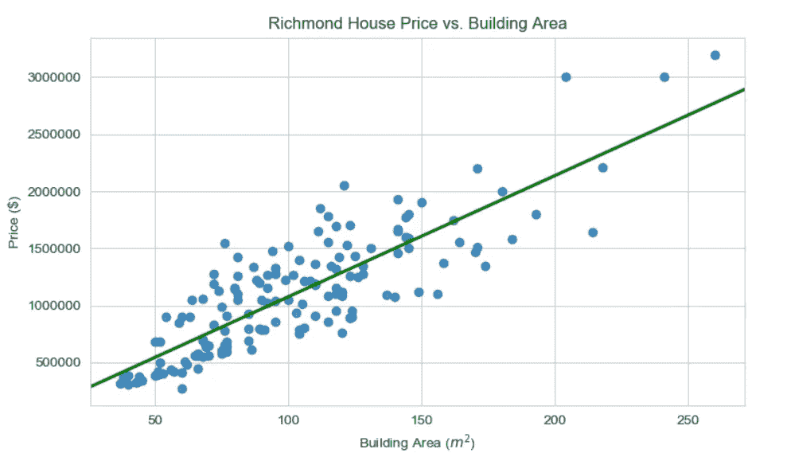

Figure 5: Linear Regression Plot

我们可以看到我们的回归线与数据非常吻合，所以让我们看看结果:

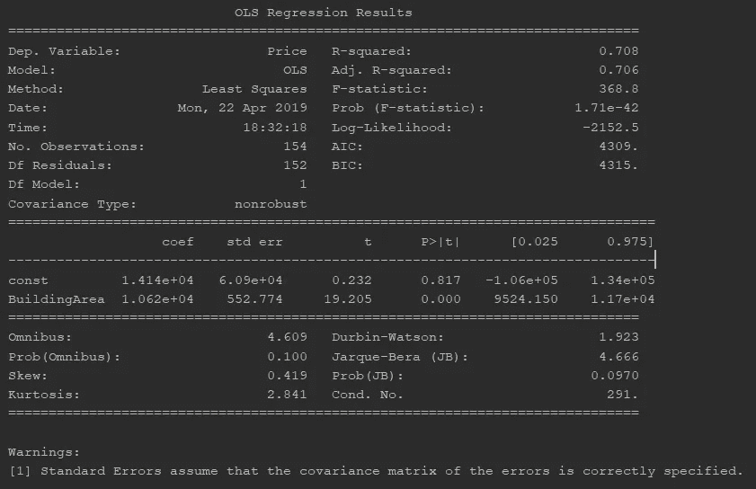

Table 7: OLS Regression Results

我们的回归模型如下:

> 价格($)= 14140+10620 *建筑面积

OLS 回归结果的关键要点:

1.  基于调整后的 R 平方，我们的回归模型解释了其均值附近 70.6%的价格可变性。
2.  我们有一个截距 14，140，根据 0.05 的显著性水平，它是**不具有统计显著性** (p 值= 0.817)。
3.  建筑面积系数为 10620，具有**统计显著性** (p 值很小)。

让我们详细阐述每一点。

## 外卖 1:

尽管我们已经发现我们的模型解释了其均值附近价格总方差的 70.6%，但我们不能就此罢休。重要的是我们检查**残差图**，以检查我们的模型的任何解释能力是否存在于我们的残差中，因为这些是随机的和不可预测的。

> 回归存在两个组成部分[，一个确定性的和随机的组成部分](https://blog.minitab.com/blog/adventures-in-statistics-2/why-you-need-to-check-your-residual-plots-for-regression-analysis)。对于随机成分，这意味着我们观察到的价格和实际价格之间的差异应该是随机的。

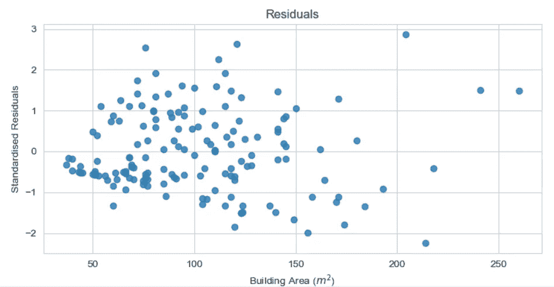

Figure 6: Standardised Residual Plot

我们可以看到，残差图上的点随机分布在零附近，我们无法辨别任何模式。这意味着我们不能用一个价格剩余来决定下一个价格剩余的价值，因此不存在**解释力**。(这就好！)

## 外卖 2:

我们有一个统计上无关紧要的截距 14140，我们如何解释这个？

对于我们的模型，截距是当我们的建筑面积为 0 平方米时里士满的一栋房子的价格。这意味着对于一栋没有建筑面积的房子，它的价格将是 14，140 美元。我的信念是，无论截距是否显著，它都应该被**忽略**，因为一栋没有建筑面积的房子卖 14140 美元是不现实的。然而，对于建筑面积变得更加现实的情况，例如 30 平方米，截距在建立基线房价时将是重要的。

## 外卖 3:

我们发现*建筑面积*的系数为 10620，具有统计学意义。我们如何解读这一点？

首先，由于系数大于零且具有统计学意义，里士满房价与其建筑面积之间存在正相关关系。

其次，在所有其他变量保持不变的情况下，*建筑面积每增加一个单位，*里士满的房价就会增加 10，620 美元。

然而，重要的是我们要考虑回归系数的不确定性(即 95%置信区间)，因此我们可以将其表示为:

> 保持所有其他变量不变，楼面面积增加 1 平方米，里士满的房价将大约增加 9524 美元，达到 11700 美元。

# 最后…

我希望这篇文章已经让你理解了准备线性回归数据的过程，以及如何理解结果。这个例子用于说明简单线性回归的应用，但是在以后的文章中，我计划应用不同的方法，比如多元线性回归。

> 如果您对我的工作有任何反馈，我可以如何改进或任何您认为不正确的地方，请告诉我！感谢您的阅读！