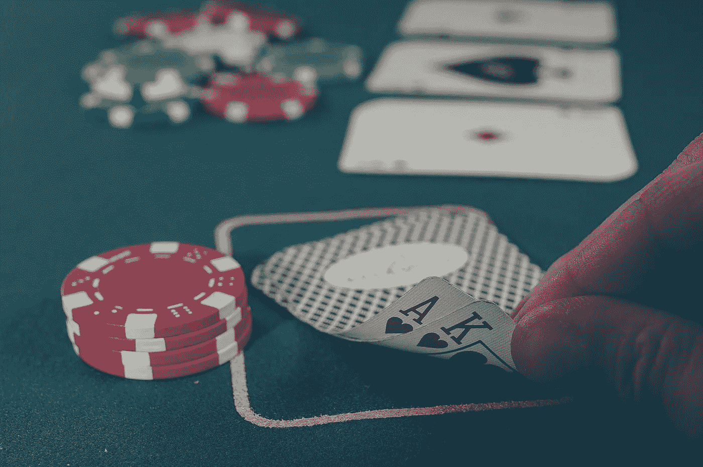
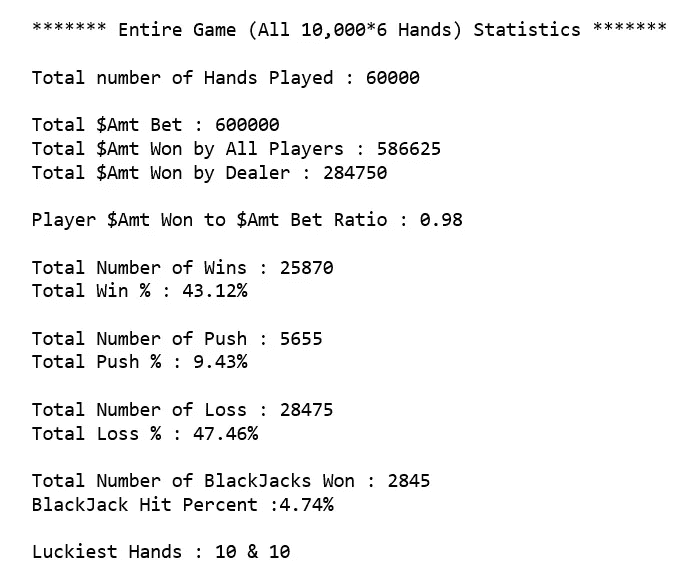
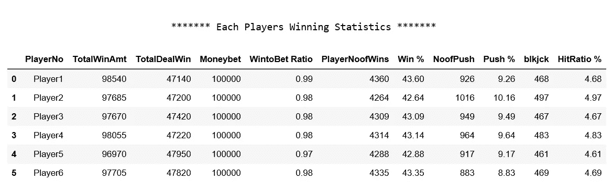
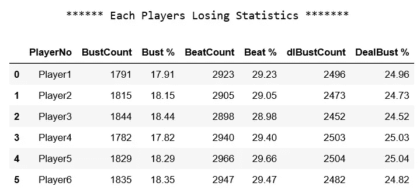
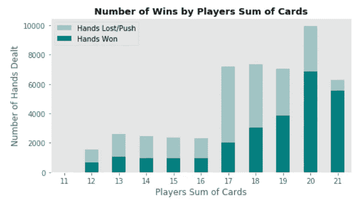
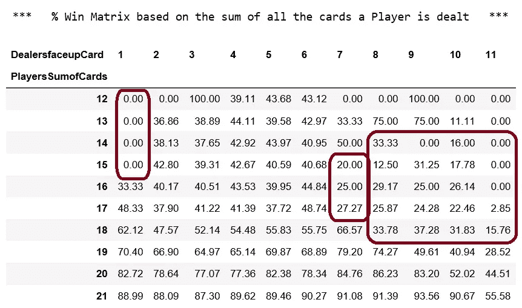

# 在 21 点中，100，000 美元将为您赢得多少？

> 原文：<https://towardsdatascience.com/how-much-will-100-000-win-you-at-blackjack-1c8344885b49?source=collection_archive---------12----------------------->

赌场不是很神奇吗？从戏剧的角度来说，你走进一个赌场，所有明亮的灯光照耀着你，有一种强烈的，舒缓的和感性的气味，你听到人们庆祝他们的胜利！现在你欣喜若狂，你迫不及待地想感受手中的筹码，你对自己说，这是你一直梦想的夜晚，你将赢得一生的胜利！你开始玩 21 点，你取得了重大的胜利，你觉得你在九霄云外，然后繁荣来了。连胜持续了多久？不多，嗯，这个场景你看着眼熟吗？(还是只有我经历这个！)

在我最近去了一次赌场后，我想一定有赢的策略，我必须找出赢这场游戏的概率。我在谷歌上搜索了 21 点策略，几乎所有的网站都将我引向赌博的基本[21 点图表](https://www.casinotop10.net/blackjack-strategy)，我很快就明白了，现在是测试的时候了，除了模拟玩家和庄家之间随机分配 21 点，还有什么别的方法呢？

嗯，这正是我所做的，让我们假设我们有 **100，000 美元来下注**(我真希望！)，每次**下注将花费我们 10 美元**，我们玩 **10，000 手牌**。让我们想一想通过我们的模拟可以尝试回答的问题；

*   我玩一万手牌赢了多少？
*   赢和输的百分比是多少？
*   我打了几个 21 点？(最少 1000，十分之一手？)
*   经销商赚多少钱？
*   哪些手最幸运？
*   我们能否创建一个矩阵，显示玩家牌相对于庄家牌的胜率？(我将在下次去赌场时用它来赚钱！)

## 模拟设置

为了模拟赌场游戏，让我们有 6 个玩家在玩，每个人都有 100，000 美元的底池(大玩家，伙计！)和一个经销商。每次下注 10 美元，赢 21 点的回报率为 3 : 2，也就是说，10 美元的赌注将返回 25 美元(包括您的 10 美元赌注)，而正常的高赢或庄家破产的回报率为 1 :1，也就是说，10 美元的赌注将返回 20 美元。出于模拟的目的，让我们忽略保险，分裂，双倍下注和任何其他奖金发挥。由于所有赌场现在通常处理一副牌中的 6 组牌，我们将使用相同的牌，即每轮总共 312 张牌——我们将每轮洗牌以模仿连续洗牌机(拜拜算牌！).庄家开始与玩家 1 至玩家 6 发牌，并结束与自己的发牌。他的第一张牌也面朝上。玩家将根据他们发出的前两张牌和庄家面朝上的牌的总和，再次根据[基本二十一点策略(请参考此处)](https://www.casinotop10.net/blackjack-strategy)，决定打出更多牌还是继续。好吧，现在让我们运行模拟，看看结果，好吗？

## 游戏结果

让我们先来看看所有玩家一起玩的所有牌的总统计数据，然后再来看看单个玩家的统计数据:

在总共玩了 **60，000 手**和总共下注 **600，000 美元**之后，玩家们总共只赢了 **586，625 美元**即下降了 **2%。**赢款与下注的比率为 **0.98，**只有大于 1 的系数才能让您从下注中获利。让我们看看**赢的概率** —从多次运行来看，范围总是在 **42%到 43%** 之间，输的概率总是在 **47%到 49%** 之间，输的概率总是高于赢的概率，这表明如果我们玩大量的手牌，那么**赌场最终将比我们任何人都赚钱。让我们来看看**21 点命中率** —我们最初的目标是从 10，000 手牌中打出 1，000 个 21 点，也就是说 10%中有 1 个**23，我们已经从 60，000 手牌中打出了 **2845 手牌，命中率只有 5%左右。**我们最幸运的手是哪一只**？—毫无疑问，它们是一对**10**(10，J，K，Q——在 21 点中具有相同的值)。让我们来看看单个球员的数据。******

## 玩家统计

一个有趣的观察结果是，每个玩家的统计数据彼此相似，并且与总体组合统计数据相似。**上一节的所有推论在这里同样适用**。我们来看看一些失败的统计数据怎么样？

从多次运行中，我们看到一个**玩家爆发(他们的牌和超过 21)～17%到 19%** ，而他们打败了**(庄家的牌和高于他们)**大约 **28%到 30%。**这清楚地表明**基本 21 点策略使人在打出更多牌时非常保守。**当**庄家的赔率为 24%到 25%** 倍时，**少于玩家的赔率%。**也许我们应该看看输赢矩阵，做一些调整来改善输赢统计。

幸运手有什么惊喜吗？不完全是，正如预期的那样 **20 和 21 给你最多的胜利**。有趣的是，**17&18****输** **的概率非常高~60%比 70%** 。而 **13，14，15&16**——概率是**输** **是>的 50%到 60%。这可能是我们可以改善损失的战略领域。**

## 赢百分比矩阵，玩家面对庄家正面牌的牌数总和

突出显示(加框)的区域胜率很低，这可能是我们改进的重点，目前 14，15，16 & 17 对 8，9，10 & 11 的庄家正面牌的**策略是打出更多的牌以获得对庄家**的优势，如果我们能更仔细地看看我们到底是如何输掉这些牌的——如果我们把牌弄坏了，或者如果我们被庄家的大牌打败了，我们就可以根据需要临时制定策略。

## 推理

就策略而言，玩家和为 12，13 的胜率相当不错，20 和 21 的胜率非常高。**基本策略看起来肯定能让我们在重要牌(~50 手)**中获得 42%的胜率，但这个胜率根本不足以盈利。如果我们能把胜率提高到 50%或 55%左右，我们肯定会有利润。那么，我们如何提高胜率呢？—等着瞧吧，鼓声——本文的第二部分将为您提供这些细节。现在，请记住我的朋友，**如果你在玩 21 点，并且你当前的胜率(赢的手数与玩的手数之比)超过 55%或更高，我建议你离开牌桌，领取你的奖金！我希望这篇文章能对赌博模式有所启发，并让你对赢的几率有所了解。**

## 试试模拟？

对于所有想看代码和尝试模拟的人来说——[https://github.com/Mojocolors/Blackjack-Odds](https://github.com/Mojocolors/Blackjack-Odds)。直到第二部分——快乐阅读，快乐玩耍！