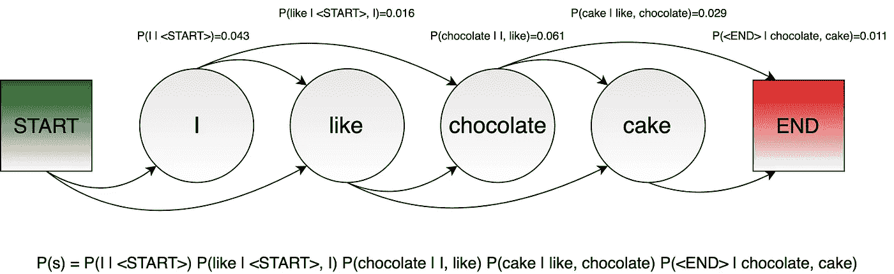
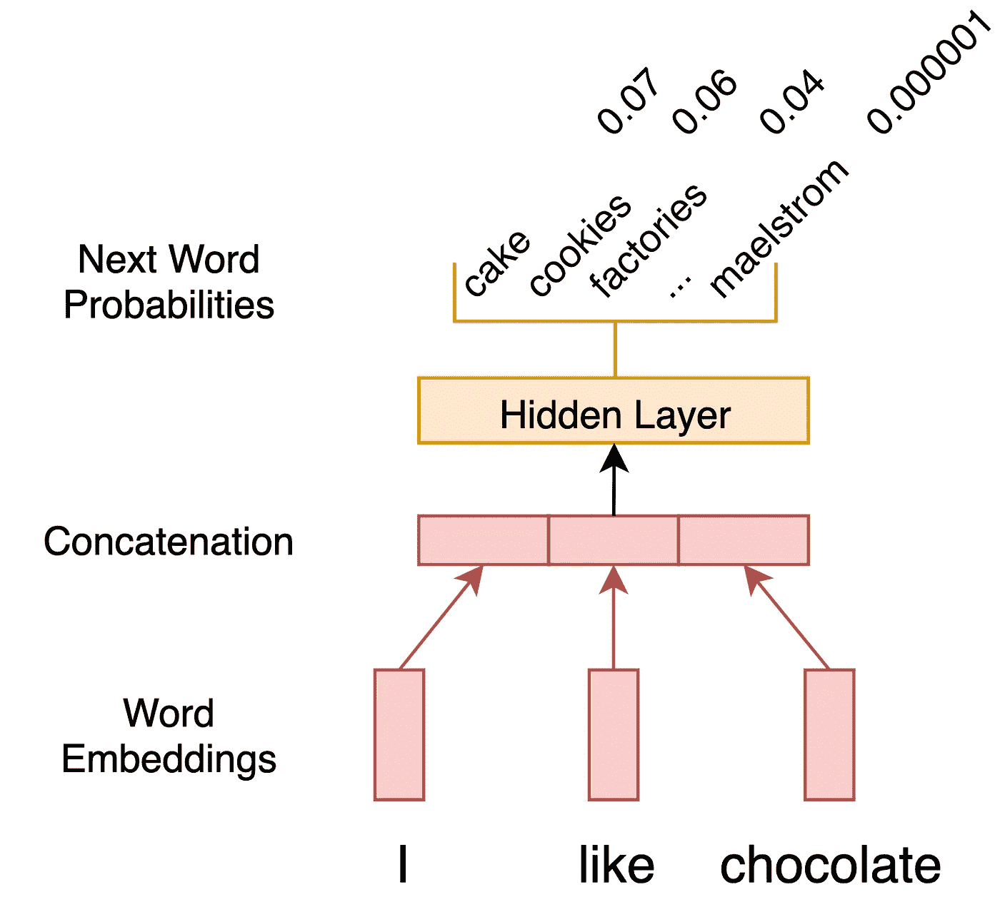
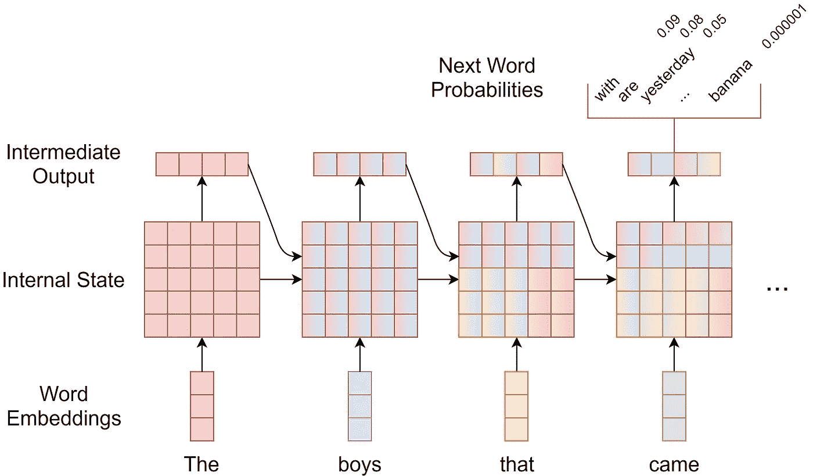
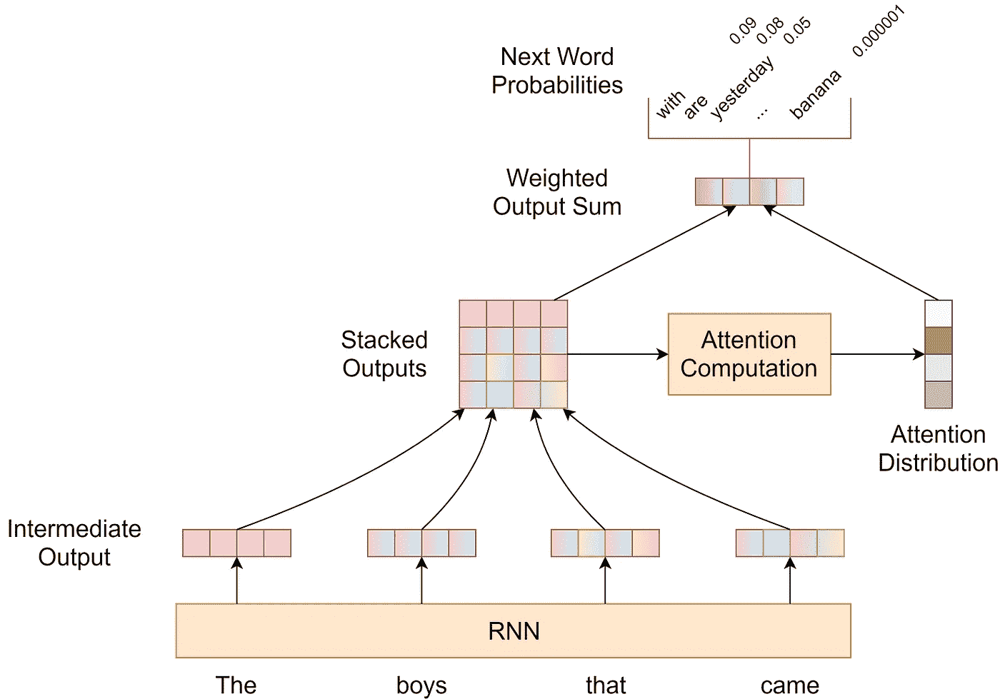
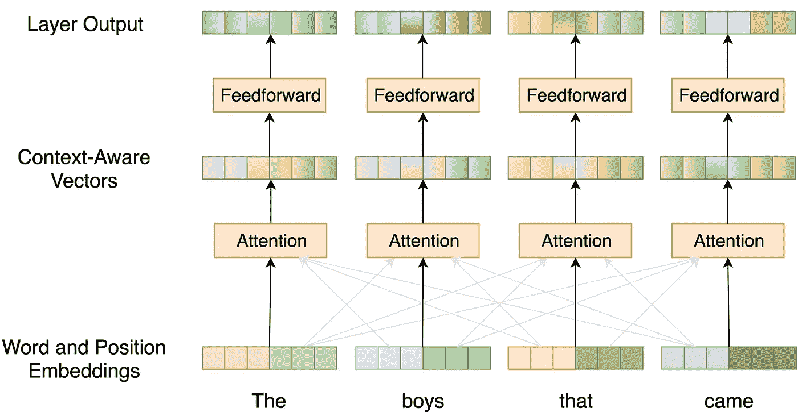

# 神经网络是如何学习写作的

> 原文：<https://towardsdatascience.com/how-neural-networks-are-learning-to-write-d631b249b499?source=collection_archive---------20----------------------->

## 写作文本的自然语言处理模型的发展综述

在一些历史学家的在线论坛上，一个用户问了一个问题:

> 普通的苏联公民有幽默感吗？

不久之后，他们收到了一封长达五段的回信。在阐述一个复杂的答案之前，首先要有一个合理的介绍性解释:

> 在苏联，有一种普遍的幽默感，这种幽默感常常与苏联身份和共产党联系在一起。

一些巨魔回复了一个没用的*嗨*，并立即被版主指责。乍一看，这个线程没有什么特别不寻常的。除了…这个论坛上的帖子不是来自人类，而是来自人工智能代理，或机器人。

[我提到的帖子](https://www.reddit.com/r/SubSimulatorGPT2/comments/c7g4qp/did_the_average_soviet_citizen_have_a_sense_of/)只是来自 [r/SubSimulatorGPT2](https://www.reddit.com/r/SubSimulatorGPT2/) 的一个例子，这是一个专门用于由基于 OpenAI 的 [GPT2](https://openai.com/blog/better-language-models/) 的 bot 自动生成的帖子的子编辑。如果你认为上面关于苏联幽默的段落只是它记忆和复制的东西，那很可能不是这样:谷歌搜索显示这句话的一半都没有出现。

让机器人在 Reddit 上互相对话并不新鲜:r/SubredditSimulator 已经这样做了几年。这里的区别是生成的文本质量有了巨大的飞跃。虽然较老的机器人可以用一些随机的胡说八道来逗你开心，但基于 GPT2 的机器人实际上可以让你暂时相信他们是真实的人——当他们最终说出一些荒谬的声明时，这往往会变得更有趣。

为什么会有如此聪明的人工智能模型？事情不是一夜之间就变成这样的。开发能够复制人类语言的模型的研究已经进行了几十年，但直到最近才真正令人印象深刻。在这里，我将展示语言建模进化的概述，以及为什么它除了创建有趣的机器人之外如此有用。

# 文本生成的演变

## 马尔可夫链和 N 元文法

来自旧的 [r/SubredditSimulator](https://www.reddit.com/r/SubredditSimulator/) 的机器人使用马尔可夫链，这是一种成熟的生成序列的技术。像现代神经网络一样，它们从数据中学习，但要简单得多。

基于马尔可夫链的模型假设一个句子中的每个单词只依赖于它前面的最后几个单词。因此，它将观察到一个给定句子的概率建模为组成该句子的所有 *n* 个字母——由 *n* 个单词组成的序列——的组合概率。一个 *n* 字母的概率可以近似为你在你的语言中能找到的所有可能的 *n* 字母中看到该特定序列的次数。

训练马尔可夫链模型基本上包括从文本数据中估计这些概率。下图说明了这个概念:

A small sentence decomposed in trigram probabilities. N-grams near the sentence beginning usually include a pseudo-token <START> to indicate their position.

在上面的例子中，基于三个单词(或三元模型)序列的马尔可夫链决定了令牌*巧克力*跟随*我喜欢*的概率。接下来，它将确定看到像巧克力一样跟随*的令牌*蛋糕*的概率，但不再考虑令牌 *I* 。*

然后，为了生成新的文本，我们只需要从模型给我们的概率中一次抽取一个单词。这种过程被称为**自回归**，其中每一步的结果都取决于前一步模型的预测。

> 抽样给了我们一些模型输出的变化。如果我们总是根据模型选择最可能的单词，它将总是产生相同的文本。

问题是，如果我们像这样分解问题，我们永远不会发现一句话有什么奇怪的地方，比如*我喜欢巧克力蛋糕，我喜欢巧克力蛋糕，我喜欢巧克力蛋糕*:三个记号的每一个序列听起来都非常正常，除此之外这个模型不关心。

如果我们尝试观察更长的序列，我们会看到一个指数爆炸。考虑到 1 万(10⁴)单词的小词汇量，我们有 1 亿(10⁸)可能的二元模型，1 万亿(10)可能的三元模型和 10 万亿(10)可能的四元模型！其中大多数都是无意义的，例如*香蕉香蕉漩涡香蕉*，但这是问题的一部分:许多完美的 4-grams 也不会出现在训练数据中，并且模型没有办法区分哪些序列是荒谬的，哪些序列是好的，但不幸的是没有被发现。

Banana banana maelstrom banana

规避较长字母的稀疏性的一种方法是使用一种语言模型，将它们与较短的字母组合起来。所以，也许我们的训练语料库没有出现*普遍幽默感*，但它确实有一些*幽默感*。与此同时，甚至连香蕉风暴*和香蕉风暴*都闻所未闻。这当然会有所帮助——但是考虑到价格，我们不能如此信任更长的克数。

N-gram 计数是我们多年来语言建模中最好的，并且它们在使用大量的谷歌 n-grams 时表现得相当好。尽管如此，我们可以看到它们非常脆弱，由马尔可夫链生成的超过五六个单词的句子几乎没有任何意义——同样，你可以查看更老的 [subreddit 模拟器](https://www.reddit.com/r/SubredditSimulator/)。

## 单词嵌入和神经语言模型

单词嵌入是当今任何人在 NLP 中首先学会的事情之一:单词到多维空间的投影。它们的巨大优势是，用余弦相似度来衡量，具有相似用法/意义的单词会得到相似的向量。因此，涉及相似单词的单词向量的矩阵乘法倾向于给出相似的结果。

这是基于神经网络的语言模型的基础。现在，我们可以将每个单词视为数百维的密集向量，并对其进行数值运算，而不是将每个单词视为一个原子符号。

在其最简单的形式中，神经语言模型查看一个 *n* 文法，将它的每个单词映射到它们相应的嵌入向量，连接这些向量，并将它们馈送到一个或多个隐藏层。输出层决定词汇表中每个单词下一个出现的概率，计算为分数的 [softmax](https://en.wikipedia.org/wiki/Softmax_function) 。

有趣的是，神经模型并不计算出现次数来确定概率，而是学习可以为任何输入计算它们的参数(权重矩阵和偏差)。这样，当我们对较长单词的计数不可靠时，我们不需要退回到较短的*n*-gram，最好的是，我们甚至可以在训练数据中从未见过的 *n* -gram 之后计算下一个单词的合理概率分布！

A simple MLP (multilayer perceptron) language model predicting the next word after the last given three.

第一个神经语言模型于 2003 年提出，比深度学习时代早了十年。那时候，没有人在 GPU 上运行神经网络，计算机更慢，我们还没有发现很多现在常用的技巧。这些模型会慢慢变得更受欢迎，但真正的突破只发生在递归神经网络上。

## 递归神经网络

可以说，语言生成的最大进步来自于递归神经网络(RNNs)的出现，更具体地说，是长短期记忆(LSTMs)的出现。与我之前提到的最简单的网络不同，RNN 的上下文不仅限于 n 个单词；它甚至没有理论上的极限。

Andrej Karpathy 有一个很棒的帖子，解释了他们是如何工作的，并展示了很多例子，在这些例子中，他们学会了制作类似莎士比亚戏剧、维基百科文章甚至 C 代码的文本。

与我之前展示的简单网络相比，RNN 的主要改进在于它们保留了一个内部状态——也就是说，一个表示网络记忆的矩阵。因此，RNN 可以一个字一个字地连续阅读，更新其内部状态以反映当前的上下文，而不是只看固定的窗口。

使用 RNNs 的文本生成遵循与马尔可夫链相似的基本原理，以自回归的方式。我们对第一个单词进行采样，将其输入神经网络，获得下一个单词的概率，对第一个单词进行采样，以此类推，直到我们对一个特殊的句子结束符号进行采样。

RNNs 在 2014 年和 2015 年左右在 NLP 中变得非常流行，并且仍然被非常广泛地使用。然而，他们优雅的体系结构和谨慎的内部状态有时会成为一种负担。让我用这个例子来说明:

> 和约翰一起来的男孩非常聪明。

注意*和*的男孩*意见一致，而不是和*约翰*意见一致，尽管两者更接近。为了正确地生成这样的句子，RNN 需要跟踪复数名词，直到它生成匹配的动词。这个例子相当简单，但是一旦你有了更长的句子，事情就变得更难了，特别是在更喜欢屈折和长距离依赖的语言中。如果我们不需要将如此多的信息塞进有限空间的内存，而是只需要回头看看前面的单词，检查还缺少什么，那就太好了。*

The RNN internal state keeps track of information about all seen words. In this example, the colors show how it can get increasingly difficult to fit everything into a limited space.

为了缓解这种情况，引入了注意机制。它允许 RNN 这样做:在产生下一个输出之前回顾所有以前的单词。计算关注度实质上意味着计算过去单词的某种分布(也就是说，对它们中的每一个进行加权，使得权重之和等于 1)，然后根据接收到的关注度成比例地聚集这些单词的向量。下图阐释了这一概念。

The attention mechanism allows an RNN to look back at the outputs of previous words, without having to compress everything into the hidden state. The condensed RNN block before the intermediate outputs is the same as when not using attention.

但是还是有一点不方便。训练 RNN 没有利用可并行化的硬件操作，因为我们需要在查看字 *i+1* 之前处理每个字 *i* 。

除此之外，你有没有注意到上图中的中间输出向量在每个单词之后变得更加丰富多彩？这象征着句子中更靠后的词可以接触到前面的词，而开头的词看不到后面的词。根据单词后面的内容对单词进行建模，起初听起来可能违反直觉，但我们一直都在这样做。考虑英语中的名词-名词复合词，比如第一个例子中的*巧克力蛋糕*。当我们一听到或读到*蛋糕*这个词，我们就知道*巧克力*只是在描述它，并不是短语的中心。我们这样做是因为我们可以回溯我们头脑中的信息，但线性 RNN 做不到这一点。因此，虽然 RNNs 可以做得很好，但仍有改进的空间。

## 变形金刚(电影名)

Transformer 是 2017 年推出的神经网络架构，旨在解决 RNNs 的缺点。它的核心思想是严重依赖注意力，以至于根本不需要内部状态或复发。

变换器中的每个隐藏层都有一个注意力组件，后跟一个默认的前馈(或 MLP)变换。首先，转换器计算每个单词对所有单词的关注程度，包括它自己和它后面的单词。在 RNN 中，这些单词的向量按照接收到的注意力的比例进行缩放和求和，从而产生上下文感知向量。这个结果向量然后经过前馈变换，结果是该变换器层的输出。

变形金刚通常有很多层，这使得它们能够学习单词之间越来越复杂的相互作用。并且为了考虑单词顺序，输入单词嵌入用编码其位置的附加向量来扩充。

这是对转换器的一个相当简单的描述，下面展示了一个这样的层。实际的架构相当复杂，你可以在[后的图解变压器](http://jalammar.github.io/illustrated-transformer/)中找到更详细的解释。

Simplified view of the first layer of a transformer network. The same weights are used in all the attention and feedforward operations in a given layer.

堆叠大约 6 层、12 层甚至 24 层，我们就能得到非常丰富的编码向量。在最后一个之上，我们可以放置最终的输出层来产生下一个单词的概率分布，就像在其他模型中一样。

当生成一个新句子时，我们必须在每个新单词后重新运行整个转换器。这是必要的，以便允许以前的单词考虑新的单词，这是 rnn 所不能做到的。

在*巧克力蛋糕*的例子中，变形金刚可以让*巧克力*在*蛋糕*的第一层上出现。因此，它的向量编码了更精确的意义信息，这些信息将被传播到更高的注意力层。

我之前也提到过，RNNs 没有让我们利用并行操作的优势。您可能已经注意到，由于我们也必须用 Transformer 一步一步地生成新单词，这里也是如此。嗯，在运行你的模型时是，但在训练时不是。

在训练过程中，我们可能会让一个转换器并行预测一个句子中的所有单词。我们只需要屏蔽我们想要预测的位置 *i* 处的单词及其后面的单词，因此网络只能查看过去的位置。没有隐藏状态-无论前一个时间步长如何，都会在每个时间步长重新计算变换器中的所有隐藏层。

# 我们现在在哪里

在许多 NLP 任务中，包括语言建模，转换器是目前最先进的。研究人员不断提出一些改进建议，但整体架构几乎保持不变。

我在本文开头提到的 GPT-2 模型是一个 Transformer 实例。那个特定的有 3.45 亿个参数，由 OpenAI 在一个巨大的文本集合上进行训练，然后在 Reddit 的几十兆字节的文本上进行微调。

OpenAI 提供的预训练模型在生成文本方面总体来说很棒，但要使一些东西更具体，你需要对它进行微调——也就是说，用一些你感兴趣的数据对它进行进一步训练。在[子漩涡模拟器](https://www.reddit.com/r/SubSimulatorGPT2/)中，GPT-2 的不同版本在 100 多个子漩涡中相互对话，你可以清楚地看到它们是如何学习自己的风格和特质的。这对于在不同子线程中对机器人进行微调的线程来说尤其有趣！

顺便说一句，那个预训练的模型甚至不是 OpenAI 最好的。他们已经训练了一个更强大的，有 15 亿个参数的，但是因为害怕恶意使用而决定不发表。这引发了一些关于人工智能会带来什么危险的有趣问题:不是科幻小说中的杀人机器人，而是一位可以不知疲倦地争论或创造故事的多产作家。机器学习领域内外的许多人不同意这种语言模型是危险的，但这一集至少表明，人工智能的影响正成为一个更重要的辩论话题。

## 除此之外还有什么呢？

好吧，但是除了创建有趣的 Reddit 线程，这些模型还有什么用呢？当然，有很多 NLP 应用程序！你可能已经意识到，一个非常简单的键就在你手机的键盘上，[就是](https://blog.swiftkey.com/swiftkey-debuts-worlds-first-smartphone-keyboard-powered-by-neural-networks/) [对](https://ai.googleblog.com/2017/05/the-machine-intelligence-behind-gboard.html)。

任何涉及文本生成的 NLP 任务都可以从这些模型中受益。[语音识别](https://ai.googleblog.com/2019/03/an-all-neural-on-device-speech.html)就是一个例子:在这里，语言模型必须根据一些语音输入找到最可能的单词序列，而不仅仅是以前的单词。

另一个自然的应用是翻译:这是一项给定另一种语言的文本，寻找最可能的单词序列的任务。事实上，机器翻译正是[关于变形金刚](https://arxiv.org/abs/1706.03762)的原始论文所处理的应用。

神经语言模型的有用性不需要局限于语言生成。一旦一个模型能够生成看起来几乎像人类的文本，这意味着它学到了很多关于单词如何相互作用的知识。这些知识编码在许多参数中，对于初始化许多不同任务的新 NLP 模型非常有用:文本分类、实体识别、问题回答和许多其他任务。

利用预先训练的模型来初始化新的模型被称为*迁移学习*，它现在被非常频繁地使用，并取得了巨大的成果——事实上，它是训练这些庞大的神经语言模型的主要动机。这是一个非常有趣的工作，值得另发一篇文章。

# 一些有趣的资源

*   OpenAI 发布的 GPT-2 模型你可以用它来生成文本
*   一个[在线平台](https://transformer.huggingface.co)尝试 GPT-2
*   微调 GPT-2 的教程[和生成假对话的例子](https://svilentodorov.xyz/blog/gpt-345M-finetune/)
*   [另一个关于产生笑话的教程](https://pmbaumgartner.github.io/blog/gpt2-jokes/)。可悲的是，神经网络仍然不是超级有趣。
*   [代码](https://github.com/karpathy/char-rnn)用于训练字符级 RNN 语言模型
*   由 LSTM 制作的莎士比亚戏剧样本