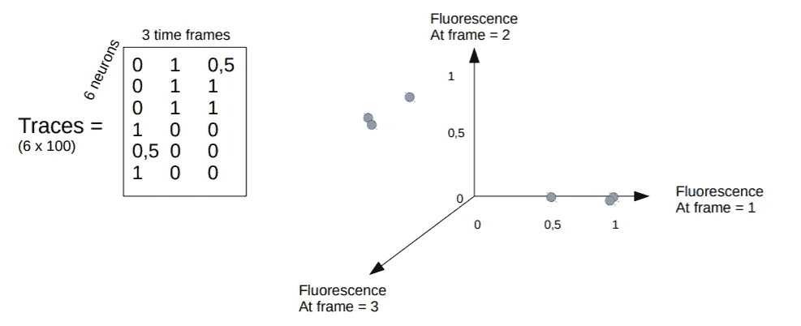

# 神经科学家如何分析来自透明鱼脑的数据:第 2 部分，聚类神经数据。

> 原文：<https://towardsdatascience.com/how-neuroscientists-analyze-data-from-transparent-fish-brains-part-2-clustering-neural-data-c1b974a146e2?source=collection_archive---------22----------------------->

## PCA 和 K-means 将具有相似活动的神经元分组

在第一篇文章中(你可以在这里阅读)，我描述了神经科学家如何将来自透明鱼脑的大脑图像预处理成可利用的数据集:一个 2D 矩阵[神经元 x 时间],代表每个时间点每个神经元的活动。

Two non-overlapping populations of amygdala neurons in the mouse brain. Picture from Mark Cembrowski, from the Cell Picture Show 2018 (have a look [here](https://www.cell.com/pictureshow/neural-mapping) for many gorgeous photos !)

在这篇文章中，我们将看到这些数据如何被用来回答这个问题:**我能把具有相似活动特征的神经元归为一组吗？**对于神经科学家来说，找到具有相同活动的神经元群是一个极其重要的问题，因为同步神经元群可能是大脑区域电路中的“构建模块”的基础。

第一步是**归一化**每个神经元的活动，以减去背景活动。确定称为 F0 的**基线**活动值:例如，它可以是记录的前 3 分钟期间的平均活动。归一化的方法是去除 F0，然后除以 F0: (F — F0)/F0。因此，最终结果用δF/F0(简称“DFF”)表示:这个四维值代表活性相对于基线的增加或减少，用百分比表示。举个例子，

*   当 F=F0 时，则δF/F0 = 0(与基线相比没有增加)
*   当 F=2*F0 时，则δF/F0 = 1(与基线相比增加 100%)。

*(注:F 代表“荧光”，因为神经活动是通过神经元活跃时发出的荧光强度间接测量的。)*

数据标准化后，就可以进行聚类了。目标是将神经元分组在一起，因此——对于记录在 T 个时间戳中的 N 个神经元——在 T 维空间中将有 N 个数据点。为了可视化，让我们在 3 个时间戳期间在 3D 空间中绘制 6 个神经元的数据集:

An example data set for visualisation : 6 neurons recorded over 3 time frames = 6 data points in a 3D space.

事实上，神经元不仅仅在 3 个时间步长内被记录…实际数字可以是大约 50000 帧(*例如:20Hz 下 45 分钟的记录= > 54000 个记录帧*)，所以这个图应该有 50000 个维度…

但是，我听到你说“ *50000 个维度，太多了！我真的要把它们都留着吗？反正我肯定所有维度都没那么有用*”。你可能是对的:想象一下，有一段时间，大脑什么也没发生？(在健康的大脑中，这在生理上不太可能，但让我们假设一下)。或者在某个时候，所有的神经元突然变得超级活跃:这可能是可能的，但是**如果我们的目标是将神经元分成几个集群，这将不会提供太多信息**…所以，在集群之前，我们可以**用 PCA** (主成分分析)减少我们数据集的非常高维度。

降维在很多帖子里都有描述，这里我就长话短说。让我们看一个简单的 2D 数据集，如图 a):十几个人的年龄和身高。我们可以在 b)中看到，数据遵循一个**总体“趋势”**，用箭头表示。如果我们将数据点投影到那个箭头上(如 c 中所示)，我们仍然可以很好地了解数据的分布。这个“趋势”就是第一主成分(PC)。在图 d)中，我们可以选择仅在一维而不是二维中表示我们的数据。我们减少了维度的数量，但我们仍然可以捕获关于数据集的重要信息。

Little sketch of dimensionality reduction with PCA.

PCA 的目标是**基于数据集的“原始”成分(这里是年龄和身高)计算主成分**。借助上面的示意图，您可能已经注意到箭头捕捉到了数据集方差最大化的方向**，或者更简单地说，在原始空间(a 中)最远的 2 个点在 PCs 空间(d 中)仍然最远。因此，PCA 背后的基本原理是找到数据集中方差最大的维度。**

***(备注:这是与 tSNE 完全不同的基本原理——*[*t 分布随机邻居嵌入*](https://lvdmaaten.github.io/tsne/)*——这也是一种在神经科学中广泛用于高维数据集可视化的降维技术。这将在下一篇文章中描述！***

****

**Diagonalization of the covariance matrix**

**一种方法是计算数据集的**协方差矩阵**并将其对角化。因此，你找到了一个新的空间，其中协方差矩阵是对角的:特征向量**是主分量，特征值**量化了每个主分量所解释的方差的百分比。对于 PCA，主成分是正交的。******

****

**由于主成分是由原始成分组合而成的，它们不一定“意味着”与数据相关的任何东西。在我的例子中，沿着第一个 PC 的值将是年龄平方的平方根加上身高平方…这个组合允许我们只保留一维。**

**在我们的神经数据集中，第一维是神经元的数量(几百个)。使用 PCA，我们可以将第二维从大约 50000(时间帧)减少到 10(主成分)。**

**一旦对数据进行了归一化处理，降低了第二个维度，我们就可以使用一个简单的、众所周知的算法进行聚类: [**K-means**](https://en.wikipedia.org/wiki/K-means_clustering) 。同样，许多 TDS 帖子已经致力于这一算法(你可以在这里 观看动画[)。因此，我将简单地评论一下毕晓普书中著名的方案。在下面的 2D 数据集中，我想分成 2 组:](/the-5-clustering-algorithms-data-scientists-need-to-know-a36d136ef68)**

****

**From C. Bishop’s book “[Pattern recognition and machine learning](https://www.springer.com/fr/book/9780387310732)”, page 426**

*   ****初始化** (a):随机选择聚类的中心(红色和蓝色十字)。**
*   ****期望** (b):每个数据点被分配到最近的聚类中心。**
*   ****最大化** (c):重新计算聚类中心(它们是彩色点的质心)。**
*   **(d-e-f):重复期望最大化步骤，直到收敛(即聚类中心不再移动)。**

**(*备注:如这里* [所讨论的](/the-5-clustering-algorithms-data-scientists-need-to-know-a36d136ef68) *，聚类数 K 必须由用户选择。对于简单的数据集，这可以通过视觉检查来完成。但是对于高维数据集，选择正确的 K 可能很棘手。有几种方法可以帮助你找到一个合适的 K，如* [这篇](/want-clusters-how-many-will-you-have-8737f4ba9bf2)*帖子中所述。*)**

**使用 PCA 和 K-means，神经科学家可以将具有相似活动的神经元分组在一起。让我们看一个来自挪威 [Yaksi 实验室](https://yaksilab.com/)的00016-5#secsectitle0025)*研究的例子。研究人员调查了斑马鱼的嗅觉以及大脑如何处理气味。他们对缰核(一个被认为整合来自感觉区域的信息的大脑区域)进行了成像，并检测了神经元[，如我在第一篇帖子](/how-neuroscientists-analyze-data-from-transparent-fish-brains-part-1-pre-processing-63a09436ea93)中所述。***

***在实验的第一部分，研究人员没有做任何具体的事情，但一些神经元无论如何都是活跃的。这叫做“**自发活动**”。科学家们执行了 PCA 和 K-means(要求 K=6)，并根据神经元在时间上的活动将它们分成 6 个簇。我们首先可以看到的是，自发活动并不是随机的，具有相似活动的**神经元在空间上是接近的**！下图显示了按簇分组的神经元的活动概况，以及每个神经元在缰核中的位置:用相同颜色表示的神经元属于同一个簇。***

******

***Spontaneous activity of habenular neurons. Left) neural activity in time (the traces are grouped in 6 clusters). Each row is a neuron, the color represents the DFF, introduced before. Right) spatial map showing the position of each neuron in the habenula (color-coded by cluster number). Figure found [here](https://www.cell.com/current-biology/fulltext/S0960-9822(14)00016-5#figures).***

***在实验的第二部分，研究人员通过水向鱼传递一种气味(传递的时间由下图中的箭头表示)。他们再次执行了 PCA 和 K=6 的 K-means，并注意到气味传递期间的**簇与自发活动期间的簇非常相似。*****

******

***Same legend than above, but during odor delivery. Figure found [here](https://www.cell.com/current-biology/fulltext/S0960-9822(14)00016-5#figures).***

***因此，自发同步的神经元在气味处理过程中也很可能是同步的！这就像一些神经元已经“预先连线”在一起，使它们更有可能以类似的方式对气味做出反应。***

***大脑中的自发活动是如何组织的？这对信息处理意味着什么？这些问题非常好，激励了许多神经科学家！***