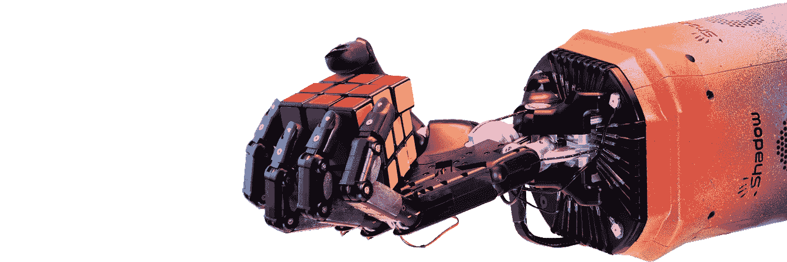
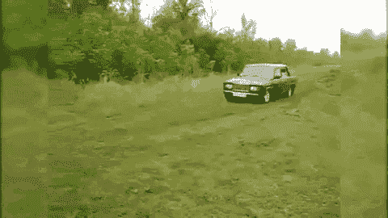
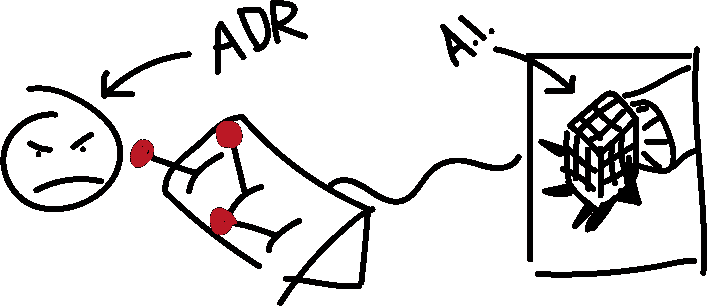
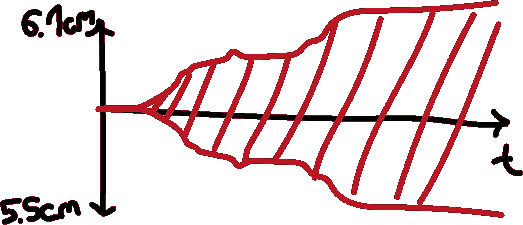
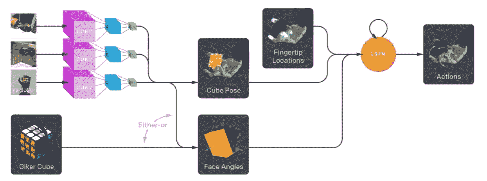

# OpenAI 如何用机械手解决魔方

> 原文：<https://towardsdatascience.com/how-openai-solved-rubiks-cube-with-a-robot-hand-3ae4490df70d?source=collection_archive---------33----------------------->

## 人工智能的突破还是只是烟幕弹？

A robotic hand holding a Rubiks Cube.

*如果你没看过视频。* [*结账*](https://www.youtube.com/watch?v=x4O8pojMF0w) *。*

强化学习在过去的几年里取得了很多成功。我们已经看到人工智能通过强化学习在围棋、Dota 和星际争霸中击败了职业选手。前围棋冠军李时斗在输给高手 AI 后甚至完全退出了比赛。

# 强化学习的问题是

但是强化学习有一个巨大的问题——它的成功仅限于虚拟环境。没有一个人工智能能像人类一样驾驭现实世界。甚至一个 2 岁的孩子都比我们最复杂的人工智能做得更好。当然，这是一个非常复杂的问题——进化花了 40 亿年才创造了人类，而我仍然设法找了 10 分钟的钥匙，才意识到它们一直在我的口袋里，所以智能生命并没有达到它的顶峰。

尽管如此，人类还是设法在不死亡的情况下学习复杂的任务。如果人类完全像我们的算法一样学习，他们将不得不从悬崖上开下数千次，才能意识到留在路上可能不是一个坏主意。

更糟糕的是，这些算法是如此的数据饥渴，以至于人类的一生都没有足够的时间来学习哪怕是一些有点困难的任务。例如，Dota AI 在能够击败职业选手之前玩了 40，000 年的游戏。当然，仍然令人印象深刻，但是加快时间在虚拟环境中更有效。

那么 OpenAI 是如何在没有利用虚拟环境优势的情况下，利用强化学习来控制物理手臂的呢？

他们没有。他们使用了虚拟模拟。但是一个模拟可以精确到它的结果可以直接转移到现实世界吗？OpenAI 的结论是否定的，现实世界太复杂了，摩擦和弹性之类的东西太难精确测量和模拟。

这是他们试图通过这个实验解决的核心问题。这是 *sim2real* 迁移问题，它描述了将在模拟中学到的知识应用到现实世界的挑战。

# 自动域随机化(*以及为什么比听起来更容易理解*)

他们解决这个问题的方法是一种叫做自动域随机化(ADR)的方法。ADR 的思想是，随着 AI 性能的提高，随机产生越来越多的具有不断变化因素的困难环境。这迫使人工智能学习一种适用于所有随机生成的环境的通用策略，这在理论上导致了这样一种健壮的人工智能，其结果可以转化为现实世界。

让我们再深入一点。这听起来很复杂，但是很简单。让我给你介绍一个人——他是 ADR 算法，他就像一个邪恶的老师。

Great illustration

他喜欢看他的学生努力奋斗。这个例子中的人工智能是他的学生。他面前有几个旋钮。第一个控制魔方的大小，第二个控制手的摩擦力，最后一个控制魔方的重量。还有几个参数，但那不是重要的部分。

当 AI 开始训练时，它仍然在挣扎，所以 ADR 什么也不做。旋钮停留在固定位置。然后在某些时候，人工智能是相当好的，并设法解决立方体的大部分时间。由于 ADR 不喜欢看到 AI 成功，他开始随机转动旋钮。但在现实中，即使 ADR 是邪恶的，他的心是好的。所以他不会全力以赴，只是随意地转动旋钮。足以让人工智能再次挣扎，但**不要太随机**，因为这将使学习变得不可能。这种情况会永远持续下去——随着人工智能改善 ADR，其随机性范围也会增加。

How the size of the Rubik’s Cube changes over time.

好了，现在我们明白了 ADR 是如何工作的，但是实际的人工智能控制机器人手臂呢？我会给你一个简短的总结他们的设置。

# 在后台

实现这一目标的神奇调料是以下几点的结合:

*   卷积神经网络从三个摄像机角度预测立方体的 3D 变换。
*   Kociemba 的算法，这是一个手工制作的算法，可以计算出解决任何混乱的魔方的步骤。
*   一个神经网络，它根据预测的立方体位置和指尖位置(从机器人手接收)决定下一个动作

During development OpenAI sometimes used a smart Rubiks Cube (Giker Cube) instead of cameras as a stepping stone.

# 戏剧

你们中的许多人可能会惊讶地看到他们使用手工算法来计算解决方案。别担心，社区的大部分人也是。声称已经用神经网络解决了魔方，但实际解决部分使用了手工制作的算法，这有点不真诚。另一方面，为什么要尝试解决一个已经有完美解决方案的问题。

既然我们已经在戏剧中，让我们继续:当观看视频时，你得到的印象是，该网络在做什么是相当好的。但是，成功率有点令人失望:对于需要 26 次面部旋转的立方体，他们的最佳策略的成功率只有 20%左右。公平地说，26 次旋转是最坏的情况，大多数立方体不需要那么多。对于需要旋转 15 次面的立方体，成功率高达 60%。

另一个警告是修改魔方。OpenAI 使用贴纸来打破旋转对称，这使得模型可以从单个图像中唯一地识别角度。这是人类不需要的修改，虽然很好理解。

不要误会我，我并不是想淡化 OpenAI 的惊人壮举。重点是，我认为 OpenAI 想通过使用 clickbait 策略来炒作他们的作品，获得更多关注。通过投资获得炒作，他们研究的准确性和科学有效性开始变得可疑。

你怎么看？

今天到此为止。如果你喜欢学习人工智能，请到[我的 Youtube 频道](https://www.youtube.com/channel/UCf5Rzk7DofjZctBGDzcRVRA?view_as=subscriber)来看看我。和平！✌️