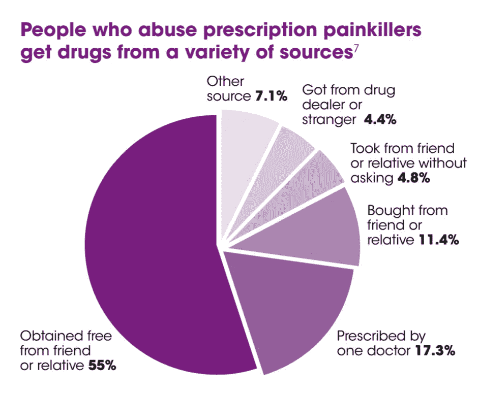
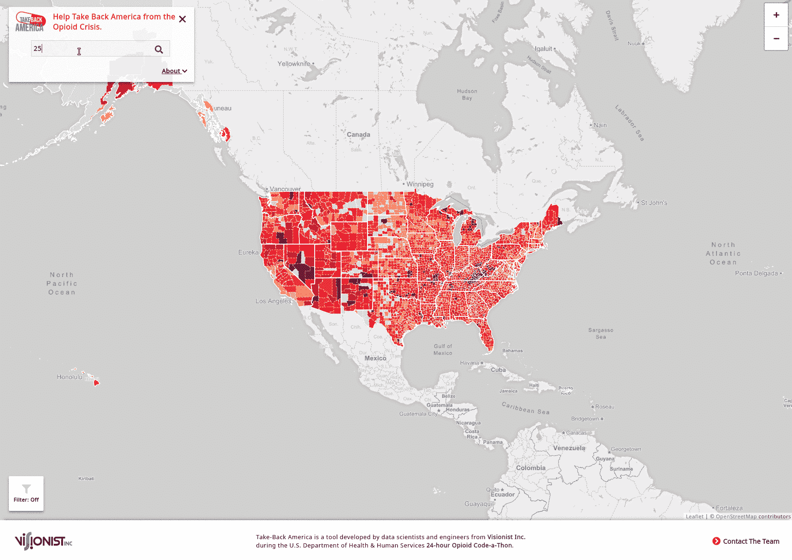
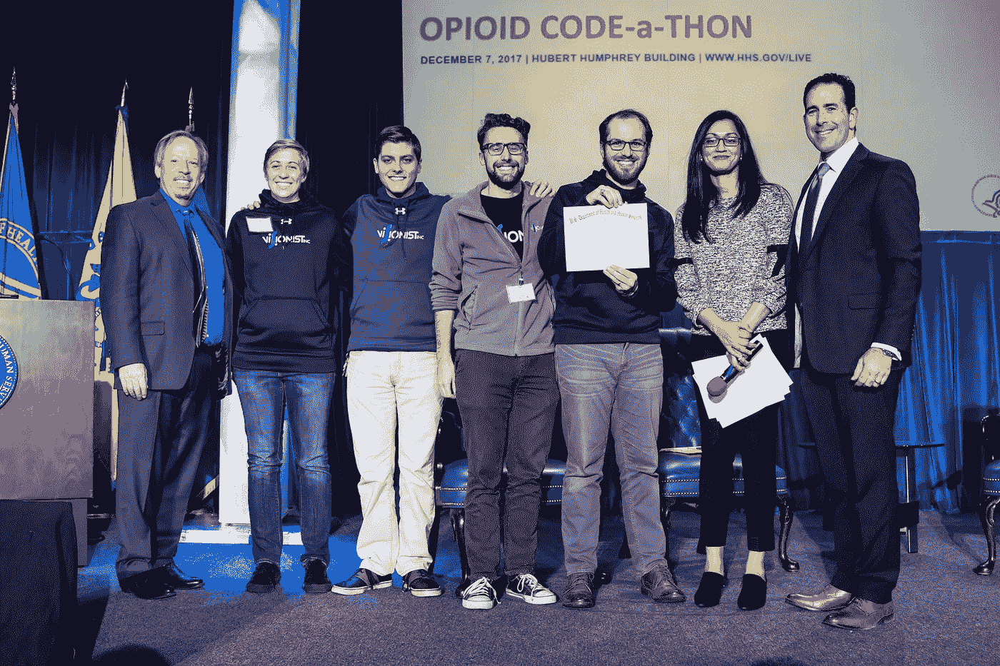

# 我们的黑客马拉松项目如何激励谷歌对抗阿片类药物危机

> 原文：<https://towardsdatascience.com/how-our-hackathon-project-inspired-google-to-fight-the-opioid-crisis-61f2ad0b2252?source=collection_archive---------20----------------------->

对于那些从未参加过黑客马拉松的人来说，这是一次独特的经历。睡眠不足、垃圾食品、紧迫的截止日期和竞争(但合作)精神的结合会产生创新的想法。

然而，尽管黑客马拉松很受欢迎，但对它们的一个普遍批评是，它们几乎没有真正的影响力。一旦糖的高潮消退，红牛消退，参与者回到他们的日常生活，他们努力开发的想法和原型通常会半途而废。这是一种耻辱。虽然在黑客马拉松上开发的许多项目都是简陋的原型，但这些原型背后的想法可能有真正的价值。通过额外的工作，一些支持你的伙伴，再加上一点运气，这些想法会产生真正的影响。我知道是因为这发生在我的团队身上。

2017 年 12 月，我和我的团队(三名数据科学家和一名软件工程师)参加了美国卫生与人类服务部(HHS)阿片类药物代码马拉松。我们和其他 50 个团队有 24 小时的时间来梳理 70 多个提供的数据集，以帮助 HHS、卫生从业者和公众找到解决阿片类药物危机的新方法。不是来自公共卫生背景，我们很难(现在仍然如此)理解助长阿片类药物危机的许多相互依赖的行为者、行为和动机。在这样一个复杂的系统中，“速赢”，特别是那些可以在代码马拉松中在 24 小时内解决的，可能是难以捉摸的；但这并不是说，如果你足够努力地去寻找，它们就不存在。

在事件发生前的几周，我们尽可能多地阅读了有关阿片类药物危机的信息。从学术期刊到 Reddit，我们投入了大量时间试图理解危机带来的挑战的类型和规模。正是通过这项研究，我们发现了一个惊人的事实:[**71%的滥用处方止痛药的人从家人或朋友那里获得药物(赠送、购买或盗窃)**。](https://www.cdc.gov/drugoverdose/pdf/PolicyImpact-PrescriptionPainkillerOD-a.pdf)

CDC — Policy Impact — Prescription Painkiller Overdoses — 2011

这个事实迫使我们重新评估我们对成瘾最常见途径的假设。危险不仅存在于过度热心的医生或药品经销商身上，还存在于全国各地医药柜中数百万陈旧且未使用的药物中。单独来看，这些药物似乎无害，但总的来说，我们知道这些过量的药物最终导致每年数千人死亡。这一认识迫使我们不断回到同一个问题:我们能做些什么来安全地清除已经在流通的阿片类药物(和其他药物)？

安全处置药物并不是一个新概念。多年来，美国药品管理局的分流控制部门为全国范围内选择允许他们接受旧的或未使用的药物的药店提供许可证。此外，美国药品管理局每年都会举办全国回收日，在此期间，公众可以将药物退回到由当地执法机构运营的其他站点。虽然这些项目为安全处置药物创造了必要的基础设施，但找到安全处置药物的方式、时间和地点仍然是一项艰巨的任务。有关许可处置地点、时间和限制的信息分散在多个联邦、州和地方政府网站以及 CVS 和 Walgreens 等私营公司的网站上。

除此之外，众所周知，让公众参与到预防行为中来是非常困难的，比如退回未使用的药物。这并不是说我们是坏人，我们只是忙碌、疲惫，被工作、账单和家庭压得喘不过气来的人。虽然我们很多人都渴望做“正确的”事情，但我的团队意识到，没有一种资源可以让公众轻松找到并利用他们周围现有的回收地点。为了真正激励公众退回他们未使用的和多余的药物，我们意识到我们需要建立一个工具来完成两件事:1)建立一种紧迫感，2)使公众尽可能容易地找到他们附近的回收地点。有了这些事实、大量的数据和大量的咖啡，我们开始了代码马拉松。

24 小时后，我们展示了我们的原型:[夺回美国](http://takeback.labs.visionistinc.com/)

TakeBack America Prototype — April 2018

简而言之,“回收”旨在通过让公众更容易找到他们附近有执照的处理场所来消除安全处理药物的障碍。TakeBack 利用县一级阿片类药物风险和处方数据(由 HHS 提供),以及我们从各种网站收集的药物回收地点数据。在 TakeBack 中，这些数据在县一级进行合并和显示，使用的是一个动态且易于使用的界面中内置的综合热点和点地图。最终，我们相信以一种本地化的、简洁的、令人信服的方式呈现这些信息将会促使公众退回他们的旧的和过量的药物；其他人同意了。在两轮闪电测试中演示了我们的工具后，TakeBack 被来自 HHS、Stanford Medicine X、Socrata 等公司的评委选为三个获奖解决方案之一。

Team Visionist — HHS Opioid Code-a-thon Awards Ceremony (Photo Credit: HHS)

在代码马拉松之后，我们继续给 TakeBack 一些 TLC。最初的更新很小；增加一些新的处理地点或者调整我们的地图，但是很快其他人开始聚集在我们周围。首先，我们 Visionist 的领导鼓励我们改进 Takeback 的用户界面，包括一天晚上我们工作到很晚时送披萨。很快，我们许多了不起的同事来帮助我们，一些人在下班后留下来帮助我们自动化数据流，微调我们的用户体验，或完善我们的用户界面。随着 TakeBack 的基础数据和功能不断增长，网站的访问量也开始增加。

虽然我们对 TakeBack 的技术细节感到满意，但我们坚信未来对 TakeBack 的增强应该由用户来引导。为此，我们首先联系了代码马拉松的赞助商 HHS。举办完比赛后，HHS 的首席数据官 Mona Siddiqui 和她的团队与我们会面，讨论如何更好地推广我们的工具。这些讨论让我们在 2018 年健康数据收集大会上展示了 TakeBack 和关于数据共享政策、数据驱动的解决方案和阿片类药物危机的[圆桌会议。在这些活动中，我们有机会与患者、医生和其他卫生从业者直接互动。我们发现这些对话非常有帮助，引导我们对 TakeBack 进行改进，这是我们自己从来没有想到过的。](https://www.hhs.gov/cto/blog/2018/09/18/hhs-data-roundtable-strategies-for-combatting-the-opioid-epidemic.html)

然后在九月，出乎意料的，谷歌联系了我们。原来谷歌(Code-a-thon 的原始赞助商)看过我们的演示，觉得 TakeBack 有很大的潜力。事实上，谷歌深受启发，他们告诉我们，他们想在谷歌的地图和搜索产品中复制 TakeBack 的见解。从 10 月份开始，我们与谷歌的法律和数据科学团队反复通话，审查我们的数据、方法以及 TakeBack 的底层代码。上周，谷歌、HHS 和 Visionist 终于宣布向更广泛的公众发布这一新工具。

不用说，我们很荣幸谷歌和 HHS 都看到了 TakeBack 的独特价值，我们很高兴在过去的一年里与这两个组织合作，将 TakeBack 推广到全国观众。我们相信，这些与谷歌搜索和地图的新整合将成为他人的宝贵资源，甚至有助于拯救生命。作为一名数据科学家，没有什么比看到您的工具惠及如此多的人更值得骄傲的了。

然而，这只是朝着正确方向迈出的一步。通过这次经历，我们了解到阿片类药物危机是多么复杂和多方面的。真正解决这一危机需要医疗系统内外的人继续做出贡献。在 Visionist，我的团队继续寻找机会将我们的分析技能应用于阿片类药物危机及其他问题。我希望这篇文章能鼓励你们中的一些人加入到我们的努力中来。无论是深夜的想法、课堂作业，还是你自己的黑客马拉松项目，我们和其他人都想听听你带来了什么想法和原型来应对这场危机。我们的经验表明，这种项目可能是未经雕琢的钻石。如果你相信你的项目，继续给它你的时间和注意力。与他人分享，并寻求他们诚实的反馈。你永远不知道它会激励谁，也不知道它最终会变成什么。

*再次感谢所有让这一切成为可能的人，包括我在 Visionist 的出色团队，他们帮助我们回到今天的状态(Dillon Mulroy、Kelsey Campbell、Will Sutton、Brian Lehman、Matt Loff、Eric Reidelbach、Trish Willard、Enrique Caballero、Greg Friedman 和 Ruth Goulding)。另外，感谢谷歌的法律团队和 HHS 办公室的首席技术官。*