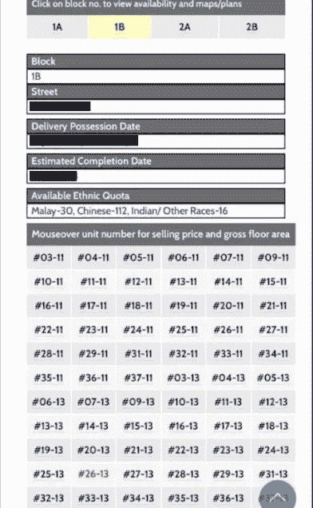
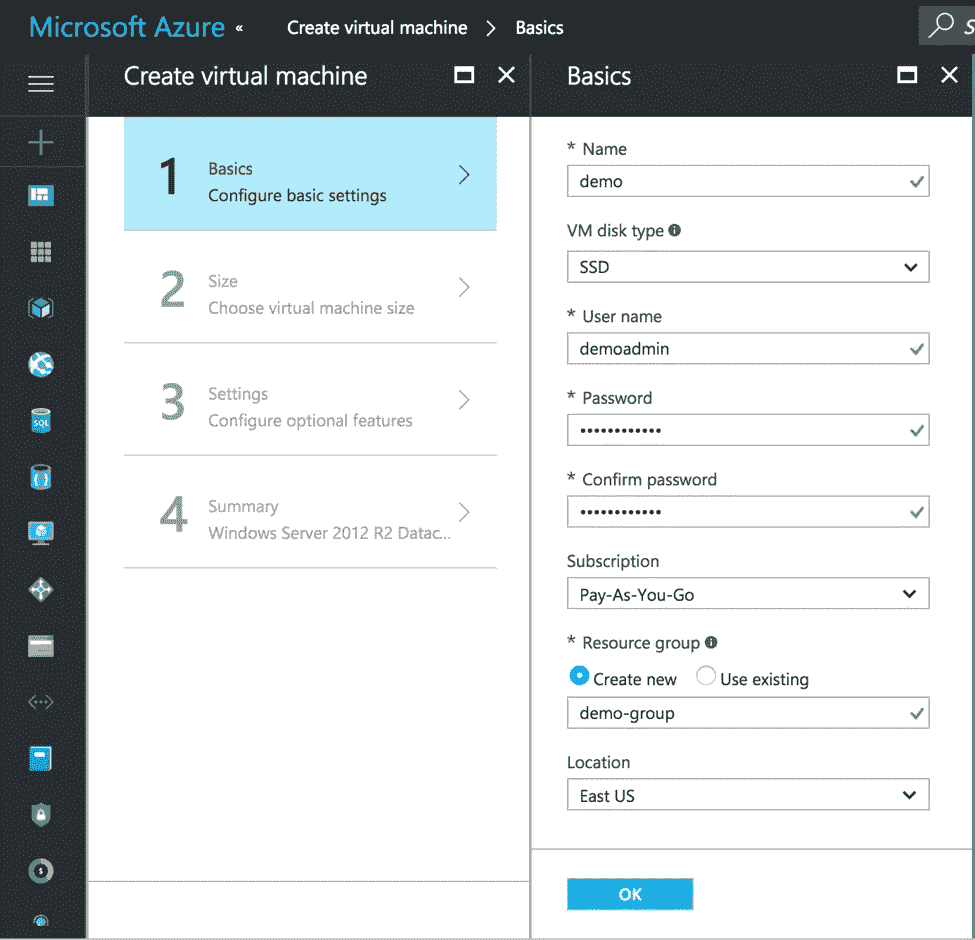
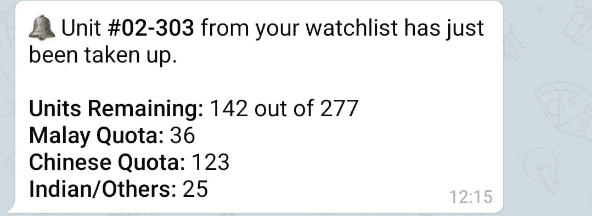
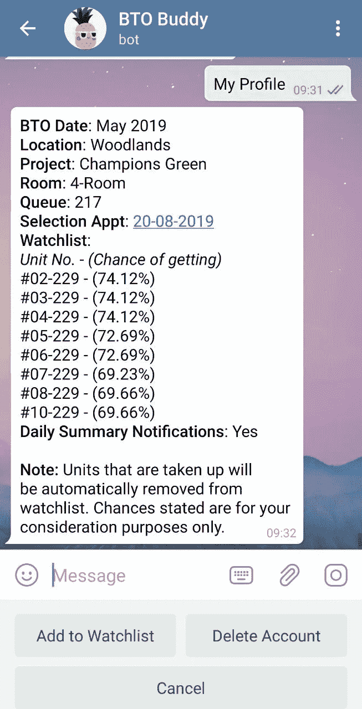
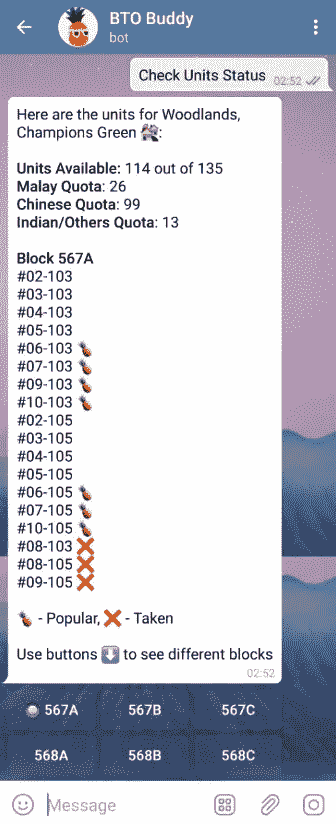

# Python 如何帮助我选择新家——第 1 部分

> 原文：<https://towardsdatascience.com/how-python-helped-me-with-choosing-my-new-home-92a238c94265?source=collection_archive---------11----------------------->

一个简单的端到端应用程序，使用 Python 来自动化枯燥的工作。

Public Housing in Singapore. Photo by [DollarsAndSense](https://dollarsandsense.sg).

# 一点背景

最近，我向住房发展委员会(HDB)申请建造一套新公寓(BTO)。对于那些不熟悉新加坡公共住房的人来说，新加坡人可以申请 HDB 建造的全新公寓，等待期为 3-5 年。那些成功的申请人将获得一个排队号码，决定他们在项目中选择一个单位的顺序。谢天谢地，我很幸运地拿到了一个排队号。剩下要做的就是选择一个我喜欢的单元，然后**努力祈祷**直到我的约会日期它仍然是可用的。

最初，根据我自己的标准，比如潜在的转售价值、屏蔽/未屏蔽的视图等，很容易列出几个单元。然而，他们总是说现实是残酷的，我最喜欢的单位被别人拿走了。

# 问题来了…

最终，我开始发现自己陷入了一个**痛苦的循环**每天:
1)查看是否有单位在 HDB 网站上被选中。如果是，它们在我的入围单位中吗？如果是的话，c̶r̶i̶e̶s̶̶i̶n̶t̶e̶r̶n̶a̶l̶l̶y̶会重新评估我的选择。

The very page I can’t help but stare at every single day before our appointment.

显然，我不是唯一有这种问题的人。在和我未来的邻居在一个电报小组呆了一天后，我很快就意识到了这一点。是的，你没听错，聪明的国家。所以我想，现在是 Python 的时代了。

# 计划是什么？

为了**自动化**检查单元的整个过程和**个性化**体验，同时对我来说成本最低或为零。

# 该过程

首先，**内容**。我需要从 HDB 网站提取单位和其他杂项信息的可用性。这可以用 Python 中的 BeautifulSoup 包或 Selenium 来完成。在这种情况下，我选择了 BeautifulSoup，因为这个任务非常简单。我不会详细讨论实现，因为这将是一个单独的话题。然而，对于那些感兴趣的人来说，网上有很多教程，这里有一个很好的。

二、**存储**。为了迎合个人，我将不得不在单元数据上存储用户数据以供将来参考，这是我与 [MongoDB 自由层云数据库](https://www.mongodb.com/)(M0 阿特拉斯)一起进行的。对于手头的任务，阿特拉斯·M0 绝对绰绰有余。此外，Python 有 [pymongo 包](https://api.mongodb.com/python/current/)，这使得设置非常简单。

最重要的是，**消费**。我将如何查看此信息，从哪里获取更新？还有，还有谁会想用这个？自然地，因为我从 Telegram 中找到了我未来的邻居，所以以 Telegram bot 的形式提供服务就有了直接的意义。毫无疑问，我选择了 [python-telegram-bot](https://github.com/python-telegram-bot/python-telegram-bot) 包，因为它的社区给了我第一手的经验，并且我可以用它进行大量的定制。

Process of setting up an Azure VM

在花了几个小时来创建基本功能，如用户注册，当他们选择的单位被占用时的通知和发送每日摘要后，这个机器人已经准备好部署在**。在虚拟机上托管脚本将允许机器人全天候运行。我把它放在微软自己的云计算平台 Azure 上。顺便说一下，学生在 Azure 上注册时可以获得 100 美元的积分。在 Azure 上设置一个 VM 简直是小菜一碟，只需点击并决定我的 VM 的层和位置。几分钟后，BTO·巴迪上线了。**

# **用户反馈的重要性**

**这次我确定要做的一件事是在第一个版本中加入一个反馈按钮，允许用户匿名留下关于我如何改进 BTO 巴迪的建议。你会对收到的反馈感到惊讶。一位用户建议，他们可以输入堆栈，而不是一次手动键入一个设备(例如# 07–111、# 08–111、# 09–111)，所有带有#xx-111 的设备都将包含在观察列表中。我继续为他们开发这个特性。**

# **结果呢**

**最后，经过几次修改和听取用户的反馈后，BTO 巴迪能做的是:**

1.  **监视列表和通知的个性化**

****

**Example of heartbreaking notification sent to users when their favourite units are taken**

**2.基于用户排队数的用户机会估计**

****

**Example of a user’s profile and chances**

**3.显示单位的当前状态及其受欢迎程度**

****

**Example of how a user can check the status of their units**

**至此，BTO 巴迪已经或多或少地完成了，目前服务于 200 多个用户。至于它的**可持续性**，也许我可能得想办法抵消托管的成本(5~10 美元)。如果你有机会申请 BTO，一定要试试 [BTO 哥们](http://t.me/btobuddy_bot) (@btobuddy_bot)！**

****更新** : [Part 2](https://link.medium.com/0x26bDDeT0) 已经发布！**