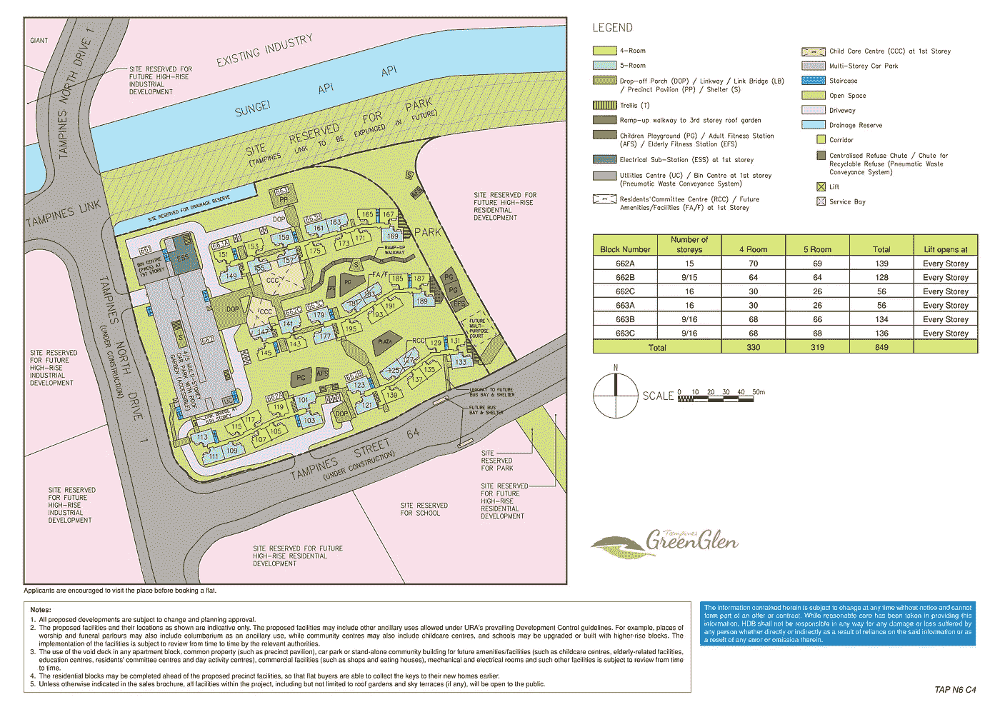
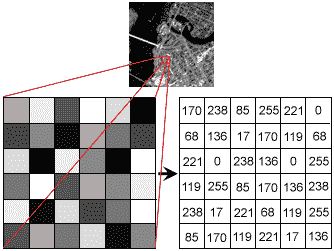
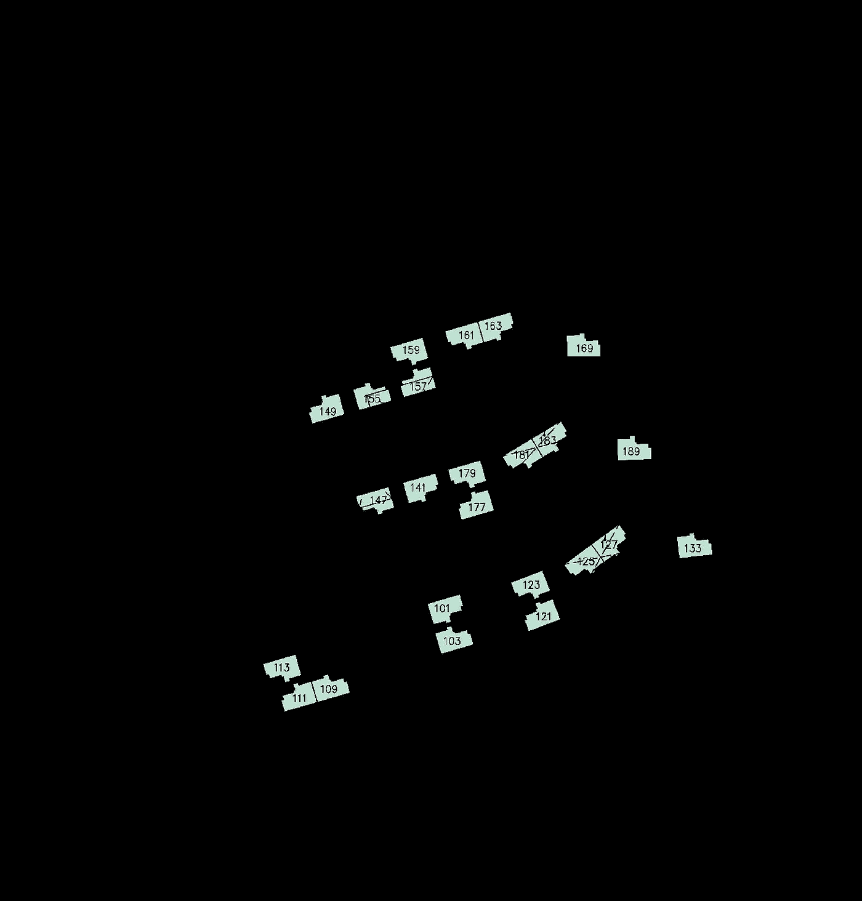
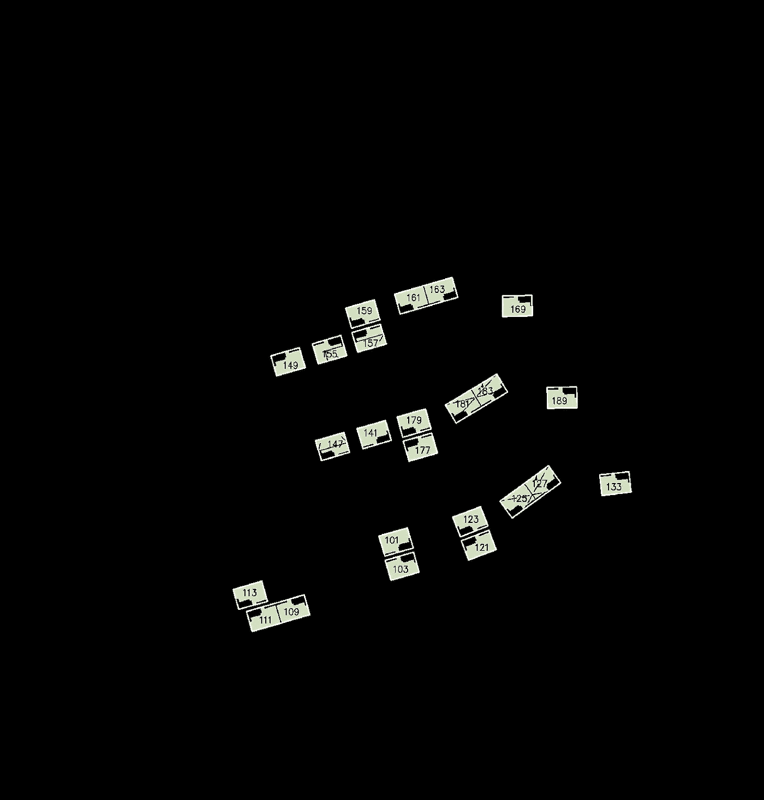
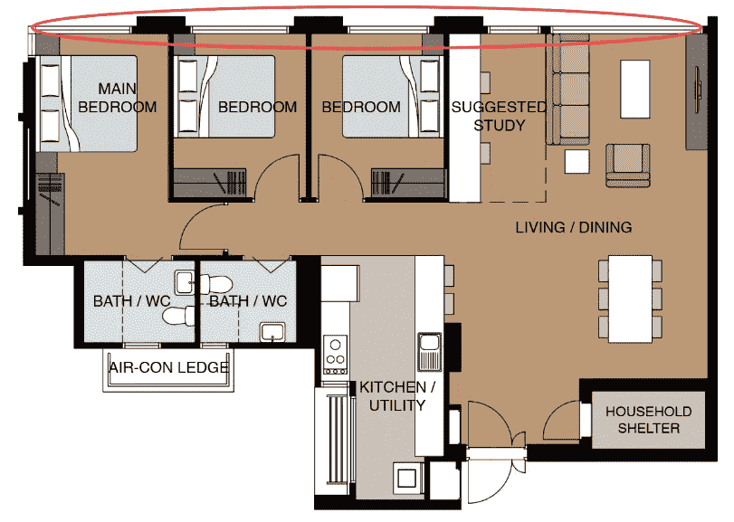
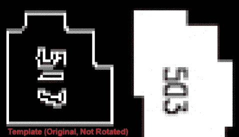
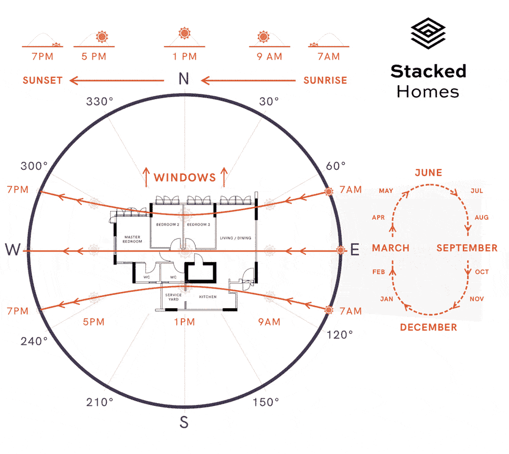
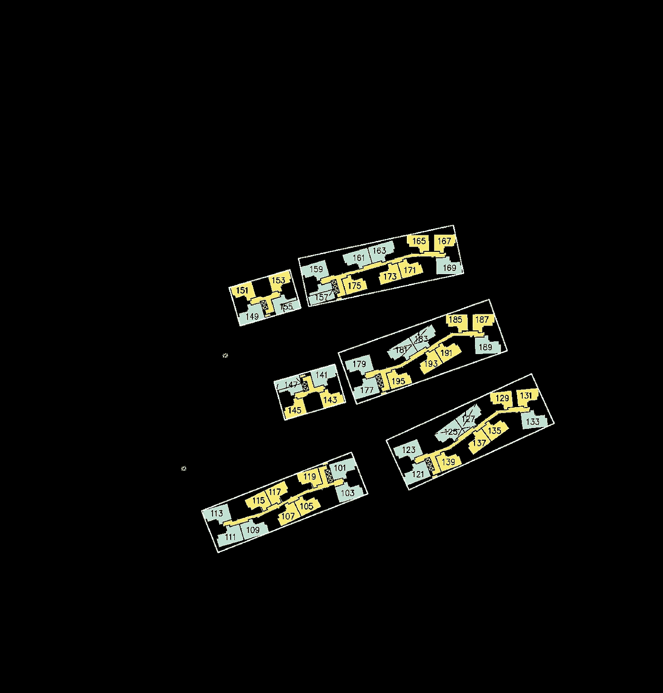
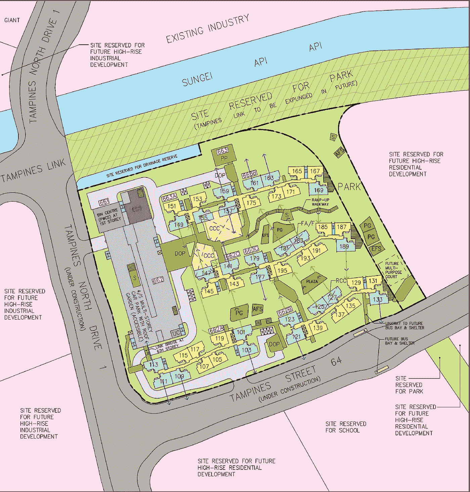
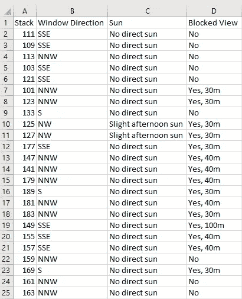

# Python 如何帮助我选择新家——第 2 部分

> 原文：<https://towardsdatascience.com/how-python-helped-select-my-new-home-part-2-470e967553e1?source=collection_archive---------21----------------------->

Photo by [Muhd Asyraaf](https://unsplash.com/@8thshot?utm_source=medium&utm_medium=referral) on [Unsplash](https://unsplash.com?utm_source=medium&utm_medium=referral)

在第 1 部分的[中，我分享了如何使用 Python 来自动化我的 BTO 应用程序中的普通流程，例如跟踪单元的可用性，并在单元被占用时通知我。截至目前，它正在为大约 700 名用户提供服务🎉非常感谢大家的支持！](https://link.medium.com/oNG5QFGGS0)

由于它开始从监控单元中释放出我的时间，我能够花更多的时间来比较单元并决定如何对它们进行排序。在这个过程中，我意识到我必须手动计算每个单元的“因子”*(例如，一个单元得到的阳光类型，窗户方向)*，然后才能比较它们。这既**重复**又**耗时**。不得不分析场地平面图来加工这些因素，并从数百个单元中确定哪些是“理想的”单元，这可能需要几天的时间。

不要误解我，这绝对是我珍惜的里程碑之一。然而，我相信每个单元因素的搅动可能是瞬间的，你可以花更多的时间和你的伙伴一起选择单元。因此，在这篇文章中，我将分享 Python 和一点计算机视觉是如何为我做到这一点的。

哦，如果你不熟悉 BTO 的话:

> **按单建造(BTO)** 是新加坡的一种公共住房分配制度，单身人士(35 岁及以上)和夫妇可以通过投票选择新的住房。公寓通常会在 3-5 年内准备好，因项目而异。偶尔被称为新加坡大抽奖。

# 解释流程

为了让您更好地理解，请允许我向您介绍一下这个过程。想象一下，你非常幸运地申请了坦帕因斯的一套 5 居室，得到了 10 号排队号。这意味着你将是第十个选择一个单位的人，可能是一个有有利因素的单位。然后，您会得到一份项目现场平面图，以帮助您做出决策:

Site Plan of Tampines Green Glen. Photo by [HDB](https://www.hdb.gov.sg/cs/infoweb/homepage).

让我们假设你是**利润驱动的**并且想要最大化你的单位的未来转售价值。您决定根据以下因素选择一个单位:

1.  没有阳光直射到你的窗户上— *为了凉爽的温度*
2.  卧室外畅通无阻的视野— *谁不喜欢好的视野*
3.  位于高层— *向上，向上，远离噪音*

> **注意**:这些因素只是众多因素中的一部分。其他的例子还有到火车站的距离，到学校的距离，甚至与风水相关的属性。

尽管每个因素的重要性因人而异，但其潜在的计算方法是相似的。希望你开始明白这有多麻烦。记住上述因素，我们现在可以将它们转换成 Python 程序。

# 将流程转换为代码

下面是我们需要在代码中实现的目标:

1.  确定 5 个房间的单元在场地平面图中的位置。
2.  对于每个单元，确定窗户位于哪一侧。
3.  对于每个单元，确定窗户朝向哪个方向。

以上为我们提供了每个单元的空间理解，形成了我们目标的基础。毕竟，大多数因素是基于一个单位的定位。

# **实施**

在我们开始之前，你必须了解一点关于计算机如何感知图像的基础知识。这将有助于你理解我的方法。

Image as an array. Photo by [Stanford](http://ai.stanford.edu/).

与人类不同，计算机将图像视为三维阵列中的数字，即宽 x 高 x 通道。

*   每个数字代表像素的强度，范围从 0(最暗)到 255(最亮)。
*   对于彩色图像，有 3 个通道(红色、绿色和蓝色)，而对于灰度图像，只有 1 个通道。
*   x，y 轴用于参考某个像素，有趣的是，原点[0，0]是图像左上角的像素。

在 Python 中，有几个包我们可以用来处理图像，比如 [OpenCV](https://opencv.org/) 、 [Pillow](https://pillow.readthedocs.io/) 和 [Scikit-Image](https://scikit-image.org/) 。在我的例子中，我们将主要使用 OpenCV。

有了这些新知识，让我们回到我们的第一个目标:

> 确定 5 个房间的单元在场地平面图中的位置。

为了确定它们的位置，我们可以利用的一种技术是**颜色分割**。请注意 5 个房间的单元是如何用蓝绿色进行颜色编码的，这也显示在图例中。这意味着，如果我们能够获得颜色的精确值，我们就可以找到单元在我们的三维数组中的位置。

通过使用颜色选择器，我们可以确定蓝绿色的值为 191，227，211 (R，G，B)。现在让我们对图像进行颜色分割:

我们必须交换我们周围的颜色值成为 BGR，并将其转换成 HSV(色调，饱和度，亮度)。HSV 是颜色的另一种表现形式。从我们的颜色分割得到的图像看起来像:

Site Plan with Color Segmented for 5-Room units

看起来棒极了！然而，这仍然没有给我们每个 5 室单元的确切位置。因此，我们将不得不使用另一种称为**轮廓检测**的技术。对于这项技术，我们将首先把图像转换成灰度。这意味着图像只包含一个通道。然后，我们应用一个简单的阈值，将所有值为 127 及以上的像素转换为 255，将 127 以下的像素转换为 0。最后，我们使用 OpenCV 中的 findContours 函数来检测单元的位置。

我们的图像看起来会像这样:

Contours drawn around all 5-Room units

我们也可以将我们的轮廓*(多点)*转换成矩形 *(4 点)*以便于计算，同时保留我们想要的信息。

Contours converted to Bounding Box using cv2.minAreaRect(contour)

好了，我们现在有了场地平面图中每个 5 室单元的坐标！继续我们的第二个目标:

> 对于每个单元，确定窗户位于哪一侧。

通过查看一套五居室公寓的布局，我们确定窗户位于“矩形”的扁平端。

Layout of a 5-room unit. Photo by HDB

为了确定单元的方向，我们可以利用图像处理中的另一种常见技术，称为 [**模板匹配**](https://opencv-python-tutroals.readthedocs.io/en/latest/py_tutorials/py_imgproc/py_template_matching/py_template_matching.html) 。模板匹配的主要思想是使用一个模板 *(duh)* 并在我们的基础图像上滑动它。给你最小差异的位置可能包含你的模板。

不是滑动，我们必须每次旋转模板 90 度，用翻转的模板重复。这是为了说明我们的单位出现在它们的边界框中的方式。总的来说，我们有 8 个不同的方向进行比较，并获得最小的差异。

下面是一个简短的例子:

Template (Left) with varying orientation and Base Image (Right)

给出最小差异的方向是最佳匹配。使用这个方向，我们可以确定边界框坐标中的哪两个点是矩形的平边。因此，我们的第三个目标是:

> 对于每个单元，确定窗户朝向哪个方向。

这相当简单，不需要使用任何技术。通过计算包围盒的平均点和窗口边上两点的平均点，我们可以投影一条线来表示窗口面向哪个方向。

Direction of which the windows are facing

# 应用

有了边界框的坐标和窗口的方向，我们现在可以在它们上面构建因子(特征)。继续我们的例子，我们想要确定每个单元将面对的太阳的类型。

Animation of sun movement. Animation by [Stacked Homes](https://stackedhomes.com)

一个单元有朝阳窗朝东**、午后阳窗朝西**和间接阳窗朝北**/**南**。因为北也是场地平面图的北，所以我们可以通过计算两条线之间的角度来确定窗户的角度和指南针方向。第一条线是上面画的蓝色箭头，第二条线只是一条垂直线。两条线之间的角度公式为:******

********

****Photo by [Steemit](https://steemit.com/)****

****一个简单的基于规则的方法可以帮助将罗盘方向转换成一个单位将要面对的太阳类型。比如**【NNW，N，NNE，SSW，S，SSE】**会是间接太阳，**【E，ENE，ESE，NE，SE】**会是上午太阳，**【W，WNW，WSW，NW，SW】**会是下午太阳。****

****另一个我们可以计算的因素是一个单位的视野是否被阻挡，如果是，还有多远？通过对每个其他房间类型执行颜色分割，我们可以获得每个单元周围的“障碍物”的边界框。****

********

****Bounding box of each block****

****还记得我们的蓝色箭头(窗户方向)吗？现在让我们在同一个方向上进一步投射它，直到它击中其中一个盒子，这与寻找一条直线和一个矩形的交点是一样的。****

****一个巧妙的技巧是确定该直线与构成矩形的 4 条直线的交点。如果相交，我们可以画一个绿色箭头表示堵塞，并计算其长度:****

********

****Projection of window direction and potential view blockage****

****为了确定实际距离，我们可以参考原始地图上的比例，即地图上的距离与地面上相应距离的比例。****

****最后，我们可以将所有内容放入一个简单的电子表格中，以便**根据我们的喜好轻松引用**和**过滤**:****

********

****Summary of 5-Room units with factors****

****鉴于大多数因素都围绕着单元的定位，您可以进一步扩展这些因素，并建立一个相当全面的列表。然而，我决定将重点放在这 3 个因素上，作为概念验证，并收集关于其可用性的反馈。****

# ****结论****

****尽管这最终比我节省的几天时间要长得多，但考虑到为未来的房主节省的时间，这绝对是值得的。事实上，它已经被集成到 [BTO 好友](https://t.me/btobuddy_bot)(第一部分中的机器人)中。最后，我希望你和我一样喜欢这篇文章。非常感谢所有反馈，干杯！****

*******免责声明:*** *你可能会发现整个过程并不像描述的那样一帆风顺(生活也是如此)，需要一些小技巧，比如放大和稀释图像，才能让它成功运行。*****