# PyTorch 如何让你建立和实验一个神经网络

> 原文：<https://towardsdatascience.com/how-pytorch-lets-you-build-and-experiment-with-a-neural-net-de079b25a3e0?source=collection_archive---------9----------------------->

## 我们一步一步地展示了一个在 PyTorch 中构建分类器神经网络的简单示例，并强调了使用自定义层和激活函数等高级概念进行实验是多么容易。

# 介绍

深度学习(DL)火热。这是时尚的 T2。它有很酷的工具可以玩。

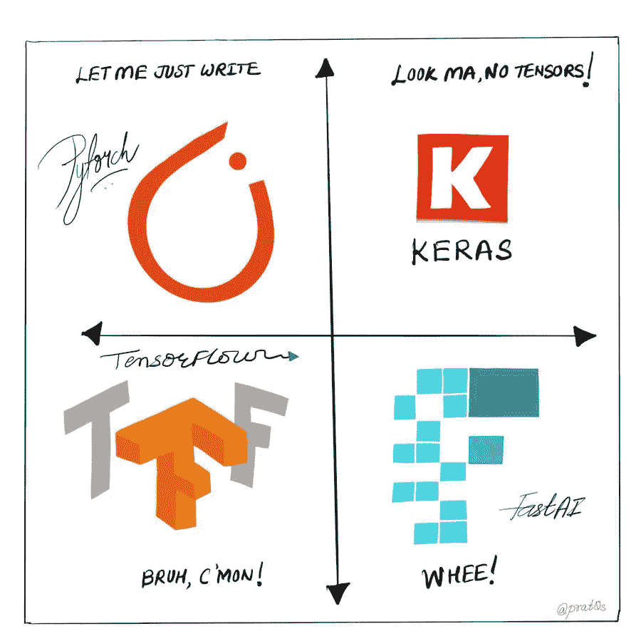

Source: [**This tweet**](https://twitter.com/prat0s/status/1100469715741204480)

尽管许多 DL 实践者是从 TensorFlow 开始他们的旅程的，但 PyTorch 已经成为一个同样受欢迎的深度学习框架，因为它是由脸书人工智能研究(FAIR)团队在 2017 年初推出的。自推出以来，它引起了全球 AI 研究人员和从业者的关注，并已显著成熟。

本质上，PyTorch 为程序员提供了极大的灵活性，使他们能够创建、组合和处理流过网络(称为计算图)的张量，并配有相对高级的面向对象的 API。

当然，原始 TensorFlow 提供了类似级别的低级灵活性，但通常很难掌握和排除故障。

此外，PyTorch 还提供了强大而简单的 API 方法来自动区分基本的反向传播流程。

见它的核心创造者，[sou Smith chint ala](https://www.linkedin.com/in/soumith/)谈谈它的起源和演变。

下面这篇文章实际上很好地提炼了 PyTorch 的本质，以及它与其他非常流行的框架 Keras/TensorFlow 的主要区别。

[](/pytorch-tutorial-distilled-95ce8781a89c) [## PyTorch 教程精华

### 从 TensorFlow 迁移到 PyTorch

towardsdatascience.com](/pytorch-tutorial-distilled-95ce8781a89c) 

在本文中，我们将展示在 PyTorch 中构建 2 层神经网络分类器(密集连接)的简单逐步过程，从而阐明一些关键特性和风格。

> PyTorch 为程序员提供了极大的灵活性，让他们可以创建、组合和处理流过网络的张量…

# 核心组件

PyTorch 的核心组件将用于构建神经分类器，

*   **张量**(py torch 中的中心数据结构)
*   张量的**自动签名的**特征(自动微分公式烘焙到
*   `**nn.Module**` **类**，用于构建任何其他神经分类器类
*   **优化器**(当然，有很多可供选择)
*   **损失**功能(有大量选择供您选择)

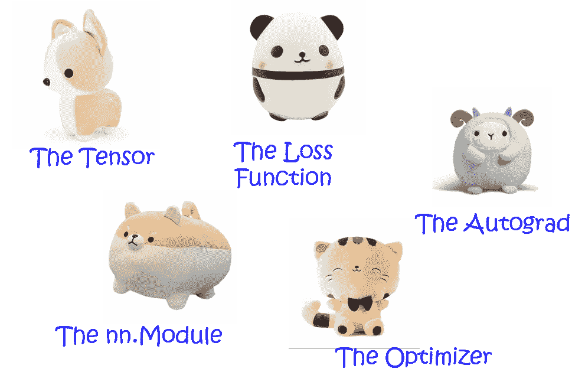

使用这些组件，我们将通过五个简单的步骤构建分类器，

*   **构建**我们的神经网络作为我们的自定义类(从`nn.Module`类继承而来)，包括隐藏层张量和一个`forward`方法，用于通过各种层和激活函数传播输入张量
*   **使用这种`forward`方法通过网络传播**特征(来自数据集)张量——假设我们得到一个`output`张量作为结果
*   **通过比较`output`和地面真实值并使用[内置损失函数](https://medium.com/udacity-pytorch-challengers/a-brief-overview-of-loss-functions-in-pytorch-c0ddb78068f7)计算**T4
*   **使用自动微分能力([](/pytorch-autograd-understanding-the-heart-of-pytorchs-magic-2686cd94ec95)**)和`backward`方法传播**的渐变**
*   ****使用损失梯度更新**网络的权重，这是通过执行所谓的优化器的一个步骤`optimizer.step()`来完成的。**

**仅此而已。这五个步骤构成了一个完整的训练时期。我们只是重复它一堆次，以降低损失，并获得高分类精度。**

**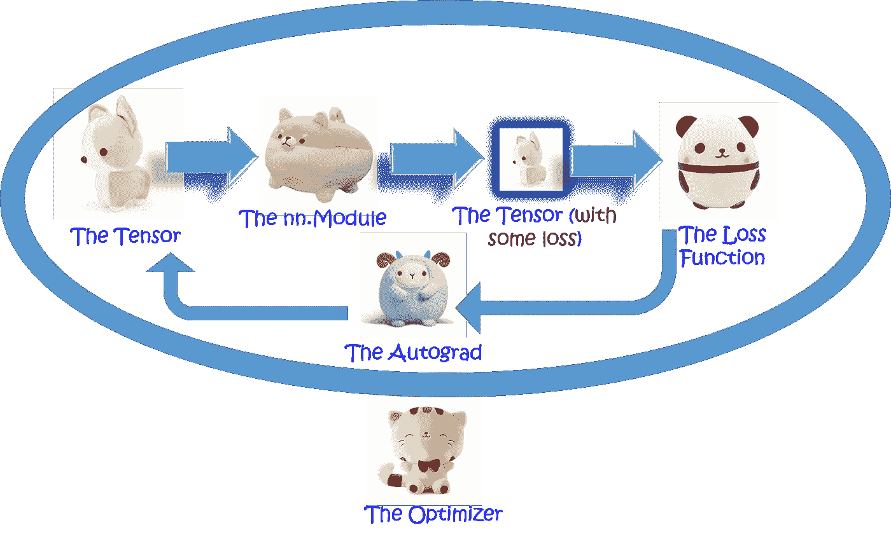**

**The five-step process with the five core components.**

> **在 PyTorch 中，我们将神经网络定义为一个自定义类，从而可以获得面向对象编程(OOP)范例的全部好处。**

## **张量**

**`[torch.Tensor](https://pytorch.org/docs/stable/tensors.html#torch.Tensor)`是包含单一数据类型元素的多维矩阵。它是框架的中心数据结构。我们可以从 Numpy 数组或列表中创建张量，并执行各种操作，如索引、数学、线性代数。**

**张量支持一些额外的增强功能，使它们变得独一无二。除了 CPU 之外，它们还可以加载到 GPU 中(通过极其简单的代码更改)以获得更快的计算速度。并且它们支持使用 [**、动态计算图(DCG)**](https://medium.com/intuitionmachine/pytorch-dynamic-computational-graphs-and-modular-deep-learning-7e7f89f18d1) 来形成跟踪应用于它们的每个操作以计算梯度的反向图。**

**[在这里阅读关于张量的官方文档](https://pytorch.org/docs/stable/tensors.html)。或者，看这个优秀的视频介绍。**

## **亲笔签名**

**当涉及到复杂的神经网络时，我们都不擅长微积分。高维空间搅乱了我们的思维。还好有亲笔签名救我们。**

> **为了处理 14 维空间中的超平面，想象一个 3 维空间并大声对自己说“14”。每个人都这样做——杰弗里·辛顿**

**张量对象支持[神奇的自动签名功能，即自动微分](/pytorch-autograd-understanding-the-heart-of-pytorchs-magic-2686cd94ec95)，这是通过在张量流经网络时跟踪和存储对其执行的所有操作来实现的。您可以观看这个精彩的教程视频，获得直观的解释。**

## **`nn.Module`类**

**在 PyTorch 中，我们通过将神经网络定义为自定义类来构建它。然而，这个类继承自`[nn.Module](https://pytorch.org/docs/stable/nn.html)` [类](https://pytorch.org/docs/stable/nn.html)，而不是从原生 Python `object`派生而来。这给神经网络类注入了有用的属性和强大的方法。我们将在文章中看到这样一个类定义的完整例子。**

## **损失函数**

**损失函数定义了神经网络的预测与实际情况有多远，损失的定量测量有助于驱动网络向对给定数据集进行最佳分类的配置靠近。**

**PyTorch 为分类和回归任务提供了所有常见的损失函数—**

*   **二元和多类交叉熵，**
*   **均方和平均绝对误差，**
*   **平滑 L1 损失，**
*   **负对数似然损失，甚至**
*   **库尔贝克-莱布勒散度。**

**[关于这些的详细讨论可以在本文](https://medium.com/udacity-pytorch-challengers/a-brief-overview-of-loss-functions-in-pytorch-c0ddb78068f7)中找到。**

## **优化器**

**优化权重以实现最低损失是用于训练神经网络的反向传播算法的核心。PyTorch 通过`[**torch.optim**](https://pytorch.org/docs/stable/optim.html)`模块提供了大量的优化器来完成这项工作**

*   **随机梯度下降(SGD)，**
*   **亚当，阿达塔，阿达格勒，斯巴达姆，**
*   **BFGS，**
*   **RMSprop 等。**

> **“五个步骤的过程构成了一个完整的训练时期。我们只是重复了很多次。”**

# **神经网络类及其训练**

## **数据**

**对于这个示例任务，我们首先使用 Scikit-learn 函数创建一些带有二进制类的合成数据。在下面的图中，数据类别由颜色区分。很明显，数据集不能通过简单的线性分类器来分离，神经网络是解决该问题的合适的机器学习工具。**

**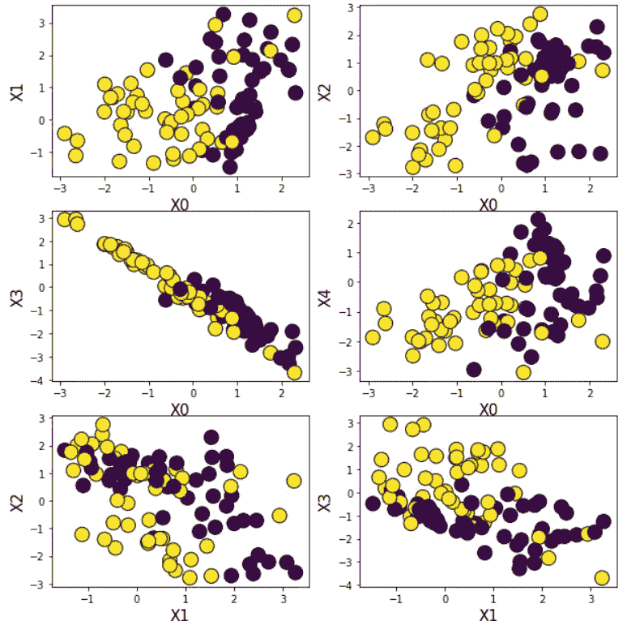**

**The synthetic dataset used for the classification example**

## **建筑**

**我们为这个演示选择了一个简单的全连接、2 隐藏层架构。如下所示，**

**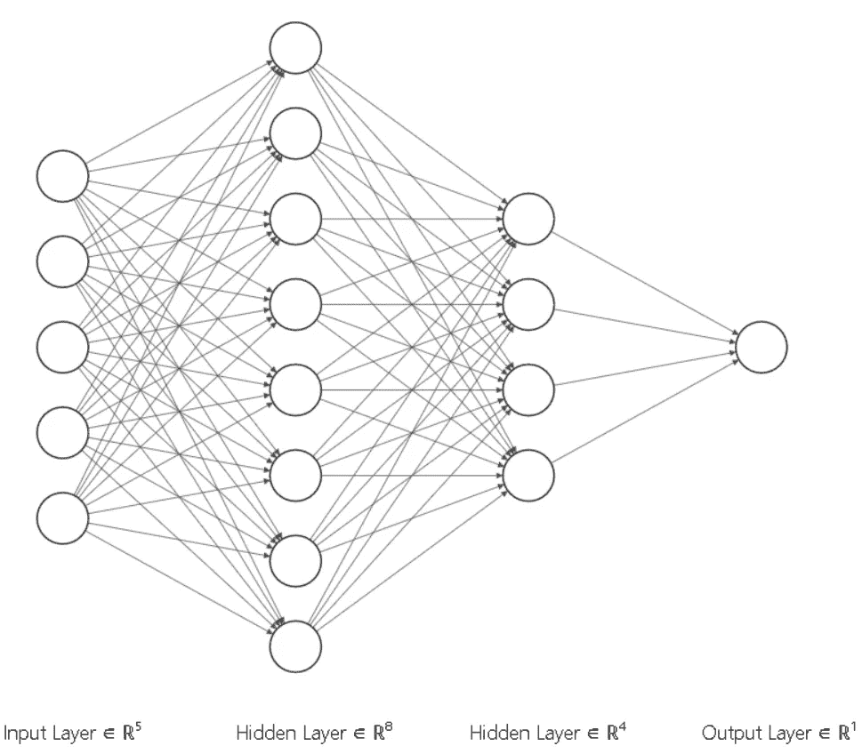**

## **类别定义**

**我们定义对应于这个架构的变量，然后定义主类。神经网络类定义如下所示。如前所述，它继承自`nn.Module`基类。**

**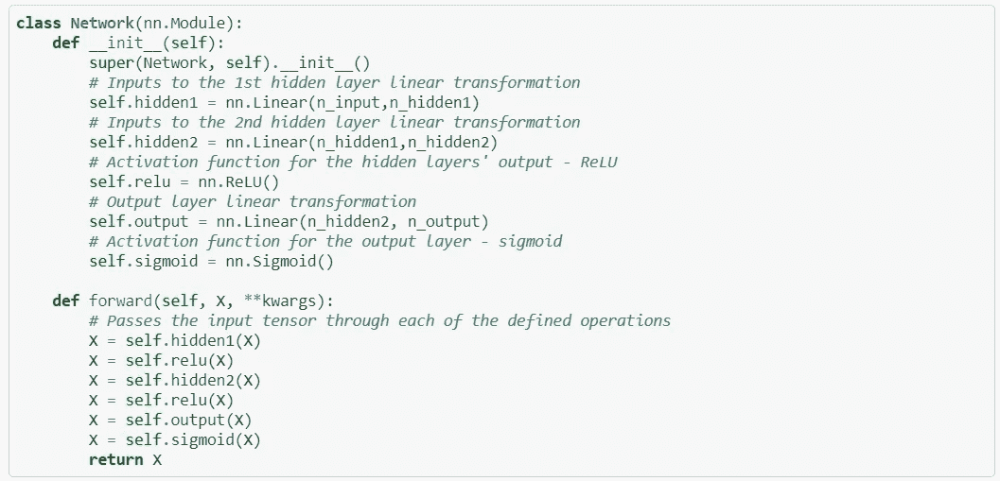**

**添加注释后，代码几乎一目了然。在方法`forward,`的定义中，与 Keras 的模型定义有很强的相似性。**

**此外，请注意内置线性代数运算的使用，如`**nn.Linear**`(层间)和激活函数的使用，如`**nn.ReLU**`和`**nn.Sigmoid**`在层的输出。**

**如果我们实例化一个模型对象并打印出来，就会看到结构(平行于 Keras 的`model.summary()`方法)。**

## **损失函数、优化器和训练**

**我们为此任务选择二元交叉熵损失，并将其定义如下(是的，按照惯例，损失函数在 PyTorch 中通常被称为`criterion`)**

```
criterion = nn.BCELoss() *# Binary cross-entropy loss*
```

**此时，让我们通过我们定义的神经网络模型运行输入数据集，即向前传递一次，并计算输出概率。由于权重已经被初始化为随机的，我们将看到随机的输出概率(大多接近 0.5)。这个网络还没有被训练。**

```
logits = model.forward(X) *# Output of the forward pass (logits i.e. probabilities)*
```

**如果我们打印前 10 个概率，我们会得到这样的结果，**

```
tensor([[0.5926],[0.5854],[0.5369],[0.5802],[0.5905],[0.6010],[0.5723],[0.5842],[0.5971],[0.5883]], grad_fn=<SliceBackward>)
```

**所有的输出概率看起来都接近 0.5，**

**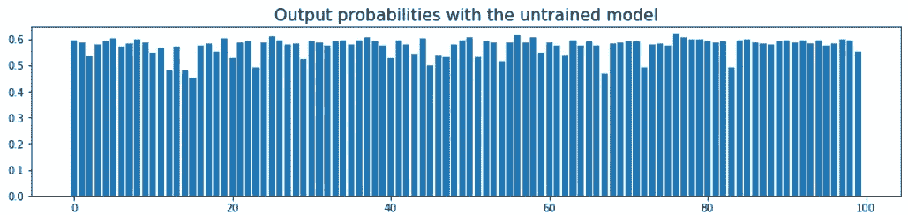**

**平均损耗是使用简单的，**

```
loss = criterion(logits,y)
```

**对于优化器，我们选择简单的随机梯度下降(SGD ),并指定学习率为 0.1，**

```
from torch import optim
optimizer = optim.SGD(model.parameters(),lr=0.1)
```

**现在开始训练。我们再次遵循一个五步流程**

*   **将梯度重置为零(防止梯度累积)**
*   **通过层向前传递张量**
*   **计算损失张量**
*   **计算损失的梯度**
*   **通过将优化器增加一个步长(在负梯度的方向上)来更新权重**

**令人惊讶的是，如果你阅读了上面的五个步骤，这正是你在所有关于神经网络的理论讨论(以及所有教科书)中看到的。使用 PyTorch，你可以用看似简单的代码一步一步地实现这个过程。**

**没有什么是对你隐藏或抽象的。您会感受到用**五行 Python 代码**实现神经网络训练过程的原始力量和兴奋！**

****

## **多个时期的训练**

**那只是一个时代。现在，我们很清楚一个时代是不够的，不是吗？对于运行多个时期，只需使用一个循环。**

**并且当运行 1000 个周期时，可以容易地产生所有熟悉的损失曲线。**

**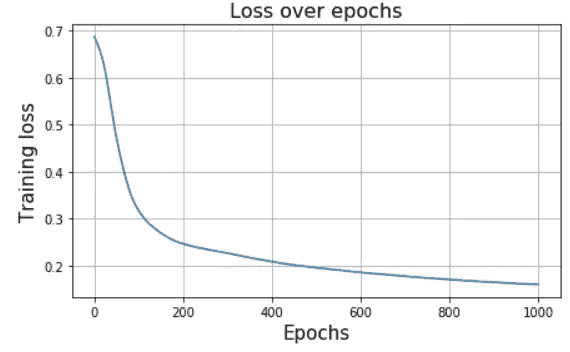**

## **想看看概率是如何随时间演变的吗？**

**PyTorch 赋予你实验、探索、打破和动摇事物的力量。**

**只是为了好玩，如果您想检查输出层概率如何在多个时期内演变，对前面代码的简单修改就可以做到这一点，**

**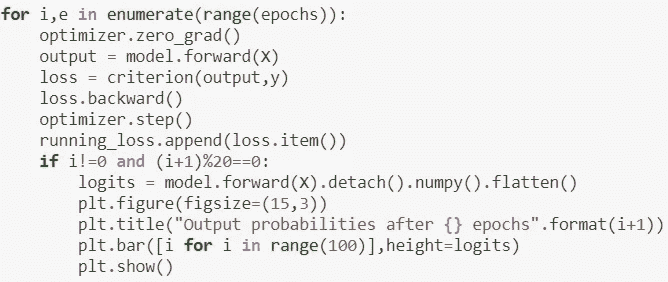**

**这就对了，**

**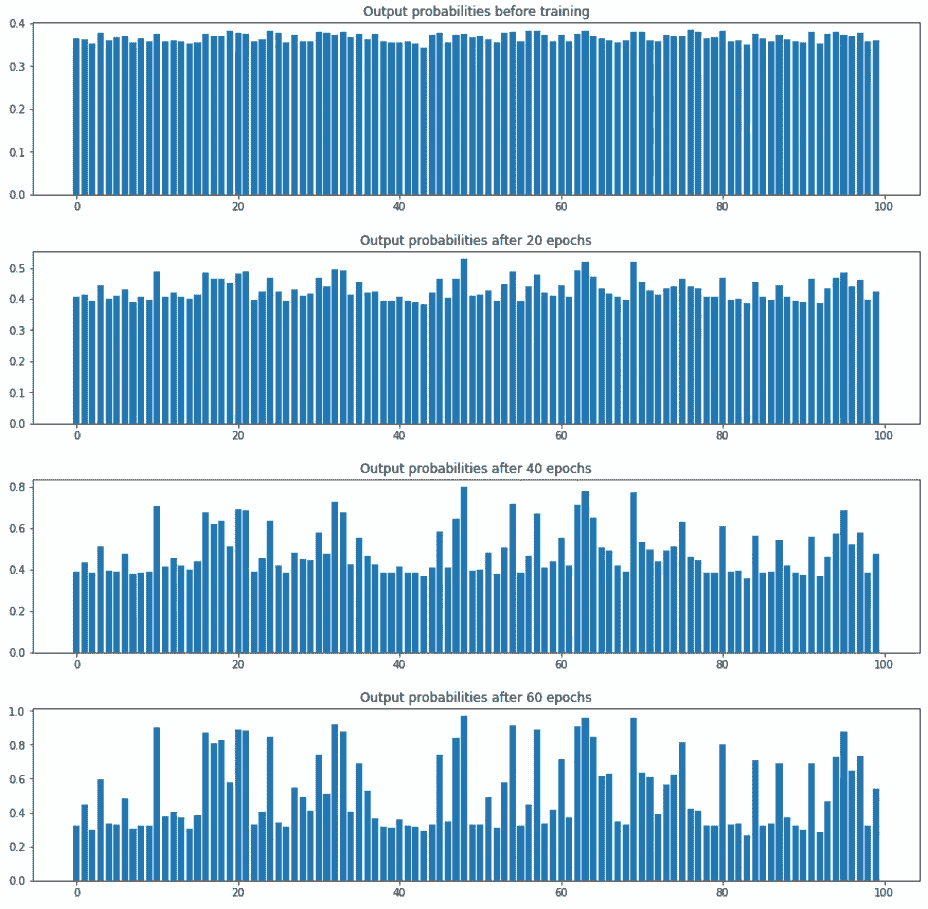**

**显然，未训练的网络输出都接近 1，即不区分正类和负类。随着训练的继续，通过调整网络的权重，概率彼此分离，逐渐试图匹配地面真实的分布。**

> **PyTorch 赋予你实验、探索、打破和动摇事物的力量。**

# **有其他时髦的想法吗？试穿一下**

**PyTorch 从其早期发布开始，就非常受欢迎，尤其是在学术研究人员和创业公司中。这背后的原因很简单——它让你通过简单的代码重构来尝试你疯狂的想法。实验是任何科学领域新思想进步的核心，当然，深度学习也不例外。**

## **用两个激活功能混起来？**

**(有点)疯狂的是，让我们假设我们想用两种不同的激活函数混合它——ReLU 和双曲正切(tanh)。我们想把张量分成两个平行的部分，分别对它们应用这些激活，把结果张量相加，然后正常传播。**

**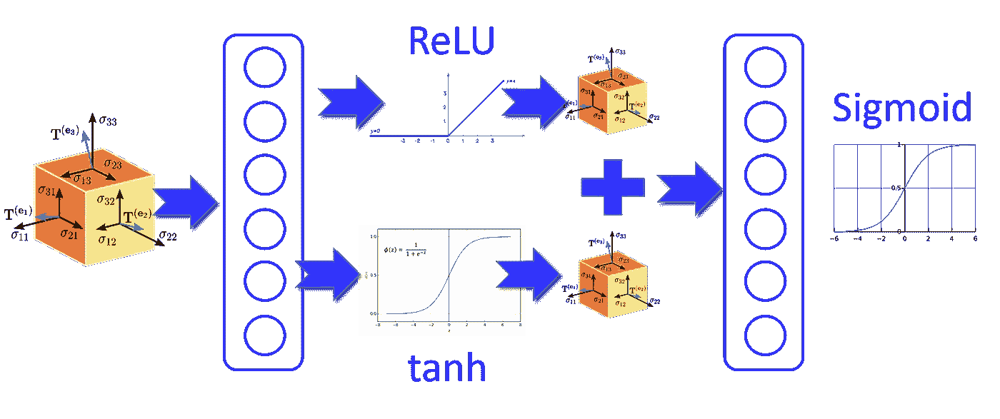**

**看起来很复杂？实现这个的代码正是你所想的。将输入张量(如 ***X*** )通过第一个隐藏层，然后通过单独的激活函数创建两个张量 ***X1*** 和***【X2****】流动合成张量。简单地将合成张量相加，并通过第二个隐藏层。***

***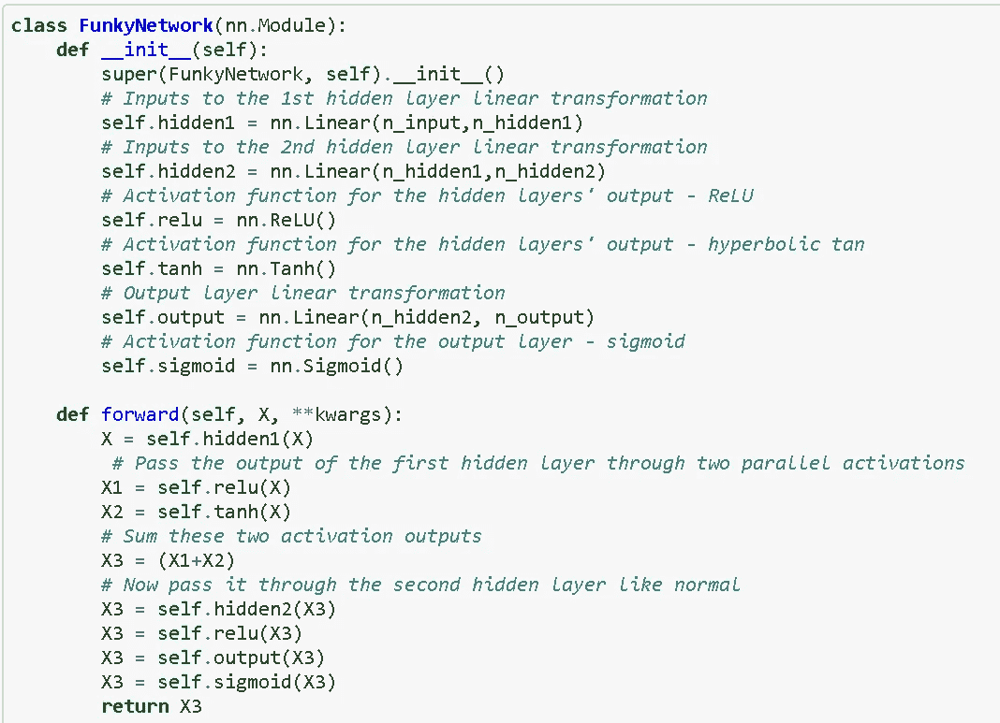***

***你会得到什么好处吗？谁知道呢？但是你可以用 PyTorch 很容易地做这种实验性的东西和改变网络的架构。***

> ***实验是任何科学领域新思想进步的核心，当然，深度学习也不例外。***

## ***试试自己定制的损失函数？***

***你可能想试试你自己定制的损失函数。我们从高中时代就开始使用均方差了。试一下回归问题的误差的四次方如何？***

***只需定义函数…***

***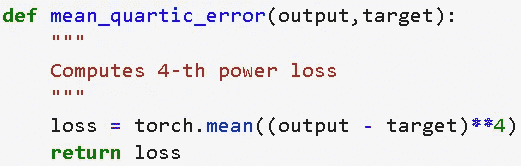***

***然后在您的代码中使用它(注意新的模型`reg_model`，它可以通过关闭我们的`Network`类的输出中的 sigmoid 激活来构造。***

***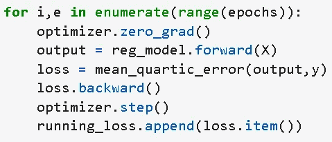***

***现在，你有这种感觉吗？***

***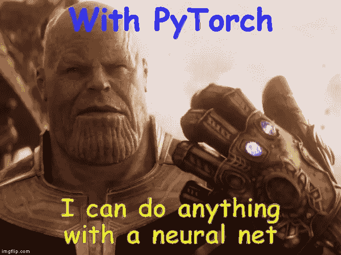***

# ***摘要***

***这个演示 [**的所有代码都可以在我的 Github repo**](https://github.com/tirthajyoti/PyTorch_Machine_Learning) 这里找到。***

***PyTorch 是一个很棒的软件包，可以深入到神经网络的核心，为您的应用程序定制它，或者尝试网络的架构、优化和机制方面的大胆的新想法。***

***在本文中，我们总结了几个关键步骤，可以遵循这些步骤来快速构建用于分类或回归任务的神经网络。我们还展示了如何用这个框架轻松地试验出好的想法。***

***走出去，建立你最喜欢的网络，解决你的机器学习问题。可能性是无限的！***

***如果你有任何问题或想法要分享，请联系作者[**tirthajyoti【AT】Gmail . com**](mailto:tirthajyoti@gmail.com)。此外，您可以查看作者的 [**GitHub**](https://github.com/tirthajyoti?tab=repositories) **资源库**中的代码、思想和机器学习和数据科学方面的资源。如果你像我一样，对人工智能/机器学习/数据科学充满热情，请随时[在 LinkedIn 上添加我](https://www.linkedin.com/in/tirthajyoti-sarkar-2127aa7/)或[在 Twitter 上关注我](https://twitter.com/tirthajyotiS)。***

***[](https://www.linkedin.com/in/tirthajyoti-sarkar-2127aa7/) [## Tirthajyoti Sarkar - Sr .首席工程师-半导体、人工智能、机器学习- ON…

### 通过写作使数据科学/ML 概念易于理解:https://medium.com/@tirthajyoti 开源和有趣…

www.linkedin.com](https://www.linkedin.com/in/tirthajyoti-sarkar-2127aa7/)***