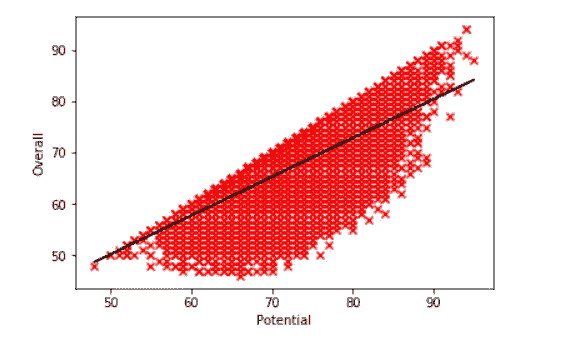

# 回归分析如何工作

> 原文：<https://towardsdatascience.com/how-regression-analysis-works-10f44c37b20a?source=collection_archive---------7----------------------->



## 不同形式的回归分析及其应用

R 回归分析是一种机器学习算法，可用于衡量自变量与因变量的相关程度。回归分析的一个广泛应用是在数据集上建立模型，精确预测因变量的值。

# 回归分析分步指南

在回归分析开始时，数据集可以分为两组:训练数据集和测试数据集。训练数据集可用于创建模型，以找出将最佳拟合线应用到图表中的最佳方法。因此，它可以是一条直线，也可以是一条曲线，很容易与自变量对因变量的图形相吻合。

这个新创建的模型可用于预测测试数据集的因变量。然后，预测值可以通过使用不同的精度测量值(如 R 平方、均方根误差、均方根误差、皮尔逊相关系数等)与原始因变量值进行比较。

如果准确度分数不够准确，并且想要建立更强的模型，则可以改变分配给训练和测试数据集的数据集的百分比。例如，如果训练数据集有 70 %的数据集，而测试数据集有 30%，那么训练数据集现在可以有 80%的数据集，而测试数据集有 20%。

获得更强模型的另一种方式是通过从线性回归分析变为多项式回归分析或者从多元线性回归分析变为多元多项式回归分析。

对于连续变量有不同的回归分析方法，如线性回归、多元线性回归、多项式回归和多元多项式回归。

# 不同形式的回归分析

## 线性回归

线性回归通过使用自变量来预测因变量的值。

在线性回归中，最佳拟合线用于从训练数据集中获得方程，然后该方程可用于预测测试数据集的值。该方程可以是这样的形式: *y = mx + b* 其中 *y* 是预测值*，m* 是直线的斜率，而 *b* 是直线与 y 轴相交的点。以下是在 python 中运行线性回归的一组代码:

该代码是基于 FIFA 19 球员评级的数据集完成的。在这里，潜力被用来预测玩家的总体评分。

```
**import** **numpy** **as** **np** ## The dataset is split into two groups below. The training dataset ## had 75% of the dataset and the testing dataset had 25%
split = np.random.rand(len(df_fifa)) < 0.75
train = df_fifa[split]
test = df_fifa[~split]
## A regression model is created
regr = linear_model.LinearRegression()
## Training and fitting the model
fifa_x_train = train[['Potential']]
fifa_y_train = train[['Overall']]
regr.fit(fifa_x_train, fifa_y_train)
## Predicting the dependent variables in the testing dataset
fifa_x_test = test[['Potential']]
fifa_y_test = test[['Overall']]
df_fifa_pred = regr.predict(fifa_x_test)
## Testing the accuracy of the linear model using R-squared
r2_score(fifa_y_test, df_fifa_pred)
```

## 多项式回归

多项式回归可以用一个自变量来预测因变量的值。

在多项式回归中，最佳拟合曲线用于从训练数据集中获得方程，然后该方程可用于预测测试数据集的值。

在多项式回归的情况下，方程可以是以下形式: *y = ax^n + bx^n-1 + …+ c* 其中 *y* 是预测值*，a 和 b* 是方程的常数， *n* 是确定曲线形状的方程的最高次，而 *c* 是 *x* 为 0 的点。基于 n 的值，该等式可以是二次、三次、四次或更多次。以下是在 python 中运行多项式回归的一组代码:

该代码是基于 FIFA 19 球员评级的数据集完成的。在这里，潜力被用来预测玩家的总体评分。

```
**import** **numpy** **as** **np** ## The dataset is split into two groups below. The training dataset ## had 75% of the dataset and the testing dataset had 25%
split = np.random.rand(len(df_fifa)) < 0.75
train = df_fifa[split]
test = df_fifa[~split]
## A regression model is created
regr = linear_model.LinearRegression()
## Training ,transforming the independent variable into a polynomial ## fit and fitting the model 
fifa_x_train = train[['Potential']]
fifa_y_train = train[['Overall']]
poly = PolynomialFeatures(degree=4)
fifa_x_train_poly = poly.fit_transform(fifa_x_train)
regr.fit(fifa_x_train_poly, fifa_y_train)
## Transforming the testing dataset and predicting the dependent 
## variables in the testing dataset
fifa_x_test = test[['Potential']]
fifa_y_test = test[['Overall']]
fifa_x_test_poly = poly.fit_transform(fifa_x_test)
df_fifa_pred = regr.predict(fifa_x_test_poly)
## Testing the accuracy of the polynomial model using R-squared
r2_score(fifa_y_test, df_fifa_pred)
```

## 多元线性回归

多元线性回归使用两个或多个自变量来预测因变量的值。

在多元线性回归中，多条最佳拟合线用于从训练数据集中获得通用方程，然后该方程可用于预测测试数据集的值。一般方程可以是这样的形式: *y = ax+ bx2 +…+ c* 其中 *y* 是预测值*，a 和 b 是*连接自变量和因变量的直线的斜率，而 *c* 是直线与 y 轴相交的点。以下是在 python 中运行多元线性回归的一组代码:

该代码是基于 FIFA 19 球员评级的数据集完成的。年龄、潜力、货币价值和释放条款被用来预测球员的总体评分。

```
**import** **numpy** **as** **np** ## The dataset is split into two groups below. The training dataset ## had 75% of the dataset and the testing dataset had 25%
split = np.random.rand(len(df_fifa)) < 0.75
train = df_fifa[split]
test = df_fifa[~split]
## A regression model is created
regr = linear_model.LinearRegression()
## Training and fitting the model
fifa_x_train = train[['Age','Value','Potential','Release Clause']]
fifa_y_train = train[['Overall']]
regr.fit(fifa_x_train, fifa_y_train)
## Predicting the dependent variables in the testing dataset
fifa_x_test = test[['Age','Value','Potential','Release Clause']]
fifa_y_test = test[['Overall']]
df_fifa_pred = regr.predict(fifa_x_test)
## Testing the accuracy of the linear model using R-squared
r2_score(fifa_y_test, df_fifa_pred)
```

## 多元多项式回归

多元多项式回归是通过使用两个或多个自变量来预测因变量的值。

对于多元多项式回归，最佳拟合的多条曲线用于从训练数据集中获得通用方程，该方程然后可用于预测测试数据集的值。

在多元多项式回归的情况下，一般方程可以是这样的形式: *y = ax^n + bx^n-1 + …+ c* 其中 *y* 是预测值*，a 和 b* 是方程的常数， *n* 是确定曲线形状的方程的最高次，而 *c* 是 *x* 为 0 的点。基于 *n* 的值，该等式可以是二次、三次、四次或更多次。以下是在 python 中运行多元多项式回归的一组代码:

该代码是基于 FIFA 19 球员评级的数据集完成的。年龄、潜力、货币价值和释放条款被用来预测球员的总体评分。

```
**import** **numpy** **as** **np** ## The dataset is split into two groups below. The training dataset ## had 75% of the dataset and the testing dataset had 25%
split = np.random.rand(len(df_fifa)) < 0.75
train = df_fifa[split]
test = df_fifa[~split]
## A regression model is created
regr = linear_model.LinearRegression()
## Training ,transforming the independent variable into a polynomial ## fit and fitting the model 
fifa_x_train = train[['Age','Value','Potential','Release Clause']]
fifa_y_train = train[['Overall']]
poly = PolynomialFeatures(degree=4)
fifa_x_train_poly = poly.fit_transform(fifa_x_train)
regr.fit(fifa_x_train_poly, fifa_y_train)
## Transforming the testing dataset and predicting the dependent 
## variables in the testing dataset
fifa_x_test = test[['Age','Value','Potential','Release Clause']]
fifa_y_test = test[['Overall']]
fifa_x_test_poly = poly.fit_transform(fifa_x_test)
df_fifa_pred = regr.predict(fifa_x_test_poly)
## Testing the accuracy of the polynomial model using R-squared
r2_score(fifa_y_test, df_fifa_pred)
```

# 结论

回归分析是一种非常有趣的机器学习技术，可以应用于不同的领域来预测数值，例如预测产品/房屋的价格，预测足球运动员在一个赛季中的进球数量以及预测人的身体质量指数。