# 亚马逊评论有多靠谱？

> 原文：<https://towardsdatascience.com/how-reliable-are-amazon-reviews-eb8c454c96a4?source=collection_archive---------14----------------------->

## 建立一个识别虚假评论的索引

# **简介**

作为一个自称的技术爱好者，我关注技术评论社区已经有一段时间了，尤其是在 YouTube 上。在那段时间里，我发现每次新 iPhone 发布后都会出现一种特定的模式:非常受欢迎的视频(以及文章)会被发布，批评新 iPhone 的初始问题。

然而，苹果的销售数字似乎并没有受到其发布日期周围的负面气氛的影响。这让我想知道谁受这些视频和文章的影响最大，以及它们是否会影响苹果的客户满意度。事实上，如果这些评论影响了苹果的客户，一个更宽松的发布时间表，给苹果更多的时间来完善 iPhone 的新功能，可能会提高苹果的客户满意度。

# 为什么是 amazon.co.uk 的 T2？

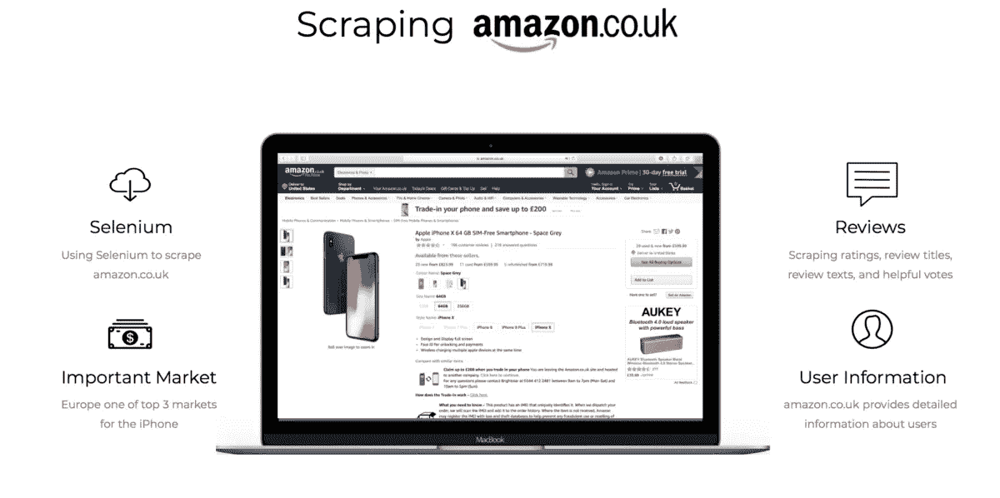

我选择刮 amazon.co.uk 有几个原因。首先，除了中国，欧洲可以说是 iPhone T5 在 T4 最重要的海外市场。因此，来自英国的顾客评论呈现了苹果的相关信息。其次，亚马逊让我不仅可以收集评论本身的信息(评分、标题、文本、有用的投票)，还可以收集发布评论的亚马逊用户的信息。通过点击用户名，我可以收集每个用户的信息，比如有用的投票和评论的总数，以及所有发布的评论。

在进行我的研究时，我选择专门关注 2017 年 11 月至 2018 年 9 月期间对 iPhone X 的评论，以便只收集该时间点最新 iPhone 的评论。未来的研究可能会将同样的概念应用于老款 iPhones。

# **工作流程**

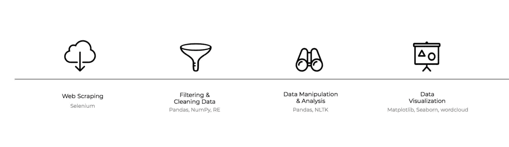

我使用 Selenium 来抓取 amazon.co.uk，主要是因为它在不同网站间导航的灵活性。

在收集了数据之后，我准备并清理了数据，主要是使用 Pandas、NumPy 和 RE。这一步包括识别和适当地处理丢失的值，修改我的代码，以及重新格式化收集的数据，以便进行进一步的处理和分析。

然后，我处理并分析了这些数据，将它们分成小组并比较它们的特征。

最后，我用 matplotlib、seaborn 和 wordcloud 可视化了我的分析结果。

# **每月审核次数**

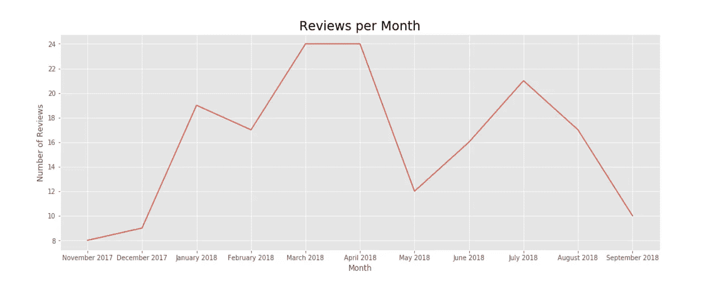

我分析的第一部分重点是从 2017 年 11 月 iPhone 的第一批评论到 2018 年 9 月每个月的评论数量。与我最初的预期相反，在 iPhone 发布期间，相关评论相对较少。然后，在 2017 年 12 月左右，评论数量开始显著增加，在 2018 年 3/4 月达到顶峰。

我对此次发布的评论数量相对较低的怀疑是，首先，iPhone 在欧洲的发布时间晚于美国，这可能会导致评论延迟。此外，英国的消费者可能会等到圣诞节才购买 iPhone，这可以解释 12 月份的增长。

# **已验证与未验证的评论**

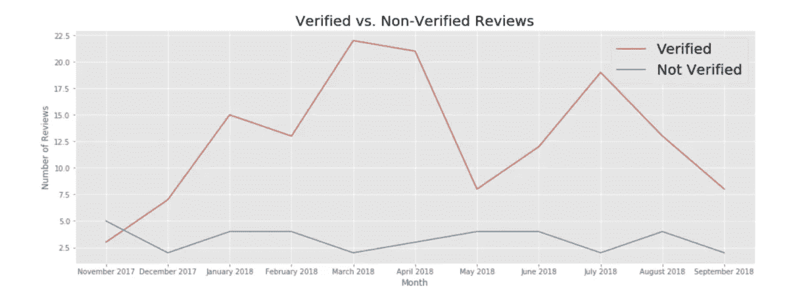

接下来，我将评论分为两类:已验证和未验证的评论。一般来说，经过核实的评论明显多于未经核实的评论。然而，唯一一次未经核实的评论数量超过经核实的评论数量的时刻是 2017 年 11 月，就在 iPhone 发布之后。这一发现让我更加怀疑，iPhone 发布时互联网上普遍负面的气氛并不是由苹果的客户造成的，而是由不喜欢苹果公司的人造成的。

此外，该折线图显示，之前确定的评论增加几乎完全由已验证的评论驱动，而未验证的评论在 2017 年 11 月之后减少，并且从未真正再次增加。

在证明了经过验证和未经验证的评论数量之间的实质性差异后，我决定深入研究并比较这两组评论的平均评分。下面的箱线图显示了结果:

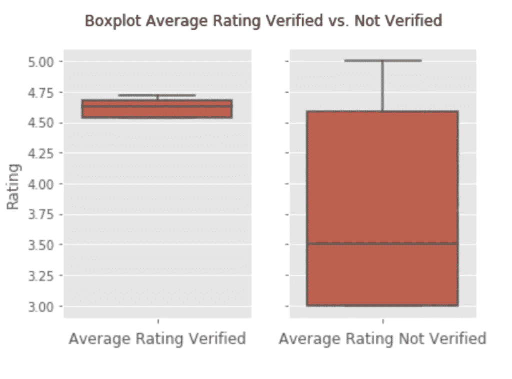

这个箱线图表明，这两种类型的评论不仅在评论数量上有很大差异，而且在平均评分上也有很大差异。虽然已验证评论的平均评级集中在 4.50 和 4.75 之间，第一和第三四分位数彼此非常接近，但未验证评论的平均评级显示出很大的可变性。最重要的是，未经核实的平均评分中值约为 3.50，这进一步证明了我的猜测，即实际的苹果客户普遍对他们的 iPhone 非常满意，并且没有受到互联网上负面评论的影响。

为了证实这些发现，我仔细研究了 2017 年 11 月发表的按评论类型分组的评论:

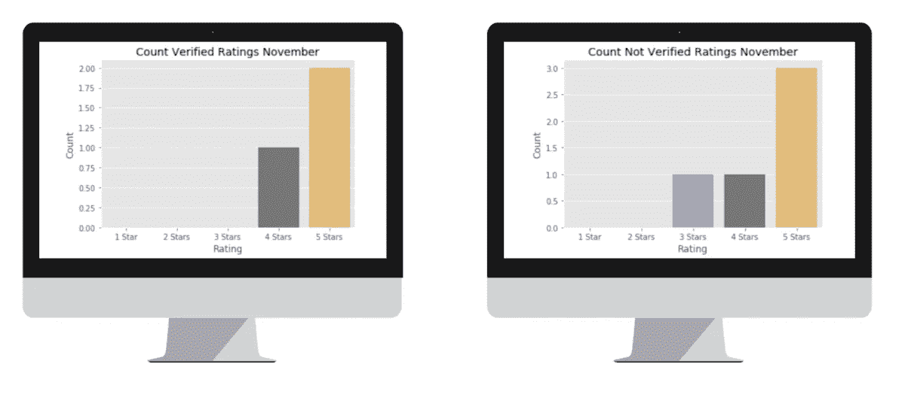

虽然相对少的评论数量不允许非常可靠的结论，但是在已验证和未验证的评级之间仍然存在明显的差异，已验证的评级通常比未验证的评级更受欢迎。

# **分析复习课文**

在我的下一步中，我专门关注已验证评论的评论文本，并在准备数据后，生成了一个词云，允许快速概述已验证评论的总体情绪:

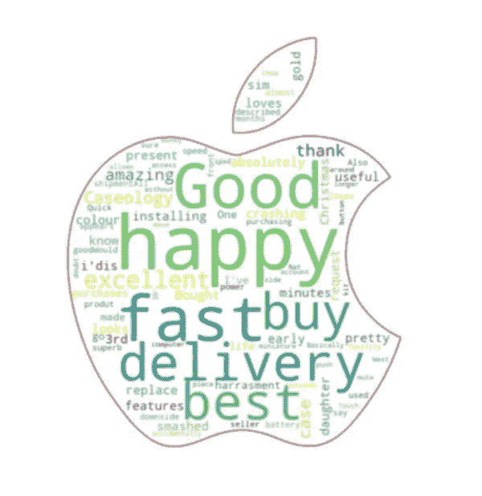

同样，这个词云中的大多数词都是积极的，表示对 iPhone X 的满意(“开心”、“优秀”、“最好”)。此外，交付似乎对客户非常重要，这不一定是苹果的洞察力，但肯定是亚马逊的。

在这个词云中找到否定词，要么需要非常好的眼睛，要么需要放大镜。如果你拥有其中任何一个，你可能会发现“崩溃”或“粉碎”，然而，负面词汇的大小和罕见程度为实际苹果客户的高满意度提供了进一步的证据。

# **造假审查指标**

在这一点上，我几乎准备好结束我的项目，并包括一些更多的描述可视化来证明我的观点。

然而，在抽样调查了一些评论后，我开始怀疑到底有多少评论是由真正购买了该产品的人发表的。有些评论，甚至是经过验证的评论，在我看来都非常可疑。为了减少由于不知道哪些评论是真实的而带来的不确定性，我想出了一个我命名为*虚假评论指数*的东西。

为了将虚假评论指数纳入我的研究，我决定重新开始搜集，不仅收集评论，还收集每个用户的相关信息。然后，我使用这些信息，根据以下 6 个因素来计算虚假评论指数:

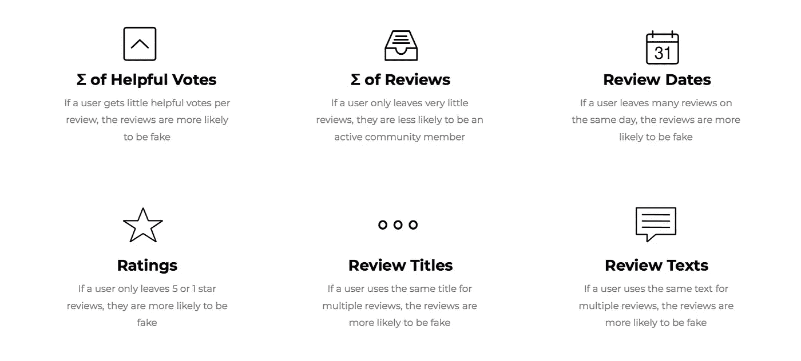

我通过为这些因素分配权重和分类几个场景来计算虚假评论指数。例如，*有用投票数/评论数*因子的最高分是 10。这个因素的一种情况如下:如果给定用户的这个计算结果返回小于或等于 1 的数字(=用户对他的所有帖子平均收到小于或等于 1 的有用投票)，则用户的虚假评论指数增加 10。因此，*假评论指数*越低，*越有可能*是真评论。

虽然虚假评论指数还不是非常复杂，但我非常有信心它至少能够识别最明显的虚假评论并将其过滤掉。

为了说明虚假评论指数，我加入了两个不同用户对 iPhone X 的评论:

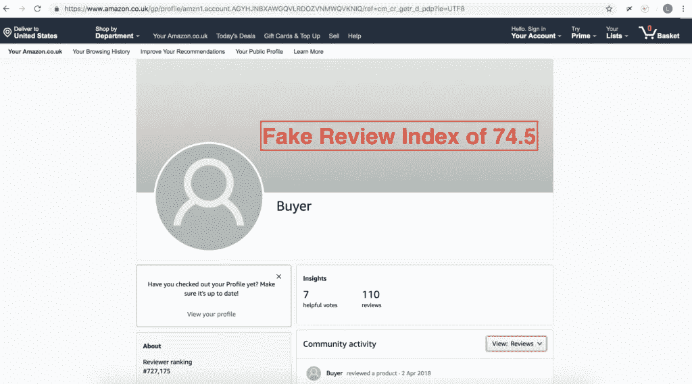

这个用户收到了 74.5 的假评论指数。从他的评论中可以明显看出，他几乎没有得到有用的投票，他的评论看起来也不真实。此外，该用户主要使用 5 星评级，并在同一天发布不同产品的几条评论。因此，他得到高的虚假评论指数分数。

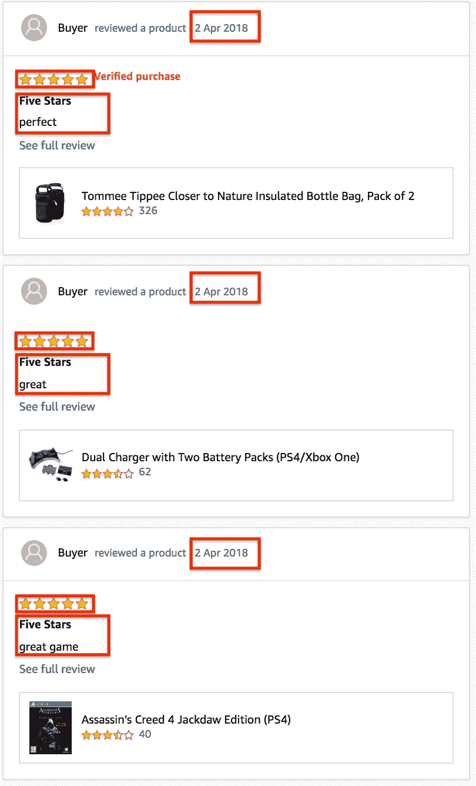

第二个用户收到的虚假评论指数为 27，这使得他的评论很可能是真实的。事实上，这个档案似乎属于亚马逊评论社区的一名活跃成员，因为他的评论实际上详细描述了他对该产品的体验，不仅包括 5 星评级，还获得了更多有用的投票:

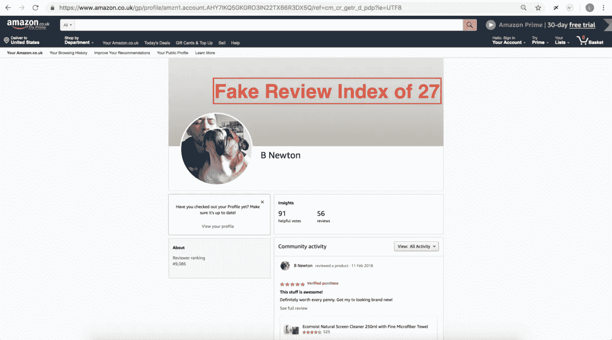

最后，在根据评论的虚假评论指数对其进行分组后，我得出了一个有趣的观察结果:评论越有可能是真实的，平均评分就越低。虽然下降幅度不是很大，但仍然很显著，因为很可能是真实的评论的平均评分约为 3.8。这个评分仍然很高，证明苹果的客户非常满意，尽管如此，它并不像之前讨论的验证评论的平均 4.5-4.75 那样高。

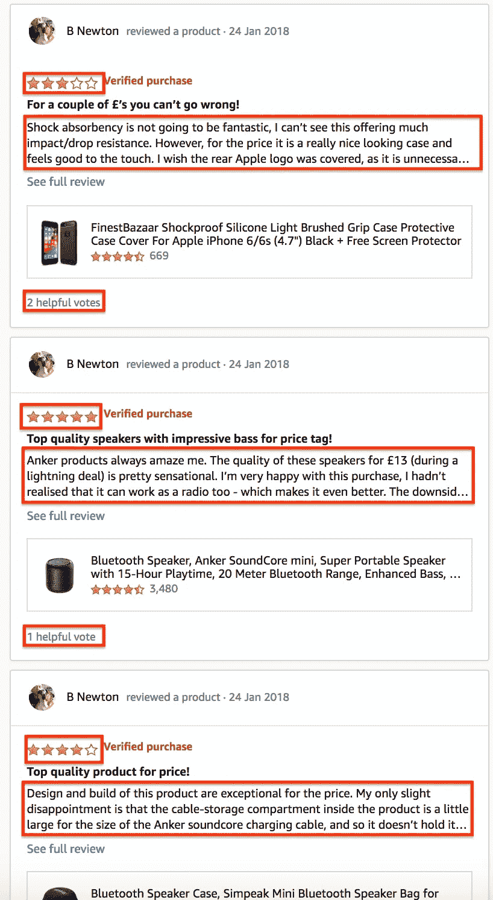

# **总结**

综上，苹果的客户满意度还是很高的。iPhone 发布时互联网上的负面氛围，主要可以归咎于非客户。然而，当考虑到评论的真实性时，苹果的客户满意度并不像人们乍一看可能怀疑的那样高。

这个项目未来的扩展将包括一个更完善和复杂的虚假评论指数，然后可以普遍应用于不同的评论网站，使公司能够筛选出他们的客户中最相关的评论和趋势。

*最初发表于*[T5【nycdatascience.com】](https://nycdatascience.com/blog/student-works/does-apples-fixed-iphone-release-schedule-hurt-its-customer-satisfaction/)*。*