# 圣地亚哥的街道有多安全？

> 原文：<https://towardsdatascience.com/how-safe-are-the-streets-of-santiago-e01ba483ce4b?source=collection_archive---------10----------------------->

## 用 Python 和 GeoPandas 来回答一下吧！


*Costanera Center, Santiago / Benja Gremler*

前段时间我写了一篇文章，解释了如何用 Python 处理地理地图，用的是“硬方法”(主要是 *Shapely* 和*熊猫* ): [用 Python 绘制地理数据](/mapping-geograph-data-in-python-610a963d2d7f)。现在是时候再做一次了，但这次，用一种简单的方式解释如何做，使用 [GeoPandas，](http://geopandas.org/index.html)可以理解为 Pandas + Shapely 在同一个包中。

> *Geopandas 是一个开源项目，旨在简化 Python 中地理空间数据的使用。GeoPandas 扩展了 Pandas 使用的数据类型，允许对几何类型进行空间操作。*

这篇文章的动机是最近由 Oscar Peredo 教授提出的一个项目，该项目由我的同事 Fran Gortari 和 Manuel Sacasa 为我们 UDD 大学数据科学硕士学位的大数据分析课程开发。

[](https://github.com/Mjrovai/UDD_Master_Data_Science/blob/master/BDA%20_Car_Crash_Prediction/03_CAR_CRASHES_WHITE_PAPER_2019.pdf)

该项目的目标是利用最先进的机器学习算法，根据 2013 年至 2018 年的公共汽车碰撞数据，探索预测城市电网碰撞风险得分的可能性。另一方面，本文的目的只是学习如何在实际问题中使用 GeoPandas，回答一个问题:

"圣地亚哥的街道有多安全？"。

> *如果你想知道我们为我们的 DS Master deegre 做了什么，请访问它的* [*GitHub 库*](https://github.com/Mjrovai/UDD_Master_Data_Science/tree/master/BDA%20_Car_Crash_Prediction) *。*

## 安装 GeoPandas

使用 GeoPandas 时，您应该做的第一件事是创建一个全新的 Python 环境，并从该环境安装软件包。如果所有依赖项都已安装，您可以使用 PIP 简单地安装它:

```
pip install geopandas
```

但是正如 [GeoPandas 官方页面](http://geopandas.org/install.html)上所推荐的，在一个全新的环境中实现它的最佳方式是使用 conda (GeoPandas 及其所有依赖项都可以在 *conda-forge* 频道上获得):

```
conda install --channel conda-forge geopandas
```

## 从 GeoPandas 开始

学习 GeoPandas 的一个很好的开始就是跟随 Benjamin Colley 的文章: [*让我们制作一张地图吧！使用 Geopandas、pandas 和 Matplotlib 制作一个 Choropleth 地图*](/lets-make-a-map-using-geopandas-pandas-and-matplotlib-to-make-a-chloropleth-map-dddc31c1983d) ，还可以看看西班牙语版爱德华多·格雷尔-加里多的作品[*Workshop de cartografía en Python*](https://github.com/carnby/carto-en-python)*。*

使用地理地图时，定义将使用哪种地球投影至关重要。在本文中，使用的实际坐标是纬度-经度( [EPSG: 4326](https://en.wikipedia.org/wiki/World_Geodetic_System) )模式，其单位是十进制度，并且是在参考球面或椭球面上:


**WGS 84** (also known as **WGS 1984**, **EPSG:4326)**

另一种可能性是使用横轴墨卡托投影，这将是以米为单位的 2D 地图(对于智利“ESPG: 5361”):

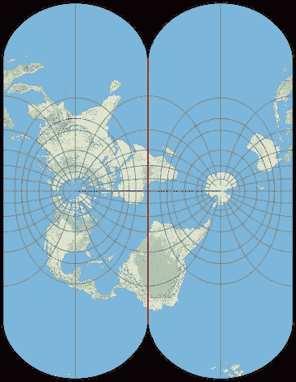

这是你的选择，但要考虑到你不能把它们混在一起。

## 我们来绘制地图吧！

一旦安装了 GeoPandas，让我们开始导入一些基本的库:

```
import numpy as np
import pandas as pd
import matplotlib.pyplot as plt
import seaborn as sns
import geopandas as gpd
from shapely.geometry import Point, Polygon
```

我们将下载的第一个形状将是定义我们工作区域的多边形。在我们的情况下，圣地亚哥市区！矢量地图可以在[智利国会图书馆](https://www.bcn.cl/siit/mapas_vectoriales/index_html) (BCN)找到。

可用地图以 shapefile 格式包含智利所有 400 个城市区域。我们应该将其过滤为“圣地亚哥”,并将其转换为 ESPG:4326:

```
sf_path = "../data/BCN/areas_urbanas/areas_urbanas.shp"
sf = gpd.read_file(sf_path, encoding='utf-8')
stgo_sf = sf[sf.NOMBRE == 'Santiago']
stgo_shape = stgo_sf.to_crs({'init': 'epsg:4326'})
stgo_shape
```

此时，我们有一个 geopandas 数据帧，它只有一条线，除了长度和面积等数据外，还包括“几何图形”，即“包围”所有城市的多边形的坐标:

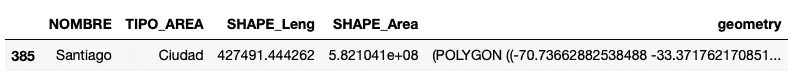

我们可以绘制这个地理数据框架，就像我们习惯于绘制正常的熊猫数据框架一样:

```
stgo_shape.plot()
```

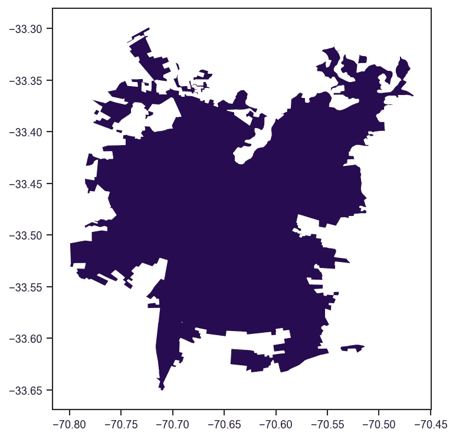

> *注意，经度(横轴)从大约-70.80(西)到-70.45(东)，纬度(纵轴)从-33.65(南)到-33.30(北)。*

您可以使用以下方式确认准确的城市边界:

```
stgo_shape.total_bounds
```

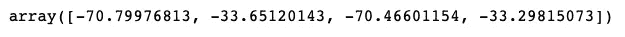

此外，还可以获得形状的中心坐标(或质心):

```
stgo_shape.centroid
```

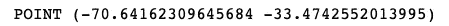

下面你可以在谷歌地图上看到同样的区域，太平洋在左边(西边)，安第斯山脉和阿根廷边界在右边(东边)

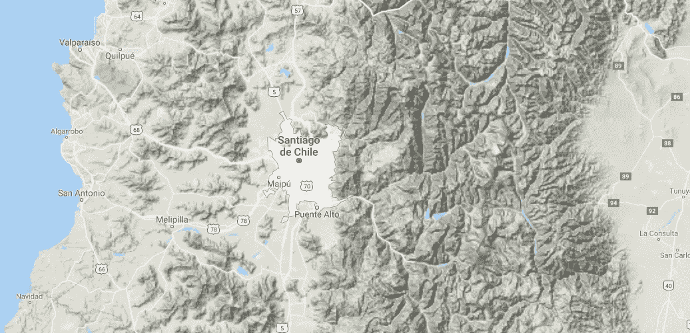

Santiago Urban Area — Google Maps

## 从 OpenStreetMap 导入道路

OpenStreetMap (OSM)是一个合作项目，旨在创建一个免费的可编辑世界地图，由一个地图绘制者社区构建，该社区提供并维护有关道路、小径、咖啡馆、火车站等更多信息的数据。项目生成的数据而非地图本身被视为其主要输出。

网站 [GeoFabrik](http://download.geofabrik.de/south-america/chile.html) 有来自 [OpenStreetMap 项目](http://www.openstreetmap.org/)的数据摘录，通常每天更新。这项开放式数据下载服务由 Geofabrik GmbH 免费提供。

开始从这个[链接](http://download.geofabrik.de/south-america/chile-latest-free.shp.zip)下载数据，并保存到你的/data/ depository 下的“/OSM/”。

从那里，让我们打开关于道路的形状文件:

```
roads_path = "../data/OSM_Chile/chile-latest-free/gis_osm_roads_free_1.shp"roads = gpd.read_file(roads_path, encoding='utf-8')
```

这个文件包含了将近 455，000 条道路。让我们开始用圣地亚哥形状过滤它(为此我们将使用*)。sjoin* ，所以我们只能处理我们感兴趣区域内的道路。

```
roads = gpd.sjoin(roads, stgo_shape, op='intersects')
```

即使过滤，我们也完成了大约 83，000 条道路。检查 roads 地理数据框架，我们可以看到它包含一个名为 *fclass 的列。我们来看看:*

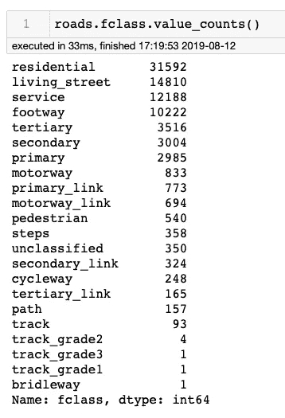

这意味着几条道路主要位于居民区，同时也是用作服务区、人行道、自行车道、人行道等的道路。一旦我们对绘制车祸地图感兴趣，让我们只保留最有可能找到它们的道路，这将把数据集减少到大约 12，000 条道路。

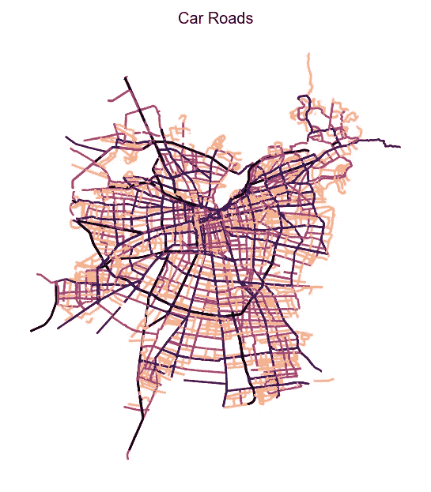

我们也可以只过滤主干道(主要道路和高速公路):

```
main_roads = car_roads[(car_roads.fclass == 'primary') |
                       (car_roads.fclass == 'motorway')
                      ]
main_roads.plot()
```

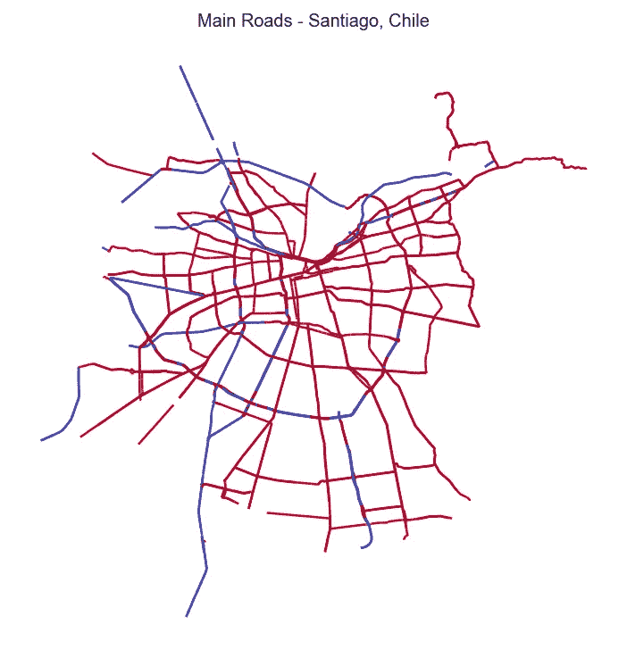

## 从公共数据集中导入车祸

在智利，可以在 [CONASET](http://mapas-conaset.opendata.arcgis.com/datasets/3a084373b58b45d0ae01d9c14a231cf8_0) 网站上找到 2013 年至 2018 年分类车祸数据的公共数据库。我们将从那里下载关于去年(2018 年)发生的事件的数据。

该数据集包含近 24，000 个已报告的事件，但不幸的是，并非所有事件都进行了地理定位。首先，让我们来看看几何数据遗漏了多少数据:

```
p0 = Point(0,0)
df_p0 = df_2018['geometry'] == p0
df_p0.sum()
```

结果是 3537 分。让我们把它们拿出来，看看我们有多少干净的数据:

```
s_2018 = df_2018[df_2018['geometry'] != p0]
s_2018.shape
```

结果是:20，402 个事件。非常好！我们可以利用这些数据。让我们对它们进行筛选，仅获取圣地亚哥地区内的事件并绘制它们:

```
ax = stgo_shape.plot(figsize=(18,16), color='#EFEFEF', edgecolor='#444444')
main_roads.plot(ax=ax, color='green', markersize=0.2)
crashes.plot(ax=ax, color='red', markersize=8)
plt.title("2018 Road Crashs - Santiago, Chile");
plt.axis('off');
```

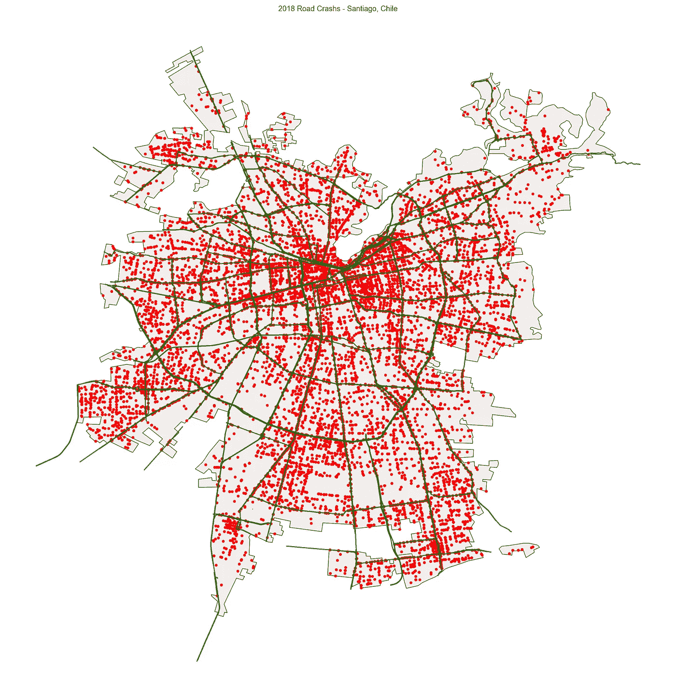

哇！目测 2018 年圣地亚哥几乎每条路都发生过车祸！

## 挖掘数据

为了真正了解发生了什么，我们需要更深入地研究数据。

查看数据集，我们可以看到，除了包含每个碰撞事件的地理定位的“几何图形”之外，我们还会发现以下相关信息:

*   撞车发生的时间(日期和时间)
*   位置和区域(农村和城市)
*   位置类型(交叉路、环形路、直路、弯道等。)
*   车道数量和建筑类型(沥青、混凝土等)。)
*   路况(干燥、潮湿、油污等。)
*   天气状况(雨、雪、清洁等。)
*   事件类型(碰撞、撞击、人员撞击、火灾等。)
*   严重性(致命、严重、中等、轻微、非伤害)

让我们想象一下这些事件及其主要特征:

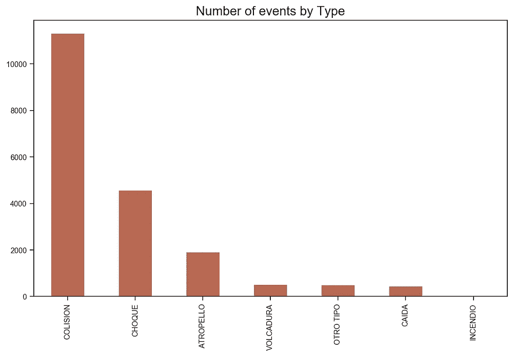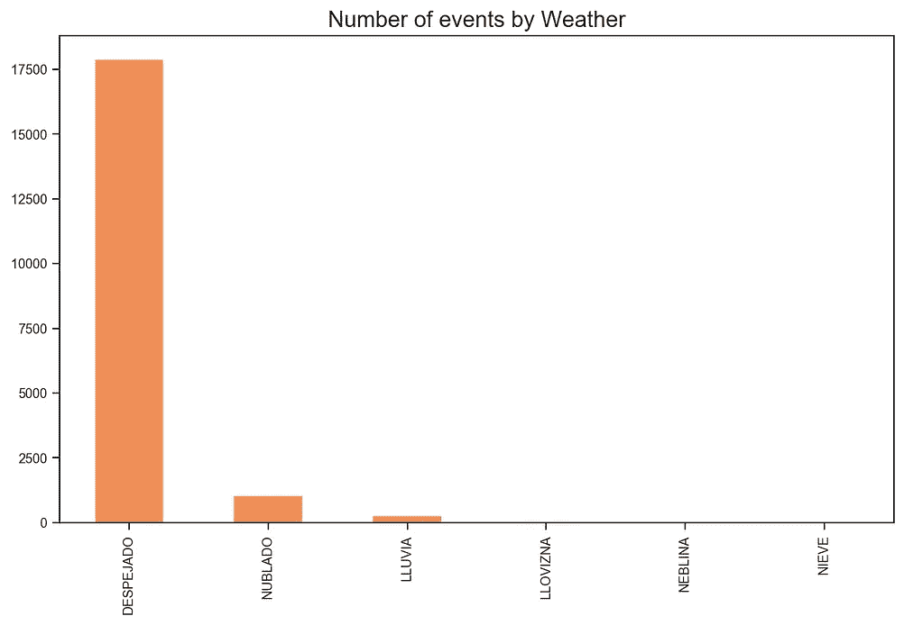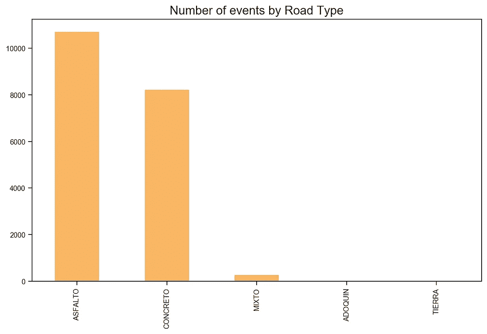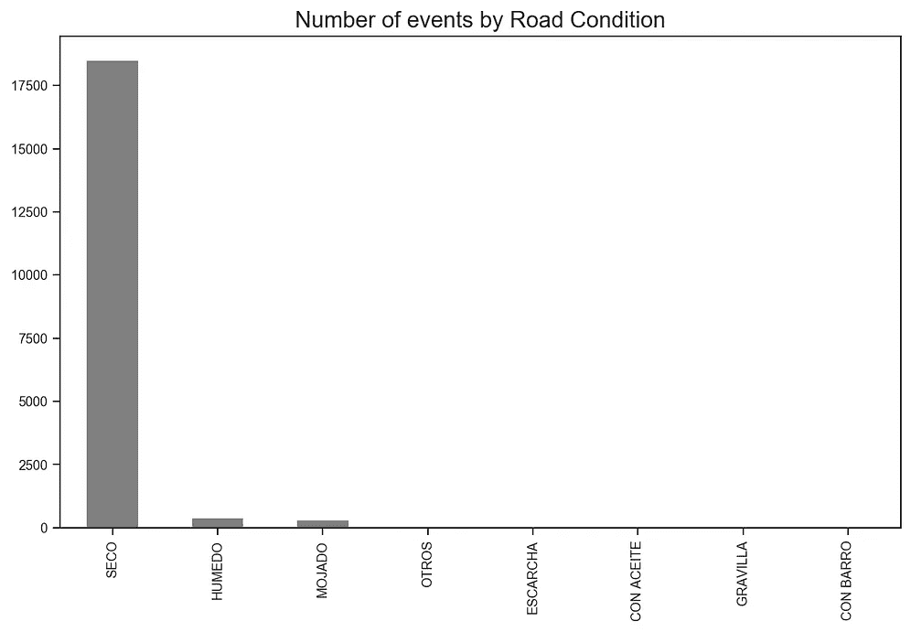

从上面的可视化结果中，我们可以看到，2018 年圣地亚哥发生的大多数车祸都是在沥青或混凝土道路上发生的碰撞和颠簸，因为几乎所有的车祸都发生在晴朗干燥的一天。

那么*发生在*的时候呢？让我们用与时间相关的数据创建新列:

```
crashes['Fecha'] = pd.to_datetime(crashes['Fecha'])
crashes['Hora'] = pd.to_datetime(crashes['Hora'])crashes['month'] = crashes['Fecha'].dt.month
crashes['day'] = crashes['Fecha'].dt.day
crashes['weekday'] = crashes['Fecha'].dt.weekday_name
crashes['hour'] = crashes['Hora'].dt.hour
```

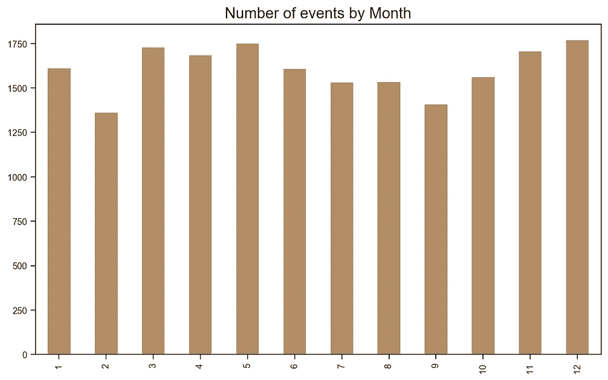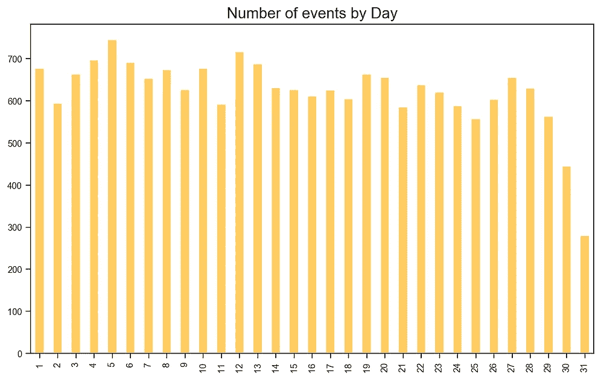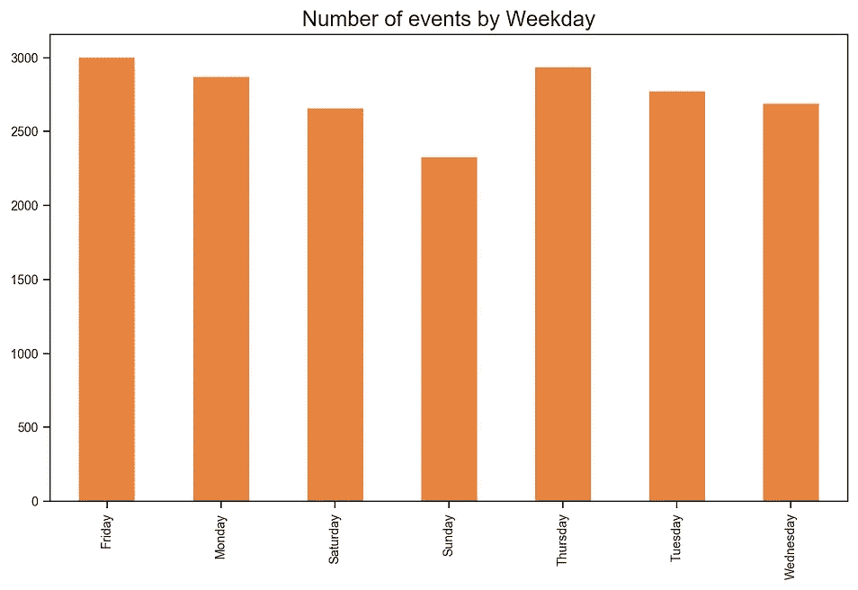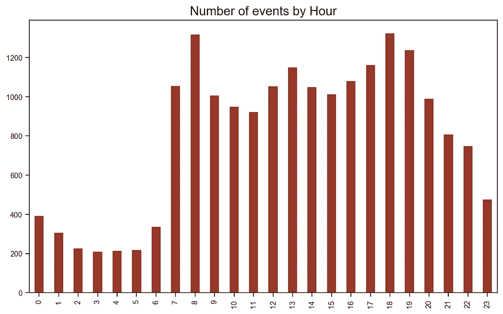

不出意外。大多数事件发生在早上 7 点到晚上 10 点，交通挑选时间(早上 8 点和下午 6 点)是最复杂的。此外，撞车事故在周末和月末发生得更少(这是一个有趣的点，应该更好地调查)。请注意，二月是事件较少的月份。这是因为这是智利人的暑假季节，圣地亚哥通常在这个月成为“沙漠”。

## 创建热图

在 GeoPandas 上可视化数据的一个很好的方法是聚合小区域上的数据，这些小区域具有向我们显示特定区域中存在的数据量的颜色模式。例如，事件越少，颜色越浅(如黄色)，事件越多，颜色越深(如棕色)。

首先，我们需要将城市分割成小区域(或多边形)。你可以使用网格、感觉区域等。在我们的案例中，我们将使用上一次智利起点-终点调查(EOD)中定义的区域，该调查可从 [SECTRA(智利交通规划部长](http://www.sectra.gob.cl/encuestas_movilidad/encuestas_movilidad.htm))处获得。

一旦你下载了 shapefile，你应该将它与你感兴趣的区域相交(在我们的例子中，stgo_shape)。结果将是 743 个更小的区域来获取我们的汽车碰撞数据。

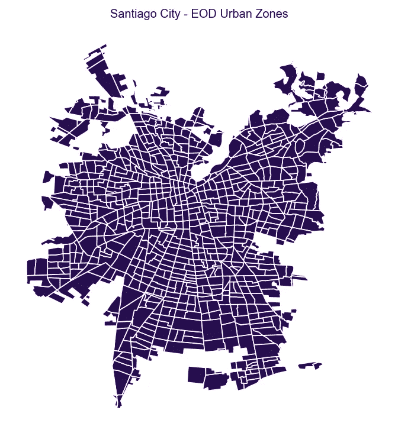

接下来，您应该将事件聚合到城市区域中。为此，应该完成两项主要任务:

1.  上述文件形状和崩溃数据集之间的连接。生成的数据集将为每条线提供一个点(碰撞)和一个相关联的面(大约 20，000)。您将会注意到，对于在其区域上捕获的每个点(事件),每个多边形都将重复。
2.  一组结果数据集，按区域 id。合成形状应具有与原始形状相同的线条数(743)。

可视化热图非常简单。为此，您应该使用一个简单的绘图函数，但是定义 2 个参数:

1.  cmap:将要使用的 colomap 名称。在我们的例子中是“magma_r”。
2.  k:你想要“分割”你的数据范围的类的数量。在我们的例子中，5(通常，建议不要使用超过 7 种颜色来表示您的数据范围)。

```
ax = crash_zone_2018.plot(column='crashes', cmap='magma_r', k=5, legend=True)
plt.title("2018 Crashes by Zone - Santiago");
ax.set_axis_off()
```

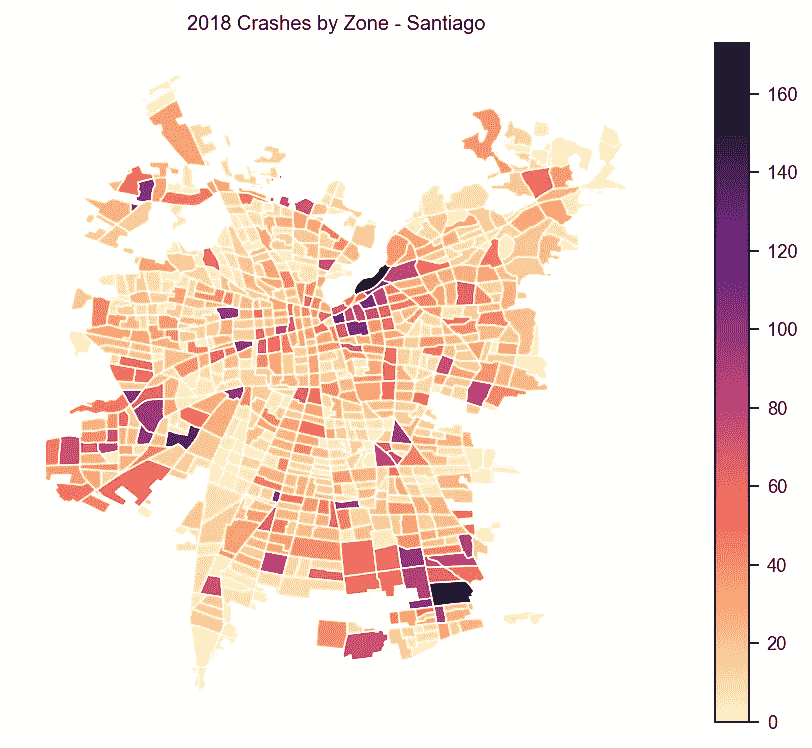

现在，从视觉上很容易区分最危险的区域(较暗的区域)。但是这些区域和道路有什么关系呢？让我们在最后一张地图上想象圣地亚哥的主要道路:

```
fig, ax = plt.subplots(figsize = (10,6)) 
crash_zone_2018.plot(ax=ax, column='crashes', cmap='magma_r', k=5, legend=True)
main_roads.plot(ax=ax, color = 'blue')
plt.title("2018 Crashes by Urban Zone and main roads - Santiago City");
ax.set_axis_off();
```

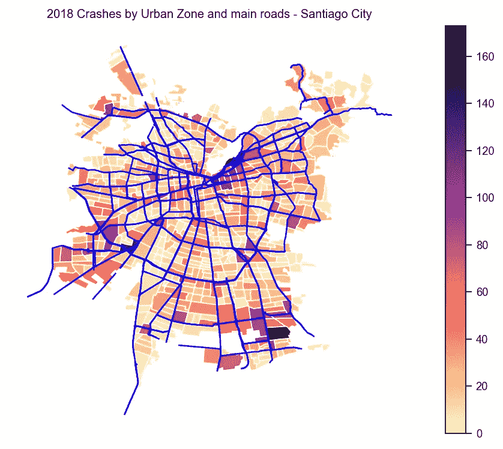

看最后一个图像，我们可以看到，例如，靠近主干道交叉口的区域，更容易发生事故。

在地图上查看大量数据的另一个非常有用的方法是使用“地形视图”。就像看一座山，山越高，颜色越深(当然，会有不是高，而是事故的数量)。[爱德华多·格雷尔斯-加里多](https://github.com/carnby/carto-en-python/blob/master/02%20-%20Choroplet%20Dot%20Symbol%20Maps.ipynb)在圣地亚哥市探索移动性方面做得很好。基于他的代码，我们可以创建自己的代码:

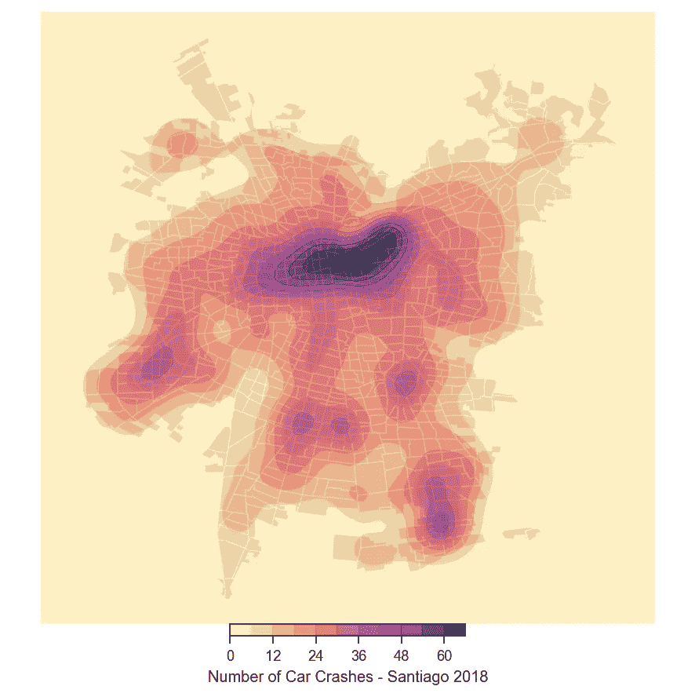

乍一看，我们可以意识到城市中最危险的区域在哪里。

> 在 [gitHub](https://github.com/Mjrovai/Python4DS/tree/master/Streets_Santiago) 上，你可以看到用于创建这种虚拟化的代码。

## 创建严重性指数

到目前为止，我们对每一个碰撞事件都一视同仁，但当然，与它们相关的严重程度非常重要。让我们将严重性指数与每个事件相关联。为此，我们应该创建一个函数，将其应用于所有数据集:

```
def sev_index_crash(row):
    if row['Fallecidos'] != 0: return 5   # fatal
    elif row['Graves'] !=0: return 4      # serious
    elif row['Menos_Grav'] !=0: return 3\. # less-serious
    elif row['Leves'] !=0: return 2\.      # minor
    else: return 1                        # non-injurycrashes['SEV_Index'] = crashes.apply(sev_index_crash, axis=1)
```

有了这个列，让我们来看看新的数据:

```
SEV_Index = crashes.SEV_Index.value_counts()
SEV_Index.plot.bar(title="Crash Severity Index", color = 'red');
```

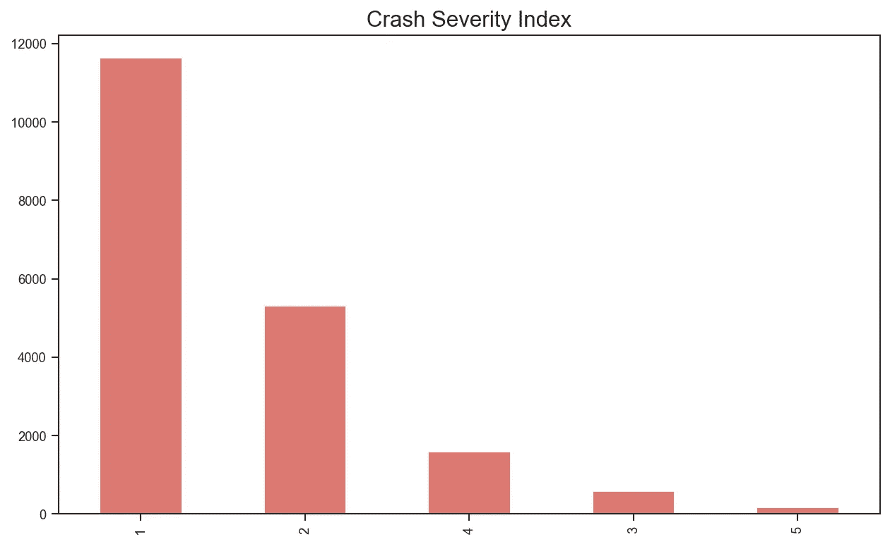

幸运的是，2018 年的大多数撞车事故都没有造成伤害(1)，其次是超过 5000 起轻伤(2)。

## 将严重性指数与道路相关联

在我们在 UDD 的[数据科学硕士的大数据分析学科项目中，城市被转换到 100×100 米的网格上，每个网格都有与城市道路相关的“细胞”。这种方法产生了 63，000 个小区域，其主要目标是确定该特定区域未来发生事故的概率。](https://ingenieria.udd.cl/postgrado/magister-en-data-science/)

对于本文，将使用一个更简单的解决方案，它是由 Alex Raichev 在 KIWI PYCON 2017 上提出的。

对于每条道路的线性路段(已经在 OSM 数据集上定义)，我们将收集距离该路段给定距离(例如，5 米)发生的交通事故。为此，将使用 GeoPandas 函数*缓冲区*。注意，单个事件可以在多条道路上被捕获，例如在十字路口。但我们认为，一旦所有细分市场都受到影响，这应该很重要。

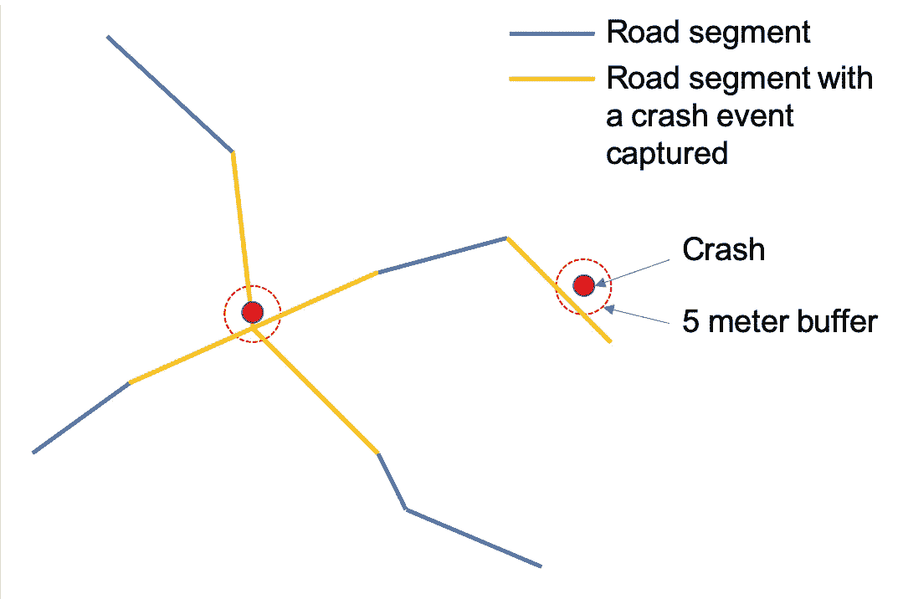

一旦我们用度数来表示角度，我们必须首先把米转换成度。我们可以用一个简单的公式来计算:

*   度数=(米* 0.1) / 11000

并为每个崩溃事件创建一个缓冲区:

```
meters = 5
buffer = (meters*0.1)/11000  # degrees
c = crashes[['geometry', 'SEV_Index']].copy()
c['geometry'] = c['geometry'].buffer(buffer)
```

接下来，我们需要空间连接道路和缓冲碰撞点

```
r = roads[['geometry', 'osm_id', 'name', 'fclass']].copy()
f = gpd.sjoin(r, c, how='inner', op='intersects')
```

下面我们可以检查生成的地理数据框架。请注意，lineString 是捕获了单个碰撞事件的路段。例如，前 2 行是名为“Rosas”(osm _ id:7981169)的街道的同一路段，其中捕获了 2 个碰撞事件(index_right: 11741 和 23840)。

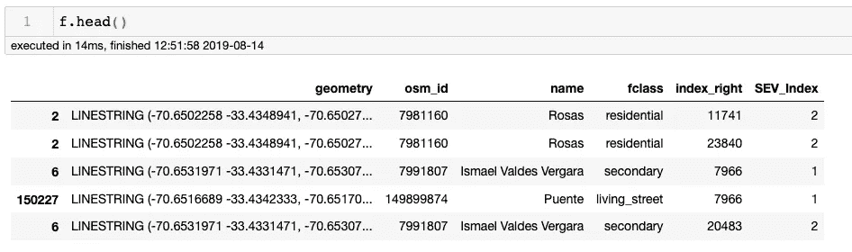

现在，按路段 *osm_id* 对地理数据框架进行分组将非常重要。这样做，我们将有段聚合崩溃。我们将添加崩溃和严重性指数。这样，例如，一个致命的事件将比一个非伤害事件重要 5 倍。

> *注意，这种方法完全是武断的，不科学的。这只是本文中用来比较路段危险程度的个人指标。*

```
f['num_crashes'] = 1
g = f.groupby('osm_id', as_index=False).agg({
  'name': 'first',
  'num_crashes': 'sum', 
  'SEV_Index': 'sum',
  'geometry': 'first',
  })
g = gpd.GeoDataFrame(g, crs='4326')
```

对我们将获得的地理数据框架进行排序:

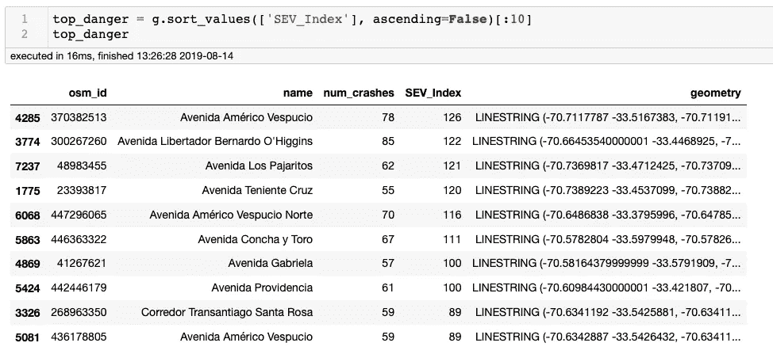

生活在圣地亚哥，这个结果很有意义。至少从名字上看，Americo Vespucio 和 Bernardo O'Higgins 是两条最重要的城市动脉。

让我们想象一下所有街道，每个路段都有一种颜色(“热点地图”):

```
fig, ax = plt.subplots(figsize = (10,6)) 
g.plot(ax=ax, column='SEV_Index', cmap='magma_r', k=7, legend=True)
plt.title("2018 Severity Crashes by roads - Santiago City");
ax.set_axis_off();
```

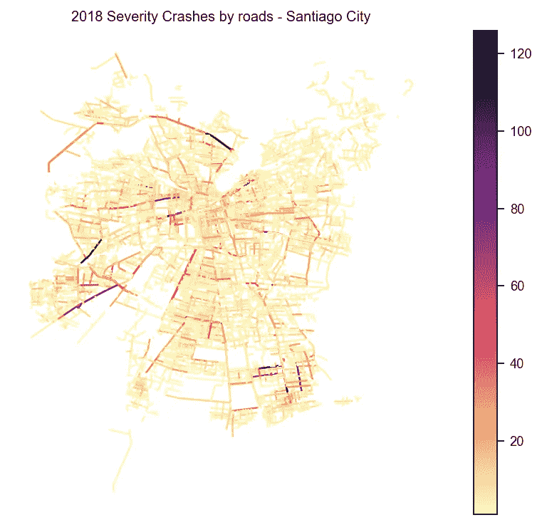

但是，我们应该做的是在真实的地图上可视化每一段。为此，我们可以使用叶子。下面是市区的一段，显示了所谓的“阿拉米达”(Ave Bernardo O'Higgins)最危险的一段。

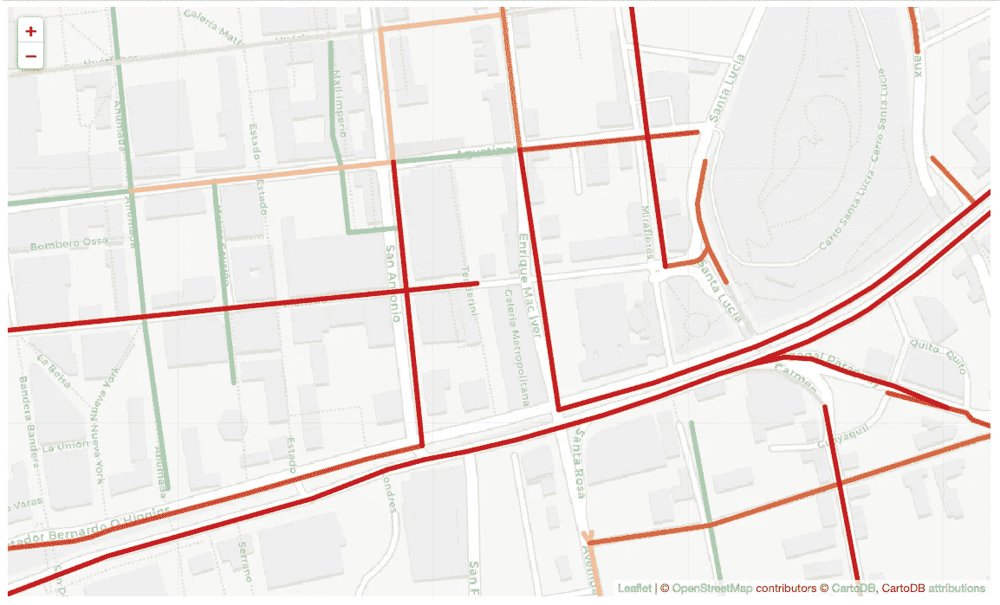

> 你可以从 GitHub 下载一张“圣地亚哥街道”的[互动地图](https://github.com/Mjrovai/Python4DS/blob/master/Streets_Santiago/Streets_of_Santiago_2018.html)。

就这些了，伙计们！

希望你能像我一样欣赏地理和数据科学！

详情和最终代码，请访问我的 GitHub 库:[圣地亚哥的街道](https://github.com/Mjrovai/Python4DS/tree/master/Streets_Santiago)

更多项目，请访问我的博客:[MJRoBot.org](http://mjrobot.org/)

来自世界南部的 Saludos！

我的下一篇文章再见！

谢谢你，

马塞洛