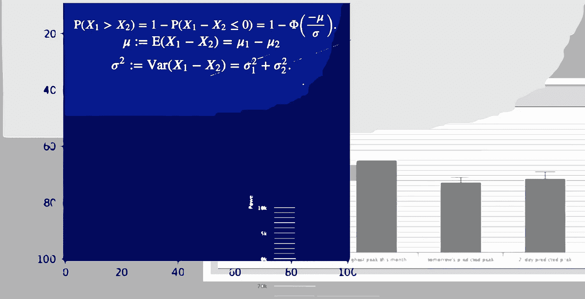
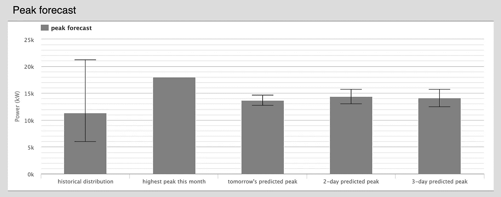
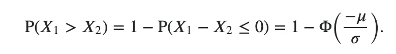
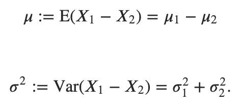
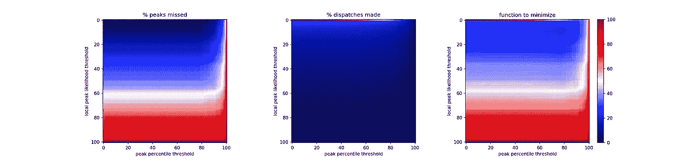
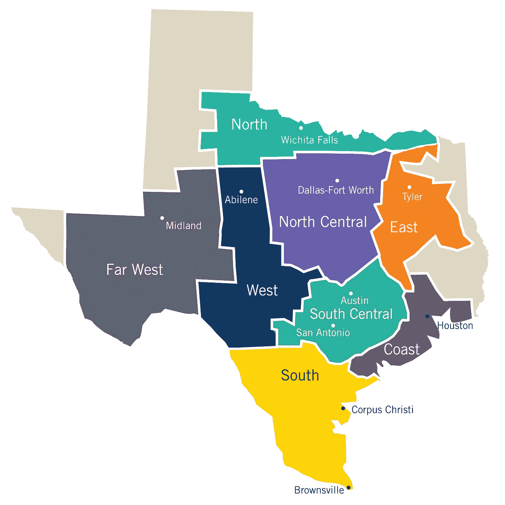
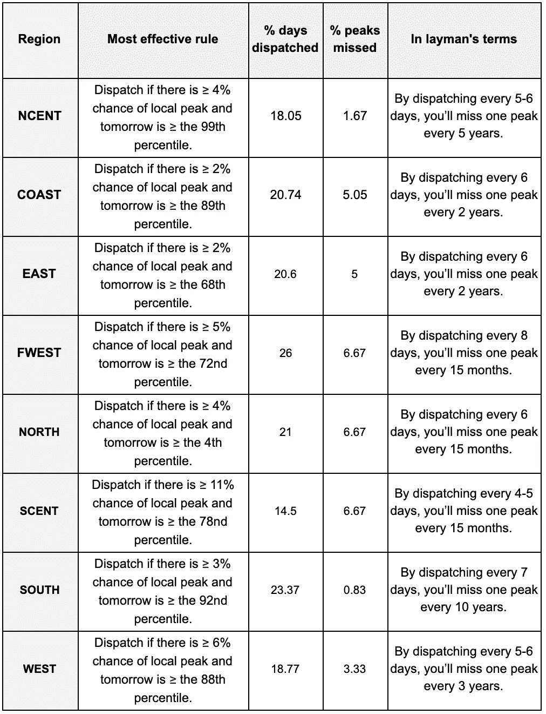

# 神经网络的短期预测如何影响长期决策。

> 原文：<https://towardsdatascience.com/how-short-term-forecasting-with-neural-nets-can-inform-long-term-decisions-9f65eba6fb7e?source=collection_archive---------16----------------------->

## 神经网络调峰:第二部分

## 电力公司只需三天的天气预报就能探测到每月的高峰。

*与* [合作研究*开放建模框架*](http://omf.coop) *。*

*这是关于神经网络调峰的三部分系列文章中的第二部分。考虑一下另外两个:*

 [## 基于神经网络的⚡️负荷预测和调峰

### 预测技术给了公用事业单位一个机会来拉平他们的负荷曲线，提出了一个全新的家庭…

www.kmcelwee.com](https://www.kmcelwee.com/load-forecasting/) 

对于电力公司来说，减少每月的需求费用可以获得巨大的利润。然而，每天实施调峰策略可能成本高昂。如果公用事业公司使用直接负荷控制(付费给客户关闭空调、热水器等)。)，如果他们这样做得太频繁，可能会让客户感到沮丧。如果公用事业公司使用存储，过度使用可能会迫使他们不必要地频繁更换昂贵的电池。因此，不仅预测第二天的负荷形状很重要，预测当月的峰值也很重要。在理想情况下，按月收费的公用事业公司需要每月削峰一天。

不幸的是，与天气预测类似，负荷预测在几天后变得不可靠。在过去三天的预测中，我们的预测平均绝对误差为 10%(MAPE)。由于一整个月的日峰值落在 10 MAPE 范围内并不罕见，因此找到月峰值很快就变成了猜测。

令人欣慰的是，通过结合一些统计技术，我们可以将明天的预测放在上下文中，并大大减少我们派遣的天数。

# 设置

我们被一个简单的问题所激励:明天是这个月的高峰吗？

我们知道我们不可能有 30 天的预测，但是通过查看三天的预测、本月已经发生的情况以及历史峰值，我们可以回答两个较小的问题:

*   明天会是局部高峰吗？
*   这个月明天的负荷特别高吗？

最后，我们将结合这些答案，为我们的激励问题提供信息。

## 明天会是局部高峰吗？

“本地峰值”将意味着明天是三天预测中最高的，也高于本月已经看到的任何负载。在我们的 web 应用程序的测试版中，它是这样表示的:

以上是 2018 年 12 月 20 日德克萨斯州中北部地区的天气预报。因为“明天的预测峰值”比目前看到的最高峰值低得多，所以电力公司不会在 12 月 20 日实施调峰策略。

考虑到模型的预测可能在正态分布附近是准确的，我们可以为明天将是局部峰值的统计可能性分配一个数字。它由这个公式给出:

Given two normal distributions (subscripts 1 and 2, defined by their mean and standard deviation), what is the likelihood that the sample X₁ will be greater than the sample X₂.

如果你对细节感兴趣，[这里有一个链接](https://math.stackexchange.com/questions/40224/probability-of-a-point-taken-from-a-certain-normal-distribution-will-be-greater)可以找到完整的解释。下面是我们如何扩展该公式并将其翻译成 python:

Function used to determine likelihood that tomorrow is local peak.

使用 12 月 20 日的示例并四舍五入到两位小数，明天的“局部峰值可能性”为 0.0%，主要是因为明天峰值的正态分布区域比迄今为止的最高峰值小得多。

## 这个月明天的负荷特别高吗？

这个问题比较容易回答。我们查看前几年的月度数据，并计算明天预测的百分位数。需要注意的是，我们计算的是每日峰值的百分比，而不是每小时的负载。

## 我们试图最小化什么？

我们有两个因素，“本地峰值可能性”和“峰值百分位数”，我们希望制定一个规则来最小化两个结果，“错过的峰值百分比”和“发出的百分比”

这两个结果是每个公用事业公司必须做出的权衡。如果他们希望确保每个峰值都被捕获(丢失的峰值百分比低)，他们必须每天进行调度(进行调度的百分比高)。反之亦然:如果他们想保守调度数量，他们就有错过高峰的风险。

我们需要一个目标来最小化。因此，出于我们的目的，我们将简单地添加两个目标。在下面的热图中，最小化(右)的函数就是其他两个函数的和。自然地，考虑到电力公司的优先级，他们会以不同的方式权衡这个优化函数。由于这也有金钱方面的原因，适当的成本效益分析是必要的。但是这些计算对每个电力公司来说都是独特的。

# 结果呢

我对 2002 年至 2018 年德克萨斯州各个地区的 ERCOT 数据进行了测试。我从 2008 年到 2018 年运行该计划，以便“峰值百分比”变量有一些后见之明。整个测试过程可以在[这本 jupyter 笔记本](https://github.com/kmcelwee/load-forecasting/blob/main/notebooks/Efficacy%20of%20short-term%20forecasts%20for%20predicting%20monthly%20peaks.ipynb)中找到。

我假设我们对一天的预测有 97%的准确率，对两天的预测有 95%的准确率，对三天的预测有 92%的准确率——这些结果在学术文献中很常见，也反映在[我们自己的测试](https://www.kmcelwee.com/load-forecasting/simple-load-forecasting.html)中。

Tests run on ERCOT’s SCENT data (San Antonio, Austin). Minimization of (% peaks missed + % dispatches made) for the two variables (“peak percentile threshold” and “local peak likelihood threshold”)

以上是德克萨斯州中南部地区的一个例子。请注意，在中心热图的顶部有一条明显的线。超过一半的每日峰值有 0%的机会成为局部峰值，这表明无论公用事业公司采用何种优化方法，这种方法都会立即将调度减少一半，同时很少错过峰值。该带在进行该试验的德克萨斯州的所有地区都出现。

The regions of Texas used in testing.

需要特别注意的是，上面的图表和下面的结果在创建调度规则时使用了逻辑“and ”(例如，如果本地峰值的概率≥ 4%,并且明天≥99 %,则进行调度。)我还测试了逻辑“或”，但结果总是更糟。

结果如下图所示。请注意，这些“规则”只有在事后才是准确的。每个电力公司都需要测试以前的政策在未来的负荷上的实施效果。正如人们可能预料的那样，在试图预测月度峰值时，没有一条规则适用于所有情况。然而，一致的趋势是，如果出现局部峰值的可能性大于个位数，并且如果预测的百分比相当高，就要调度。(北部的结果与德克萨斯州的其他地方截然不同，[这里有一个链接](https://github.com/kmcelwee/load-forecasting/blob/main/img/NORTH.png)指向它的热图。)

结果表明,“局部峰值似然性”变量在此函数中起了最大的作用，而百分位数因子有助于检测历史背景中明显的非峰值。

我没有忘记，这种优化也可以通过分解每个月的规则来辅助，甚至可以应用某种机器学习算法；但是，由于未来的负载行为可能会因技术和消费模式的变化而不同于过去，因此这些流程很容易成为过度拟合的牺牲品。

然而，公用事业公司有很大的机会利用机器学习和基本统计数据来更好地通知他们的调度决策，从而节省资金并在此过程中建立客户信任。

*有问题吗？更正？数据科学笑话？联系我，查看更多项目在* [*我的网站*](http://www.kmcelwee.com) *。*