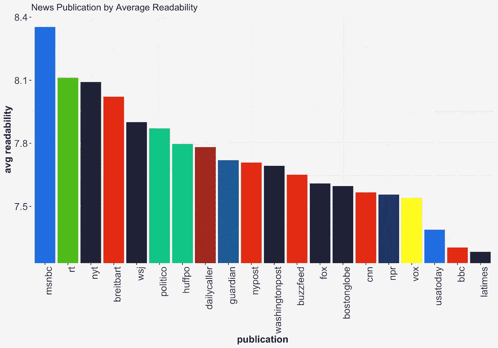
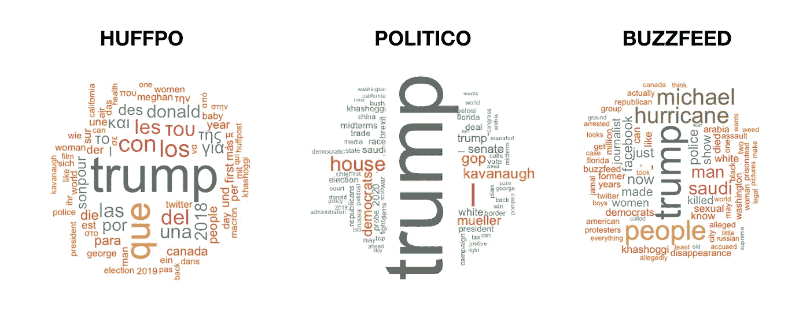

# 你的新闻来源有多聪明？

> 原文：<https://towardsdatascience.com/how-smart-is-your-news-source-1fe0c550c7d9?source=collection_archive---------13----------------------->

## 21 种不同新闻媒体的可读性分析

我认为理解我们新来源的观点和偏见比以往任何时候都更重要。不幸的是，新闻如此之多，以至于我们几乎不可能逃脱小小的过滤气泡。

幸运的是，让我们陷入这种困境的技术可以帮助我们渡过难关。使用电脑，有可能获得多种新闻来源的广阔视野，并看到他们最关注的领域。看到不同网点的写作风格如何不同也很有趣。虽然我们需要在自然语言处理(NLP)方面取得更多进展，以真正处理新闻偏见，但我们现在可以做一些有趣的分析。

为此，在过去的 6 个月里，我使用 python [报纸库](https://newspaper.readthedocs.io/en/latest/)从 21 个不同的新闻渠道收集了尽可能多的文章。这里有一些有趣的不同之处。

# 新闻的情感

当谈到新闻时，一个简单而有趣的事情是故事情节。使用 python [VADER 库](https://github.com/cjhutto/vaderSentiment)，我们可以给来自不同出版物的所有故事打分，并测量它们的平均情绪。正数表示更乐观的语言，而负数表示黑暗和消极的写作。

不出所料，《今日美国》的评价相当正面，而关于信息战争的阴谋论大多是负面的。令人惊讶的是，大多数新闻文章并不完全是负面的(尽管今日俄罗斯、布莱巴特和 Buzzfeed 似乎倾向于负面)。

如果我们只看新闻标题，我们会发现它们比故事内容更消极。毕竟坏消息更受关注。同样，Inforwars 头条是最负面的，只有华尔街日报得分正面。

# 新闻的可读性

新闻写作的另一个简单衡量标准是它的可读性。多年来已经开发了多种系统来衡量一个东西的易读性。下面我用 python [textstat 库](https://github.com/shivam5992/textstat) ⁴比较了各种出版物的阅读难度。

## 弗莱斯奇-金凯可读性 Testing⁵

弗莱斯-金凯就绪测试是最受欢迎的测试之一。它根据每个句子的字数和每个单词的音节数来评分，即长单词和句子更难阅读。然后，它将该分数转换为等级级别。注意，这个结果和分析的句子内容无关。完全基于单词/句子的长度。

使用这种方法，我们看到 MSNBC 有最高的年级水平，使其最难阅读。这可能是因为 MSNBC 的“故事”只是网站上新闻视频的描述。它们被设计成描述性的，不一定可读。所有其他网站都包含适当的文章，甚至像 CNN 和 FoxNews 这样的网络新闻网站。

在光谱的另一端，BBC 新闻文章可以轻松阅读，只需要 10 年级教育。这可能是因为大多数 BBC 的报道短小精悍(很少有曲折的社论)。

## 戴尔-查尔可读性测试

[戴尔-查尔公式](https://en.wikipedia.org/wiki/Dale–Chall_readability_formula)使用单词长度，但也考虑了这些单词的难度。它保留了一个四年级学生应该理解的“简单单词”列表。使用这种方法，不在列表中的单词越多，阅读起来就越困难。

基于这个体系，我们再次看到 MSNBC 是最不可读的。除了现在《纽约时报》( NYT)和《华尔街日报》(华尔街日报)以 8 分左右的分数上升。这意味着他们需要 11 或 12 年级的教育才能完全理解。

## 雾霾 Grade⁷

[雾霾分级系统](https://en.wikipedia.org/wiki/SMOG)使用多音节词(3 个或 3 个以上音节的单词)的数量来分配难度等级。我们再次看到 MSNBC、布莱巴特和政治使用最长的单词，而英国广播公司和洛杉矶时报使用更简单的语言。

## 射击雾 index⁸

[喷雾指数](https://en.wikipedia.org/wiki/Gunning_fog_index)也是用音节多的单词作为阅读难度的衡量标准，只是公式不同。有了这种新方法，《今日美国》成为最容易阅读的报纸。

## 每个故事的字数

最后，尽管不是严格的可读性测试，我们可以通过测量新闻报道的长度来了解新闻报道的复杂性。

**注意**——一些新闻网站是付费的，所以不可能总是收集完整的故事。还有一些网站要求点击“阅读更多”按钮来获取全文。这些来源已被删除。

我们看到，以解释新闻为使命的 Vox 拥有迄今为止最长的文章(1427 个单词)。政治和 Buzzfeed 紧随其后，平均每篇报道 1000 字左右。如果我们包括付费网站,《纽约时报》、《洛杉矶时报》和《华盛顿邮报》,它们也会接近 1500 字/篇。

就我个人而言，我认为《纽约邮报》是最完美的报纸，500 字的篇幅正好适合报道。社论往往更长。

# 新闻内容

不幸的是，NLP 工具还不够先进，不足以轻易发现政治偏见。然而，我们可以通过看标题来了解一家媒体的政治倾向。以下是基于术语使用频率的词云(大词是使用频率最高的词)。

三大全国性新闻媒体似乎大多是特朗普的报道机器(我确实担心它们未来的商业模式)。卡瓦诺证实的故事是所有三个来源中第二受欢迎的，而穆勒调查对 MSNBC 也很重要。

其他主要新闻来源的单词 clouds 也是类似的。虽然他们都痴迷于特朗普，但他们也涉及其他主题。《华尔街日报邮报》和《华盛顿邮报》有很多关于沙特的报道，而《纽约时报》有很多#MeToo 报道(“被告”、“男人”、“性”)。NPR 仍然谈论特朗普很多，但《今日美国》花了大部分笔墨在“最佳交易”的故事上。与此同时，英国广播公司正确地聚焦于英国退出欧盟和全球政治。

我们还可以看到，更新的纯互联网出版物覆盖面更广(政治除外)。《赫芬顿邮报》似乎有很多希腊语和西班牙语的文章，所以结果与其他语言的单词混在了一起。Vox 的主要报道是“解释者”(关于川普、沙特和卡瓦诺的常见话题)，而布莱巴特和《每日来电》对美墨“边境”进行了大量报道。最后，《洛杉矶时报》(LA Times)、《波士顿环球报》(Boston Globe)和《纽约邮报》(New York Post)等当地报纸除了关注特朗普，还关注当地新闻(“加州”、“波士顿”、“纽约”)。他们也有许多老式的一般兴趣故事(“家”、“学校”、“男人”、“女人”等术语很常见)。

## Word2Vec 分析

由于“特朗普”是新闻中的头条，我认为看看不同媒体如何看待他会很有趣。使用一种叫做“⁹”的技术，可以看到哪些单词被新闻媒体认为与 Trump 相似。

下面我们看到，围绕“川普”的词汇类似于用来描述“奥巴马”、“老布什”、“普京”、“Xi”(金平)、“博尔索纳罗”、“杜特尔特”和“马克龙”的词汇。似乎左翼和右翼都将特朗普等同于全球强有力的(或者激进的)领导人。

注意——尼尔“盖曼”混入这些结果的有趣事实表明，这种技术可能不太适合这种类型的分析。

# 结论

这些天我们读得最多的单词来自互联网新闻网站。这些出版物对我们的所见、所想和感受有着巨大的影响。然而，他们只对富有的资助人或他们的底线负责。科技创造了这种极具竞争力的媒体景观。也许科技也能帮助我们更深思熟虑地穿越它。

# 奖金结果

作为一个作家，我一直想知道理想的句子长度是多少。根据新闻标题的平均字数，答案是 10 到 14 个字。这是所有新闻媒体在这些点击中使用的长度。

我们也可以测量一篇新闻文章平均一句话的字数。在这里，我们看到大多数都在 21 到 26 个单词之间。这对我来说有点长，但我的背景涉及更多的技术和商业写作。英语专业的记者可能更啰嗦。

## 最差情绪头条

为了好玩，我把绝对最差情绪评分的新闻标题留了下来。下面这些反映了过去 6 个月最黑暗的故事。

*   联邦调查局局长雷:恐怖分子可能使用无人机袭击美国的“大规模集会”
*   唐纳德·特朗普将致命的加州野火归咎于对森林的“严重管理不善”
*   记者死亡人数:报复杀人在 2018 年几乎翻了一番
*   怀疑溺死儿子的母亲在谷歌上搜索了 100 多次杀害儿童的提示
*   疾病预防控制中心数据显示，美国枪支死亡人数达到近 40 年来最高水平
*   怀蒂·巴尔杰的致命监狱殴打:“他是无法辨认的”
*   前黑人雇员声称，特斯拉工厂是种族主义的温床

## 托马斯·弗里德曼

如上所述，大多数可读性测试都非常简单。它们不衡量句子是如何构成的，也不衡量单词是如何使用的。我想看看这些测试如何给我认为是真正糟糕的作品打分。为此，我从出了名的高深莫测的纽约时报专栏作家 [Thomas Friedman](https://www.google.com/url?sa=t&rct=j&q=&esrc=s&source=web&cd=3&ved=2ahUKEwicz-Pwr-TfAhU4HTQIHQm-D7kQFjACegQIExAB&url=https%3A%2F%2Fwww.nytimes.com%2Fcolumn%2Fthomas-l-friedman&usg=AOvVaw2g_A3o32gGhbxN49KiUVRY) 中挑选了最后 5 篇文章。他的分数在以下。

平均果肉-金凯级水平-12.1

戴尔-查尔可读性平均得分— 7.27(十年级)

平均喷涂雾— 13.03

平均烟雾等级——13.5

基于弗里德曼的写作风格有多么奇特，我认为雾霾等级是最准确的。无论他想说什么，你肯定需要一个大学学位才能理解。

如果你想知道，这篇文章有以下可读性分数:

弗里斯-金凯等级水平— 7.9，戴尔-查尔可读性分数— 6.81，喷烟— 9.64，烟雾等级— 11.3

## 笔记

位于 https://github.com/taubergm/news_readability[的 GitHub 上的所有代码和数据(不包括受版权保护的新闻报道)](https://github.com/taubergm/news_readability)

1 —“每天有 [2.5 万亿字节的数据](https://www.domo.com/learn/data-never-sleeps-5?aid=ogsm072517_1&sf100871281=1)被创建”

2—【https://newspaper.readthedocs.io/en/latest/ 

3 — VADER 情感分析。VADER (Valence Aware 字典和情感推理器)是一个基于词典和规则的情感分析工具，专门针对社交媒体中表达的情感，对其他领域的文本也很有效。

4—[https://github.com/shivam5992/textstat](https://github.com/shivam5992/textstat)

我不得不修复这个库中一个与计算句子字数相关的小错误。我使用 nltk 标记器用自己的实现替换了 sentence_count()函数

5 —转换为年级水平之前的 Flech-Kincade 分数

6 —戴尔-查尔公式

7-烟雾公式

8-喷雾配方

9——来自维基百科。Word2Vec 模型“是浅层的两层[神经网络](https://en.wikipedia.org/wiki/Neural_network)，被训练来重建单词的语言上下文”。我承认我只是模糊地理解它是如何工作的。