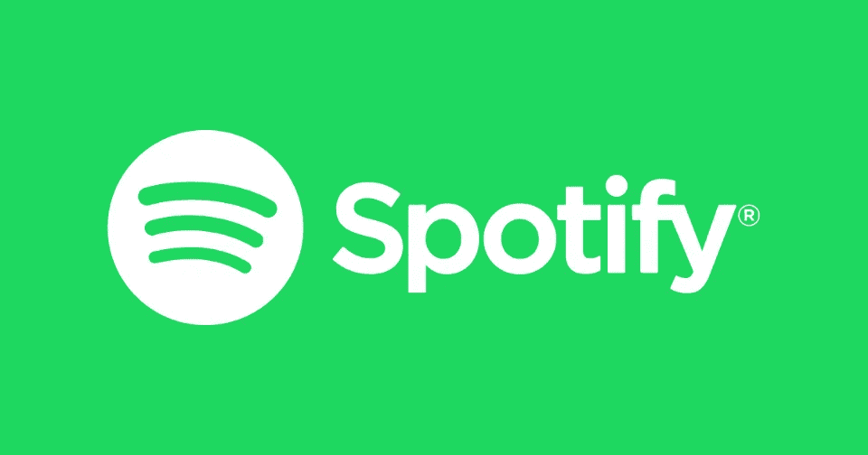
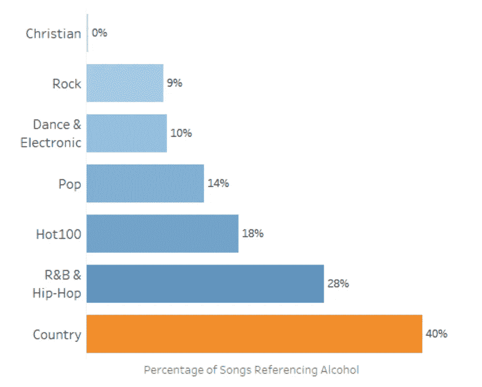

# Spotify 如何推荐你新喜欢的艺术家

> 原文：<https://towardsdatascience.com/how-spotify-recommends-your-new-favorite-artist-8c1850512af0?source=collection_archive---------5----------------------->

## 一个关于数据、品味和非常有效的推荐系统的故事。

就在几天前，我在教的一门课上与一些学生讨论了推荐系统的影响。

网飞、亚马逊、脸书和许多其他在线服务使用我们的数据来推荐我们可能喜欢的其他产品。

这有帮助吗，或者只是为了巩固我们现有的偏好？

当我们的选择由旨在提供“参与”的系统决定时，我们如何发现真正新的或意想不到的东西？

因此，它们被编程为给我们更多我们已经喜欢的东西，这可能导致熟悉的影响向内螺旋。

这是一个比我想象的更大的问题，它让我思考了更多。

当受到不同的影响时，我们更有创造力，但是要在机器时代做到这一点，我们的品味必须符合一个数学模型。

科技不仅仅存在于我们的环境中；它从一开始就包围并塑造了我们的感知。重要的是我们要解决这个问题。

因此，我开始思考我们如何消费我们的音乐——特别是在 Spotify 这样的流媒体平台上。

**这个故事将涵盖:**

**-Spotify 到底是什么？
-数字版 Spotify。
-Spotify 怎么这么了解你。
——推荐人制度。**

> 更多这样的故事，[订阅克拉克的免费时事通讯！](https://hitech.substack.com/)

# SPOTIFY 到底是什么？

**Spotify:** 基于云的数字音乐平台，提供对超过 5000 万首歌曲的跨设备访问，以及数量迅速增长的播客和视频。2008 年成立于斯德哥尔摩。

它提供一个免费的、有广告支持的选项和一个付费的、无广告的版本，每月 9.99 美元。每月 12.99 美元就可以获得 Spotify + Hulu(还是美国)。其他计划(家庭和学生优惠很常见)也有，但因市场而异。

Spotify 根据音乐人歌曲的播放次数向他们支付版税(实际上它与第三方签约来处理此事)。通常，每场比赛的奖金在 0.006 美元到 0.0084 美元之间。难怪歌曲越来越短，越来越上口。

该公司的一个新重点是 Spotify Marketplace，它向一系列“创作者”开放。这个双边市场旨在鼓励艺术家在 Spotify 平台上上传和编辑他们的作品，粉丝可以在这里发现和欣赏这些作品。

今年早些时候，Spotify 收购了 SoundBetter，以增加一套新的创作工具。面对苹果和亚马逊日益激烈的竞争，苹果希望这种方式能够降低运营成本，增加对消费者的吸引力。

这家公司是瑞典的，但目前它的总部在卢森堡。听众可以在 80 多个国家注册。

# 好，让我们从一些数字开始

10 月 28 日，Spotify 发布了 2019 年第三季度财报。我已经读过了，所以你也许不必读了。

总的来说，瑞典音乐流媒体平台今年表现不错。

**关键统计:**

*   **€本季度总收入 17 亿元**，同比 2018 年增长 28%。
*   保费收入为**€15.6 亿**，超出预期。
*   广告支持的收入为**€1.7 亿**，大大低于预期。
*   经营利润率**3.1%(€5400 万)**；这是 Spotify 自 2008 年推出以来第三个季度实现盈利。由于一些即将进行的投资，该公司预计第四季度将出现亏损。
*   高级(付费、无广告)用户同比增长 31%，从 8700 万增加到 1.13 亿。
*   免费(免费，广告支持)用户增长了 29%，从 1 . 09 亿增加到 1 . 41 亿。
*   这使得总月活跃用户(mau)增加了 30%。
*   与 Q2 相比，第三季度播客播放时间增长了 39%。
*   Spotify 认为，其音乐服务的用户数量是苹果的两倍，其用户对 Spotify 平台的参与度明显更高。这是基于苹果公司在最近的声明中公布的公开数据。

Spotify 将拉丁美洲和亚洲列为今年和 2020 年的两个重要增长地区。Spotify Lite 现已在 36 个国家上市，这无疑有助于印度等国家的采用。

然而，头条数据来自北美。下图显示了 Spotify 用户的地区分布情况:

Spotify 在其本土欧洲建立了基础，但在 2011 年推出的美国面临更激烈的竞争。

Pandora(音乐平台，而不是魅惑手环或开罐器恶棍)是 Spotify 在这个市场上最直接的竞争对手。

2015 年 Q2 结束时，Pandora 的全球活跃用户数超过了 Spotify(分别为 7940 万和 7500 万)。

潘多拉已经向内聚焦，于 2017 年关闭了其在澳大利亚和新西兰的昂贵业务，以加倍其在美国的努力。

与此同时，Spotify 每年都在向更多的市场扩张，并启动了引人注目的广告活动。

截至 2019 年第三季度，Spotify 的 mau 数量是 Pandora 的近 4 倍(2.48 亿比 6310 万)。

我们可能预料到这个结果；潘多拉在它选择优先考虑的市场上仍然有相当多的追随者。

我们可能没有预料到的是，Spotify 现在在美国的 mau 数比 Pandora 还多(分别为 6700 万和 6300 万)。

而且，潘多拉的用户群正在萎缩；去年这个时候，它在美国拥有 6800 万听众。

这不是唯一重要的统计数据——事实上，远非如此。

2019 年第三季度，Pandora 的广告收入达到 3.15 亿美元，而 Spotify 在美国的广告收入为 1.9 亿美元。

潘多拉宣布了创新的新广告形式，这可能有助于品牌通过在线音频与观众联系。这是一个巨大的挑战；我们今天听到的很多东西都让人想起老式的广播广告，甚至连声音效果也不例外。

潘多拉的想法之一是创建互动广告，允许听众通过对着他们的设备说话来跳过或询问更多信息。

与基于文本的在线广告相比，这有助于解决音频广告的另一个挑战。

很难知道一个音频广告对它的接收者有什么影响。

互动语音广告创造了额外的数据点，这些数据点将反馈到 Pandora 的报告中，并帮助广告商衡量和改善业绩。

Spotify 的创始人着手创建一个开放平台，每首歌曲都可以免费获得，由广告支持。创始人之一(现任首席执行官丹尼尔·埃克)的早期资金来自卖给 TradeDoubler 的 Advertigo。

毫不奇怪，Spotify 正在转向交互式音频广告，这将很快开始为在 Spotify 应用程序中启用麦克风的用户播放。

Spotify 的目标是成为流媒体音乐的代名词。

例如，如果你在谷歌 Chrome 浏览器中键入 playlist.new，它会直接将你带到 Spotify。

这款应用可以通过智能扬声器使用，很快，Fitbit 佩戴者将能够通过手势控制他们的音乐。

# 明白了，很受欢迎。但是为什么呢？

这些天我们谈论了很多关于转换成本的话题。嗯，我当然知道。

这是微观经济学(个人决策经济学)中的一个术语，适用于消费者从一个供应商换到另一个供应商所产生的成本。

这可能意味着金钱、时间或努力。对于一个 iPhone 用户来说，升级到新的 iPhone 比赶上三星的潮流更简单。这将意味着建立新的账户，回答大量的问题，等等。

无论如何，这些都不是不可逾越的障碍，但是我们的大脑喜欢常规。这就是为什么你每周都会阅读这份时事通讯。

许多优步用户也有 Lyft 应用，增加第三个或第四个打车选择不会杀了他们。转换成本低；我想，如果出现一款更便宜、更快捷、更好的打车应用，我们就不会效忠优步了。

类似地，许多公司都沉迷于他们的新功能(有人需要在他们的智能手机上再装一个摄像头吗？)而忽略了客户真正想要的是什么。

这种情况打开了“中断”的可能性；一个新进入者突然出现，并提供我们想要的东西，而不是公司认为我们想要的东西。

在这方面，Spotify 必须保持警惕。亚马逊可以在其 Prime 订阅机器中包含音乐流媒体，而苹果和谷歌也活跃在这一领域。

当然，这仍然不能解释 Spotify 的持久流行，但我们正在朝着这个方向前进。

Spotify 明确而坚定地专注于使用参与度数据来了解并提供客户渴望的东西。

它估计，60%的时间听众在应用程序上处于“封闭”的心态；他们知道他们想听什么，他们只需要找到它。

剩下的 40%的时间是在“开放”的心态中度过的。

在这种心态下，用户投入的精力更少，滚动的次数更少，跳过的曲目更多，点击艺术家以获取更多信息的次数更少。

本质上，他们乐于接受新思想，但处于被动而不耐烦的状态。

我认为 Spotify 最初的吸引力在于大多数人的“封闭”心态。当 Spotify 推出时，能够免费播放任何歌曲是一个非常有吸引力的前景。

它仍然很吸引人，但现在许多其他服务也可以提供这种服务。

Spotify 的持久吸引力在于它如何迎合 40%的“开放”心态。

它开发了一个数学模型来理解艺术家和听众之间的关系，但也让这种关系充满了发现一首新的最喜爱的歌曲的飘渺的兴奋感。

这一成功的核心是推荐系统。

> “音乐不像新闻，重要的是 5 分钟前甚至 10 秒钟前发生的事情。有了音乐，一首 20 世纪 60 年代的歌曲可能会像最新的 Ke$ha 歌曲一样与今天的人相关。”
> 
> —丹尼尔·埃克

# SPOTIFY &推荐系统

> “音乐是一种不用特定词语说话的语言。它用情感说话，如果是在骨子里，那就是在骨子里。”
> 
> **——基思·理查兹**

也许吧基思。

但当他发表这些离谱的言论时，他没有考虑深度学习算法。

真正神奇的[**https://pudding . cool**](https://pudding.cool/)产生了一系列基于大数据的歌曲流派分析，结果令人瞠目结舌。

这些视觉散文引发了关于它们揭示的模式的辩论。

乡村音乐使用的词汇范围较小，这可能是因为它的听众和它所描绘的地方比较熟悉。

乡村音乐也比任何其他音乐类型更多地谈论酒，而那些节制的基督徒则避而远之。

好吧，这一发现并不完全可耻，但看到这些趋势在图表中具体化仍然很有趣。

显然，随着时间的推移，音乐变得越来越重复。

谁知道辛纳特拉如此多变？尽管正如伟大的弗雷泽·克雷恩所说，“四个小时后，他的“叭-叭-叭-叭-a-a-a”听起来很像他的“勺子，嘣，嘣，嘣！""

Spotify 的一名数据科学家运营着网站[**http://everynoise.com/**](http://everynoise.com/)，该网站根据音乐流派之间的相互关系绘制出每一种音乐流派。

下面是来自上述网站的截图。它说，埃塞克斯独立音乐很像西班牙独立流行音乐。

当然，这些图表只是孤立地揭示了一点。然而，这些分析是由个体数据科学家进行的，主要是为了娱乐。

这种方法的风险在于，我们完全剥夺了音乐的乐趣。如果是在骨头里，正如我们的朋友理查兹先生建议的，我们会因为对数据驱动的一切无法满足的渴望而吸干骨头。

出于一些明智的商业原因，Spotify 希望避免这种情况。

相反，它希望扮演知情人士的角色，向你提示最新的乐队，那些你错过的 B 面和分割线，但肯定会“挖掘”。它希望通过将多样性与直接相关性相结合来实现这一目标:

考虑到这一点，让我们回到本周故事的介绍性问题:

Spotify 如何利用数据推荐新音乐，而不是简单地推荐更多相同的音乐？

好吧，Spotify 的推荐系统根据用户的历史交互(收听/跳过/添加到播放列表)、他们所听歌曲/艺术家的属性以及它认为“相似”的用户的偏好，为用户提供建议。

其他音乐服务(Songza、Pandora)使用人工标记对歌曲进行分类，而 Spotify 使用深度学习来自动化这一过程，并识别艺术家、流派和用户偏好之间的潜在模式。

**Spotify 上有三种推荐模式:**

*   **协同过滤:**利用你和相似用户的行为。
*   **自然语言处理(NLP):** 针对歌词、播放列表、博客帖子、社交媒体评论。
*   **音频型号:**用于原始音频。

## 协同过滤

这个模型非常重要。它使用“最近邻居”来预测其他用户可能喜欢什么。

这类似于网飞的模式，但 Spotify 的引擎不是由星级提供动力的。Spotify 必须使用像流计数这样的隐式反馈信号来推断我们喜欢什么。

事实上，网飞已经转向这种方法，因为它比使用显式反馈更可靠。如果你想了解人们，听他们做什么，而不是他们说什么。

Spotify 上的每个用户都有自己的喜好，这取决于他们听什么、什么时候听、多久听一次等等。

下面的图像看起来像一个天气系统，但它是一个石英记者的口味配置文件；Spotify 允许他访问自己的个人资料，但通常更愿意保护平台的这一部分。遗憾的是，我们无法登录并查看自己的个人资料。

虽然在 Spotify 上，这些品味档案看起来更像这样:

该简档用于形成每个用户的每周发现播放列表。

《发现周刊》对 Spotify 来说是一个巨大的成功；在推出后的第一年，超过 50 亿首歌曲通过这些播放列表播放。

这个想法很简单，但执行起来很复杂:找到 30 首听众可能会喜欢，但还没有听过(在 Spotify 上)的歌曲。二进制系统对歌曲使用标签 1(流式)和 0(从未流式)，后者则根据用户喜欢它们的可能性进行组织。

该列表是自动创建的，每周一提供。

这使得 Spotify 能够展现那些原本可能无人知晓的艺术家和歌曲的“长尾”。

如果 Spotify 只关注 60%的“封闭”思维，当用户搜索特定的东西时，就很难让这些艺术家出现在观众面前。

这将对该平台的供应方产生负面影响，因为艺术家没有什么动力优先考虑 Spotify。反过来，这会降低 Spotify 对听众的吸引力；我们喜欢 Spotify 上有 5000 万首歌曲的想法，即使我们只听了其中很小的一部分。

亚马逊用这种方式推荐产品；事实上，这只是它在电子商务中占据领先地位的众多原因之一。有如此多的产品可供选择，该平台需要帮助我们找到重要的商品。

策划探索的意义超越了《发现周刊》。Spotify 的主页、基于情绪的播放列表和电台部分都可以进行额外的个性化设置。

Spotify 致力于迎合这 40%的时间花在“开放”心态上，这使得竞争对手更难复制其优势。

它还增加了随机选择来为推荐系统产生更多的反馈。

毕竟，风险相对较低。如果出现最坏的情况，用户可以简单地跳过他们不喜欢的曲目。如果 Spotify 推荐的点击数多于未点击数，这是听众可以接受的成功率。

这一切都确保了赫拉克利特的教导在数字时代得到了令人欢迎的重申:一个人不能两次踏入同一条河流。

## 自然语言处理

Spotify 的工程师对他们的工作非常开放，他们经常表示，自然语言处理在音乐上比人们想象的更有效。

他们可以将播放列表转换成文本文档，并分析歌词模式之间的相互关系。

与谷歌的 NLP 算法类似，Spotify 可以识别单个术语的同位置，并以此来预测短语的含义。

在下面的例子中，我们看到了某些术语相对于刺激“Abba”的得分。《舞后》的得分略高于《妈妈咪呀》，这几乎可以肯定是因为后者在意大利流行音乐中无处不在。

Abba 可能会被描述为“活泼的”和“非暴力的”，尽管我见过婚礼舞池提供相反的证据。

这种洞察力随后被输送到 Spotify 庞大的实体网络中，带来了丰厚的回报。

他们的测试发现，根据这些常见的形容词推荐歌曲会产生以前看不到的新链接。

例如，被描述为“黑暗”或“忧郁”的音乐会跨越流派。我们倾向于根据我们知道的类别来导航，比如古典、重金属或迪斯科舞。这是一个有用的目的，但 Spotify 的推荐方式给我们带来了新的选择，否则我们不知道如何找到。

事实证明，音乐是一种用特定词语说话的语言。我们只需要一点技术援助来帮助找到它们。

## 音频模型

我们评估的前两种模式带来了 Spotify 最近的成功；这第三种模式是其未来成功的关键。

如果一首新歌通过不断扩大的市场添加到 Spotify，Spotify 如何知道这首歌应该提供给哪些用户？

如果这首歌是来自一个新的艺术家，有一个小的追随者，它将产生非常少的数据点。艺术家可能会用类别和流派属性来标记歌曲，但是这仅对于过时的推荐系统来说是足够的。

除此之外，Spotify 使用搜索引擎使用的那种神经网络来理解图像的内容。这些网络处理原始音频以产生一系列特征，包括音调、速度甚至响度。

蠢朋克高度重复的《环游世界》看起来是这样的:

因此，Spotify 可以将这些新歌放入正确的播放列表，当用户与内容互动时，它们可以在额外的数据点上分层。

这对 Spotify 下一阶段的发展至关重要。

如果它可以向乐于接受的粉丝介绍新的艺术家，这些艺术家将开始收到版税。这应该会鼓励其他不知名的艺术家将他们的作品带到 Spotify 上，在某些情况下，甚至可以使用 Spotify 的新工具来录制和编辑他们的歌曲。

# 这都是好消息吗？

没有。尽管这种体制有许多令人印象深刻的优点，但也存在缺陷和威胁。

像 Spotify 这样的平台对我们文化的重要方面拥有很大的控制权。

当音乐离开平台，很可能被遗忘时，挑战就来了。这是一种平淡无奇的契约式关注，但我们应该记得，这不是一种文化的历史记录；这是一家私营企业。

随着 Spotify 广告业务的增长，它还将在后台收集更多数据，并出售给出价最高的买家。

Spotify 的动机是让人们继续听下去，因此它将尽其所能实现这一结果。

有时，这意味着用新的艺术家取悦顾客；其他时候，这意味着乏味的重复。系统并不知道其中的区别——它只是想得出一个结果。

随着 Spotify 走向开放的“市场”方式，新的威胁将会出现。视频和播客内容将为坏演员提供吸引注意力的途径。

对这些创作者来说，他们也有动机让我们继续看，听，点击，做除了离开以外的任何事情。

毫无疑问，这些都不是新问题，也不是 Spotify 特有的问题。

在本周的主要故事中，我们开始回答一个问题，即算法推荐系统是否必然会导致个人经验的减少。更多相同的，无限的。

Spotify 的例子提供了一个有启发性的案例，说明了融合不同模式带来多样性和相关性的好处。

这一切都是通过对我们如何聆听和分享音乐的心理和文化理解来实现的。

Spotify 旨在利用混音带的怀旧吸引力，并提升数字时代的概念。

如果我们想找出 Spotify 保持低流失率(不到 Apple Music 的一半)的转换成本，它们主要在于它如何在探索的“开放”心态中娱乐我们。

Spotify 承担了合理的风险，并优化了参与度，没有屈服于同样轻松获胜的诱惑。

在这个过程中，它展示了算法推荐如何扩展我们的经验范围。