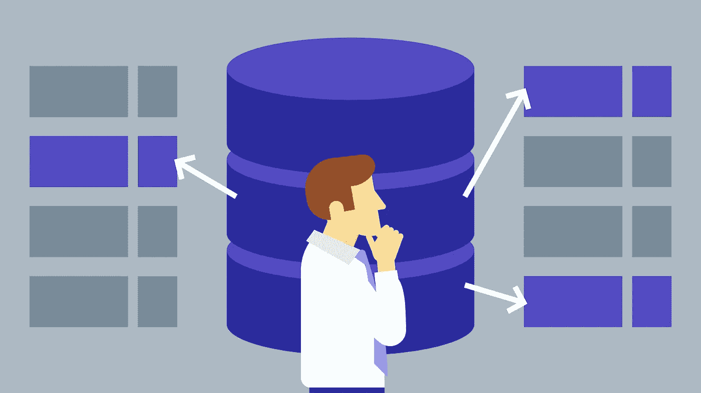
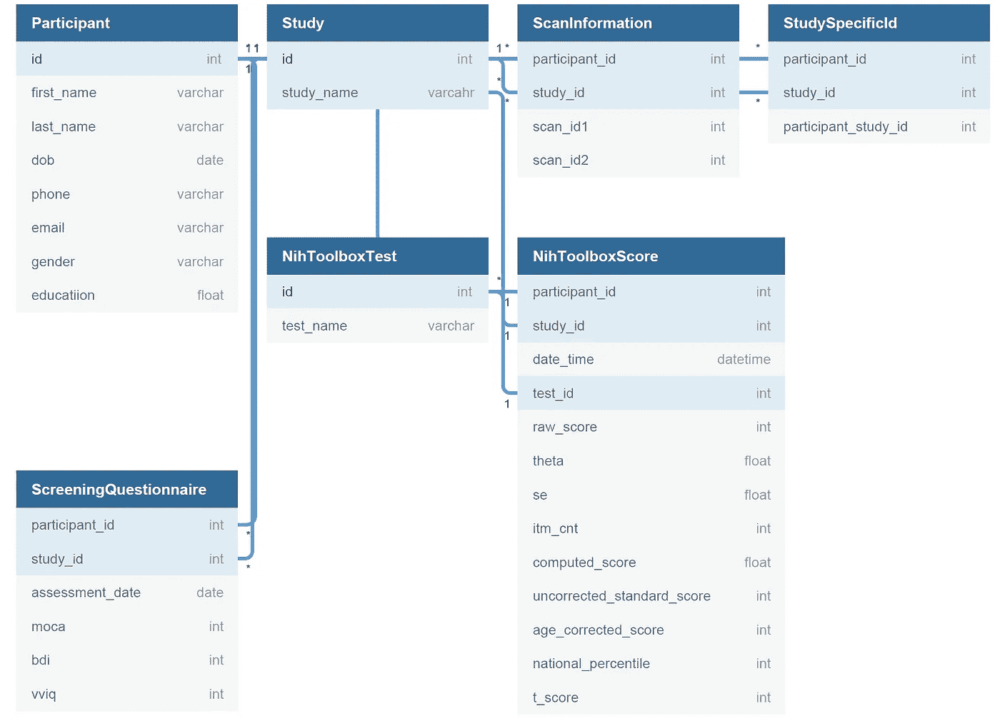

# SQL 如何让我成为更好的科学家

> 原文：<https://towardsdatascience.com/how-sql-is-making-me-a-better-scientist-28289d5bee56?source=collection_archive---------21----------------------->

## 解释我为什么以及如何开始使用 SQL

SQL(结构化查询语言)是一种用于关系数据库管理和数据操作的计算机语言。关系数据库和 SQL 在工业界非常受欢迎，这是有原因的。当处理大型复杂的数据库时，关系数据库非常有用。SQL 作为一种语言，允许你有效地查询这些数据库。SQL 是一种*声明式编程语言*，这基本上意味着当编写 SQL 代码时，你知道*它做什么*，但是你不一定知道*它如何工作*。SQL 为什么是如此强大的语言，这一切都发生在幕后，它可以以极高的效率查询数据库。由于它是一种声明性语言，如果你熟悉命令式编程语言(例如 Python)，你会发现它非常容易学习。同样，有了 SQL，致力于学习如何高效查询数据库的团队已经为我们做了艰苦的工作，并找到了查询数据库的方法。使用 SQL，我们只需告诉计算机我们想要做什么。

当我第一次学习 SQL 时，我并不认为它会对我的日常工作有用，因为我是一名研究计算认知神经科学的研究生。我意识到，既然 SQL 在工业界如此受欢迎，我就必须学习它，但我并不打算在学生时代使用 SQL。在稍微思考了一下如何在我的工作场所使用 SQL 之后，我意识到创建/维护关系数据库在我的工作中非常有用。

# 为什么我选择开始使用 SQL

我的研究调查了一个名为衰老的认知神经科学的学科，这意味着我通常会进行人类大脑成像研究，其中包含年轻人(~ 18-29 岁)和老年人(~ 65-79 岁)的人类研究参与者样本。具体到老年人参与者，实际上很难找到(1)想要参与通常持续几天的研究的参与者，以及(2)接受持续 1-2 小时的 MRI 的参与者。因此，参与我的研究和实验室内其他研究的或多或少是同一批老年人。尽管每项研究设计不同，但通常每项研究都有相似的组成部分。例如，通常实验室内的所有研究都包含相同的神经心理学评估。我们实际上是在进行一项纵向研究，但却没有意识到这一点。

尽管我们年复一年地使用相同的参与者，但在实验室中没有一个好的系统来跟踪哪些参与者完成了我们的每项研究。基本上每项研究都是相互独立的。没有一个合适的系统来跟踪参与者，这确实是一个遗憾。那时我意识到**创建一个标准化的实验室范围的关系数据库管理系统有可能改变我的研究。**我可以创造一种方法，轻松地跟踪参与者并在一个地方维护他们的数据。创建这个数据库管理系统有几个好处。首先，我或我的一位同事可以进行一些有趣的分析，包括随着时间的推移跟踪参与者的认知表现(如记忆)，看看谁表现出认知下降，谁没有，以及他们参加了哪些研究。此外，创建关系数据库管理系统可以节省管理评估的时间。我和一位同事可能在同一时间进行两项不同的研究，并使用相同的神经心理学工具。如果相同的参与者完成了每项研究，为了避免实践效应，他们不应该每次都接受神经心理学测试。最后，我们可以在研究之间折叠数据。例如，我主要进行脑成像研究，但我的一些同事只是进行行为研究。一位同事可以查询关系数据库，看到他或她的许多参与者完成了我的研究，并可能将行为测量与我的成像测量相关联，反之亦然。总之，创建关系数据库系统有可能增加我工作的影响。

# 创建数据库

既然我已经论证了为什么我认为创建数据库对我的工作有益，那么我将解释我是如何创建这个数据库的。我是关系数据库设计的初学者，所以我欢迎任何反馈。在创建数据库之前，创建一个数据库结构图是很重要的。有很多程序可以做到这一点，但我使用的是完全免费的 [DBDiagram](https://dbdiagram.io/home) 。下面是示意图:

该图的细节并不太重要，但基本上每个参与者都被分配了一个唯一的参与者 id，并且每个研究都被分配了一个唯一的研究 id。NIH 工具箱是神经心理学的成套工具，在筛选问卷中还有一些其他的评估。

为了实际创建数据库，我使用了 SQLite，特别是 Python 中的 sqlite3。为了确保数据输入正确，我使用 SQLite 的 [DB 浏览器查看数据库。对于有兴趣学习 SQL 的读者，网上资源很多，但我特意用了一个](https://sqlitebrowser.org/) [Coursera class](https://www.coursera.org/learn/sql-for-data-science) ， [Python 给大家](https://www.py4e.com/)，最重要的是，用自己的数据练习！

我不能公开数据，因为它包含参与者的个人信息，但你可以在我的 [GitHub](https://github.com/zachmonge/Lab-Relational-Database) 上查看用于创建数据库的脚本。截至目前，该数据库只包含一项研究，但最终它将扩展到包括多项研究和更多的研究数据点。

# **结论**

我相信我的同事和我自己将从这个数据库中受益。我很高兴看到这个数据库将有助于产生什么新奇的分析！最后，我将以最后一条建议作为结束，那就是如果你认为你不能从关系数据库的使用中获益，请三思。数据库管理在任何机构都很重要，它有可能使您的生活更加轻松，并提高您的工作质量。