# 淘宝的视觉搜索技术是如何工作的

> 原文：<https://towardsdatascience.com/how-taobaos-visual-search-technology-works-c966b56c361b?source=collection_archive---------26----------------------->

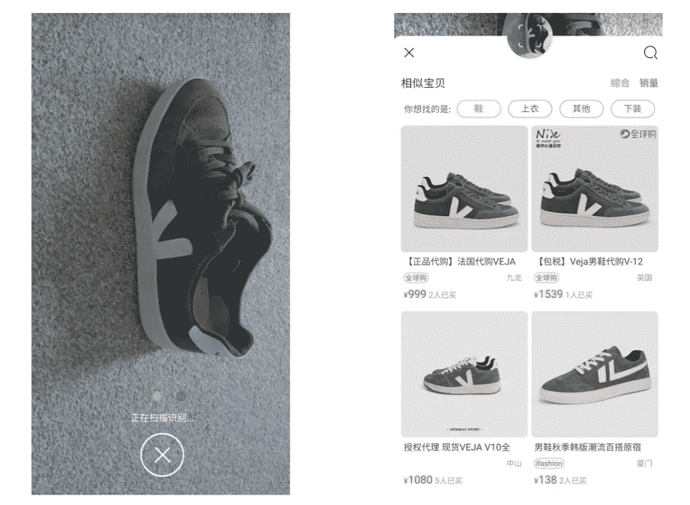

## 它已经吸引了奢侈品零售商。

在本周的文章中，我们来看看中国电子商务巨头阿里巴巴旗下的淘宝。

它一直在增长，有趣的是，今年它成功地吸引了奢侈品零售商。

我也测试了淘宝的视觉搜索引擎，看看它与我们在 Pinterest、谷歌和亚马逊的老朋友相比如何。

**我们来好好看看:**

*   一些淘宝花絮。
*   淘宝和奢侈品零售商。
*   淘宝视觉搜索的工作原理。
*   懒汉测试。

# ***一些淘宝花絮***

在我们动手操作视觉搜索小发明之前，让我们明确一下淘宝是什么。

如今越来越多的情况是，这是一个比看起来更困难的任务。

这些巨型公司跨越行业和技术，扰乱了我们人类在这个过程中给一切贴上标签的欲望。

因此，淘宝于 2003 年由阿里巴巴集团创立，是中国最大的在线市场。

它最初是一个 C2C(消费者对消费者)销售平台，类似于 Ebay。事实上，淘宝的推出是阿里巴巴的一项防御性举措，旨在保护其在线主导地位，对抗 Ebay 新生的、但仍非常真实的威胁。

碰巧的是，淘宝以惊人的权宜之计扼杀了中国的 Ebay。

2003 年，Ebay 占据了中国 C2C 在线市场 79%的份额。然后淘宝出现了，到 2006 年易趣中国就没了。

淘宝如何应对 Ebay 在中国遭遇的这场迅速而致命的打击，有着重要的教训。

从我对这个话题公认的有限研究来看，淘宝似乎有一些关键的竞争优势:

*   **价格:** Ebay 向中国用户收费，让他们列出自己的产品。淘宝通过免费提供商品来吸引用户，然后通过广告将受众货币化。
*   **本地知识:**用户体验完全是为中国用户设计的，他们为论坛版主添加了一些小的改动，比如使用中国小说和漫画中的人物名字。
*   **即时支付:**2004 年，支付宝给数百万中国购物者带来了在线支付，也是淘宝提供服务的核心组成部分。这对小企业来说尤其是一个重大的好处。
*   **客户服务:**淘宝，或许比任何其他个人网站都更能提高中国消费者对客户服务的期望。自 2003 年以来，它为买家和卖家提供即时通讯工具。

不可能只孤立出导致这种优势的一个因素。淘宝创造了一系列互补服务，形成了自己生态系统的基础。

但是，我们可以说，这四个要素仍然是淘宝本地优势的基础。

我们还在 2006 年，所以我会加快步伐。

到 2008 年，淘宝占据了中国在线市场 80%的份额。

在这个阶段，它开始涉足电子商务的其他领域。首先，淘宝在 2008 年 4 月推出了淘宝商城(现在简称为天猫)。

如今，天猫据说是奢侈品品牌进入中国电子商务的门户。“奢侈品馆”的引入促进了这一点，它允许品牌在天猫内创建自己的在线商店，以符合他们的身份。

在 2019 年的光棍节(一个非常透明的购物假期，由阿里巴巴发明)，295 个国际奢侈品牌“出席”了这场数字盛会。其中 40%的品牌抓住机会推出新产品，超过 95%的品牌整合了华北(支付宝虚拟信用卡)作为支付选项。

国际品牌已经慢慢学到了一些关于中国市场的惨痛教训。

今年，许多知名零售商选择与阿里巴巴合作，创造新的在线体验。与只翻译内容并等待人民币滚滚而来的老方法相比，这似乎是一个明智的选择。

瓦伦蒂诺与阿里巴巴人工智能实验室合作，创建了一个 3D 虚拟商店:

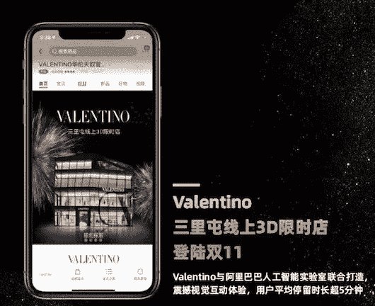

平均而言，顾客每次访问华伦天奴电子商店的时间超过五分钟。我不知道他们买了多少产品，但这似乎仍然是相当积极的。

博柏利在光棍节推出了在线围巾刺绣服务，这对我来说并不那么令人兴奋。但是我知道什么？他们仅在 3 小时内就卖完了一些围巾图案。

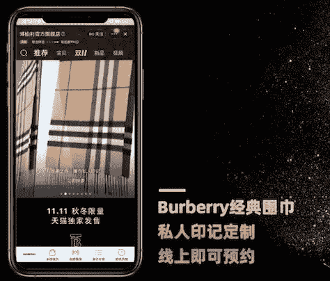

如果你喜欢这类东西，博柏利还与微信的母公司腾讯 T3 合作，为社交媒体创造内容。

就阿里巴巴和腾讯等公司而言，它们的“行业合作伙伴经理”团队正在以谷歌都无法企及的速度增长。

淘宝占阿里巴巴收入的 86%，天猫在最近一个季度的收入同比增长 34%。

今年 8 月，竞争对手腾讯公布了 13 年来首次季度销售收入下降(2%)，而阿里巴巴继续快速增长。如今，仅在中国，其网站的移动设备年访问量就超过 6.2 亿。

如今，我们对这些数字不太敏感，但很明显，阿里巴巴将其 2019 年的成功在很大程度上归功于淘宝天猫上奢侈品牌的到来。

就在不久前，奢侈品零售商还对淘宝心存疑虑，因为它以出售廉价仿冒自己产品而闻名。

中国对奢侈品零售产品的需求越来越大，而且已经持续了一段时间。然而，很少有人会预测到淘宝会成为最大的受益者。

迈克高仕首席执行官今年早些时候表示:“阿里巴巴的天猫奢侈品馆是我们传达迈克高仕品牌愿景的绝佳场所。"

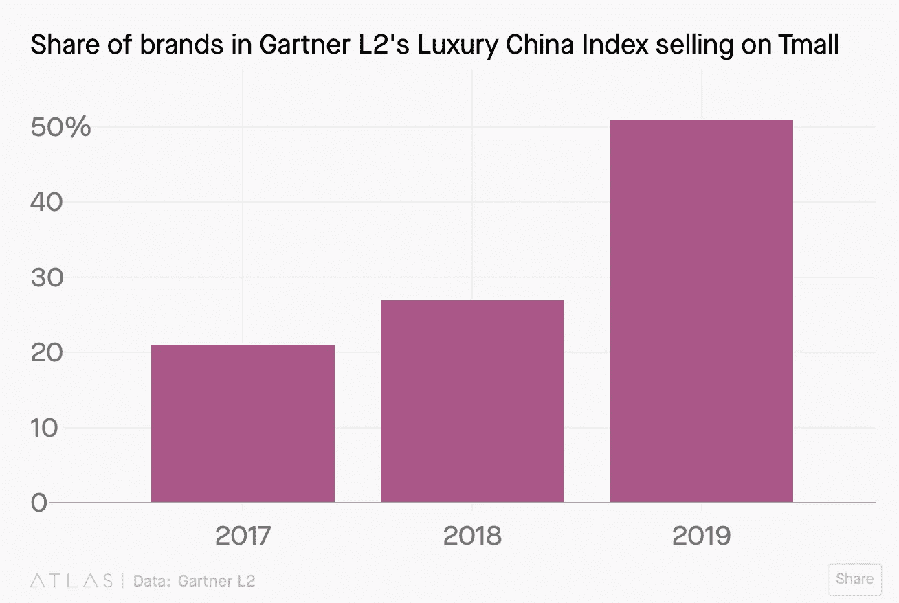

如你所见，关于这家公司有很多要说的。在我们继续之前，我将总结几个要点。

淘宝精品店让较小的零售商能够与他们的受众建立联系。

商店“工作人员”提供的不仅仅是顾客服务，他们还充当私人购物者，向购物者推荐新产品。

一位店主在最近接受《京日报》 采访时说:“我的一些客服团队成员喜欢与顾客进行朋友间的交谈，与他们建立了非常亲密和务实的关系。”

淘宝的电视直播功能还允许卖家把他们的客厅变成他们自己的 QVC 风格的工作室。视频是淘宝今年成功的一个重要方面，大多数商品页面都包含至少一部迷你电影。

此外，淘宝最近在马来西亚开设了一家“实体零售体验”(以前称为“一家商店”)，此前在新加坡成功推出了一家类似的商店。

它将出售受欢迎的本地产品，类似于美国的亚马逊四星级商店。中国已经有很多这样的商店，但淘宝现在把目光投向了其他亚洲市场。

我们略显懒散的西方比较点是亚马逊，两者基于相似的买卖动态。

淘宝现在成立的目的是运输杂货，它正在吸引高端零售客户，此外它还提供复杂的人工智能服务、云计算和线下商店。

到目前为止，亚马逊。

尽管如此，淘宝的发展轨迹在很多方面都非常独特。

淘宝最初是一个 Ebay 式的 C2C 市场，它提供快如闪电的客户服务，并在自己的平台上扮演更亲力亲为的角色。

因此，任何此类比较都只能让我们有限地了解淘宝的成功之处。

也就是说，两家电子商务巨头都同意的一点是，视觉搜索的重要性正在上升。

# **拍立陶 **

普通读者会非常了解我对 [**视觉搜索**](https://medium.com/@clarkboyd/visual-search-trends-statistics-tips-and-uses-in-everyday-life-d20084dc4b0a) 的兴趣。

Pinterest 和谷歌提供高效的基于摄像头的搜索，而许多零售商也开发了自己的视觉搜索技术。

正如人们所料，百度、腾讯和阿里巴巴等中国公司也处于该领域技术发展的前沿。

在阿里巴巴的案例中，[**Pailitao.com**](http://www.pailitao.com/)一直是他们视觉搜索努力的焦点。虽然基于摄像头的搜索自 2014 年起就在淘宝上推出，但拍拍淘一直是一个独立的视觉搜索引擎。

Pailitao (‘拍立淘’ in Chinese) seems to mean ‘Polaroid’ or ‘shopping with a camera’, so that makes sense.

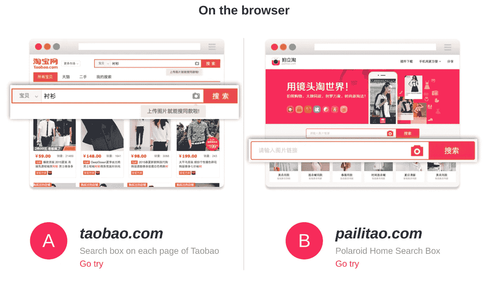

说到翻译，我真希望谷歌翻译在阅读派力陶主页上的这篇文章时是不准确的:

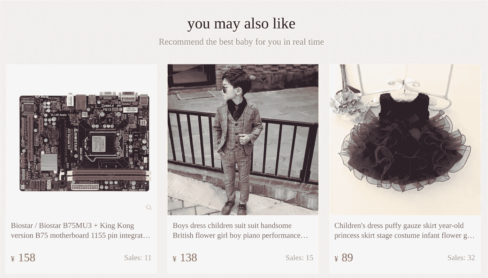

我的意思是，我知道他们说你可以在网上买任何东西，但这似乎有点多。

总之，我找到了一篇名为《阿里巴巴的视觉搜索》的科学论文，这篇文章对我很有帮助。

根据这篇论文，它是这样工作的:

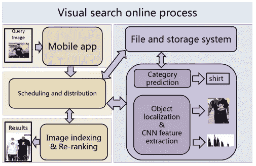

安全了吗？

基本上，用户要么用相机搜索，要么在派力陶手机应用上上传图片。视觉搜索引擎然后试图隔离图像中的重要项目，提取它们最显著的特征，然后预测项目所属的类别。

从这里，它可以搜索它的产品索引来找到匹配，然后向用户显示最准确的结果。基于用户是否点击结果，该算法可以学习它的哪些建议是最有效的。

它看起来有点像这样，逐屏显示:

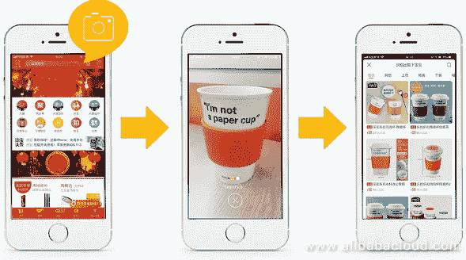

当它进入计划时，对用户来说是很棒的。他们不需要详细描述物品；通过将摄像机对准正确的项目，他们可以获得快速、准确、个性化的结果。

阿里巴巴将视觉搜索视为一个巨大的增长机会，并已着手将拍拍淘整合到淘宝的更多服务中。

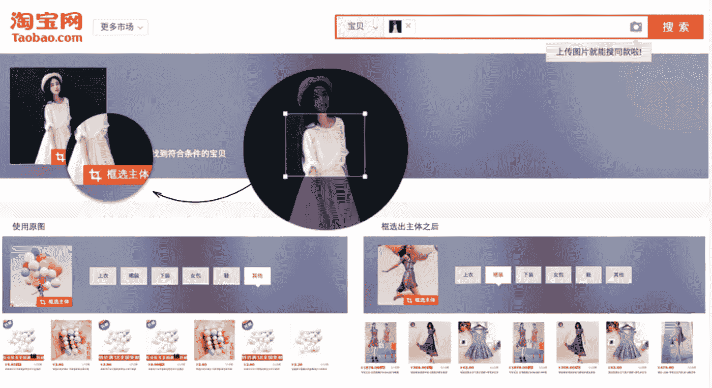

## ***那么，淘宝视觉搜索管用吗？***

确定的唯一方法是测试它的速度，在我写这篇文章的时候使用手边的物品。

**第一条:我桌子旁边的地板上有一双运动鞋。**

在这种情况下，很可能用户想要找到该产品的近似匹配。图像非常清晰，几乎没有背景噪音，除了标准发行的伦敦出租物业地毯。

结果:这一点无可争议。仅仅等了四秒钟，淘宝上就找到了同样颜色的运动鞋，尽管价格相差很大，要么是 999 元，要么是 1539 元(134 美元或 229 美元)。

不过这是一个卖方的问题，所以我们会给淘宝**五个相机(共五个)**来买那个。

**第二件:一个艺术风格的杯子，内含复杂的海边设计。**

这才是真正的测试者。一些视觉搜索引擎会关注物品的形状，这不利于设计。任何人搜索这个不一定要确切的项目，而是类似项目的灵感。

让我们看看他们是如何相处的:

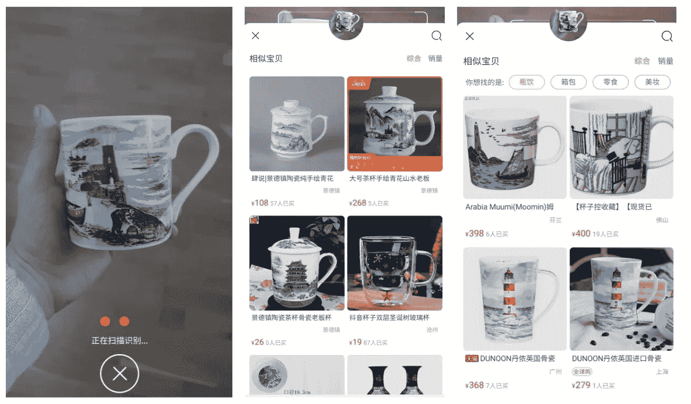

**结果:**一点都不差。

它会选择设计中包含的形状、颜色，甚至是物体。也许对基于姆明的设计有过度的偏好，但是我们在这里吹毛求疵。

让我们在这一个上给他们 **4.5 个照相机**。

**第三项:乐福鞋。**

这会告诉我们需要知道的一切。

通过 Loafie 测试是视觉搜索成就的典范。如果艾伦·图灵还在世的话，他会致力于此。

我一直在用它来尝试一系列类似的技术，并整理了一些关于这个主题的演示文稿— [**，就像这个**](https://www.slideshare.net/ClarkBoyd/visual-search-how-it-works-and-how-to-optimize-for-pinterest-google-and-amazon) 。

如下所述，Loafie 是我在办公椅上用来支撑腰部的垫子。因此，这些天他比这张照片中的他更加憔悴:

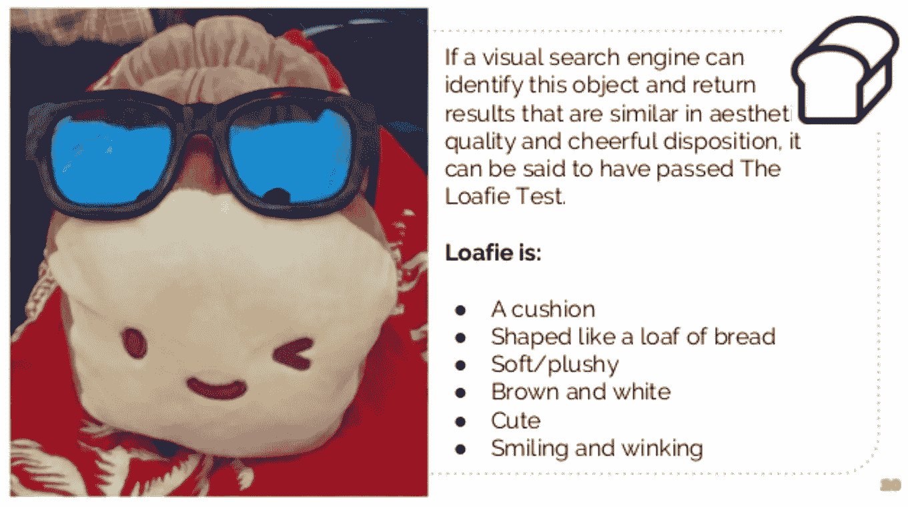

我们可以从测试结果中看出视觉搜索引擎优先考虑哪些功能。

那么，我们来看看淘宝:

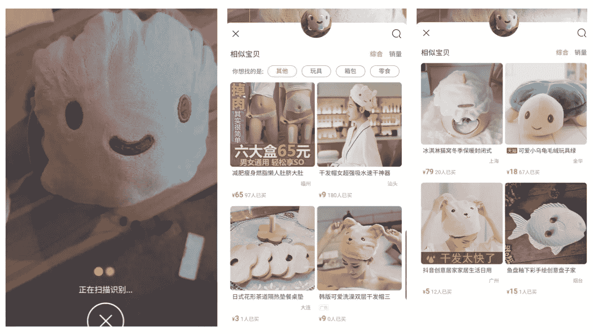

**结果:**它似乎专注于他的颜色和那价值百万美元的微笑，乌龟是一个特别的亮点。不可否认的是，其他一些结果更难解释。

微笑帽产品引起了我的兴趣，所以我仔细观察了一下:

这似乎是一条毛巾，兼作一顶时髦的帽子，绕过了费力的“头巾”方法的需要。

与 Pinterest(目前的 Loafie 测试领导者)相比，淘宝在解释如此细致入微的对象时表现良好。然而，仍有改进的余地。

**五个摄像头中的三个。**

# ***【现在看，现在买】***

阿里巴巴成功背后的驱动力淘宝提供了可视化搜索体验，帮助用户在全球最大的商店中找到合适的商品。

然而，这只是开始，我们应该很快就会在天猫的奢侈品零售店看到视觉搜索。

事实上，淘宝在 2019 年巴黎时装周上推出了“现在看，现在买”活动，让观众可以毫不夸张地购物。只需将相机对准最新时尚，淘宝就会指引你到合适的天猫精品店进行购买。

淘宝也利用这些西方时装秀在海外推广中国设计师。这些被称为“中国酷”的活动已于今年 9 月在纽约和米兰举办。

它将即时客户服务、免费商品列表和无缝在线支付结合在一起，帮助确立了淘宝作为中国电子商务主导力量的地位。

在其下一个增长阶段，一系列复杂的服务将有助于吸引奢侈品零售商和购物者到该平台。

视觉搜索将是把这两方面结合起来的关键因素。