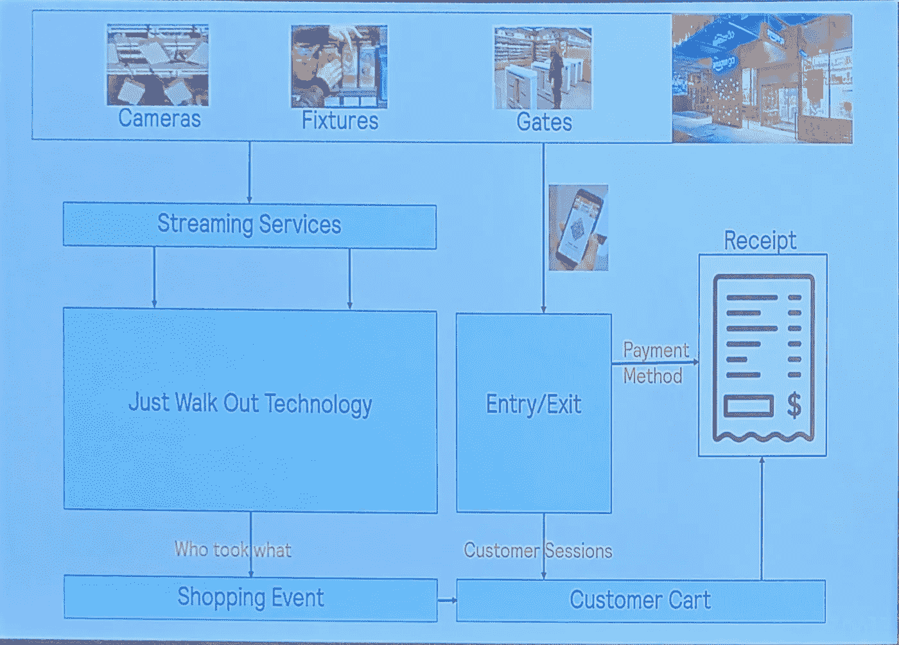
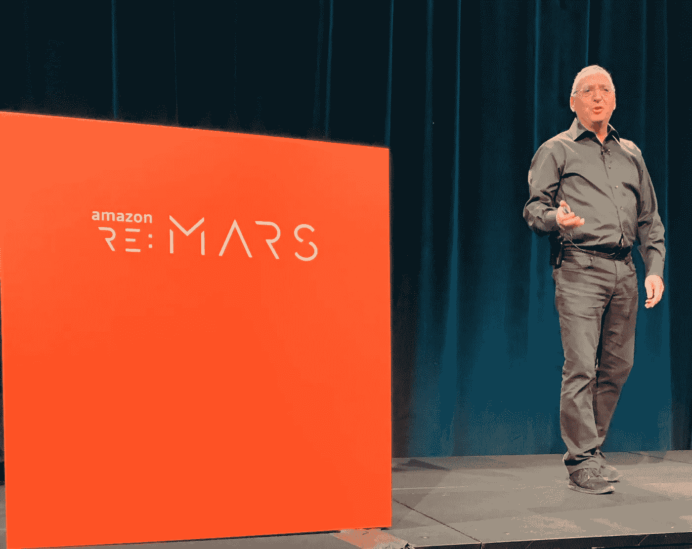
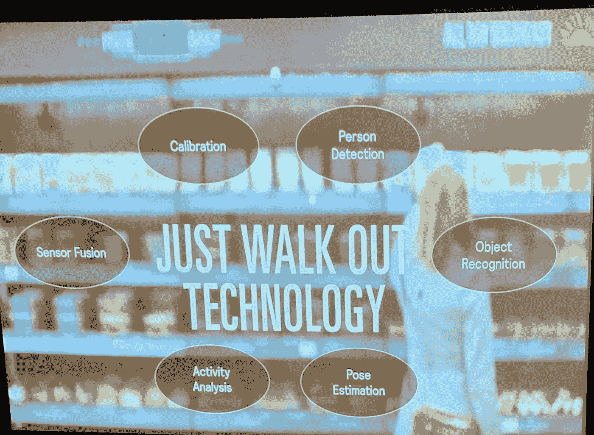
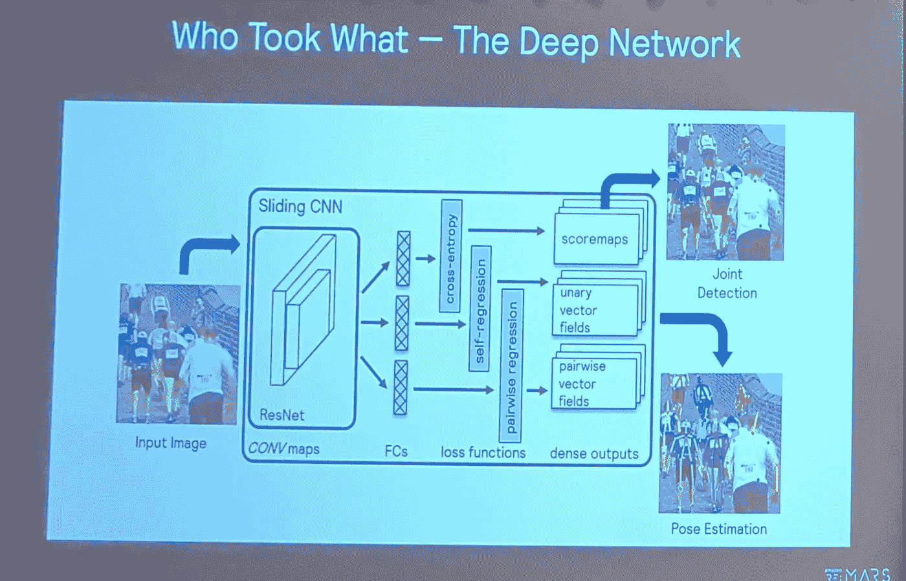
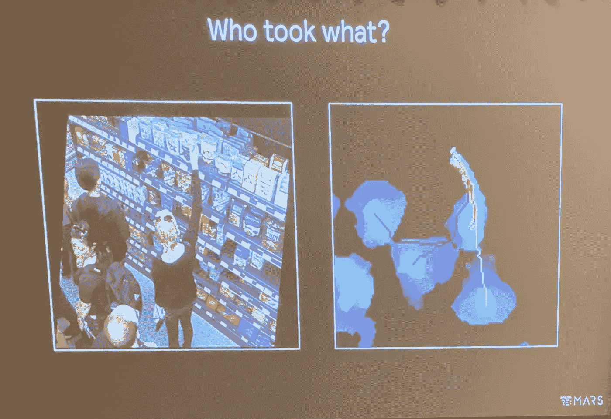

# 亚马逊 Go 商店的人工智能是如何工作的

> 原文：<https://towardsdatascience.com/how-the-amazon-go-store-works-a-deep-dive-3fde9d9939e9?source=collection_archive---------3----------------------->

## 深入探讨亚马逊如何使用 AWS、ML、RL 和模拟来推动 Go Store 的“走出去”体验。

我住在芝加哥，我们很幸运地拥有 4 家 Amazon Go 商店，这是一家未来主义的便利店，你只需走进去，拿起你想要的东西，然后走出来。几分钟之内，你就可以拿到你所拿走的所有东西的准确收据。这感觉真的很神奇，但实际上这是大量的机器学习创新，亚马逊花了 3 年时间做概念验证，又花了 3 年时间生产 go 商店。今天在他们的 re:MARS 会议上，他们对提供“走出去”体验所需的大量创新进行了首次技术深度探讨。我想向你介绍一下他们分享的内容，这样我们就可以分享对这一惊人成就的敬畏。

The high-level architecture of the platform

# 计算机视觉核心:“走出去”技术

Go 商店的核心是基于计算机视觉的机器学习，用于无缝跟踪和评估商店中每个人的意图。亚马逊对这项技术的实现进行了令人惊讶的详细描述。虽然他们没有展示他们模型的确切神经架构，但他们展示了这些单个模型解决的具体问题，以及它们如何组合起来构建完整的解决方案。

本部分由首席科学家、前南加州大学计算机视觉教授 Gerard Medioni 博士[演示。我不得不说，他不仅是一个出色的研究员，还是一个出色的演讲者。他设法在短短几秒钟内涵盖了激烈的话题，回答了 go store 背后的开创性问题:**谁拿走了什么？**](https://viterbi.usc.edu/directory/faculty/Medioni/Gerard)

根据 Medioni 博士的说法，围棋库是一个“计算机视觉完全”问题，指的是计算机科学中的 [NP 完全](https://en.wikipedia.org/wiki/NP-completeness)类算法问题。在这个顶级问题中，需要解决 6 个核心问题来提供体验。

**传感器融合**:聚合不同传感器(或摄像机)的信号，因为这个问题只用计算机视觉就解决了

**校准**:让每台摄像机非常准确地知道它在商店中的位置

**人员检测:**持续识别和跟踪店内的每个人

**物品识别**:区分出售的不同物品

**姿势估计**:检测货架附近的每个人用手臂在做什么

**活动分析**:判断一个人是否拿走了一件物品还是归还了一件物品。

Just Walk Out 技术的详细架构包括以下组件:

Just Walk Out Architecture

## 个人识别

**定位器**:问题“谁拿了什么？”不能用一系列独立的选择来解决。亚马逊必须跟踪每个人在商店的整个时间，从他们走进商店的那一刻直到他们离开。定位器组件必须解决的一些难题是:

*   遮挡，一个人被商店里的东西挡住了视线
*   纠结状态，人与人之间很亲近

为了解决这些问题，亚马逊使用定制的摄像头硬件来进行 RGB 视频和距离计算。在那里，他们将图像分割成像素，将像素分组为斑点，并将每个斑点标记为人/非人。最后，他们使用多个摄像头对每个人进行三角测量，从帧中构建位置地图。

**链接器**:下一个任务是确保标签在视频中的帧间得以保留，从定位转移到跟踪商店中的顾客。这一阶段遇到的问题有:

**消除困惑状态**:当两个人靠得很近时，会降低对谁是谁的信心。go store 技术通过将这些客户标记为低信心来处理这一问题，因此他们会被安排随着时间的推移进行重新识别。

有一个后续阶段用于区分亚马逊员工，他们的行为可能与客户不同(例如，他们可能会将商品放在货架上，而不是拿下来)。

## **物品标识**

**商品 ID 检测**:这里要回答的关键问题是:哪些具体的商品是下架了，在某人手里。这一阶段面临的一些问题和解决方案是:

*   非常相似的物品，如同一品牌饮料的两种不同口味，在 CNN 层识别出物品类别后，使用残差神经网络进行精细的产品识别(我猜是跨多个帧)来区分
*   光照和变形改变了物品，这通过使用针对这些特定挑战的大量训练集数据生成来解决

## **客户协会**

最具挑战性的问题可能是将上述步骤中的所有信息结合起来，最终回答“谁拿走了什么？”问题。

The “who took what?” decision is made from a stick figure model of the customers

**姿势估计**:位置跟踪 Go 商店摄像机从上往下看，而不是从等轴视图看，因此它们需要通过表示商品和顾客之间手臂的像素来跟踪路径。一个简单的自上而下的模型不足以解决这个问题，因此团队开始从视频中构建一个类似简笔画的客户模型。

需要一种新颖的深度学习模型来从视频中构建每个客户的关节模型。它使用具有[交叉熵](/demystifying-cross-entropy-e80e3ad54a8)损失函数的 CNN 来构建联合检测点云，自回归用于向量生成，成对回归用于将向量分组在一起。这个模型本身非常有趣。他们表明，它可以用于任何视频剪辑，以帮助解决许多其他依赖于姿态估计的问题。

**动作确定:**为了避免对顾客没有拿走的商品收费，系统必须准确地考虑顾客可以将商品放回货架的情况。

上图可以看出这方面的一个问题。这个问题的明显答案是某个项目被拿走了，但这是不正确的。取而代之的是，顾客将一件商品放回原处，并将剩余的商品推到货架的更后面。为了解决这个问题，系统需要计算货架上的所有商品，而不是使用基于空间的简单假设。

**长尾**:当人们从货架上挑选一件物品时，可以有很多种姿势，尤其是当你考虑到附近有多个顾客的时候。只是没有足够的标记数据来训练每一个模型。即使有人类标记，也不可能扩展训练数据集(在金钱和时间上)。

Simulated data is used to solve for difficult situations

为了解决这个问题，该团队承担了一个雄心勃勃的项目，使用模拟器生成合成活动数据。在这些模拟器中，他们需要创建虚拟顾客(包括服装、头发、体型、身高等的变化)。)、相机、照明和阴影，并模拟相同的相机硬件限制。然而，回报是巨大的:

1.  数据是预先注释的，因为它是生成的，这使得注释模拟数据便宜 3 个数量级。
2.  该团队可以横向扩展计算来生成数据(他们有 AWS 云来做到这一点)。
3.  注释在框架之间非常一致，而人类注释者则不是这样。

通过使用模拟来建立大规模的训练集，该团队能够利用云的力量在一天内对几个月的数据进行训练，消除了时间瓶颈，并实现了快速进步。这与 DeepMind 训练 AlphaStar、OpenAI 训练 Open AI 5 以及自动驾驶公司训练其驾驶员模型所使用的技术非常相似。

## 流媒体服务

如果视频不流动，任何计算机视觉魔法都不起作用。最初要解决的挑战是将视频从商店中取出，放到云中进行处理。该系统具有以下组件:

1.  通过板载计算进行视频捕获，进行基本预处理并降低带宽要求
2.  现场视频流设备，处理视频编解码器、网络问题，并保证交付到云
3.  云上的视频服务器在 S3 和迪纳摩捕获和存储视频

管道中这一阶段的一个关键方面是冗余和异常检测，以处理跨系统(摄像机、网络、云基础设施等)的真实故障场景。)并提供弹性。

## 进入和退出检测

下一个挑战是检测人们何时进出商店来创建购物会话。该系统具有以下组件:

1.  当你出现在商店时，移动应用程序扫描二维码。他们花了很多时间在这上面做 UX 测试(手机上下扫描，如何处理群组，等等。)
2.  当您扫描二维码时，关联系统会根据您在商店入口处的位置，将您在视频中的肖像与您的帐户关联起来
3.  会话的创建基于关联发生

在实现系统时，团队必须解决一些额外的场景。首先，人们可能会扫描多次，所以他们必须在第二次扫描时删除任何没有项目的会话。一个更困难的问题是，顾客(尤其是家庭)想集体购物，但只有一个人付款。为了实现这一点，当每个人进入商店时，负责人/付款人扫描相同的代码。这将创建一个会话，将该组中的所有人链接到同一个帐户。从那里，团队中的人可以随时离开商店。通过将会话提升到小组级别，并将单个购物者视为“一个小组”，该团队能够克服这一挑战，让个人随时进入或退出小组。

## 购物车、付款和收据

这些基本上都和你在 Amazon.com 看到的一样，所以这里没有太多创新可以讨论。他们用了整整 10 秒钟来覆盖这些区域。

当然，他们以经典的亚马逊风格结束了谈话，说“这是 Amazon Go 的第一天”，并暗示即将有重大改进。离开演讲时，我既对自己与这些成就的差距感到谦卑，又对人工智能的黄金时代的到来感到无比兴奋。

如果你读到最后，你可能也会对我关于[强化学习进入主流](https://medium.com/@ryanwgross/reinforcement-learning-is-going-mainstream-heres-what-to-expect-d0fa4c8c30cf)的其他想法感兴趣。