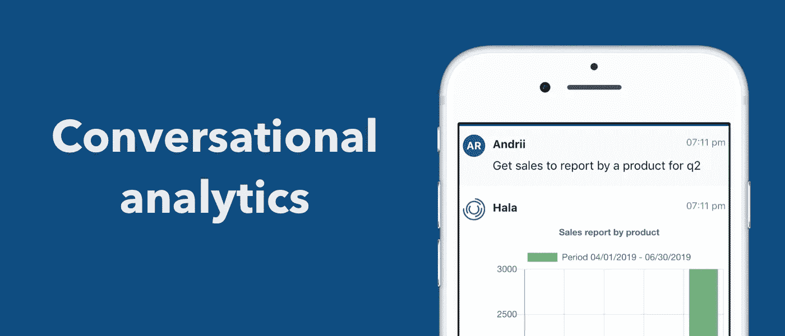
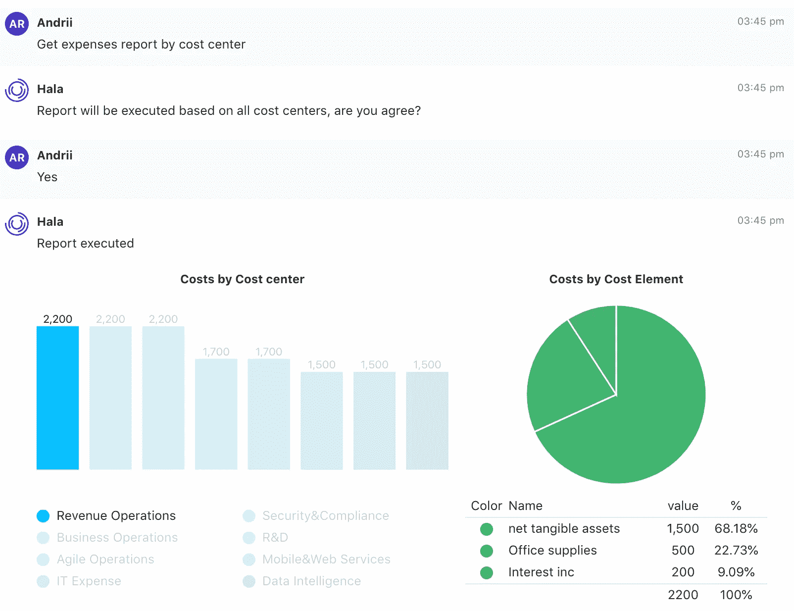
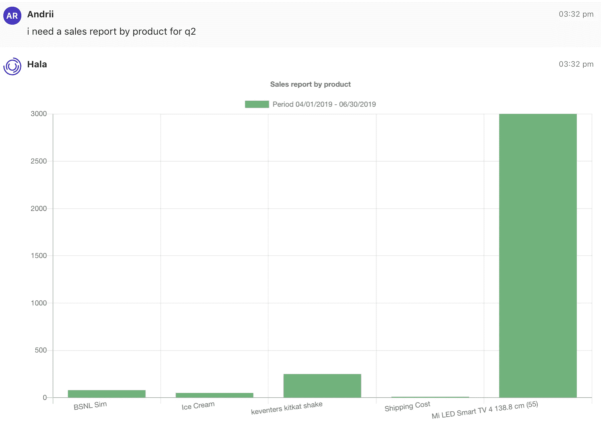
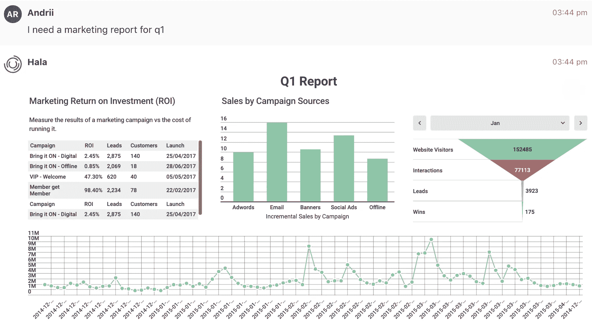

# 对话式人工智能分析将如何改变商业？

> 原文：<https://towardsdatascience.com/how-the-conversational-ai-analytics-will-transform-the-business-c1915cdedb6e?source=collection_archive---------41----------------------->

# 第一章对话式人工智能

对话式人工智能是一种语音助手，可以进行类似人类的对话，捕捉上下文，并提供智能响应。例子包括苹果 Siri，亚马逊 Alexa，谷歌虚拟助手。还有其他侧重于企业的对话平台。根据 Gartner 的说法，典型的应用程序存在于人力资源、IT 服务台和自助服务中，但客户服务是聊天机器人已经产生最大影响的领域，特别是改变了客户服务的方式。

对话式人工智能平台的 Gartner 典型应用中尚未包括的一个领域是对话式分析。

# 第 2 章什么是对话分析

为了理解对话分析，我们首先需要讨论数据。组织拥有大量结构化和非结构化数据。通过从不同来源接收新的和新的更新，数据量每秒都在增长。

借助对话分析和人工智能技术，您可以获得更好地浏览所有这些数据的机会，从多个来源中提取正确的数据集，并通过语音或类型查询使其可用。

**用例—财务报告**

# 第 3 章机遇

对话分析将改变业务的原因之一是缺乏数据访问和个性化。如今，缺乏数据本身并不是一个问题。恰恰相反。如今，这些公司拥有大量数据，他们花费了大量精力来准备报告、图表和其他数据可视化工具。

数据如何为企业、经理和决策者带来最大价值？数据不应该成为组织的死资产。数据应该是相关的、透明的、最新的、个性化的和可访问的。

我们相信对话式分析有助于数据的可访问性和个性化。

**用例—销售报告**

# 第 4 章要改进什么？

对话分析可以帮助员工与数据对话。

如今，员工可以使用图形用户界面(GUI)来访问报告、图表和其他数据可视化图形，以访问数据并做出自信的决策。当我们谈论高层管理人员时，在许多情况下，他们没有时间使用 GUI 来获取报告，其他人正在为他们准备报告。

当你不在办公室的时候，有时不可能得到分析。在这种情况下，你可以使用电子邮件，并要求有人给的信息。当然，有一些移动解决方案可以为您提供移动的机会，让您可以随时随地访问数据。

我们还需要考虑到整个组织中的人员在不同的部门工作，他们有自己的职责，有时现有的分析不符合他们的议程或与期望的结果一致。

所有这些方面都在员工和数据之间产生一些障碍，有时在正确的时间获得正确的数据非常耗时，会导致不准确的结论。

# 第 5 章对话分析的好处

有了 Siri，你可以对着手机说话，有了 Alexa，你可以用语音了解天气或进行新的购买。

当前的人工智能技术可以理解我们，并理解查询的上下文。如果我们可以训练机器理解查询并可视化数据会怎么样。

想象一下，这个人站在大屏幕后面与机器对话，机器根据这个人的输入将数据可视化。

这样有什么好处？

**时间** —有了对话式分析，你不需要考虑如何获取数据或者从哪里获取数据。你只需要想想你想要什么，然后说出来或者输入文字。

**准确性** —在准备数据和可视化数据的过程中没有人接触，机器被编程为选择所需的数据，汇总并为您准备数据。我们可以避免报告中的人为错误。

**移动性** —对话式人工智能界面在你的设备中，这不是一个独立的应用程序，这是一个简单的聊天，通过这个聊天，你可以获得分析或预订商务旅行或创建销售订单。集所有功能于一身。

**用例—营销报告**

> 利用人工智能技术，你可以与数据对话。

问候，

Andrii Rudchuk，首席执行官@ Hala.ai